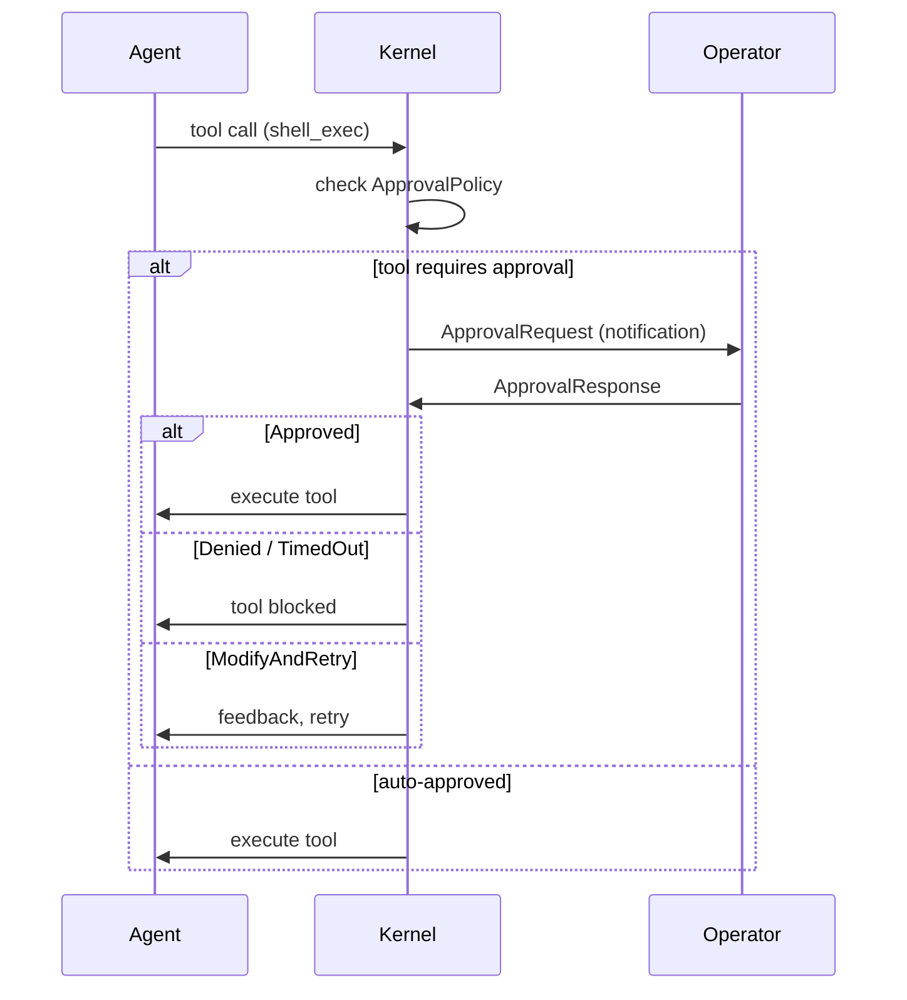

# Shared Types

# Shared Types (`librefang-types`)

Core data structures shared across the LibreFang kernel, runtime, memory substrate, wire protocol, and dashboard. This crate contains **no business logic** — only type definitions, serialization helpers, and validation methods.

## Architecture

```mermaid
graph TD
    subgraph "librefang-types"
        direction TB
        AGENT[agent<br/>identity, manifest, state]
        APPROVAL[approval<br/>gates, risk, TOTP]
        CAP[capability<br/>glob matching]
        CONFIG[config<br/>global settings]
        MSG[message<br/>LLM wire types]
        TOOL[tool / tool_policy<br/>definitions, profiles]
        MEM[memory<br/>substrate keys]
        SCHED[scheduler<br/>jobs, cron]
        EVENT[event<br/>agent lifecycle]
        SUB[subagent<br/>orchestration]
        SIGN[manifest_signing<br/>integrity]
        TAINT[taint<br/>PII detection]
        SERDE[serde_compat<br/>lenient parsers]
    end

    KERNEL[librefang-kernel] --> AGENT
    KERNEL --> APPROVAL
    KERNEL --> CAP
    RUNTIME[librefang-runtime-wasm] --> EVENT
    RUNTIME --> CAP
    MEMORY[librefang-memory] --> MEM
    MEMORY --> MSG
    API[librefang-api] --> AGENT
    API --> APPROVAL
    CHANNELS[librefang-channels] --> MSG
    MIGRATE[librefang-migrate] --> TOOL_COMPAT[tool_compat]
    SKILLS[librefang-skills] --> TOOL_COMPAT
    DASHBOARD[dashboard TS] --> AGENT
    DASHBOARD --> MEM
```



Every other crate in the workspace depends on `librefang-types`. The types are designed for serde roundtripping through both JSON (API wire format, session storage) and TOML (agent manifests, daemon config).

---

## Core Identifiers

### `AgentId`

A UUID wrapper with two construction modes:

| Method | UUID Version | Use Case |
|---|---|---|
| `AgentId::new()` | v4 (random) | Fresh agents created at runtime |
| `AgentId::from_name(name)` | v5 (SHA-1) | Named agents that must survive restarts |
| `AgentId::from_hand_id(hand_id)` | v5 | Multi-agent hand instances |
| `AgentId::from_hand_agent(hand, role, instance)` | v5 | Specific role within a hand |

All v5 derivation uses a single fixed namespace UUID with typed prefixes (`"agent:"`, bare `hand_id`, or `"{hand}:{role}:{instance}"`) to prevent collisions between different ID categories.

**Backward compatibility note**: `from_hand_agent` with `instance_id: None` produces the legacy format `"{hand_id}:{role}"`. With `Some(id)`, it produces `"{hand_id}:{role}:{instance_id}"`. Existing single-instance hands must pass `None` to preserve their original agent IDs and avoid orphaned cron jobs or memory keys.

### `SessionId`

Supports deterministic derivation for channel-based sessions via `SessionId::for_channel(agent_id, channel)`. This uses UUID v5 under a dedicated namespace so that the same `(agent, channel)` pair always maps to the same session across daemon restarts. Channel names are lowercased before hashing.

### `UserId`

Simple random UUID wrapper. No deterministic derivation — users are always created fresh.

---

## Agent Manifest (`AgentManifest`)

The manifest is the complete specification for an agent. It deserializes from TOML files on disk and is the primary configuration surface for operators.

### Key Fields

| Field | Type | Purpose |
|---|---|---|
| `name` | `String` | Human-readable identifier |
| `model` | `ModelConfig` | Primary LLM configuration |
| `fallback_models` | `Vec<FallbackModel>` | Ordered chain tried on primary failure |
| `schedule` | `ScheduleMode` | Reactive, Periodic, Proactive, or Continuous |
| `session_mode` | `SessionMode` | `Persistent` (reuse session) or `New` (fresh per invocation) |
| `resources` | `ResourceQuota` | Memory, CPU, token, and cost limits |
| `profile` | `Option<ToolProfile>` | Named tool preset (Minimal, Coding, Research, etc.) |
| `capabilities` | `ManifestCapabilities` | Explicit capability grants |
| `routing` | `Option<ModelRoutingConfig>` | Auto-select model by prompt complexity |
| `autonomous` | `Option<AutonomousConfig>` | Guardrails for 24/7 agents |
| `thinking` | `Option<ThinkingConfig>` | Per-agent extended thinking override |
| `exec_policy` | `Option<ExecPolicy>` | Shell execution restrictions |
| `web_search_augmentation` | `WebSearchAugmentationMode` | Auto-inject web search results |
| `auto_dream_enabled` | `bool` | Opt-in to background memory consolidation |

### Model Configuration

`ModelConfig` supports an `extra_params` field flattened into the API request body via `#[serde(flatten)]`. This allows provider-specific parameters (e.g., Qwen's `enable_memory`) without code changes. The `model` field accepts a TOML alias `name` for backward compatibility.

### Fallback Chain

When the primary model fails, the kernel tries each `FallbackModel` in order. Each entry specifies its own `provider`, `model`, `api_key_env`, and `base_url`.

### Model Routing

`ModelRoutingConfig` splits prompts by estimated token count:

```
tokens < simple_threshold  →  simple_model (e.g., claude-haiku)
simple_threshold..complex_threshold  →  medium_model
tokens > complex_threshold  →  complex_model
```

### Resource Quotas

`ResourceQuota.effective_token_limit()` normalizes `max_llm_tokens_per_hour`:
- `None` → `0` (unlimited, inherits global default)
- `Some(0)` → `0` (explicitly unlimited)
- `Some(n)` → `n`

Enforcement code should skip the check when the returned value is `0`.

---

## Agent Lifecycle

### `AgentState`

```
Created → Running ⇄ Suspended
              ↓         ↓
           Terminated  Crashed
```

### `AgentMode`

Permission-based operational filter:

| Mode | Behavior |
|---|---|
| `Observe` | No tools available |
| `Assist` | Read-only tools only: `file_read`, `file_list`, `memory_list`, `memory_recall`, `web_fetch`, `web_search`, `agent_list` |
| `Full` | All granted tools (default) |

`AgentMode::filter_tools()` applies this at runtime against the agent's tool list.

### `AgentEntry`

The runtime registry record. Wraps `AgentManifest` with lifecycle state, session tracking, and recovery flags:

- **`force_session_wipe`**: Next LLM call clears message history (keeps `session_id`). Takes priority over `resume_pending`.
- **`resume_pending`**: Agent was interrupted by restart; will resume the existing session transcript on next turn.
- **`reset_reason`**: Tracks why the last automatic session reset occurred.

---

## Tool Profiles

`ToolProfile` is a named preset that expands to both a tool list and derived `ManifestCapabilities`:

```rust
let caps = ToolProfile::Coding.implied_capabilities();
// caps.network = ["*"]      (from web_fetch)
// caps.shell = ["*"]        (from shell_exec)
// caps.agent_spawn = false
```

| Profile | Tools |
|---|---|
| `Minimal` | `file_read`, `file_list` |
| `Coding` | `file_read`, `file_write`, `file_list`, `shell_exec`, `web_fetch` |
| `Research` | `web_fetch`, `web_search`, `file_read`, `file_write` |
| `Messaging` | `agent_send`, `agent_list`, `channel_send`, `memory_store`, `memory_list`, `memory_recall` |
| `Automation` | All of the above combined |
| `Full` / `Custom` | `["*"]` (all tools) |

`implied_capabilities()` inspects the tool list to derive network, shell, agent, and memory permissions. Profiles with `["*"]` grant all capability categories.

---

## Approval System

The approval module implements human-in-the-loop gating for dangerous operations.

### Request Flow



### `ApprovalDecision`

Custom serde implementation. Simple variants serialize as strings (`"approved"`, `"denied"`, `"timed_out"`, `"skipped"`). `ModifyAndRetry` serializes as `{"type": "modify_and_retry", "feedback": "..."}`. The deserializer accepts both formats for backward compatibility.

### `ApprovalPolicy`

Default gated tools: `shell_exec`, `file_write`, `file_delete`, `apply_patch`, `skill_evolve_*`.

Configuration highlights:

| Field | Default | Purpose |
|---|---|---|
| `require_approval` | 5-tool list | Accepts list or boolean shorthand |
| `timeout_secs` | 60 | Range: 10–300 |
| `timeout_fallback` | `Deny` | `Deny`, `Skip`, or `Escalate` |
| `trusted_senders` | `[]` | Auto-approve bypass by user ID |
| `channel_rules` | `[]` | Per-channel allow/deny tool lists |
| `second_factor` | `None` | `Totp`, `Login`, or `Both` |
| `totp_grace_period_secs` | 300 | Skip re-verification within window |

The `require_approval` field uses a custom deserializer that accepts either a list of tool names or a boolean (`false` → empty list, `true` → default set).

### Channel Rules

`ChannelToolRule` evaluates allow/deny lists with wildcard glob patterns. **Deny wins** when both lists match. The `check_tool()` method returns `Option<bool>` — `None` means the rule has no opinion.

### Tool Name Validation

Tool names accept alphanumeric characters, underscores, and at most one `*` wildcard (for glob patterns like `"file_*"` or `"skill_evolve_*"`).

---

## Deterministic Identity Pattern

A recurring pattern in this crate: using UUID v5 to derive stable identifiers from human-readable names so that associations survive process restarts.

```
AgentId::from_name("researcher")
  → UUID v5(namespace, "agent:researcher")
  → always the same UUID

SessionId::for_channel(agent_id, "telegram")
  → UUID v5(channel_namespace, "{agent_id}:telegram")
  → always the same session for the same agent+channel pair
```

This is critical for:
- Cron schedulers that need to address the same agent across restarts
- Channel adapters that resume existing sessions
- Memory substrate keys that must be stable

---

## Serde Compatibility (`serde_compat`)

The `serde_compat` module provides lenient deserializers used throughout the manifest:

- **`vec_lenient`**: Accepts both arrays and missing/null fields (defaults to empty vec)
- **`map_lenient`**: Same for HashMap fields
- **`exec_policy_lenient`**: Accepts string shorthands (`"allow"`, `"deny"`, `"full"`, `"allowlist"`) or full structured config

These allow TOML manifests to omit empty collections without explicit `[]`, reducing boilerplate for operators.

---

## Utility Functions

### `truncate_str(s, max_bytes)`

UTF-8-safe string truncation. Walks backward from `max_bytes` to find a character boundary. Originally added to fix production panics (issue #104) caused by splitting multi-byte characters like em dashes (`—`) when constructing LLM prompts.

---

## Integration Points

### Downstream Consumers

| Consumer | Types Used |
|---|---|
| `librefang-kernel` | `AgentManifest`, `AgentEntry`, `ApprovalPolicy`, `AgentState` |
| `librefang-runtime-wasm` | `Event`, capability checking via `capability_matches` |
| `librefang-memory` | `SessionId`, `Message` types, memory key types |
| `librefang-api` | Full agent/approval CRUD, webhook payloads |
| `librefang-channels` | `Message` content types, i18n `t()` / `t_args()` |
| `librefang-migrate` | `tool_compat::map_tool_name`, `is_known_librefang_tool` |
| `librefang-skills` | Tool compatibility mapping, schema normalization |
| Dashboard (TypeScript) | Serialized `AgentEntry`, `SessionEntry`, memory structures |

### Cross-Language Contract

The TypeScript dashboard consumes JSON produced by these types. Fields like `AgentIdentity` (emoji, color, archetype), `ToolProfile`, and `AgentMode` are rendered in the UI. Any serde format change to these types is a breaking API change for the dashboard.