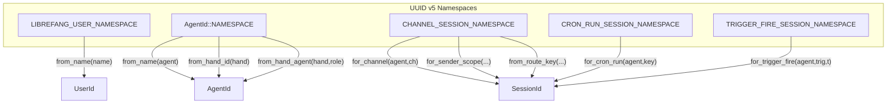

# Shared Types

# Agent Types (`librefang-types/src/agent.rs`)

Central type definitions for LibreFang's agent subsystem — identity, manifests, scheduling, session resolution, resource quotas, and operational state. Every other crate in the workspace depends on these types; nothing in this file imports from `librefang-kernel` or `librefang-runtime`, keeping the dependency graph acyclic.

---

## Identity: Deterministic vs Random IDs

Three newtype wrappers — `UserId`, `AgentId`, `SessionId` — wrap `Uuid` and provide both random (`new()`) and deterministic (`from_name`, `for_channel`, etc.) constructors. Deterministic derivation uses **UUID v5 (SHA-1)** so the same logical input always maps to the same ID across daemon restarts, preserving audit-log correlation and session continuity.


```mermaid
graph TD
    subgraph "UUID v5 Namespaces"
        A["LIBREFANG_USER_NAMESPACE"]
        B["AgentId::NAMESPACE"]
        C["CHANNEL_SESSION_NAMESPACE"]
        D["CRON_RUN_SESSION_NAMESPACE"]
        E["TRIGGER_FIRE_SESSION_NAMESPACE"]
    end
    A -->|"from_name(name)"| UID["UserId"]
    B -->|"from_name(agent)"| AID["AgentId"]
    B -->|"from_hand_id(hand)"| AID
    B -->|"from_hand_agent(hand,role)"| AID
    C -->|"for_channel(agent,ch)"| SID["SessionId"]
    C -->|"for_sender_scope(...)"| SID
    C -->|"from_route_key(...)"| SID
    D -->|"for_cron_run(agent,key)"| SID
    E -->|"for_trigger_fire(agent,trig,t)"| SID
```

Each namespace is a fixed UUID constant, generated once and never rotated. Collisions between identity types are structurally impossible because `AgentId` prefixes its input with `"agent:"` while `SessionId` uses entirely separate namespaces per derivation flavour.

**When to use which constructor:**

| Constructor | Use case | Stability guarantee |
|---|---|---|
| `UserId::from_name` | Users defined in config | Same name → same id across restarts |
| `AgentId::from_name` | Named agents in TOML manifests | Session history survives daemon restart |
| `AgentId::from_hand_id` | Multi-agent hand instances | Backward-compatible bare hash |
| `AgentId::from_hand_agent` | Per-role agents within a hand | `None` instance_id = legacy format |
| `SessionId::for_channel` | Channel-scoped persistent sessions | Same (agent, channel) → same session |
| `SessionId::for_sender_scope` | Channel + chat_id scoping | Canonical `compose_sender_scope` formula |
| `SessionId::for_cron_run` | Isolated per-fire cron sessions | Reproducible from logs |
| `SessionId::for_trigger_fire` | Isolated per-fire trigger sessions | Reproducible from logs |
| `SessionId::from_route_key` | Structured (channel, account, conversation) keys | `v2:` prefix when account is set |

**`compose_sender_scope`** is the single source of truth for the scope formula `"{channel}:{chat_id}"` (or `"{channel}"` when chat_id is absent). Both the kernel's session-id resolver and the runtime's memory-scope filter call this function — any disagreement would cause cross-chat memory leaks (regression #5227, #4868).

---

## Agent Manifest (`AgentManifest`)

The manifest is the complete declarative definition of an agent, typically loaded from `agent.toml`. It controls every aspect of the agent's behaviour:

```toml
name = "support-bot"
version = "1.0.0"
description = "Customer support agent"
module = "builtin:chat"
enabled = true

[model]
provider = "anthropic"
model = "claude-sonnet-4-20250514"
system_prompt = """
You are a helpful support agent.
Always be polite and thorough.
"""
max_tokens = 4096
temperature = 0.7

[resources]
max_memory_bytes = 268_435_456   # 256 MB
max_cpu_time_ms = 30_000
max_tool_calls_per_minute = 60

[capabilities]
tools = ["*"]
network = ["*"]
memory_read = ["*"]
memory_write = ["self.*"]
```

### Three-state option fields

Several manifest fields use a three-state pattern with `Option<Vec<T>>`:

- **`None`** (key absent from TOML) → inherit the global/kernel default
- **`Some([])`** (key present, empty list) → explicitly disable/allow nothing
- **`Some([...])`** → use exactly these entries

This applies to `fallback_models`, `tool_allowlist`, `tool_blocklist`, `mcp_servers`, `channels`, `allowed_plugins`, and `skills`.

### Session mode resolution order

The `session_mode` field determines whether automated invocations reuse a persistent session or create a fresh one. The resolution priority is:

1. **Explicit `session_id_override`** from the dispatch caller — always wins
2. **Per-trigger override** (`ManifestTrigger.session_mode`)
3. **Channel branch** — always uses `SessionId::for_channel(agent, "channel:chat")`, overriding both per-trigger and manifest when a non-empty `SenderContext.channel` is present
4. **Cron** — synthesizes `SenderContext{channel:"cron"}`, or uses a job-specific override
5. **Manifest `session_mode`** — final fallback for event triggers and `agent_send`

When a higher-priority path overrides a non-default manifest setting, the kernel emits a `tracing::debug!` event with `resolution_source` for diagnostics.

### Model configuration

`ModelConfig` supports:
- Standard fields (`provider`, `model`, `max_tokens`, `temperature`, `system_prompt`)
- `api_key_env` / `base_url` for provider configuration
- `context_window` / `max_output_tokens` to override runtime-probed values (useful for self-hosted endpoints)
- `extra_params` — a `BTreeMap<String, serde_json::Value>` flattened into the API request body via `#[serde(flatten)]`. `BTreeMap` ensures deterministic key order for provider prompt-cache stability (#3298)
- TOML alias: `name` is accepted as an alias for `model`

### Resource quotas and burst control

`ResourceQuota` enforces per-agent limits. The `effective_token_limit()` and `effective_burst_ratio()` methods resolve the three-state pattern:

```rust
// effective_token_limit: None or Some(0) → 0 (unlimited), Some(n) → n
// effective_burst_ratio: agent override > global default > 0.2, clamped [0.01, 1.0]
let hourly = quota.effective_token_limit();
let burst = quota.effective_burst_ratio(global_default_ratio);
```

### Workspace declarations

Agents declare shared workspaces via the `workspaces` map. Each `WorkspaceDecl` supports two mutually exclusive modes:

- **`path`** — relative to `workspaces_dir`, auto-created by the kernel
- **`mount`** — absolute host path (e.g. an Obsidian vault), must be whitelisted in `config.toml: allowed_mount_roots`

```toml
[workspaces]
library = { path = "shared/library", mode = "rw" }
vault   = { mount = "/home/user/obsidian-vault", mode = "r" }
```

### Skill workshop

`SkillWorkshopConfig` controls passive after-turn capture of reusable workflows. Default is **off** (`enabled = false`). When enabled:

- `review_mode` — `Heuristic` (no LLM cost) or `ThresholdLlm` (heuristic gate + LLM confirmation)
- `approval_policy` — `Pending` (human review required) or `Auto` (bypass review, still scanned for prompt injection)
- `max_pending` — cap on candidates per agent; oldest evicted via LRU
- `max_pending_age_days` — optional TTL for pending candidates

### Trigger reconciliation

`ManifestTrigger` entries are reconciled against the runtime trigger store on agent spawn/reload. The `reconcile_orphans` policy (`Keep` | `Warn` | `Delete`) determines what happens to runtime-only triggers with no TOML counterpart.

### Compaction overrides

`CompactionOverrides` allows per-agent overrides of the global compaction policy. The `resolve()` method merges agent-level `Some(_)` values on top of the kernel-global defaults:

```rust
let effective = agent.compaction.unwrap_or_default().resolve(&global_compaction);
```

Use `is_empty()` to short-circuit when no overrides are set.

---

## Agent Entry (`AgentEntry`)

Runtime representation of a registered agent in the kernel's registry. Wraps the manifest with mutable state:

| Field | Purpose |
|---|---|
| `id` / `name` | Identity |
| `manifest` | Full declarative config |
| `state` | Lifecycle: `Created` → `Running` → `Suspended` / `Terminated` / `Crashed` |
| `mode` | Permission filter: `Observe` / `Assist` / `Full` |
| `session_id` | Currently active session |
| `parent` / `children` | Agent hierarchy |
| `force_session_wipe` | Hard-reset flag for next invocation |
| `resume_pending` | Recovery flag after restart |
| `has_processed_message` | Sticky flag: true once the agent has handled real work |
| `source_toml_path` | Original manifest file (enables hot-reload) |

### Agent mode tool filtering

`AgentMode::filter_tools` applies permission-based filtering:

- **`Observe`** — no tools at all
- **`Assist`** — only read-only tools: `file_read`, `file_list`, `memory_list`, `memory_recall`, `web_fetch`, `web_search`, `agent_list`
- **`Full`** — all granted tools pass through

---

## Tool Profiles

`ToolProfile` expands a named preset into a tool list and derived `ManifestCapabilities`:

| Profile | Tools included | Key capabilities |
|---|---|---|
| `Minimal` | `file_read`, `file_list` | No network, no shell |
| `Coding` | `file_*`, `shell_exec`, `web_fetch` | Network + shell |
| `Research` | `web_*`, `file_read`, `file_write` | Network |
| `Messaging` | `agent_*`, `channel_send`, `memory_*` | Agent spawn + messaging |
| `Automation` | All named tools | Full |
| `Full` / `Custom` | `["*"]` | All capabilities |

---

## Hook Events

`HookEvent` defines interception points in the agent loop:

| Event | When it fires | Use case |
|---|---|---|
| `BeforeToolCall` | Before tool execution | Block or modify calls |
| `AfterToolCall` | After tool completes | Logging, auditing |
| `TransformToolResult` | After tool execution | Rewrite result strings |
| `BeforePromptBuild` | Before system prompt assembly | Dynamic prompt modification |
| `AgentLoopEnd` | After agent loop completes | Cleanup, notifications |

`TransformToolResult` uses first-wins semantics: the first handler returning `Ok(Some(s))` short-circuits the rest.

---

## Validation

`validate_agent_name` rejects names starting with `_operator:` — a reserved prefix used by the workflow engine for synthetic operator-node agents (#4980). This prevents ambiguity between real agents and workflow step labels in run history.

---

## Scheduling Modes

```rust
pub enum ScheduleMode {
    Reactive,                                    // wake on message/event (default)
    Periodic { cron: String },                   // cron schedule
    Proactive { conditions: Vec<String> },       // condition monitoring
    Continuous { check_interval_secs: u64 },     // persistent loop (default 300s)
}
```

---

## Key Design Invariants

1. **Namespace isolation** — `AgentId`, `SessionId`, and `UserId` each use disjoint UUID v5 namespaces so the same logical name can never produce colliding IDs across types.

2. **Backward compatibility** — `AgentId::from_hand_agent` with `instance_id: None` uses the legacy `"{hand_id}:{role}"` format; `SessionId::from_route_key` with empty `account` falls back to the `for_channel` formula exactly.

3. **Strict deserialization** — `SessionMode` has no `#[serde(other)]` fallback; unknown variant strings error hard rather than silently mapping to the default (preventing `session_mode = "New"` typos from running against a persistent session).

4. **Deterministic serialization** — `ModelConfig.extra_params` and `FallbackModel.extra_params` use `BTreeMap` (not `HashMap`) so flattened API request keys are stable across processes, preserving provider prompt caches.

5. **Reserved prefix** — `_operator:` is rejected at the registry boundary so workflow engine synthetic names never collide with user-defined agents.