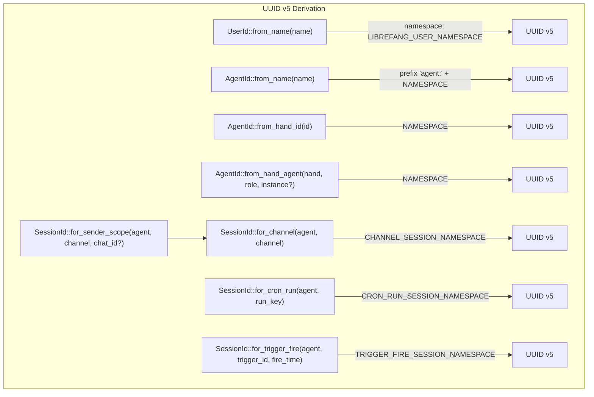

# Shared Types

# Agent Types (`librefang-types::agent`)

Identity, manifest, state, scheduling, and session-resolution types for the LibreFang agent runtime. Every other crate in the codebase — kernel, API, runtime, skills — depends on the definitions here. Changing any repr or serde contract in this file is a wire-format break.

## Deterministic Identity

All first-class entities (users, agents, sessions) use UUID v5 (SHA-1) derivation so the same logical input always produces the same ID across daemon restarts, config reloads, and fleet nodes. This is what makes audit-log correlation and session-history survival possible.


```mermaid
graph TD
    subgraph "UUID v5 Derivation"
        U["UserId::from_name(name)"] -->|namespace: LIBREFANG_USER_NAMESPACE| U5[UUID v5]
        A["AgentId::from_name(name)"] -->|prefix 'agent:' + NAMESPACE| A5[UUID v5]
        AH["AgentId::from_hand_id(id)"] -->|NAMESPACE| AH5[UUID v5]
        AHA["AgentId::from_hand_agent(hand, role, instance?)"] -->|NAMESPACE| AHA5[UUID v5]
        SC["SessionId::for_channel(agent, channel)"] -->|CHANNEL_SESSION_NAMESPACE| SC5[UUID v5]
        SR["SessionId::for_sender_scope(agent, channel, chat_id?)"] --> SC
        SCR["SessionId::for_cron_run(agent, run_key)"] -->|CRON_RUN_SESSION_NAMESPACE| SCR5[UUID v5]
        ST["SessionId::for_trigger_fire(agent, trigger_id, fire_time)"] -->|TRIGGER_FIRE_SESSION_NAMESPACE| ST5[UUID v5]
    end
```

### Namespaces

Each derivation flavour uses a distinct UUID namespace so the same input string can never collide across identity types:

| Namespace constant | Used by | Collision scope |
|---|---|---|
| `LIBREFANG_USER_NAMESPACE` | `UserId::from_name` | User names only |
| `AgentId::NAMESPACE` | `AgentId::from_name`, `from_hand_id`, `from_hand_agent` | Internally prefixed (`agent:`, bare, `hand:role[:instance]`) |
| `CHANNEL_SESSION_NAMESPACE` | `SessionId::for_channel`, `from_route_key` | `(agent, scope)` pairs |
| `CRON_RUN_SESSION_NAMESPACE` | `SessionId::for_cron_run` | `(agent, run_key)` pairs |
| `TRIGGER_FIRE_SESSION_NAMESPACE` | `SessionId::for_trigger_fire` | `(agent, trigger_id, timestamp)` triples |

**Stability contract**: `LIBREFANG_USER_NAMESPACE` is frozen. Rotating it re-hashes every existing `UserId` and breaks audit-log continuity across the fleet. The same discipline applies to all namespace constants — never change them.

## Core Identifiers

### `UserId`

Wraps a `Uuid`. Two constructors:

- **`UserId::new()`** — random v4. Used for ephemeral/internal identities. Avoid for config-backed users: the UUID changes on every restart, making cross-restart correlation impossible.
- **`UserId::from_name(name)`** — deterministic v5 from the stable namespace. Prefer this for all users sourced from configuration.

### `AgentId`

Wraps a `Uuid`. Deterministic constructors handle the multi-agent hand system:

- `AgentId::from_name(name)` — prefixed with `"agent:"` inside the namespace to avoid collisions with hand-derived IDs.
- `AgentId::from_hand_id(hand_id)` — bare `hand_id` input for backward compat with existing hand instances.
- `AgentId::from_hand_agent(hand_id, role, instance_id)` — the multi-instance hand variant. When `instance_id` is `None`, uses the legacy format `"{hand_id}:{role}"` so existing single-instance hands keep their IDs. When `Some`, appends the instance UUID for per-instance uniqueness.

### `SessionId`

The most complex identifier because session resolution has multiple callers (channels, cron, triggers, agent_send) and a precedence chain. See [Session Resolution](#session-resolution) below.

## Session Resolution

`SessionId` has several factory methods, each targeting a specific dispatch path:

| Method | Caller | Key input |
|---|---|---|
| `for_channel(agent, channel)` | Channel messages, cron (synthetic `"cron"` channel) | Lowercased `"{agent_uuid}:{channel}"` |
| `for_sender_scope(agent, channel, chat_id?)` | Channel `/new`, `/reboot`, `/compact` commands | Delegates to `compose_sender_scope` then `for_channel` |
| `for_cron_run(agent, run_key)` | Cron jobs with `session_mode = "new"` | `"{agent_uuid}:{run_key}"` |
| `for_trigger_fire(agent, trigger_id, fire_time)` | Event triggers with `SessionMode::New` | `"{agent_uuid}:{trigger_id}:{rfc3339_nanos}"` |
| `from_route_key(agent, channel, account, conversation)` | Multi-tenant routing | `v2:` prefixed when account is non-empty for collision safety with legacy format |

### `compose_sender_scope`

The canonical scope-string formula shared by this crate and the kernel's `sender_chat_scope` metadata stamp. Both call sites must stay in lockstep — divergence causes memory-scope leakage between chats (regression #5227).

Returns `Some("channel:chat_id")` when both are non-empty, `Some("channel")` when chat_id is absent, `None` when channel itself is empty.

### Session resolution precedence (documented on `AgentManifest::session_mode`)

1. Explicit `session_id_override` from the dispatch caller — always wins.
2. Per-trigger `session_mode` override.
3. Channel branch — always uses `SessionId::for_channel` when a non-empty `SenderContext.channel` is present, overriding both per-trigger and manifest values.
4. Cron — synthesizes a `"cron"` channel or passes an explicit `session_id_override` from the job scheduler.
5. Manifest `session_mode` — final fallback.

The kernel emits `tracing::debug!` events with `resolution_source` so operators can verify why a particular `session_mode` declaration is or isn't being honored.

## Agent Manifest

`AgentManifest` is the complete declarative configuration for an agent, deserialized from `agent.toml`. It is the single source of truth for agent behavior at spawn time.

### Key fields by category

**Identity & scheduling**
- `name`, `version`, `description`, `author` — metadata
- `schedule` — `Reactive` (default, event-driven), `Periodic { cron }`, `Proactive { conditions }`, or `Continuous { check_interval_secs }`
- `session_mode` — `Persistent` (reuse session) or `New` (fresh per invocation)
- `enabled` — disabled agents are not spawned at startup

**LLM configuration**
- `model` — `ModelConfig` with provider, model name, temperature, system prompt, context window overrides, and `extra_params` (flattened into the API request via `#[serde(flatten)]`). Uses `BTreeMap` for deterministic key order to preserve provider prompt caches (#3298).
- `fallback_models` — three-state: `None` = inherit global fallback chain, `Some([])` = disable fallbacks, `Some([...])` = explicit chain.
- `routing` — optional `ModelRoutingConfig` for complexity-based auto-selection.
- `thinking` — per-agent extended thinking override.
- `pinned_model` — model pin for stable-prefix mode.
- `response_format` — structured output format.

**Tooling & capabilities**
- `profile` — named `ToolProfile` (Minimal, Coding, Research, Messaging, Automation, Full, Custom) that expands to a tool list and derived `ManifestCapabilities`.
- `tool_allowlist` / `tool_blocklist` — fine-grained filtering applied after profile expansion.
- `tools_disabled` — master kill switch overriding everything.
- `capabilities` — explicit `ManifestCapabilities` (network, shell, memory scopes, agent spawn, OFP).
- `exec_policy` — per-agent shell-exec override (`allow`, `deny`, `full`, `allowlist`).
- `tool_exec_backend` — per-agent backend override (`local`, `ssh`, `daytona`).

**Autonomous operation**
- `autonomous` — `AutonomousConfig` with quiet hours, max iterations/restarts, heartbeat settings.
- `max_concurrent_invocations` — caps trigger-dispatch fan-out per agent. Requires `session_mode = "new"` for caps > 1; persistent + cap > 1 is auto-clamped to 1.
- `async_tasks` — `AsyncTasksConfig` for workflow_start timeout and notification policy.

**Memory & learning**
- `proactive_memory` — per-agent overrides for the global proactive-memory policy.
- `auto_dream_enabled`, `auto_dream_min_hours`, `auto_dream_min_sessions` — background consolidation.
- `skill_workshop` — `SkillWorkshopConfig` for passive after-turn skill capture. Default off; opt-in per agent.
- `auto_evolve` — background skill evolution review after each turn (default on).

**Workspaces**
- `workspace` — private agent directory, auto-created on spawn.
- `workspaces` — named `WorkspaceDecl` map for shared directories. Each entry has either `path` (relative to workspaces_dir) or `mount` (absolute host path, requires `allowed_mount_roots` whitelist) and an access `mode` (`ReadWrite` or `ReadOnly`).

**Channels & plugins**
- `channels` — restrict which channel types this agent serves. Empty = all.
- `allowed_plugins` — restrict which plugins load. Empty = all.
- `channel_overrides` — per-agent DM/group policy overrides.

**Context management**
- `max_history_messages` — per-agent trim cap override.
- `cache_context` — read `context.md` once at session start vs. re-read every turn.
- `context_injection` — per-agent injections merged with global entries.
- `compaction` — `CompactionOverrides` for per-agent summarisation tuning.

**Triggers**
- `triggers` — `Vec<ManifestTrigger>` for declarative event triggers. Reconciled against the runtime trigger store on spawn/reload.
- `reconcile_orphans` — `OrphanPolicy` (Keep/Warn/Delete) for runtime-only triggers not in the manifest.

### Serde leniency

Many `Vec` and `HashMap` fields use custom deserializers (`vec_lenient`, `map_lenient`, `option_vec_lenient`) that downgrade parse errors for individual items to warnings rather than failing the entire manifest parse. This prevents a single malformed entry from breaking agent startup.

## Agent Entry

`AgentEntry` is the runtime representation of a registered agent in the kernel's registry — the mutable companion to the immutable `AgentManifest`. It adds:

- `id: AgentId`, `state: AgentState`, `mode: AgentMode`
- `created_at`, `last_active` timestamps
- `parent` / `children` for the spawn hierarchy
- `session_id` for the current active session
- `source_toml_path` for disk-originated agents
- `identity: AgentIdentity` (emoji, avatar, color, archetype, vibe)
- `onboarding_completed` / `onboarding_completed_at`
- `force_session_wipe` — next invocation clears message history (keeps session ID)
- `resume_pending` — agent was interrupted but should continue on same transcript
- `reset_reason` — why the last auto-reset happened
- `has_processed_message` — sticky flag set on first real dispatch; prevents heartbeat monitor from false-positive crash detection on agents that were spawned but never received work

## Enums

### `AgentState`

```
Created → Running → Suspended → Terminated
                  → Crashed
```

### `AgentMode`

Permission filter applied to the tool list at dispatch time via `filter_tools()`:

- **Observe** — no tools at all
- **Assist** — read-only subset (`file_read`, `file_list`, `memory_list`, `memory_recall`, `web_fetch`, `web_search`, `agent_list`)
- **Full** (default) — all granted tools

### `SessionMode`

Controls session reuse for automated invocations. Strictly deserialized — unknown variant strings error rather than falling back to default, because silently re-mapping a typo'd `"New"` to `Persistent` would cause undefined concurrent writes to a shared session.

### `HookEvent`

Lifecycle hooks for the agent loop: `BeforeToolCall`, `AfterToolCall`, `TransformToolResult`, `BeforePromptBuild`, `AgentLoopEnd`.

### `ResetScope`

Passed to reset/reboot operations. `Agent` wipes all sessions; `Session(SessionId)` targets a single session — prevents a channel `/new` in one chat from destroying transcripts in every other surface the same agent serves (#4868).

### `WebSearchAugmentationMode`

`Off`, `Auto` (default — augment when model doesn't support tools), `Always`. Enables web search injection for models like Ollama Gemma4 that lack tool/function calling.

## Tool Profiles

`ToolProfile` is a named preset that expands to a concrete tool list and a set of implied `ManifestCapabilities`:

```rust
let caps = ToolProfile::Coding.implied_capabilities();
// caps.network = ["*"], caps.shell = ["*"], caps.tools = ["file_read", "file_write", ...]
```

The expansion is purely string-based — it checks for tool name prefixes (`web_*`, `agent_*`, `memory_*`) to decide which capability categories to enable.

## Skill Workshop

`SkillWorkshopConfig` controls passive after-turn capture of reusable workflows. Default off. When enabled, the workshop:

1. Runs heuristic pattern matching on turn transcripts (or heuristic + LLM via `ReviewMode::ThresholdLlm`)
2. Writes candidates to `pending/<agent_id>/<uuid>.toml`
3. Respects `max_pending` (LRU eviction) and optional `max_pending_age_days` TTL
4. Follows `ApprovalPolicy`: `Pending` (human review) or `Auto` (promote through the same injection scan as marketplace skills)

## Compaction Overrides

`CompactionOverrides` provides per-agent tuning of the session compaction algorithm. Each field is `Option<_>` — when set, it supersedes the matching global `CompactionTomlConfig` field. The `resolve()` method merges onto a global snapshot:

```rust
let effective = agent.manifest.compaction
    .as_ref()
    .map(|o| o.resolve(&global_compaction))
    .unwrap_or(global_compaction.clone());
```

`token_threshold_ratio` is clamped to `[0.0, 1.0]` at resolve time to prevent misconfigured agents from disabling compaction entirely or triggering it every message.

## Name Validation

`validate_agent_name` rejects names starting with `RESERVED_OPERATOR_AGENT_NAME_PREFIX` (`"_operator:"`), which is used by the workflow engine for synthetic operator-node step results (#4980). This prevents ambiguity in run history between builtin steps and hand-rolled agents.

`SessionLabel::new` validates labels to 1–128 chars, alphanumeric + spaces + hyphens + underscores only.

## A/B Testing

`PromptExperiment`, `ExperimentVariant`, and `SuccessCriteria` support prompt version testing with traffic splitting and automated success criteria evaluation. Experiments progress through `Draft → Running → Paused → Completed`.

## Consumption by Other Crates

The call-graph data shows this module's types flowing to:

- **`librefang-kernel`** — `AgentId::from_hand_agent` and `from_hand_id` for multi-agent hand dispatch; `SessionId` factories for all session resolution paths
- **`librefang-api`** — `UserId` in auth middleware; `AgentId` in session and channel-bridge endpoints
- **`librefang-runtime`** — `ModelRoutingConfig` for complexity-based routing; `ToolProfile` expansion
- **`librefang-skills`** — `ToolProfile` during skill conversion
- **`librefang-import`** — `ToolProfile` and capability expansion during OpenClaw migration
- **`tool_runner`** — `AgentId` for channel-send mirror dispatch