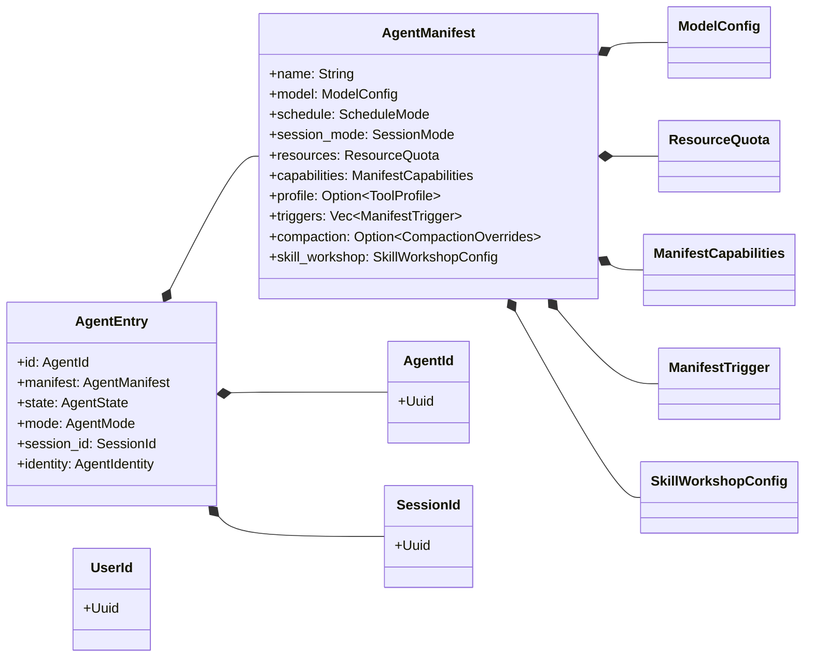

# Shared Types

# Shared Agent Types (`librefang-types/src/agent.rs`)

## Purpose

This module defines every core type that describes an **agent** in the LibreFang runtime — its identity, manifest configuration, lifecycle state, session resolution, scheduling, resource quotas, tool profiles, workspace declarations, event triggers, and skill workshop settings.

It is consumed by nearly every other crate (`librefang-kernel`, `librefang-runtime`, `librefang-api`, `librefang-cli`). Because it sits at the bottom of the dependency graph, all types here are pure data with **no runtime behaviour** beyond constructors, validation helpers, and serde round-trips.

---

## Core Type Map


```mermaid
classDiagram
    direction LR
    class AgentManifest {
        +name: String
        +model: ModelConfig
        +schedule: ScheduleMode
        +session_mode: SessionMode
        +resources: ResourceQuota
        +capabilities: ManifestCapabilities
        +profile: Option~ToolProfile~
        +triggers: Vec~ManifestTrigger~
        +compaction: Option~CompactionOverrides~
        +skill_workshop: SkillWorkshopConfig
    }
    class AgentEntry {
        +id: AgentId
        +manifest: AgentManifest
        +state: AgentState
        +mode: AgentMode
        +session_id: SessionId
        +identity: AgentIdentity
    }
    class AgentId { +Uuid }
    class SessionId { +Uuid }
    class UserId { +Uuid }
    AgentEntry *-- AgentManifest
    AgentEntry *-- AgentId
    AgentEntry *-- SessionId
    AgentManifest *-- ModelConfig
    AgentManifest *-- ResourceQuota
    AgentManifest *-- ManifestCapabilities
    AgentManifest *-- ManifestTrigger
    AgentManifest *-- SkillWorkshopConfig
```

---

## Identifier System

Three newtype wrappers — `AgentId`, `SessionId`, `UserId` — each wrap a `Uuid`. Every one can be created randomly (`::new()`) or **derived deterministically** via UUID v5 (SHA-1 + namespace). Deterministic derivation is critical for audit-log correlation across daemon restarts.

### `AgentId`

| Constructor | Input | Namespace | Use case |
|---|---|---|---|
| `AgentId::new()` | — | random v4 | general-purpose |
| `AgentId::from_name(name)` | agent name string | `NAMESPACE` with `agent:` prefix | TOML-declared agents |
| `AgentId::from_hand_id(hand_id)` | hand identifier | `NAMESPACE`, bare input | hand backward compat |
| `AgentId::from_hand_agent(hand_id, role, instance_id)` | hand + role + optional instance | `NAMESPACE` with `hand:role[:instance]` format | multi-agent hand roles |

All typed variants use a **single namespace UUID** with prefixed input strings (`"agent:name"`, `"hand_id:role"`, etc.) to avoid cross-type collisions.

### `UserId`

- `UserId::from_name(name)` — UUID v5 under `LIBREFANG_USER_NAMESPACE`.
- **Warning**: `LIBREFANG_USER_NAMESPACE` is a frozen constant. Changing it re-keys every user ID and breaks fleet-wide audit history.

### `SessionId`

Session IDs have the richest derivation surface. Each source gets its own disjoint UUID v5 namespace so two derivations can never collide even with overlapping input strings:

| Constructor | Namespace constant | Input formula | Used by |
|---|---|---|---|
| `SessionId::new()` | random v4 | — | ad-hoc sessions |
| `SessionId::for_channel(agent, channel)` | `CHANNEL_SESSION_NAMESPACE` | `"{agent_id}:{channel}"` | channel-bound persistent sessions |
| `SessionId::for_sender_scope(agent, ch, chat_id)` | (delegates to `for_channel`) | `compose_sender_scope(ch, chat_id)` | kernel inbound resolver, channel-bridge resets |
| `SessionId::for_cron_run(agent, run_key)` | `CRON_RUN_SESSION_NAMESPACE` | `"{agent_id}:{run_key}"` | per-fire cron isolation |
| `SessionId::for_trigger_fire(agent, trigger_id, fire_time)` | `TRIGGER_FIRE_SESSION_NAMESPACE` | `"{agent_id}:{trigger_id}:{rfc3339_nanos}"` | per-fire trigger isolation |
| `SessionId::from_route_key(agent, ch, acct, conv)` | `CHANNEL_SESSION_NAMESPACE` | legacy: `for_channel`; v2: `"v2:{agent}:{ch}:{acct}:{conv}"` | multi-tenant channel routing |

#### Scope composition — `compose_sender_scope`

The helper `compose_sender_scope(channel, chat_id)` is the **single source of truth** for building scope strings. It returns `Some("channel:chat_id")` when both are present, `Some("channel")` when chat_id is absent, and `None` when channel itself is empty. Both the kernel's session resolver and the runtime's memory-scope filter call this function — if they ever drift, cross-chat memory isolation breaks (#5227).

---

## Agent Manifest (`AgentManifest`)

The manifest is the **complete declarative configuration** for an agent, typically authored as `agent.toml`. It has ~60 fields. The most important groups:

### LLM Configuration

- **`model`** (`ModelConfig`) — provider, model name, temperature, max_tokens, system_prompt, optional `context_window`/`max_output_tokens` overrides, and `extra_params` (a flattened `HashMap` for provider-specific request-body extensions like Qwen's `enable_memory`).
- **`fallback_models`** — three-state: `None` (inherit global chain), `Some([])` (disable fallbacks), `Some([...])` (explicit chain).
- **`routing`** (`ModelRoutingConfig`) — auto-select cheap/mid/expensive models by token-count thresholds.
- **`pinned_model`** — override used in Stable prefix mode.
- **`thinking`** — per-agent `ThinkingConfig` override (budget tokens, stream thinking).
- **`response_format`** — structured-output request format.

### Session Behaviour

- **`session_mode`** (`SessionMode`) — `Persistent` (reuse one session) or `New` (fresh per invocation). Resolved with a 5-level precedence chain documented on the field: explicit override → per-trigger → channel-derived → cron override → manifest default.
- **`max_concurrent_invocations`** — caps trigger fan-out concurrency. Requires `session_mode = "new"` when > 1.

### Scheduling

- **`schedule`** (`ScheduleMode`) — `Reactive` (on-message), `Periodic { cron }`, `Proactive { conditions }`, or `Continuous { check_interval_secs }`.
- **`autonomous`** (`AutonomousConfig`) — 24/7 agent guardrails: quiet hours, max iterations (default 50), restart cap, heartbeat interval/timeout, heartbeat channel.

### Resource Limits

- **`resources`** (`ResourceQuota`) — memory, CPU time, tool-call rate, hourly/daily/monthly cost caps, LLM token budget with a burst ratio (`effective_burst_ratio` resolves agent override → global default → 0.2, clamped to `[0.01, 1.0]`).

### Tool Access

- **`profile`** (`ToolProfile`) — named presets (`Minimal`, `Coding`, `Research`, `Messaging`, `Automation`, `Full`, `Custom`) that expand to tool lists and implied `ManifestCapabilities`.
- **`tool_allowlist`** / **`tool_blocklist`** — post-profile filtering.
- **`tools_disabled`** — nuclear option, overrides everything.
- **`exec_policy`** — per-agent shell/exec policy override.
- **`tool_exec_backend`** — per-agent backend override (`local`, `ssh`, `daytona`).

### Workspaces

- **`workspace`** — agent-private directory, auto-created on spawn.
- **`workspaces`** (`HashMap<String, WorkspaceDecl>`) — named shared workspaces. Each `WorkspaceDecl` has either a `path` (relative to `workspaces_dir`) or a `mount` (absolute host path, must be in `allowed_mount_roots`), plus a `WorkspaceMode` (`ReadWrite` or `ReadOnly`).

### Triggers

- **`triggers`** (`Vec<ManifestTrigger>`) — declarative event triggers, reconciled against the runtime store on spawn/reload.
- **`reconcile_orphans`** (`OrphanPolicy`) — `Keep` (default), `Warn`, or `Delete` for runtime-only triggers missing from TOML.

### Memory & Compaction

- **`proactive_memory`** — per-agent overrides for the global proactive-memory policy.
- **`compaction`** (`Option<CompactionOverrides>`) — per-agent overrides for `threshold_messages`, `keep_recent`, `max_summary_tokens`, etc. Merged via `resolve()` which takes agent overrides over global defaults. `is_empty()` lets callers skip the merge when no overrides exist.

### Other Notable Fields

| Field | Type | Purpose |
|---|---|---|
| `skills` | `Vec<String>` | Skill references (empty = all) |
| `skills_disabled` | `bool` | Disable all skills |
| `mcp_servers` | `Vec<String>` | MCP server allowlist |
| `mcp_disabled` | `bool` | Hide all MCP tools from this agent |
| `allowed_plugins` | `Vec<String>` | Plugin allowlist |
| `inherit_parent_context` | `bool` | Workflow subagent context inheritance |
| `context_injection` | `Vec<ContextInjection>` | Per-agent context additions |
| `cache_context` | `bool` | Read `context.md` once vs. every turn |
| `show_progress` | `bool` | Surface `🔧 tool_name` markers in channel replies |
| `auto_evolve` | `bool` | Background skill evolution after each turn |
| `auto_dream_enabled` | `bool` | Opt-in to periodic memory consolidation |
| `web_search_augmentation` | `WebSearchAugmentationMode` | Auto web-search before LLM call (`Off`/`Auto`/`Always`) |
| `channel_overrides` | `Option<ChannelOverrides>` | Per-agent dm/group policy overrides |
| `max_history_messages` | `Option<usize>` | Trim cap override (clamped 4–500) |
| `async_tasks` | `AsyncTasksConfig` | Timeout and notification policy for async task tracker |
| `is_hand` | `bool` | Persisted hand-origin marker |

---

## Agent Entry (`AgentEntry`)

The runtime representation of a registered agent. Combines the manifest with live state:

- **`id`** / **`name`** — identity
- **`manifest`** — full configuration snapshot
- **`state`** (`AgentState`) — `Created`, `Running`, `Suspended`, `Terminated`, `Crashed`
- **`mode`** (`AgentMode`) — `Observe` (no tools), `Assist` (read-only tools only), `Full` (all granted tools)
- **`session_id`** — active session
- **`identity`** (`AgentIdentity`) — emoji, avatar URL, color, archetype, vibe, greeting style
- **`parent`** / **`children`** — spawn hierarchy
- **`source_toml_path`** — original TOML file path for disk-spawned agents

### Session Reset State

Three fields control session auto-reset and recovery:

| Field | Purpose |
|---|---|
| `force_session_wipe` | Next LLM call clears message history (keeps `session_id`). Takes priority over `resume_pending`. |
| `resume_pending` | Agent was interrupted; preserve `session_id` and continue on the same transcript. |
| `has_processed_message` | Sticky flag — `true` once the agent has processed at least one real message. Prevents heartbeat monitor from flagging a spawned-but-idle agent as unresponsive (#844). |

---

## State & Mode Enums

### `AgentState`

```
Created → Running → Suspended → Terminated
                  → Crashed
```

### `AgentMode` and Tool Filtering

`AgentMode::filter_tools()` enforces permission levels at the type level:

- **Observe** — returns empty list
- **Assist** — keeps only `file_read`, `file_list`, `memory_list`, `memory_recall`, `web_fetch`, `web_search`, `agent_list`
- **Full** — passes through all tools

### `SessionMode`

Controls session reuse for automated invocations. **Strict deserialization** — unknown variant strings error rather than falling back to default. This prevents a capitalized typo like `session_mode = "New"` from silently becoming `Persistent`.

### `HookEvent`

Lifecycle hooks that can be intercepted: `BeforeToolCall`, `AfterToolCall`, `TransformToolResult`, `BeforePromptBuild`, `AgentLoopEnd`.

---

## Tool Profiles

`ToolProfile` maps named presets to concrete tool lists and capability grants:

| Profile | Tool count | Key capabilities |
|---|---|---|
| Minimal | 2 | `file_read`, `file_list` |
| Coding | 5 | + `file_write`, `shell_exec`, `web_fetch` |
| Research | 4 | `web_fetch`, `web_search`, `file_read`, `file_write` |
| Messaging | 6 | `agent_send`, `channel_send`, memory tools |
| Automation | 12 | all of the above |
| Full / Custom | wildcard `["*"]` | everything |

`implied_capabilities()` derives a `ManifestCapabilities` struct from the tool list by inspecting which tool name prefixes are present (`web_*` → network, `shell_exec` → shell, `agent_*` → agent_spawn, `memory_*` → memory).

---

## Triggers (`ManifestTrigger`)

Declarative triggers defined in `agent.toml` under `[[triggers]]`. Key fields:

- **`pattern`** — carried as `serde_json::Value` (parsed at reconcile time to avoid kernel dependency)
- **`prompt_template`** — `{{event}}` is replaced at fire time
- **`session_mode`** — per-trigger override of the manifest default
- **`target_agent`** — route the triggered message to a different agent (by name)
- **`workflow_id`** — fire a workflow instead of dispatching a message
- **`max_fires`** / **`cooldown_secs`** — rate limiting

On spawn/reload, the kernel reconciles the TOML list against `trigger_jobs.json`: missing entries are created, drifted entries are updated (TOML wins), and orphans are handled per `reconcile_orphans` policy.

---

## Skill Workshop (`SkillWorkshopConfig`)

Passive after-turn capture of reusable workflows. Default is **disabled** — operators opt in via `[skill_workshop] enabled = true`.

| Field | Default | Purpose |
|---|---|---|
| `enabled` | `false` | Master switch |
| `auto_capture` | `true` | Run heuristic scanner after each turn (independent of `enabled`) |
| `approval_policy` | `Pending` | Candidates wait for human review; `Auto` bypasses review |
| `review_mode` | `Heuristic` | Pattern-match only; `ThresholdLlm` adds auxiliary LLM confirmation |
| `max_pending` | `20` | LRU cap on pending candidates per agent |
| `max_pending_age_days` | `None` | Optional TTL for pending candidates |

---

## Compaction Overrides (`CompactionOverrides`)

Per-agent overrides for the kernel-global compaction policy. Each field is `Option` — `None` inherits global, `Some(_)` takes precedence. The `resolve(global)` method merges agent overrides onto global defaults and returns a fresh config. `token_threshold_ratio` is clamped to `[0.0, 1.0]` to prevent misconfiguration.

```toml
[compaction]
threshold_messages = 50
keep_recent = 20
max_summary_tokens = 8192
```

---

## Async Tasks (`AsyncTasksConfig`)

Per-agent settings for the async task tracker (#4983):

- **`default_timeout_secs`** — kernel-imposed wall-clock timeout when the caller doesn't provide one. `None` = no limit.
- **`notify_on_timeout`** — inject a synthetic `TaskCompletionEvent` on timeout (default `true`). Set `false` for batch agents.

---

## Validation

### `validate_agent_name`

Rejects names starting with `_operator:` — the reserved prefix used by the workflow engine for synthetic operator-node names (Wait, Gate, Approval, Transform, Branch). A colliding name would make run history ambiguous between a real agent and a workflow step (#4980).

### `SessionLabel`

Validated wrapper — 1–128 chars, alphanumeric + spaces + hyphens + underscores only. Created via `SessionLabel::new()` which returns `Result`.

---

## Key Design Principles

1. **Deterministic IDs everywhere** — UUID v5 derivation ensures the same logical identity always maps to the same ID across restarts, nodes, and processes. Disjoint namespace constants prevent cross-flavour collisions.
2. **Three-state optionals** — `fallback_models: Option<Vec<_>>` distinguishes "not configured" (`None`, inherit global) from "explicitly empty" (`Some([])`, disable fallbacks) from "configured" (`Some([...])`).
3. **Strict deserialization** — `SessionMode` errors on unknown variants rather than silently defaulting. This prevents a typo from changing session semantics.
4. **Single source of truth** — `compose_sender_scope` is the one place the scope formula lives. All session-id and memory-scope consumers call it rather than inlining `format!("{ch}:{cid}")`.
5. **Resolution chains** — many fields (thinking, compaction, burst ratio, token limits) follow an agent-override → global-default → compiled-fallback pattern, documented on each field.