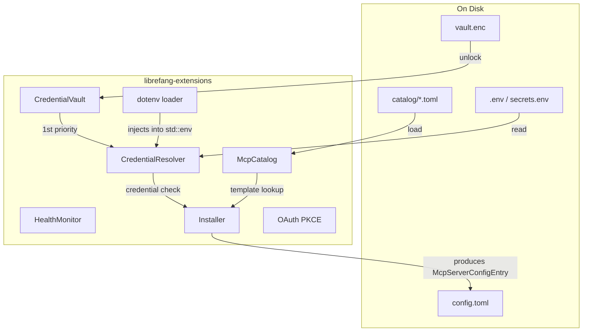

# Skills & Extensions — librefang-extensions-src

# librefang-extensions

MCP server catalog, encrypted credential vault, OAuth2 PKCE flows, health monitoring, and installation logic for LibreFang.

All configured MCP servers live as `[[mcp_servers]]` entries in `~/.librefang/config.toml`. An optional `template_id` field on each entry points back to the catalog template it was installed from. There is no separate `integrations.toml`.

## Architecture



## Core Types (`lib.rs`)

`ExtensionError` enumerates all failure modes — `NotFound`, `AlreadyInstalled`, `Vault`, `VaultLocked`, `OAuth`, `TomlParse`, `Io`, `Http`, `HealthCheck`, and `CredentialNotFound`. All public functions return `ExtensionResult<T>`, an alias for `Result<T, ExtensionError>`.

Key shared types:

| Type | Purpose |
|---|---|
| `McpCategory` | Enum: `DevTools`, `Productivity`, `Communication`, `Data`, `Cloud`, `AI` |
| `McpStatus` | Server lifecycle: `Ready`, `Setup`, `Available`, `Error(String)`, `Disabled` |
| `McpCatalogEntry` | Full catalog template — id, name, transport, required env, OAuth config, health check config |
| `McpCatalogTransport` | Template transport variants: `Stdio { command, args }`, `Sse { url }`, `Http { url }` |
| `McpCatalogRequiredEnv` | Describes one required env var: name, label, help text, `is_secret`, optional `get_url` |
| `OAuthTemplate` | OAuth provider config: provider name, scopes, auth_url, token_url |
| `HealthCheckConfig` | `interval_secs` and `unhealthy_threshold` with sensible defaults (60s / 3 failures) |

`McpCatalogTransport` maps to `librefang_types::config::McpTransportEntry` at install time. The `HttpCompat` variant is intentionally absent from the catalog — it's a power-user transport that doesn't ship as a template.

---

## MCP Catalog (`catalog`)

Read-only in-memory index of all template TOML files under `~/.librefang/mcp/catalog/`. Templates are refreshed from the upstream registry by `librefang_runtime::registry_sync`.

### File Layout

Two layouts are recognized:

- **Flat**: `<id>.toml` — the id is the filename minus the extension.
- **Directory**: `<id>/MCP.toml` — for multi-file MCP packages; the id is the directory name.

This mirrors `web/scripts/fetch-registry.ts` so catalog loading, the live API, and the UI all agree on identity.

### McpCatalog API

```rust
let mut catalog = McpCatalog::new(&home_dir);
let count = catalog.load(&home_dir); // full reload — clears stale entries first
```

- **`load(&mut self, home_dir: &Path) -> usize`** — Re-reads all template files. Accepts `home_dir` explicitly so tests can share a single home directory. Performs a full clear-and-reload so deleted/renamed files on disk don't linger.
- **`get(id: &str) -> Option<&McpCatalogEntry>`** — Lookup by id.
- **`list() -> Vec<&McpCatalogEntry>`** — All entries sorted by id.
- **`list_by_category(category: &McpCategory) -> Vec<&McpCatalogEntry>`** — Filtered list.
- **`search(query: &str) -> Vec<&McpCatalogEntry>`** — Case-insensitive substring match against id, name, description, and tags.

---

## Credential Vault (`vault`)

AES-256-GCM encrypted secret storage at `~/.librefang/vault.enc`.

### Encryption Scheme

1. A 32-byte master key is generated on `init()`.
2. Master key is stored in the OS keyring (macOS Keychain / Windows Credential Manager / Linux Secret Service via `libsecret`).
3. If the OS keyring is unavailable, a file-based fallback at `$LOCAL_DATA/librefang/.keyring` wraps the master key with AES-256-GCM using an Argon2id-derived key from a machine fingerprint (username + hostname hash).
4. Each `save()` generates a fresh random salt + nonce, derives an encryption key via Argon2id from the master key + salt, and encrypts the JSON-serialized entries with AES-256-GCM.
5. On-disk format starts with the `OFV1` magic header followed by a JSON `VaultFile` struct (version, salt, nonce, ciphertext — all base64). Legacy JSON-only files (no magic header, starting with `{`) are still readable for backward compatibility.

### Key Resolution Order

`resolve_master_key()` tries, in order:
1. Cached key (from a previous unlock/init on this instance)
2. OS keyring
3. `LIBREFANG_VAULT_KEY` environment variable

If none resolve, returns `ExtensionError::VaultLocked`.

### CredentialVault API

```rust
let mut vault = CredentialVault::new(path);
vault.init()?;                        // first-time setup — generates key, stores in keyring
vault.unlock()?;                      // decrypts and loads entries

vault.set("API_KEY".into(), Zeroizing::new("secret".into()))?;
let val = vault.get("API_KEY");       // Option<Zeroizing<String>>
vault.remove("API_KEY")?;             // returns bool — was it present?
let keys = vault.list_keys();         // Vec<&str> — no values exposed
```

For testing or programmatic use without the OS keyring:

```rust
let key = Zeroizing::new([0u8; 32]); // your own 32-byte key
vault.init_with_key(key.clone())?;
vault.unlock_with_key(key)?;
```

All in-memory secrets use `Zeroizing<String>` or `Zeroizing<[u8; 32]>`. On `Drop`, the vault clears its entries map and cached key.

### Keyring File Migration

The file-based keyring supports two versions:
- **v1 (legacy)**: XOR-obfuscated with a SHA-256 mask derived from the machine fingerprint. Automatically detected and re-stored in v2 format on load.
- **v2 (current)**: AES-256-GCM wrapped with Argon2id-derived key from the machine fingerprint.

---

## Credential Resolver (`credentials`)

Multi-source credential resolution with a defined priority chain.

### Resolution Order

| Priority | Source | Notes |
|---|---|---|
| 1 | Encrypted vault (`vault.enc`) | Must be unlocked |
| 2 | Dotenv file (`~/.librefang/.env`) | Loaded at construction time |
| 3 | Process environment variable | `std::env::var` |
| 4 | Interactive prompt (CLI only) | When `interactive` is enabled |

### CredentialResolver API

```rust
let resolver = CredentialResolver::new(Some(vault), Some(dotenv_path.as_ref()))
    .with_interactive(true);

// Single key
let secret = resolver.resolve("GITHUB_TOKEN"); // Option<Zeroizing<String>>

// Bulk
let creds = resolver.resolve_all(&["KEY_A", "KEY_B", "KEY_C"]);
let missing = resolver.missing_credentials(&["KEY_A", "KEY_B"]); // Vec<String>

// Check without side effects
if resolver.has_credential("KEY_A") { ... }

// Store to vault
resolver.store_in_vault("NEW_KEY", Zeroizing::new("value".into()))?;

// Invalidate dotenv cache entry after dashboard deletion
resolver.clear_dotenv_cache("STALE_KEY");
```

`has_credential` skips the interactive prompt — it only checks vault, dotenv, and env.

### Dotenv File Format

Standard `KEY=VALUE` lines. Comments (`#`), blank lines, and surrounding quotes (single or double) are handled. See `credentials::load_dotenv` for parsing details.

---

## Dotenv Loader (`dotenv`)

Shared startup routine that injects secrets into the process environment. Used by every entry point (CLI, desktop app, kernel) to ensure consistent credential loading.

### Priority (highest first)

1. System environment variables (already set) — **never overridden**
2. Credential vault (`vault.enc`) secrets
3. `~/.librefang/.env`
4. `~/.librefang/secrets.env`

### Usage

```rust
// Call once from synchronous main() BEFORE spawning any tokio runtime.
// std::env::set_var is UB in Rust 1.80+ once other threads exist.
dotenv::load_dotenv();
```

The call is `Once`-guarded — repeated calls are no-ops.

### File Management

```rust
dotenv::save_env_key("API_KEY", "value")?;  // upserts into .env, sets 0600 on Unix
dotenv::remove_env_key("API_KEY")?;          // removes from .env and current process
dotenv::list_env_keys();                      // Vec<String> of key names only
dotenv::env_file_exists();                    // bool
```

Files are written with a managed header comment and 0600 permissions on Unix. Values containing spaces, `#`, or `"` are double-quoted with escaped inner quotes.

---

## Health Monitor (`health`)

Concurrent-safe health tracking for configured MCP servers using `DashMap`.

### McpHealth Record

Each tracked server stores: id, status, tool count, last-ok timestamp, last error, consecutive failure count, reconnect state, and connected-since timestamp.

### Auto-Reconnect

Exponential backoff: 5s → 10s → 20s → 40s → ... → capped at `max_backoff_secs` (default 300s). Maximum 10 attempts (configurable). Background tokio tasks call `report_ok` / `report_error` and check `should_reconnect`.

```rust
let monitor = HealthMonitor::new(HealthMonitorConfig {
    auto_reconnect: true,
    max_reconnect_attempts: 10,
    max_backoff_secs: 300,
    check_interval_secs: 60,
});

monitor.register("github");
monitor.report_ok("github", 12);           // marks Ready, resets failure count
monitor.report_error("github", "timeout".into()); // increments consecutive_failures

let health = monitor.get_health("github"); // Option<McpHealth>
let all = monitor.all_health();            // Vec<McpHealth>

let backoff = monitor.backoff_duration(3); // Duration — exponential, capped
if monitor.should_reconnect("github") {
    monitor.mark_reconnecting("github");
}
```

The `health_map()` method returns `Arc<DashMap<String, McpHealth>>` for background task integration.

---

## Installer (`installer`)

Pure transforms — no side effects. Converts a catalog template + provided credentials into a `McpServerConfigEntry` that the caller persists to `config.toml`.

### install_integration

```rust
let result = install_integration(
    &catalog,
    &mut resolver,
    "github",                          // catalog entry id
    &provided_keys,                    // HashMap<String, String> of user-supplied creds
)?;
```

Steps:
1. Look up the template in the catalog.
2. Store provided credentials in the vault (best-effort — warns on failure).
3. Check which required env vars are still missing after combining provided keys with resolved credentials.
4. Map the template transport and required env into a `McpServerConfigEntry` via `catalog_entry_to_mcp_server`.
5. Return an `InstallResult` with the server entry, status (`Ready` if all creds present, `Setup` if missing), and a human-readable message.

The returned `InstallResult.server` has `template_id` set so the dashboard can trace it back to the catalog entry.

### Scaffold Commands

- **`scaffold_integration(dir)`** — Creates a `mcp.toml` template file in the given directory for a new custom MCP server.
- **`scaffold_skill(dir)`** — Creates `skill.toml` + `SKILL.md` for a new custom skill.

---

## OAuth (`oauth`)

OAuth2 Authorization Code + PKCE (S256) flows for Google, GitHub, Microsoft, and Slack.

### Flow

```rust
let tokens = run_pkce_flow(&oauth_template, &client_id).await?;
```

1. Generate PKCE verifier + SHA-256 challenge, plus a random CSRF state parameter.
2. Bind a temporary localhost TCP listener on a random port.
3. Build the authorization URL with `code_challenge_method=S256`.
4. Open the user's browser (platform-specific: `open` on macOS, `xdg-open` on Linux, `start` on Windows). Falls back to printing the URL to stderr.
5. Serve a single `/callback` route via `axum` that validates the state, extracts the authorization code, and responds with a success/closed HTML page.
6. Exchange the code for tokens via POST to `token_url` with the PKCE `code_verifier`.
7. Return `OAuthTokens` (re-exported from `librefang_types::oauth::OAuthTokens`).

The flow has a 5-minute timeout. Client IDs default to placeholder values — configure real ones via `OAuthConfig` (which `resolve_client_ids` merges with defaults).

---

## HTTP Client (`http_client`)

Shared `reqwest::Client` builder that loads native CA roots first and falls back to Mozilla's `webpki_roots` bundle if none are found. Uses `aws_lc_rs` as the TLS crypto provider.

```rust
let client = new_client(); // reqwest::Client — panics on build failure (should never happen)
let builder = client_builder(); // reqwest::ClientBuilder — for custom configuration
```

---

## Cross-Module Integration Points

**Vault → API authentication**: The kernel's `mcp_oauth_provider` calls `vault_get` → `vault.unlock()` → `resolve_master_key()` during TOTP setup/revoke flows and dashboard session token resolution.

**Dotenv → Every binary**: `dotenv::load_dotenv()` must be called from the synchronous `main()` of every binary (CLI, desktop, kernel) before any async runtime starts. This ensures secrets are available in `std::env` for all downstream consumers.

**Catalog → Installer → Config**: The CLI/API layer calls `install_integration` with the catalog and resolver, then persists the resulting `McpServerConfigEntry` to `config.toml` and triggers a kernel reload.

**Health Monitor → Kernel**: The kernel registers MCP servers with the `HealthMonitor`, background tasks report health, and `should_reconnect` drives auto-reconnection logic with exponential backoff.