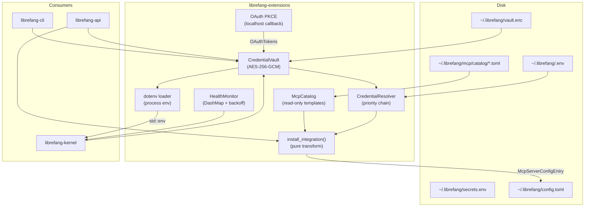

# Skills & Extensions — librefang-extensions-src

# librefang-extensions

MCP server catalog, credential vault, OAuth2 PKCE flows, health monitoring, and installation logic for LibreFang. This crate is the bridge between the upstream registry (template definitions) and the kernel's running MCP server instances.

## Architecture



## Core Types (`lib.rs`)

All shared types live at the crate root. The key ones:

| Type | Purpose |
|------|---------|
| `McpCatalogEntry` | A template definition from the registry — id, name, transport, required credentials, OAuth config, i18n overrides |
| `McpCatalogTransport` | Transport template: `Stdio`, `Sse`, or `Http` (mirrors `McpTransportEntry` without the `HttpCompat` variant) |
| `McpStatus` | Lifecycle state: `Available` → `Setup` → `Ready`, or `Error(String)`, or `Disabled` |
| `McpCategory` | Browsing category: `DevTools`, `Productivity`, `Communication`, `Data`, `Cloud`, `AI` |
| `OAuthTemplate` | Provider, scopes, auth/token URLs for PKCE flows |
| `ExtensionError` | Unified error enum — `NotFound`, `VaultLocked`, `OAuth(String)`, `Io`, etc. |

`McpCatalogEntry` supports i18n overrides via an `i18n: HashMap<String, McpCatalogI18n>` field keyed by BCP-47 tag. The API routes resolve `Accept-Language` against this table and fall back to the top-level English fields.

## MCP Catalog (`catalog`)

`McpCatalog` is an in-memory, read-only view of TOML template files under `~/.librefang/mcp/catalog/`. The upstream `librefang-runtime::registry_sync` refreshes these files from the registry; this module only reads them.

Two disk layouts are supported:

- **Flat**: `<id>.toml` — ID extracted from filename
- **Directory**: `<id>/MCP.toml` — ID from directory name (for multi-file MCP packages)

`McpCatalog::load()` performs a full reload (clears existing entries first) and returns the count loaded. Parse failures are warned and skipped. Query methods:

- `get(id)` — direct lookup
- `list()` — all entries sorted by ID
- `list_by_category(category)` — filtered by `McpCategory`
- `search(query)` — case-insensitive substring match on id, name, description, and tags

The catalog is **not** the source of truth for installed servers. Installed servers are `[[mcp_servers]]` entries in `config.toml`, optionally with a `template_id` pointing back to a catalog entry.

## Credential Resolution Chain

Credentials are resolved through a priority chain in `CredentialResolver`:

```text
1. Encrypted vault (~/.librefang/vault.enc)
2. Dotenv file (~/.librefang/.env)
3. Process environment variable
4. Interactive prompt (CLI only, when enabled)
```

Each source is tried in order; the first hit wins. All returned values are wrapped in `Zeroizing<String>`.

Key methods:

- **`resolve(key)`** — returns `Option<Zeroizing<String>>` trying all sources
- **`has_credential(key)`** — checks availability without prompting
- **`resolve_all(keys)`** — batch resolution returning `HashMap<String, Zeroizing<String>>`
- **`missing_credentials(keys)`** — returns which keys have no value in any source
- **`store_in_vault(key, value)`** — persists a credential to the vault (if configured)
- **`clear_dotenv_cache(key)`** — evicts a stale entry from the boot-time `.env` snapshot (used after dashboard deletion)

The resolver accepts an optional `CredentialVault` and optional `.env` path at construction. Interactive prompting is opt-in via `.with_interactive(true)`.

## Credential Vault (`vault`)

AES-256-GCM encrypted storage at `~/.librefang/vault.enc`. Secrets are serialized as JSON, encrypted with a key derived via Argon2id from a master key + random salt.

### Master key resolution

```text
1. Cached key (from prior unlock/init — avoids keyring race in parallel tests)
2. LIBREFANG_VAULT_KEY env var
3. OS keyring (Windows Credential Manager / macOS Keychain / Linux Secret Service)
4. File-based AES-256-GCM wrapped store at <data_local_dir>/librefang/.keyring
```

The env var takes precedence over the OS keyring to support CI/headless deployments where the env var is the intended source of truth.

### OS keyring behavior

The OS keyring is used by default on Linux and Windows. On macOS it is **disabled by default** (`default_use_os_keyring_for_platform()` returns `false`) because the Keychain ACL is bound to the per-binary code signature — every `cargo build` invalidates the ACL and triggers another permission prompt. Override at three levels:

1. **Config**: `VaultConfig.use_os_keyring` → `CredentialVault::init_with_config()`
2. **Env var**: `LIBREFANG_VAULT_NO_KEYRING=1` (always wins)
3. **Platform default**: disabled on macOS, enabled elsewhere

When the OS keyring is unavailable or disabled, the master key is stored in a file wrapped with AES-256-GCM using a key derived from a machine fingerprint (`SHA-512` of domain-tagged OS identifiers).

### On-disk format

The vault file starts with a 4-byte magic `OFV1`, followed by a JSON `VaultFile` containing:

- `version` (always 1)
- `salt` — Argon2id salt (base64)
- `nonce` — AES-GCM nonce (base64)
- `ciphertext` — encrypted entries (base64)
- `schema_version` — AAD schema version (0 = legacy path-only, 1 = version + path)

The AAD binds the ciphertext to the vault file path, preventing file-swap attacks. Version 0 (legacy) uses path-only AAD for backward compatibility; `save()` always writes schema version 1.

### Keyring file migration

The file-based keyring store is at version 3. Version 2 files (pre-#4159, derived wrap key from raw `random_id`) are auto-migrated to version 3 on first successful decrypt. The v2 read path will be removed after two release cycles.

### Lifecycle

```rust
let mut vault = CredentialVault::new(path);
vault.init()?;            // generate key, create vault.enc
// ... later ...
vault.unlock()?;          // decrypt into memory
vault.set("KEY".into(), Zeroizing::new("secret".into()))?;  // encrypt + save
let val = vault.get("KEY");  // returns Option<Zeroizing<String>>
```

`Drop` clears all in-memory entries and the cached key. All writes use atomic rename (`.tmp` → final) with 0600 permissions on Unix.

## Process-wide Dotenv Loading (`dotenv`)

`dotenv::load_dotenv()` is called once from synchronous `main()` **before** spawning any tokio runtime. It loads secrets into `std::env` in this priority order (highest first):

```text
1. System environment variables (never overridden)
2. Credential vault (vault.enc → unlock → inject into env)
3. ~/.librefang/.env
4. ~/.librefang/secrets.env
```

A `Once` gate makes repeated calls safe no-ops. The vault is unlocked silently; failures are printed to stderr (no tracing subscriber exists yet).

**Thread safety**: `std::env::set_var` is UB once other threads exist. This function must be called before the tokio runtime starts.

### File management

- `save_env_key(key, value)` — upsert into `.env` with atomic write, also sets in process env
- `remove_env_key(key)` — remove from `.env` and process env
- `list_env_keys()` — key names only (no values)
- `env_file_exists()` — existence check

Values containing special characters (spaces, `#`, `"`, `\`, newlines, `\r`, `'`, `=`) are automatically double-quoted with escape sequences on write. Single-quoted values are treated as literals; double-quoted values support `\n`, `\r`, `\"`, `\\` escapes.

## OAuth2 PKCE (`oauth`)

`run_pkce_flow()` implements the complete Authorization Code flow with PKCE for Google, GitHub, Microsoft, and Slack:

1. Generate PKCE verifier + S256 challenge
2. Bind a random localhost port, build HMAC-signed state token
3. Open browser to authorization URL
4. Wait for callback on `/callback` with 5-minute timeout
5. Exchange authorization code for tokens via POST to token endpoint

### State token security (#3791)

State tokens are HMAC-signed and bind the flow to `(provider, client_id, redirect_uri, nonce, expiry)`. The HMAC key is a per-process random 32-byte value (re-seeded on every daemon restart). Verification checks:

- Valid HMAC signature (constant-time comparison)
- Non-expired payload (10-minute TTL)
- Provider, client_id, and redirect_uri match the expected values
- Nonce matches the in-process value
- Only the first valid callback wins (subsequent replays are rejected)

Client IDs default to placeholder values; override them via `OAuthConfig` in `config.toml`.

## Health Monitor (`health`)

`HealthMonitor` tracks the status of configured MCP servers using a `DashMap<String, McpHealth>` for concurrent access from background tasks.

Each `McpHealth` record tracks: status, tool count, last-ok timestamp, last error, consecutive failures, reconnect state, and connected-since time.

### Auto-reconnect

Exponential backoff: 5s → 10s → 20s → 40s → ... → capped at 300s (5 minutes). Maximum 10 reconnect attempts by default. Configurable via `HealthMonitorConfig`:

```rust
HealthMonitorConfig {
    auto_reconnect: true,
    max_reconnect_attempts: 10,
    max_backoff_secs: 300,
    check_interval_secs: 60,
}
```

A healthy `report_ok()` resets consecutive failures and reconnect attempts. `should_reconnect(id)` returns true only when the status is `Error` and attempts remain.

## Installer (`installer`)

`install_integration()` is a **pure transform** — no side effects. It takes a catalog template ID and optional credential map, and returns an `InstallResult` containing:

- The `McpServerConfigEntry` to persist into `config.toml`
- Final status (`Ready` if all credentials present, `Setup` if missing)
- List of missing credential names
- User-facing message

The caller (API route or CLI command) is responsible for writing the entry to config and triggering a kernel reload.

`catalog_entry_to_mcp_server()` maps the template's transport, required env vars, and OAuth config into a `McpServerConfigEntry` with `template_id` set for traceability.

### Scaffolding

- `scaffold_integration(dir)` — generates a starter `mcp.toml` template for custom MCP servers
- `scaffold_skill(dir)` — generates `skill.toml` + `SKILL.md` for custom skills

## HTTP Client (`http_client`)

`client_builder()` returns a `reqwest::ClientBuilder` configured with:

- Native CA roots (via `rustls-native-certs`) with webpki fallback
- `aws-lc-rs` TLS provider
- 10s connect timeout, 30s read timeout
- Maximum 5 redirects
- No client auth

`new_client()` builds the client (panics on failure, which should never happen with bundled roots).

## File Layout

```text
~/.librefang/
├── config.toml              # [[mcp_servers]] — installed servers
├── vault.enc                # AES-256-GCM encrypted secrets
├── .env                     # User-managed env vars
├── secrets.env              # Additional secrets file
└── mcp/catalog/             # Registry templates (read-only)
    ├── github.toml
    ├── slack.toml
    └── ...

<data_local_dir>/librefang/
└── .keyring                 # File-based master key store (when OS keyring unavailable)
```

## Integration Points

**Incoming** (who calls this crate):

| Caller | What |
|--------|------|
| `librefang-cli` | `vault init/set/remove/list`, `mcp add`, startup dotenv load |
| `librefang-kernel` | `vault unlock/get/set` for MCP OAuth tokens, `HealthMonitor` for connection tracking |
| `librefang-api` | `vault unlock/get` for dashboard auth, `install_integration` for the skills API |
| TUI init wizard | `vault init`, `vault.exists()` to gate setup steps |
| All binaries | `dotenv::load_dotenv()` from synchronous main |

**Outgoing** (what this crate depends on):

| Dependency | Usage |
|------------|-------|
| `librefang-types` | `McpServerConfigEntry`, `McpTransportEntry`, `McpOAuthConfig`, `OAuthTokens`, `OAuthConfig` |
| `librefang-runtime` | `registry_sync::resolve_home_dir_for_tests()` for test setup |

## Security Notes

- All secret values use `Zeroizing<String>` or `Zeroizing<[u8; 32]>` for automatic memory zeroing on drop
- Vault files are written with 0600 permissions via atomic rename
- AES-256-GCM AAD binds ciphertext to the vault file path, preventing file-swap attacks
- OAuth state tokens are HMAC-SHA256 signed with a per-process key, preventing cross-flow code injection
- The vault's cached master key avoids repeated keyring queries, which reduces exposure to keyring race conditions in parallel environments
- `LIBREFANG_VAULT_KEY` env var takes precedence over the keyring for deterministic CI behavior