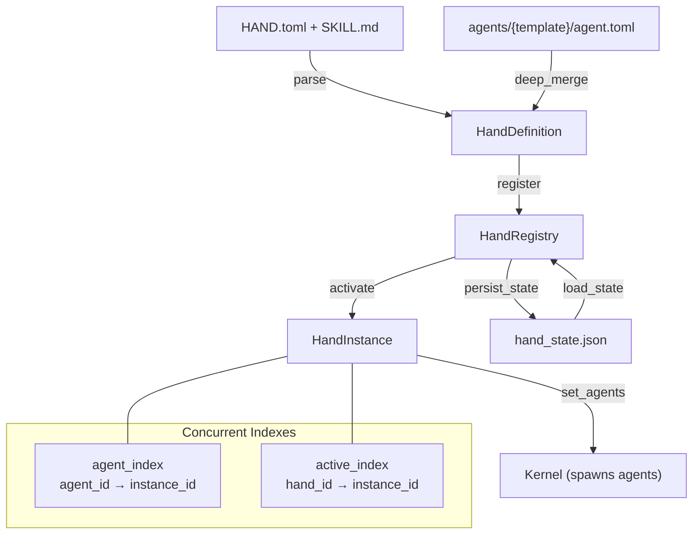

# Skills & Extensions — librefang-hands-src

# LibreFang Hands — Curated Autonomous Capability Packages

A **Hand** is a pre-built, domain-complete agent configuration that users activate from a marketplace. Unlike regular agents (you chat with them), Hands work *for* you — you check in on them.

This crate defines the Hand data model, TOML parsing (including legacy format fallbacks and multi-agent support), a thread-safe registry for definitions and active instances, and runtime requirement/settings checking.

## Architecture



## Core Types

### `HandDefinition`

The complete specification of a Hand, parsed from `HAND.toml`. Key fields:

| Field | Purpose |
|-------|---------|
| `id` | Unique identifier (e.g. `"clip"`) |
| `agents` | `BTreeMap<String, HandAgentManifest>` — agent manifests keyed by role name |
| `requires` | Requirements that must be satisfied before activation |
| `settings` | Configurable settings shown in the activation modal |
| `tools` / `skills` / `mcp_servers` | Allowlists for spawned agents |
| `dashboard` | Metrics schema for the Hand dashboard |
| `routing` | Keywords for deterministic hand selection |
| `i18n` | Localized strings keyed by language code |
| `skill_content` / `agent_skill_content` | Bundled skill markdown (populated at load, not in TOML) |

Supports two agent formats:
- **Single-agent** (`[agent]` section) — auto-converted to `{"main": ...}` with `coordinator = true`
- **Multi-agent** (`[agents.planner]`, `[agents.analyst]`, etc.) — each role gets its own agent

The coordinator is determined by `coordinator = true` on an agent, falling back to the first agent by role name (BTreeMap is sorted).

### `HandInstance`

A running Hand — links a `HandDefinition` to its spawned agents.

| Field | Purpose |
|-------|---------|
| `instance_id` | Unique UUID |
| `hand_id` | Which definition this is an instance of |
| `status` | `Active`, `Paused`, `Error(String)`, or `Inactive` |
| `agent_ids` | `BTreeMap<String, AgentId>` — role name → spawned agent ID |
| `coordinator_role` | Which role receives user messages |
| `config` | User-provided configuration overrides |

The coordinator role is resolved via `normalize_coordinator_role()`: explicit `coordinator_role` if it exists in `agent_ids`, then single-agent shortcut, then `"main"`, then first key.

### `HandCategory`

Enum: `Content`, `Security`, `Productivity`, `Development`, `Communication`, `Data`, `Finance`, `Other`. Used for marketplace browsing.

### `HandStatus`

Enum: `Active`, `Paused`, `Error(String)`, `Inactive`. Error variant carries a human-readable message.

## TOML Parsing

### Two File Formats

`HAND.toml` supports a **flat format** (fields at top level) and a **wrapped format** (fields under `[hand]`). Both are accepted:

```toml
# Flat format
id = "clip"
name = "Clip Hand"
[agent]
name = "clip-agent"
```

```toml
# Wrapped format
[hand]
id = "clip"
name = "Clip Hand"
[hand.agent]
name = "clip-agent"
```

### Legacy Agent Config

Older `HAND.toml` files use flat agent fields (`provider`, `model`, `system_prompt`, etc.) directly under `[agent]`. These are auto-converted to the nested `AgentManifest` format via `LegacyHandAgentConfig`. The parser uses a heuristic: if `[agent]` contains a `model` sub-table, parse as full `AgentManifest`; otherwise parse as legacy.

### Base Template Resolution

Agents in multi-agent hands can reference a shared template via `base`:

```toml
[agents.writer]
coordinator = true
base = "my-writer"

[agents.writer.model]
system_prompt = "You are a blog post writer."
```

This loads `{agents_dir}/my-writer/agent.toml`, normalizes any flat-format fields to nested format, then deep-merges the hand's overrides on top. Only available via `parse_hand_definition()` or `parse_hand_toml_with_agents_dir()` — the standard `Deserialize` path has no filesystem access and cannot resolve templates.

Path traversal is prevented: template names containing `..`, `/`, or `\` are rejected.

### Deep Merge

`deep_merge_toml(base, overlay)` recursively merges TOML tables. Overlay scalars and arrays replace base values; tables are merged recursively. This preserves base fields not overridden by the hand.

## Settings

### Schema

Settings are declared as `[[settings]]` arrays in `HAND.toml`:

```toml
[[settings]]
key = "stt_provider"
label = "STT Provider"
setting_type = "select"
default = "auto"

[[settings.options]]
value = "groq"
label = "Groq Whisper"
provider_env = "GROQ_API_KEY"
```

Three setting types: `Select`, `Text`, `Toggle`.

### Resolution

`resolve_settings(settings, config)` produces a `ResolvedSettings`:

- **`prompt_block`** — Markdown appended to the system prompt summarizing user choices
- **`env_vars`** — Env var names the agent's subprocess needs access to

For Select settings, only the matched option's `provider_env` is collected. For Text settings with `env_var`, that env var is collected when the value is non-empty.

## Requirements

### Types

| `RequirementType` | `check_value` | Check |
|---|---|---|
| `Binary` | Binary name | `which` on PATH (special handling for `python3` and `chromium`) |
| `EnvVar` | Env var name | Non-empty check |
| `ApiKey` | Env var name | Non-empty check |
| `AnyEnvVar` | Comma-separated names | Any one non-empty |

Optional requirements (`optional = true`) do not block activation. When an active hand has unmet optional requirements, it reports as **degraded**.

### Platform-Specific Install Info

Each requirement can carry `HandInstallInfo` with install commands for macOS, Windows (winget), Linux (apt/dnf/pacman), pip, signup URLs, docs, and step-by-step guides.

### Special Cases

- **`python3`**: Cached via `OnceLock`. Runs `python3 --version` / `python --version` and checks for "Python 3" in output to avoid false positives from Windows Store shims.
- **`chromium`**: Falls back to `chromium-browser`, `google-chrome`, `google-chrome-stable`, `chrome`, and `CHROME_PATH` env var.

## HandRegistry

Thread-safe registry using `DashMap` for lock-free concurrent access, with `Mutex` guards for serialized activate/deactivate operations.

### Concurrent Indexes

| Index | Key | Value | Purpose |
|-------|-----|-------|---------|
| `definitions` | `hand_id` | `HandDefinition` | All known hands |
| `instances` | `instance_id` (UUID) | `HandInstance` | Active/paused instances |
| `agent_index` | `agent_id` string | `instance_id` | O(1) agent → instance lookup |
| `active_index` | `hand_id` | `instance_id` | O(1) "is hand active?" check |

### Install Flows

| Method | Source | Persists to Disk? | Base Templates? |
|--------|--------|-------------------|-----------------|
| `install_from_path` | Directory with `HAND.tomL` | No | Yes |
| `install_from_content` | Raw TOML + skill strings | No | No (rejected) |
| `install_from_content_persisted` | Raw TOML + skill strings | `workspaces/{id}/` | Yes |
| `reload_from_disk` | Scans `registry/hands/` + `workspaces/` | No | Yes |

`install_from_content` **rejects** hands with `base` references since it has no access to the agents registry directory. Use the other two methods when base resolution is needed.

### Uninstall

`uninstall_hand(home_dir, hand_id)` has four outcomes:

1. **NotFound** — hand_id not in registry
2. **BuiltinHand** — hand lives under `registry/hands/` (no `workspaces/{id}/HAND.toml`); would be recreated on next sync
3. **AlreadyActive** — live instance exists; deactivate first
4. **Ok** — removes in-memory definition and `workspaces/{id}/` directory

### State Persistence

`persist_state(path)` writes all non-Inactive instances to `hand_state.json` (version 4 format). `load_state(path)` reads it back, handling v1 (bare array), v2 (single `agent_id`), and v3/v4 (multi-agent) formats with backward-compatible migration.

Paused instances are persisted. Error-state instances are skipped during restore (the user sees what went wrong but the instance is not re-activated).

### Readiness

`readiness(hand_id)` returns `HandReadiness`:

- `requirements_met` — all **non-optional** requirements satisfied
- `active` — at least one instance is Active
- `degraded` — active but any requirement (including optional) is unmet

## Localization (i18n)

`HandI18n` provides optional translations keyed by language code:

```toml
[i18n.zh]
name = "线索生成"
description = "自主线索生成"

[i18n.zh.agents.main]
name = "主协调器"

[i18n.zh.settings.target_industry]
label = "目标行业"
```

All fields are optional — untranslated items fall back to English. `check_settings_availability()` accepts an optional `lang` parameter and returns localized labels/descriptions.

## Dashboard Metrics

`HandDashboard` declares metrics read from agent structured memory:

```toml
[[dashboard.metrics]]
label = "Items processed"
memory_key = "items_count"
format = "number"
```

Formats: `Number` (default), `Duration`, `Bytes`, `Percentage`, `Text`, `Date`.

## Metadata and Routing

`HandMetadata` carries token consumption hints and activation warnings:

```toml
[metadata]
frequency = "periodic"
token_consumption = "medium"
default_active = true
activation_warning = "This hand uses paid API calls"
```

`HandRouting` provides deterministic keyword matching:

```toml
[routing]
aliases = ["video editor", "clip maker"]
weak_aliases = ["cut video", "trim"]
```

Strong aliases score ×3, weak aliases score ×1. Cross-lingual matching is handled by semantic embedding fallback, not translated keywords.

## Error Handling

`HandError` variants:

| Variant | When |
|---------|------|
| `NotFound(id)` | Hand definition not in registry |
| `AlreadyActive(id)` | Hand already has an active instance |
| `AlreadyRegistered(id)` | Duplicate definition on install |
| `BuiltinHand(id)` | Cannot uninstall a registry hand |
| `InstanceNotFound(uuid)` | Instance ID doesn't exist |
| `ActivationFailed(msg)` | Instance UUID collision, etc. |
| `TomlParse(msg)` | Invalid HAND.toml |
| `Io(err)` | Filesystem errors |
| `Config(msg)` | Validation errors |

## File Layout on Disk

```
{home_dir}/
├── registry/
│   ├── hands/
│   │   ├── clip/
│   │   │   ├── HAND.toml
│   │   │   ├── SKILL.md
│   │   │   └── SKILL-analyst.md    # Per-agent skill content
│   │   └── lead/
│   │       └── HAND.toml
│   └── agents/
│       └── my-writer/
│           └── agent.toml           # Base template
├── workspaces/
│   ├── uptime-watcher/              # User-installed hand
│   │   ├── HAND.toml
│   │   └── SKILL.md
│   └── {agent-workspace-dirs}/     # Filtered out by HAND.toml check
└── hand_state.json                  # Persisted instances
```

## Integration Points

The registry is consumed by:
- **Kernel** — activates hands, spawns agents, calls `set_agents()` after spawning
- **Router** — loads hand definitions for keyword-based routing via `load_hand_route_candidates()`
- **TUI** — lists definitions, checks requirements, displays active instances
- **HTTP routes** — `find_by_agent()` for agent→hand lookup, `readiness()` for status APIs, `check_settings_availability()` for activation modals