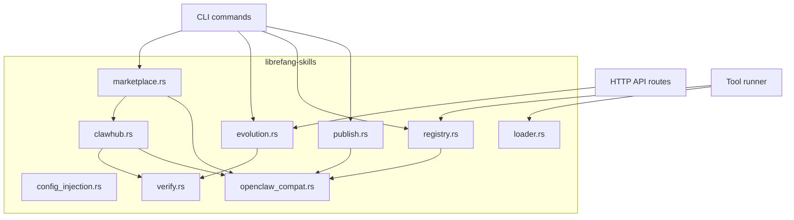

# Skills & Extensions — librefang-skills-src

# librefang-skills

Skill lifecycle management for LibreFang — marketplace discovery, installation, configuration injection, agent-driven self-evolution, and version control.

## Architecture Overview



The crate is organized around four responsibilities:

| Responsibility | Files | Purpose |
|---|---|---|
| **Discovery & Install** | `clawhub.rs`, `marketplace.rs` | Search/browse ClawHub, download, convert, security-scan, install |
| **Runtime Registry** | `registry.rs`, `loader.rs` | Load skills from disk, freeze/unfreeze, find tool providers |
| **Configuration** | `config_injection.rs` | Collect and resolve per-skill config vars into system prompts |
| **Self-Evolution** | `evolution.rs` | Agent-driven skill creation, fuzzy patching, versioning, rollback |
| **Shared Infrastructure** | `openclaw_compat.rs`, `verify.rs`, `publish.rs` | Format conversion, security scanning, packaging |

---

## ClawHub Marketplace Client — `clawhub.rs`

HTTP client for the ClawHub skill marketplace at `clawhub.ai/api/v1`. Handles search, browse, detail queries, file fetching, and full skill installation with security scanning.

### API Endpoints

| Method | Endpoint | Returns |
|---|---|---|
| `search()` | `GET /api/v1/search?q=...&limit=N` | `ClawHubSearchResponse` (key: `results`) |
| `browse()` | `GET /api/v1/skills?limit=N&sort=...` | `ClawHubBrowseResponse` (key: `items`, paginated via `next_cursor`) |
| `get_skill()` | `GET /api/v1/skills/{slug}` | `ClawHubSkillDetail` |
| `get_file()` | `GET /api/v1/skills/{slug}/file?path=SKILL.md` | Raw file content |
| `install()` | `GET /api/v1/download?slug=...` | Downloads zip/SKILL.md → full install pipeline |

### Client Construction

```rust
let client = ClawHubClient::new(cache_dir);
// Or with custom base URL:
let client = ClawHubClient::with_url("http://localhost:8080/api/v1", cache_dir);
```

TLS verification can be disabled by setting `LIBREFANG_DANGEROUSLY_SKIP_TLS_VERIFICATION=true` or `1` — intended exclusively for development against servers with expired certificates.

### Retry and Rate Limiting

All API calls go through `get_with_retry()`, which handles:

- **429 Too Many Requests** — respects the `Retry-After` header when present; otherwise uses exponential backoff with jitter
- **5xx server errors** — same retry strategy
- **Network/timeout errors** — retryable up to `MAX_RETRIES` (5 attempts)

Constants:

| Constant | Value | Meaning |
|---|---|---|
| `MAX_RETRIES` | 5 | Total attempts including the first |
| `BASE_DELAY_MS` | 1,500 | Base for exponential backoff |
| `MAX_DELAY_MS` | 30,000 | Hard cap on any single delay |

The jitter is derived from system-clock nanos hashed with a Knuth multiplicative constant, adding 0–25% randomness to each delay.

### Installation Pipeline

`install()` and `install_from_bytes()` run a multi-stage security pipeline:

```
1. Download → compute SHA256
2. Detect format (SKILL.md front-matter vs PK zip header vs package.json)
3. Extract: zip entries get path-traversal checks; SKILL.md saved directly
4. Convert to LibreFang manifest via openclaw_compat
5. Security scan: manifest scan + prompt injection scan
6. Binary dependency check (which_check for each required_bins entry)
7. Write skill.toml
```

**Prompt-only skills** with critical prompt-injection warnings are blocked entirely — the skill directory is removed and `SkillError::SecurityBlocked` is returned.

**Path safety**: `resolve_skill_child_path()` rejects absolute paths and any path component that isn't `Component::Normal`, preventing zip-slip attacks. `validate_slug()` ensures slugs contain only `[a-zA-Z0-9_-]`.

### Response Types

The ClawHub API uses `camelCase` JSON. Key types and their relationships:

- `ClawHubSearchResponse` → contains `results: Vec<ClawHubSearchEntry>` (flatter structure, includes `score`)
- `ClawHubBrowseResponse` → contains `items: Vec<ClawHubBrowseEntry>` (richer structure, includes `stats`, `tags`, `latest_version`)
- `ClawHubSkillDetail` → contains nested `skill: ClawHubSkillInfo`, `latest_version`, `owner`, `moderation`

`ClawHubStats` includes `installsAllTime`, `installsCurrent`, `installs`, `downloads`, `stars`, `comments`, and `versions` — all defaulting to 0.

Backward-compat type aliases exist: `ClawHubListResponse` = `ClawHubBrowseResponse`, `ClawHubSearchResults` = `ClawHubSearchResponse`, `ClawHubEntry` = `ClawHubBrowseEntry`.

### Sort Orders

`ClawHubSort` enum values: `Trending`, `Updated`, `Downloads`, `Stars`, `Rating` — passed as the `sort` query parameter in `browse()`.

---

## Skill Config Injection — `config_injection.rs`

Skills declare configuration dependencies via `[[config_vars]]` in their `skill.toml`. This module collects those declarations, resolves them against the user's config file, and formats them for injection into the system prompt.

### Storage Convention

A declared key like `wiki.base_url` is looked up at path `skills.config.wiki.base_url` in `~/.librefang/config.toml`:

```toml
# In skill.toml:
[[config_vars]]
key = "wiki.base_url"
description = "Base URL of the internal wiki"
default = "https://wiki.example.com"

# In ~/.librefang/config.toml:
[skills.config.wiki]
base_url = "https://wiki.corp.example.com"
```

### Resolution Flow

```
collect_config_vars(skills) → Vec<SkillConfigVar>
     ↓ deduplicates by key, first declaration wins
     ↓ skips empty keys / missing descriptions
     ↓ skips disabled skills
resolve_config_vars(vars, config_toml) → Vec<(String, String)>
     ↓ walks dotted path in TOML tree
     ↓ empty-string values treated as absent
     ↓ falls back to declared default
     ↓ omits entries with neither value nor default
format_config_section(resolved) → String
     → "## Skill Config Variables\nwiki.base_url = ..."
```

### Key Functions

- **`collect_config_vars(skills: &[InstalledSkill])`** — Gathers all `config_vars` from enabled skills, deduplicating by key.
- **`resolve_config_vars(vars: &[SkillConfigVar], config_toml: &toml::Value)`** — Resolves each key against the config TOML tree, falling back to defaults.
- **`format_config_section(resolved: &[(String, String)])`** — Formats as a markdown section for system prompt injection. Returns empty string when no vars are resolved.

The dotted-path resolver (`resolve_dotpath`) walks nested `toml::Value::Table` nodes. Scalar values (string, integer, float, boolean, datetime) are converted to strings; arrays and tables are serialized as compact TOML as a fallback.

---

## Skill Self-Evolution — `evolution.rs`

Agent-driven skill lifecycle management. Agents can create new skills from successful task approaches, patch existing skills with fuzzy find-and-replace, manage supporting files, and roll back to previous versions.

### Core Operations

| Function | Purpose |
|---|---|
| `create_skill()` | Create a new PromptOnly skill from scratch |
| `update_skill()` | Full prompt_context rewrite |
| `patch_skill()` | Fuzzy find-and-replace within prompt_context |
| `rollback_skill()` | Restore previous prompt_context from snapshot |
| `delete_skill()` | Agent-initiated deletion (local skills only) |
| `uninstall_skill()` | User-initiated deletion (any skill source) |
| `write_supporting_file()` | Add files to references/, templates/, scripts/, assets/ |
| `remove_supporting_file()` | Remove supporting files |
| `list_supporting_files()` | Enumerate all supporting files |
| `record_skill_usage()` | Increment use counter |
| `get_evolution_info()` | Read `.evolution.json` metadata |

### Concurrency Model

All mutations are serialized through per-skill exclusive file locks:

- Lock files live at `{skills_dir}/.evolution-locks/{name}.lock` — **outside** the skill directory so they survive `remove_dir_all` (important on Windows where open handles block deletion)
- Implemented via `fs2::FileExt::lock_exclusive()` (flock on Unix, LockFileEx on Windows)
- Lock is acquired **before** any filesystem work, including directory existence checks

Every mutation function re-reads `skill.toml` from disk after acquiring the lock to get the current version number, preventing concurrent writers from producing duplicate version numbers.

### Atomic Writes

All file writes use `atomic_write()`, which:

1. Writes to a temp file named `.tmp.{filename}.{pid}.{tid}.{counter}.{nanos}`
2. Calls `fs::rename` to swap it into place

The temp-file name incorporates a per-process monotonic counter (`ATOMIC_WRITE_COUNTER`), thread ID, process ID, and nanosecond timestamp, making collisions extremely unlikely even under concurrent access.

### Fuzzy Find-and-Replace

`fuzzy_find_and_replace()` tries six strategies in order from strict to loose:

| # | Strategy | Description | Use Case |
|---|---|---|---|
| 1 | **Exact** | Literal substring match | Exact text available |
| 2 | **LineTrimmed** | Trim leading/trailing whitespace per line | Indentation variance |
| 3 | **WhitespaceNormalized** | Collapse whitespace runs to single space | Formatting differences |
| 4 | **IndentFlexible** | Strip all leading whitespace per line | Deeply-indented blocks |
| 5 | **BlockAnchor** | Match first+last lines, ≥60% middle similarity | Large blocks with minor changes |
| 6 | **WhitespaceStripped** | Remove ALL whitespace, substring match | CJK content where inter-character spaces are meaningless |

When multiple matches are found and `replace_all` is false, the function returns an error rather than guessing. When no strategy matches, it surfaces the closest lines in the content as "did you mean" hints (character-overlap Jaccard similarity, top 3, threshold > 0.3).

The **WhitespaceStripped** strategy enforces a minimum needle length of 3 characters to prevent English false positives (e.g., stripped `"a"` matching inside `"banana"`).

### Version History

Each skill stores `.evolution.json` alongside `skill.toml`:

```rust
struct SkillEvolutionMeta {
    versions: Vec<SkillVersionEntry>,  // newest last, capped at 10
    use_count: u64,                     // successful invocations
    evolution_count: u64,               // total version entries written
    mutation_count: u64,                // post-create mutations only
}
```

Version snapshots include: semver string, ISO 8601 timestamp, changelog, SHA256 of prompt_content, and author identifier (`"agent:<id>"`, `"cli"`, `"dashboard"`, `"reviewer"`).

`bump_patch_version()` uses the `semver` crate for robust parsing, correctly clearing pre-release tags and build metadata on bump.

Rollback snapshots are stored in `.rollback/` with nanosecond-precision filenames (`prompt_context_YYYYMMDD_HHMMSS_{nanos}_{pid}.md`). Old snapshots are pruned to `MAX_VERSION_HISTORY` (10).

### Security

All prompt content passes through `validate_prompt_content()` which:

- Enforces `MAX_PROMPT_CONTEXT_CHARS` (160,000 ≈ 55k tokens)
- Runs `SkillVerifier::scan_prompt_content()` for injection detection
- Blocks content with **Critical** severity warnings entirely

Supporting file writes are scanned before being written (not after), so rejected content never reaches disk.

### Path Safety

- `validate_name()`: lowercase `[a-z0-9_-]`, max 64 chars, must start with alphanumeric
- `validate_supporting_path()`: must be under `references/`, `templates/`, `scripts/`, or `assets/`; rejects `..`, absolute paths
- `write_supporting_file()` and `remove_supporting_file()` canonicalize both the skill directory and target path to verify containment, catching symlink-based escape attempts
- `ALLOWED_SUBDIRS` restricts where supporting files can live
- `MAX_SUPPORTING_FILE_SIZE` is 1 MiB

### Supporting File Traversal

`list_supporting_files()` walks each allowed subdirectory recursively (max depth 16), skipping symlinks. Returns a `HashMap<String, Vec<String>>` mapping subdirectory name to relative file paths.

`remove_supporting_file()` cleans up empty ancestor directories after removing a file, collapsing back up to (but not including) the skill root.

### EvolutionResult

All operations return `EvolutionResult` with:

- `success`, `message`, `skill_name`, `version`
- `match_strategy` / `match_count` — populated by `patch_skill()`
- `evolution_count`, `mutation_count`, `use_count` — post-operation counters read from `.evolution.json` so callers don't need a second query

### delete_skill vs uninstall_skill

Two distinct deletion paths exist:

- **`delete_skill()`** — Agent-facing. Validates the skill's `source` field; only allows deletion of `Local` or `Native` skills. Rejects marketplace/bundled skills and skills with missing `source` field.
- **`uninstall_skill()`** — User-facing (CLI `librefang skill remove`, dashboard "Uninstall"). Removes any installed skill regardless of source. Less strict name validation (rejects `/`, `\`, `..`) to handle names that might not pass `validate_name()`.

---

## Error Handling

Operations return `Result<T, SkillError>` where `SkillError` variants include:

| Variant | When |
|---|---|
| `Network(msg)` | HTTP failures, API parse errors |
| `RateLimited(msg)` | 429 after exhausting retries |
| `InvalidManifest(msg)` | Parse errors, validation failures |
| `SecurityBlocked(msg)` | Critical prompt injection, unauthorized delete |
| `AlreadyInstalled(name)` | Duplicate skill name on create |
| `NotFound(name)` | Missing skill, missing rollback snapshots |
| `Io(err)` | Filesystem errors |

---

## Integration Points

### CLI (`librefang-cli`)

- `cmd_skill_search` → `marketplace::search`
- `cmd_skill_install` → `marketplace::install` + `openclaw_compat::convert_openclaw_skill`
- `cmd_skill_list` → `registry::load_all` + `registry::list`
- `cmd_skill_evolve` → all `evolution::*` functions
- `cmd_skill_publish` → `publish::prepare_local_skill` + `publish::package_prepared_skill`
- `cmd_doctor` → `registry::load_all` + `verify::scan_prompt_content`

### HTTP API (`src/routes/skills.rs`)

API routes for the dashboard call evolution functions directly (e.g., `evolve_update_skill` → `update_skill`, `evolve_rollback_skill` → `rollback_skill`).

### Runtime (`librefang-runtime`)

The tool runner loads skills via `registry::load_all` and freezes the registry before tool dispatch to prevent mid-request skill mutations from affecting in-flight operations.