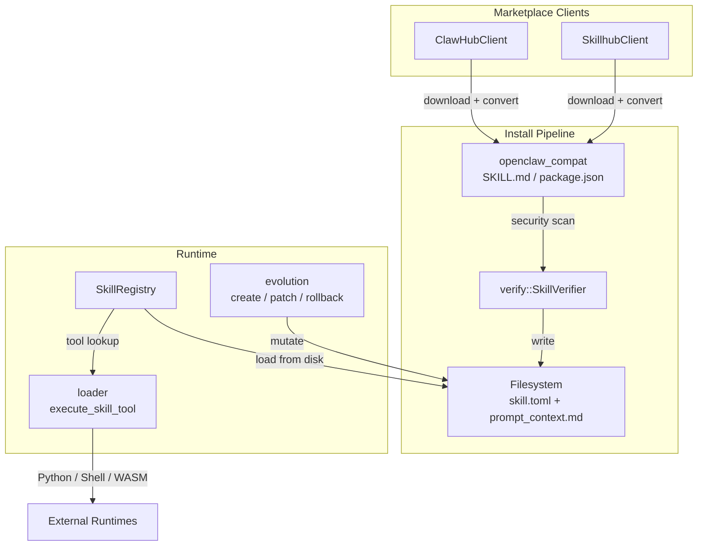

# Skills & Extensions — librefang-skills-src

# Skills & Extensions — `librefang-skills`

## Overview

`librefang-skills` is the skill system for LibreFang. Skills are pluggable tool bundles that extend agent capabilities at runtime. They can be:

- **TOML + Python scripts** — subprocess execution
- **TOML + WASM modules** — sandboxed execution
- **TOML + Node.js modules** — OpenClaw compatibility layer
- **TOML + Shell scripts** — subprocess execution
- **Prompt-only** — Markdown injected into the LLM system prompt with no executable code
- **Remote skills** — downloaded from ClawHub or Skillhub marketplaces

The crate handles the full lifecycle: discovery, download, format conversion, security scanning, installation, version management, agent-driven evolution, and tool execution.

## Architecture



## Core Types

All core types live in [`lib.rs`](src/lib.rs) and are re-exported from the crate root.

### `SkillManifest`

The central data structure, parsed from `skill.toml` files:

```rust
pub struct SkillManifest {
    pub skill: SkillMeta,
    pub runtime: SkillRuntimeConfig,
    pub tools: SkillTools,
    pub requirements: SkillRequirements,
    pub prompt_context: Option<String>,
    pub source: Option<SkillSource>,
    pub config: HashMap<String, serde_json::Value>,
}
```

Each manifest contains metadata (`SkillMeta`), runtime configuration, provided tool definitions (with JSON Schema inputs), host requirements, and optional user-defined config under `[config]`.

### `SkillRuntime`

The execution backend for a skill:

| Variant | Behavior |
|---------|----------|
| `PromptOnly` | Default. Markdown body injected into the LLM system prompt — no code execution |
| `Python` | Runs a Python script in a subprocess |
| `Wasm` | Runs a WASM module in a sandbox |
| `Node` | Node.js module (OpenClaw compatibility) |
| `Shell` | Shell/Bash script in a subprocess |
| `Builtin` | Compiled into the LibreFang binary |

### `SkillSource`

Provenance tracking — where a skill came from:

- `Native` — built into LibreFang
- `Local` — user-created workspace skill
- `OpenClaw` — converted from OpenClaw format
- `ClawHub { slug, version }` — downloaded from ClawHub marketplace
- `Skillhub { slug, version }` — downloaded from Skillhub marketplace

### `SkillError`

Unified error type covering all failure modes: `NotFound`, `InvalidManifest`, `AlreadyInstalled`, `RuntimeNotAvailable`, `ExecutionFailed`, `Io`, `Network`, `RateLimited`, `TomlParse`, `YamlParse`, `SecurityBlocked`.

## Skill Manifest Format

Skills are defined by a `skill.toml` file in their own directory. A minimal manifest:

```toml
[skill]
name = "web-summarizer"
version = "0.1.0"
description = "Summarizes any web page into bullet points"
author = "librefang-community"
license = "MIT"
tags = ["web", "summarizer"]

[runtime]
type = "python"
entry = "src/main.py"

[[tools.provided]]
name = "summarize_url"
description = "Fetch a URL and return a concise summary"
input_schema = { type = "object", properties = { url = { type = "string" } }, required = ["url"] }

[requirements]
tools = ["web_fetch"]
capabilities = ["NetConnect(*)"]
```

Custom user-defined config goes under `[config]`:

```toml
[config]
apiKey = "sk-..."
custom_endpoint = "https://api.example.com"
max_retries = 3
```

These are accessible via `manifest.config` as a `HashMap<String, serde_json::Value>`.

## Installation Pipeline

### ClawHub (`clawhub.rs`)

`ClawHubClient` communicates with the ClawHub API at `https://clawhub.ai/api/v1`. Key endpoints:

| Method | Endpoint | Returns |
|--------|----------|---------|
| `search` | `GET /api/v1/search?q=...&limit=N` | `ClawHubSearchResponse` (key: `results`) |
| `browse` | `GET /api/v1/skills?limit=N&sort=trending` | `ClawHubBrowseResponse` (key: `items`) |
| `get_skill` | `GET /api/v1/skills/{slug}` | `ClawHubSkillDetail` |
| `get_file` | `GET /api/v1/skills/{slug}/file?path=SKILL.md` | Raw file text |
| `install` | `GET /api/v1/download?slug=...` | Downloads and installs |

**Retry behavior**: All HTTP requests use `get_with_retry` which automatically retries on 429 (rate limit) and 5xx (server error) responses up to `MAX_RETRIES` (5) attempts with exponential backoff (base 1.5s, max 30s) and jitter. The `Retry-After` header is respected when present.

**TLS verification**: Disabled only when the environment variable `LIBREFANG_DANGEROUSLY_SKIP_TLS_VERIFICATION` is set to `"true"` or `"1"` — uses `crate::http_client::dangerous_client_builder()` in that case.

The `install` method runs a full security pipeline:

1. Download content and compute SHA256
2. Detect format: SKILL.md (frontmatter `---`), ZIP archive (magic bytes `PK`), or package.json
3. Convert to LibreFang manifest via `openclaw_compat`
4. Run manifest security scan via `SkillVerifier::security_scan`
5. If prompt-only: run prompt injection scan via `SkillVerifier::scan_prompt_content`
6. Check binary dependencies (e.g., Python, Node) are on PATH
7. Write `skill.toml`

**Path safety**: `resolve_skill_dir` and `resolve_skill_child_path` validate against directory traversal — slugs must be alphanumeric + `-_`, extracted paths must contain only `Normal` components, no absolute paths.

### Skillhub (`skillhub.rs`)

An alternative marketplace client. Delegates to `ClawHubClient::install_from_bytes` for the shared extraction and scanning logic after downloading from Skillhub's COS storage.

### OpenClaw Compatibility (`openclaw_compat.rs`)

Handles conversion from two OpenClaw skill formats:

- **SKILL.md format**: YAML frontmatter + Markdown body → `PromptOnly` skill with `prompt_context`
- **package.json format**: Node.js skill definition → LibreFang manifest with `SkillRuntime::Node`

Key functions: `detect_skillmd`, `detect_openclaw_skill`, `convert_skillmd`, `convert_openclaw_skill`, `write_librefang_manifest`, `write_prompt_context`.

## Evolution System (`evolution.rs`)

Agent-driven skill creation, mutation, and version management. Agents can autonomously create and refine skills based on execution experience.

### Core Operations

| Function | Purpose |
|----------|---------|
| `create_skill` | Create a new `PromptOnly` skill from an agent's learned approach |
| `update_skill` | Full rewrite of a skill's `prompt_context.md` |
| `patch_skill` | Fuzzy find-and-replace on `prompt_context.md` |
| `rollback_skill` | Restore the previous version from a `.rollback/` snapshot |
| `delete_skill` | Agent-facing delete (only removes `Local`/`Native` source skills) |
| `uninstall_skill` | User-facing delete (removes any skill regardless of source) |
| `write_supporting_file` | Add files to `references/`, `templates/`, `scripts/`, `assets/` subdirectories |
| `remove_supporting_file` | Remove supporting files and clean up empty parent dirs |
| `record_skill_usage` | Increment use count on successful tool invocation |

### Fuzzy Patching

`patch_skill` uses `fuzzy_find_and_replace` which tries six strategies in order from strict to loose:

1. **Exact** — literal substring match
2. **LineTrimmed** — trim each line's leading/trailing whitespace
3. **WhitespaceNormalized** — collapse whitespace runs to single space
4. **IndentFlexible** — strip all leading whitespace
5. **BlockAnchor** — match first + last lines, verify middle ≥60% similar (50% for first candidate)
6. **WhitespaceStripped** — remove ALL whitespace, substring match (CJK-friendly last resort)

Each strategy returns the `MatchStrategy` used and match count. When all strategies fail, the error includes the closest matching lines from the content to help the agent self-correct.

Empty `old_str` is rejected before any strategy runs — `"".contains("") == true` would cause catastrophic corruption with `replace_all=true`.

### Version Management

Version history is stored in `.evolution.json` alongside `skill.toml`:

```rust
pub struct SkillEvolutionMeta {
    pub versions: Vec<SkillVersionEntry>,   // newest last, max 10
    pub use_count: u64,                      // successful invocations
    pub evolution_count: u64,                // total version entries written
    pub mutation_count: u64,                 // post-creation edits only
}
```

`bump_patch_version` uses the `semver` crate for robust version parsing, correctly handling pre-release tags and build metadata. Falls back to simple string splitting for non-standard versions.

### Concurrency & File Safety

All mutations are serialized through **per-skill file locks** (`acquire_skill_lock`). Lock files live in `{parent}/.evolution-locks/{name}.lock` — outside the skill directory so they don't interfere with `remove_dir_all` on Windows. Uses `fs2::FileExt::lock_exclusive()` (flock on Unix, LockFileEx on Windows).

**Lock-first, read-after-lock pattern**: Every mutation operation acquires the lock, then re-reads `skill.toml` from disk to get the current version. Without this, concurrent writers operating on stale snapshots would produce duplicate version numbers.

All file writes go through `atomic_write`: write to a temp file named `.tmp.{name}.{pid}.{tid}.{counter}.{nanos}`, then `fs::rename`. The monotonic `ATOMIC_WRITE_COUNTER` prevents temp-file collisions even when two threads in the same process target the same path.

**Rollback snapshots** are saved to `.rollback/prompt_context_{timestamp}_{nanos}_{pid}.md` before every mutation. Snapshots are pruned to the last 10. The rollback operation itself saves a snapshot of the current content first, making rollback reversible.

### Security Validation

- `validate_name`: lowercase alphanumeric + `-_`, max 64 chars, must start with alphanumeric
- `validate_prompt_content`: max 160,000 chars (~55k tokens), runs `SkillVerifier::scan_prompt_content` and blocks on critical warnings
- `delete_skill`: refuses to delete non-Local/Non-Native skills; skills with no `source` field are rejected as unclassified
- Supporting file paths are validated against traversal, must be under `references/`, `templates/`, `scripts/`, or `assets/`, max 1 MiB per file
- Containment checks use `canonicalize` on both skill dir and target to catch symlink escapes

### Disk-First Loading

`load_installed_skill_from_disk` reads `skill.toml` + `prompt_context.md` directly from the filesystem, bypassing the in-memory registry. This is needed because the registry hot-reloads after an agent turn completes, but within a single turn an agent might create then immediately update a skill — the registry won't know about it yet.

The runtime calls this function from `tool_runner.rs` for every evolution tool invocation.

## Registry (`registry.rs`)

`SkillRegistry` manages all installed skills. Key operations:

- `load_all` / `load_skill` / `reload_skill` — scan skill directories and parse manifests
- `get` — look up an installed skill by name
- `find_tool_provider` — find which skill provides a given tool name
- `list` — enumerate all installed skills
- `remove` — uninstall a skill
- `skills_dir` — access the configured skills directory path
- `freeze` / `is_frozen` — prevent further mutations (used in tests to verify guard behavior)

The registry supports **progressive prompt context loading**: if `manifest.prompt_context` is empty, it lazily reads `prompt_context.md` from disk on access, avoiding loading large prompt content for skills that aren't being used.

## Loader (`loader.rs`)

Executes skill tools at runtime:

- `execute_skill_tool` — dispatches to the appropriate runtime
- `execute_python` — runs Python scripts via `find_python` (locates the interpreter)
- `execute_shell` — runs shell scripts via `find_shell`
- Returns `SkillToolResult` with JSON output and error status

## Verification (`verify.rs`)

Security scanning pipeline:

- `SkillVerifier::scan_prompt_content` — detects prompt injection patterns in skill content
- `SkillVerifier::security_scan` — inspects manifest for dangerous configurations
- `SkillVerifier::sha256_hex` — content hashing for version tracking
- `build_threat_patterns` — builds the pattern database used by the scanner
- `WarningSeverity::Critical` — blocks installation; lower severities produce warnings

The `cmd_doctor` CLI command also calls `scan_prompt_content` to audit installed skills.

## Publish (`publish.rs`)

Skill packaging and publishing workflow:

- `validate_manifest` — pre-publish validation
- `load_manifest_from_dir` — read manifest for publishing
- `package_prepared_skill` — bundle a skill for distribution

## Config Discovery

Skills can declare config variables in their `[config]` table. The evolution module provides:

- `extract_skill_config_vars` — get config vars for a single skill
- `discover_all_config_vars` — flat list across all skills (first declaration wins)
- `discover_config` — returns `ConfigDiscovery` with both deduplicated vars and explicit `SkillConfigConflict` entries for keys claimed by multiple skills

## Integration Points

The runtime (`librefang-runtime`) calls into this crate from `tool_runner.rs`:

- `tool_skill_evolve_create` → `evolution::create_skill`
- `tool_skill_evolve_update` → `evolution::update_skill`
- `tool_skill_evolve_patch` → `evolution::patch_skill`
- `tool_skill_evolve_rollback` → `evolution::rollback_skill`
- `tool_skill_evolve_delete` → `evolution::delete_skill`
- `tool_skill_evolve_write_file` → `evolution::write_supporting_file`
- `tool_skill_evolve_remove_file` → `evolution::remove_supporting_file`
- `tool_skill_read_file` → `evolution::record_skill_usage`
- `execute_tool_raw` → `loader::execute_skill_tool` + `registry::find_tool_provider`

The CLI (`librefang-cli`) calls:

- `cmd_doctor` → `registry::load_all`, `registry::list`, `verify::scan_prompt_content`
- `cmd_skill_install` → `marketplace::install`

The API layer (`src/routes/skills.rs`) calls evolution functions and `acquire_skill_lock` for web-initiated mutations.