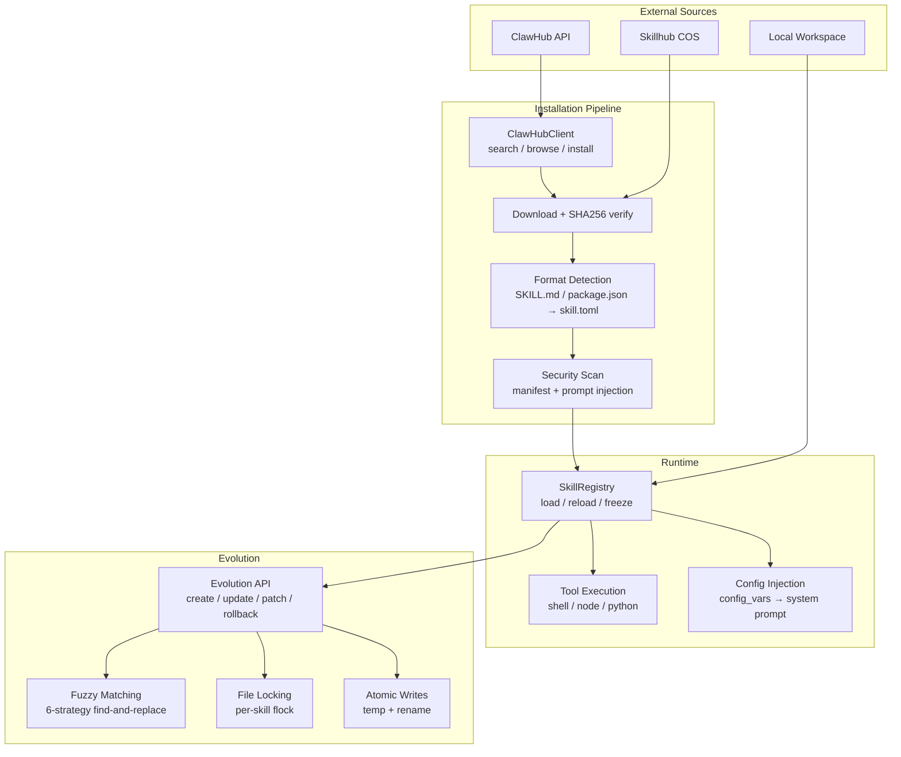

# Skills & Extensions — librefang-skills-src

# librefang-skills

Skill lifecycle management for LibreFang — marketplace installation, agent-driven evolution, configuration injection, and security scanning.

## Architecture Overview



---

## Module Structure

| File | Responsibility |
|---|---|
| `clawhub.rs` | ClawHub marketplace client — search, browse, download, install |
| `config_injection.rs` | Collect and resolve skill-declared config variables into the system prompt |
| `evolution.rs` | Agent-driven skill creation, fuzzy patching, version history, rollback |
| `openclaw_compat.rs` | SKILL.md / package.json format detection and conversion to `skill.toml` |
| `verify.rs` | Security scanning — manifest validation and prompt injection detection |
| `registry.rs` | `SkillRegistry` — load, reload, freeze, query installed skills |
| `loader.rs` | Tool dispatch — execute shell, Node.js, and Python skill runtimes |
| `publish.rs` | Manifest validation for skill publishing |

---

## ClawHub Marketplace Client

### `ClawHubClient`

HTTP client for the [ClawHub API](https://clawhub.ai/api/v1/) (3,000+ community skills). All API calls go through `get_with_retry`, which handles rate-limiting (429) and server errors (5xx) with exponential backoff capped at 30 seconds, respecting the `Retry-After` header when present.

```rust
let client = ClawHubClient::new(PathBuf::from("/tmp/cache"));
```

**Constructor options:**

| Method | Behavior |
|---|---|
| `ClawHubClient::new(cache_dir)` | Connects to `https://clawhub.ai/api/v1` |
| `ClawHubClient::with_url(base_url, cache_dir)` | Custom API URL (for testing or self-hosted registries) |

TLS verification can be disabled by setting `LIBREFANG_DANGEROUSLY_SKIP_TLS_VERIFICATION=true` or `1` — intended exclusively for development against servers with expired certificates.

### API Methods

| Method | Endpoint | Returns |
|---|---|---|
| `search(query, limit)` | `GET /api/v1/search?q=...&limit=N` | `ClawHubSearchResponse` (key: `results`) |
| `browse(sort, limit, cursor)` | `GET /api/v1/skills?sort=...&limit=N&cursor=...` | `ClawHubBrowseResponse` (key: `items`) |
| `get_skill(slug)` | `GET /api/v1/skills/{slug}` | `ClawHubSkillDetail` |
| `get_file(slug, path)` | `GET /api/v1/skills/{slug}/file?path=...` | Raw file content as `String` |
| `install(slug, target_dir)` | `GET /api/v1/download?slug=...` → security pipeline | `ClawHubInstallResult` |
| `install_from_bytes(slug, target_dir, bytes)` | Same pipeline, caller-provided bytes | `ClawHubInstallResult` |
| `is_installed(slug, skills_dir)` | Filesystem check | `bool` |

**Sort options** (`ClawHubSort` enum): `Trending`, `Updated`, `Downloads`, `Stars`, `Rating`.

### Installation Pipeline

`install()` and `install_from_bytes()` share a core pipeline via `install_with_expected_sha256()`:

1. **Fetch detail** — best-effort `get_skill(slug)` to obtain `expected_sha256` from the registry
2. **SHA256 validation** — if the registry provided a hash, mismatch returns `SkillError::SecurityBlocked` immediately (fail-fast on supply-chain tampering, issue #3827)
3. **Format detection** — SKILL.md (starts with `---`), zip archive (magic bytes `PK`), or package.json
4. **Extraction** — zip entries are path-sanitized via `resolve_skill_child_path` (rejects absolute paths, `..` components)
5. **Conversion** — SKILL.md → `skill.toml` via `openclaw_compat::convert_skillmd`; package.json → `openclaw_compat::convert_openclaw_skill`
6. **Prompt injection scan** — `SkillVerifier::scan_prompt_content()`; critical-severity findings block installation
7. **Binary dependency check** — `which_check()` for each required binary; missing binaries produce warnings
8. **Manifest security scan** — `SkillVerifier::security_scan()`
9. **Atomic promotion** — extraction happens in a `.staging-{slug}-{pid}-{counter}` directory, then `rename()` to the final location

The staging directory uses a process-local `AtomicU64` counter (plus pid and nanosecond timestamp) so concurrent installs never collide.

### Slug Validation

All slug-accepting methods call `validate_slug()`, which requires non-empty ASCII alphanumeric strings with hyphens and underscores only. This prevents path traversal through the slug parameter.

### Backward-Compatible Aliases

```rust
pub type ClawHubListResponse = ClawHubBrowseResponse;
pub type ClawHubSearchResults = ClawHubSearchResponse;
pub type ClawHubEntry = ClawHubBrowseEntry;
```

These exist for callers written against older API names.

---

## Config Injection

Skills declare configuration dependencies in their `skill.toml`:

```toml
[[config_vars]]
key = "wiki.base_url"
description = "Base URL of the internal wiki"
default = "https://wiki.example.com"
```

### Resolution Flow

1. **`collect_config_vars(skills)`** — gathers all `[[config_vars]]` from enabled skills, deduplicating by key (first declaration wins). Skips incomplete entries (empty key or description) and disabled skills.

2. **`resolve_config_vars(vars, config_toml)`** — walks the config TOML tree at the path `skills.config.<logical-key>`. Falls back to the declared `default`. Omits entries with neither a config value nor a default (avoids injecting empty strings).

3. **`format_config_section(resolved)`** — formats resolved pairs as a system-prompt section:

```
## Skill Config Variables
wiki.base_url = https://wiki.corp.example.com
db.host = localhost
```

Returns an empty string when `resolved` is empty, so callers can cheaply skip injection with an `is_empty()` check.

### Storage Convention

A logical key `wiki.base_url` is stored in `~/.librefang/config.toml` as:

```toml
[skills.config.wiki]
base_url = "https://wiki.corp.example.com"
```

The dotted logical key maps to nested TOML tables: `skills` → `config` → `wiki` → `base_url`.

---

## Skill Evolution

Agent-driven skill creation and mutation with version history, rollback, and concurrency safety.

### Concurrency Model

All mutation operations acquire a **per-skill exclusive file lock** via `acquire_skill_lock()`. Lock files live at `{skills_dir}/.evolution-locks/{skill_name}.lock` — outside the skill directory itself, so `remove_dir_all()` doesn't conflict with the open lock handle on Windows.

The lock uses `fs2::FileExt::lock_exclusive()` (flock on Unix, LockFileEx on Windows).

### Atomic Writes

`atomic_write(path, content)` writes to a temp file then `rename()`s it into place. Temp filenames incorporate pid, thread id, a monotonic `AtomicU64` counter, and a nanosecond timestamp for collision resistance even under concurrent callers.

### Core Operations

| Function | Purpose | Version bump |
|---|---|---|
| `create_skill(skills_dir, name, description, prompt_context, tags, author)` | Create a new PromptOnly skill | Sets `0.1.0` |
| `update_skill(skill, new_prompt_context, changelog, author)` | Full prompt_context rewrite | Semver patch bump |
| `patch_skill(skill, old_str, new_str, changelog, replace_all, author)` | Fuzzy find-and-replace | Semver patch bump |
| `rollback_skill(skill, author)` | Restore previous version | Semver patch bump |
| `delete_skill(skills_dir, name)` | Delete agent-evolved skill only | N/A |
| `uninstall_skill(skills_dir, name)` | Delete any installed skill | N/A |

All operations re-read `skill.toml` from disk **after** acquiring the lock, ensuring the version chain is serial even under concurrent writers.

### Version Management

Each mutation appends a `SkillVersionEntry` to `.evolution.json`:

```json
{
  "versions": [
    {
      "version": "0.1.2",
      "timestamp": "2026-03-15T10:30:00+00:00",
      "changelog": "Fixed prompt wording [strategy: Exact, matches: 1]",
      "content_hash": "a3f2...",
      "author": "agent:uuid-here"
    }
  ],
  "use_count": 15,
  "evolution_count": 3,
  "mutation_count": 2
}
```

- **`evolution_count`** — total entries written including initial creation (may lag `versions.len()` after truncation)
- **`mutation_count`** — post-creation edits only; a freshly-created skill reports `0`
- **`use_count`** — bumped by `record_skill_usage()` after successful tool invocations
- **History cap** — last 10 versions kept (`MAX_VERSION_HISTORY`); oldest entries pruned
- **Rollback snapshots** — stored in `.rollback/` with nanosecond-precision filenames to prevent collision

Version bumping uses the `semver` crate, correctly handling pre-release tags and build metadata.

### Fuzzy Matching (6 Strategies)

`fuzzy_find_and_replace()` tries strategies in strict-to-loose order. Each strategy reports itself via `MatchStrategy` so agents and dashboards can distinguish exact from approximate matches:

| Priority | Strategy | Description |
|---|---|---|
| 1 | `Exact` | Literal substring match |
| 2 | `LineTrimmed` | Trim each line's leading/trailing whitespace |
| 3 | `WhitespaceNormalized` | Collapse whitespace runs to single space per line |
| 4 | `IndentFlexible` | Strip all leading whitespace |
| 5 | `BlockAnchor` | Match first + last line, require ≥60% middle similarity |
| 6 | `WhitespaceStripped` | Remove all whitespace from both sides, substring match (CJK-friendly) |

Empty `old_str` is rejected before any strategy runs — `content.replace("", new_str)` would corrupt content at every character boundary.

Multiple matches without `replace_all=true` return an error immediately (does not fall through to looser strategies). When all strategies fail, the error includes the closest-matching content lines (character-overlap similarity > 0.3) so agents can self-correct.

### Supporting Files

Skills can manage auxiliary files in four allowed subdirectories: `references/`, `templates/`, `scripts/`, `assets/`.

| Function | Purpose |
|---|---|
| `write_supporting_file(skill, rel_path, content)` | Write file ≤ 1 MiB with path traversal + symlink escape checks |
| `remove_supporting_file(skill, rel_path)` | Delete file, prune empty ancestor directories |
| `list_supporting_files(skill)` | Recursively list files per subdirectory (max depth 16) |

Both write and remove operations acquire the per-skill lock and perform canonical-path containment verification to prevent symlink-based escape attacks. Security scanning runs **before** writing so rejected content doesn't wipe pre-existing files.

### Delete vs. Uninstall

- **`delete_skill`** — agent-facing path. Refuses to delete skills with `source` other than `Local` or `Native`. Skills with no `source` field are rejected as unclassified.
- **`uninstall_skill`** — user-facing path (dashboard "Uninstall", CLI `librefang skill remove`). Removes any skill regardless of source. Both acquire the per-skill lock and re-check existence under the lock.

### Validation

- **Skill names**: lowercase alphanumeric + hyphens/underscores, 1–64 chars, must start with alphanumeric
- **Prompt content**: max 160,000 characters (~55k tokens); security scan blocks critical-severity injection patterns
- **Description**: non-empty, max 1024 characters
- **Supporting file paths**: must start with an allowed subdirectory, no `..` or absolute paths, max 1 MiB

---

## Key Types

### `EvolutionResult`

Returned by all evolution operations. Includes post-operation counters so agents don't need a separate query:

```rust
pub struct EvolutionResult {
    pub success: bool,
    pub message: String,
    pub skill_name: String,
    pub version: Option<String>,
    pub match_strategy: Option<MatchStrategy>,  // patch operations only
    pub match_count: Option<usize>,              // patch operations only
    pub evolution_count: Option<u64>,
    pub mutation_count: Option<u64>,
    pub use_count: Option<u64>,
}
```

### `ClawHubInstallResult`

```rust
pub struct ClawHubInstallResult {
    pub skill_name: String,
    pub version: String,
    pub slug: String,
    pub warnings: Vec<SkillWarning>,
    pub tool_translations: Vec<(String, String)>,  // OpenClaw → LibreFang name mappings
    pub is_prompt_only: bool,
}
```

### API Response Types

ClawHub uses camelCase JSON. Search and browse have different structures:

- **Search** (`ClawHubSearchResponse`): flat entries under `results`, includes `score`
- **Browse** (`ClawHubBrowseResponse`): richer entries under `items` with nested `stats` and `latestVersion`
- **Detail** (`ClawHubSkillDetail`): `skill` + `latestVersion` + `owner` + `moderation` + optional `expectedSha256`

All types use `#[serde(default)]` extensively so missing fields don't break deserialization.

---

## Integration Points

**Called by:**
- `librefang-runtime/src/tool_runner.rs` — evolve tools (create, patch, update, rollback, write_file, remove_file, delete), tool dispatch via `find_tool_provider`
- `librefang-cli/src/main.rs` — `cmd_skill_list`, `cmd_doctor`, `load_installed_skill`
- `src/routes/skills.rs` — marketplace browse/search/install, skill listing, evolve endpoints
- `src/routes/agents.rs` — agent skill attachment via `skill_names`
- `src/routes/network.rs` — MCP tool definitions via `all_tool_definitions`
- `src/routes/system.rs` — tool invocation via `find_tool_provider`

**Depends on:**
- `librefang-extensions/src/vault.rs` — filesystem existence checks
- `librefang-hands` — TLS provider for HTTP client builder
- `src/config/types.rs` — `EnvPassthroughPolicy` for env var filtering in tool execution