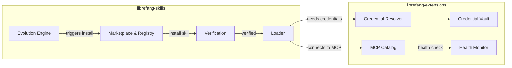

# Skills & Extensions

# Skills & Extensions

LibreFang's capability layer — everything that makes an agent *useful* beyond its base model. This module group manages the full lifecycle of **skills** (installable tool packages) and **extensions** (MCP server integrations with their credential plumbing).

## How the sub-modules relate

[librefang-skills](librefang-skills-src.md) handles discovery and lifecycle — browsing the marketplace, clawhub integration, loading skills into the runtime, and the agent-driven self-evolution loop that lets agents propose and install new skills autonomously.

[librefang-extensions](librefang-extensions-src.md) provides the infrastructure skills depend on — the encrypted credential vault, OAuth2 PKCE flows, MCP server catalog, and health monitoring for remote connections.

## Key cross-module workflows

**Skill installation with credential binding.** The marketplace discovers a skill → `verify` security-scans it → `loader` installs it → `CredentialResolver` supplies API keys from the vault or `.env` files. Credentials are never stored in skill config; they're injected at runtime.

**Agent self-evolution.** The `evolution` engine in skills can trigger autonomous skill installation. When a new skill requires an MCP server, the extensions `Installer` provisions it, registers it in `config.toml`, and the `HealthMonitor` begins tracking connectivity.

**TOTP and security-critical flows.** Operations like `totp_setup`, `totp_confirm`, and `totp_revoke` span both modules: a route handler calls into the kernel's OAuth provider, which unlocks the extensions vault (using keyring-backed master key derivation via `machine_fingerprint`), then surfaces results back to UI components like `AgentManifestForm` and `WizardPage`.

**Credential resolution chain.** At runtime, `CredentialResolver` checks the vault first (`is_unlocked`), falls back to `.env`/`secrets.env` files, then system environment variables. This gives skills a unified interface regardless of where a credential originates.

## Configuration surface

All MCP servers live as `[[mcp_servers]]` entries in `~/.librefang/config.toml`, with an optional `template_id` linking back to the catalog entry they were installed from. There is no separate integrations config — extensions and skills share one file.