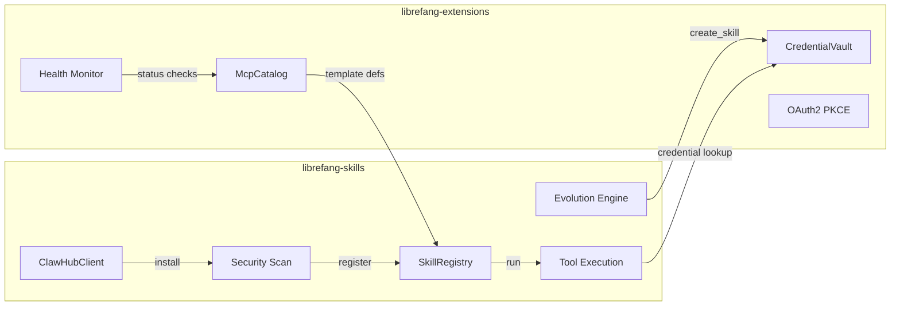

# Skills & Extensions

# Skills & Extensions

LibreFang's capability layer — everything the system can *do* beyond its core kernel lives here. The two sub-modules divide the responsibility between **skill lifecycle** (install, evolve, execute) and **infrastructure services** (credentials, MCP servers, health monitoring) that skills and the broader platform depend on.

## Sub-modules

| Sub-module | Responsibility |
|---|---|
| [librefang-skills](librefang-skills-src.md) | Skill marketplace client (ClawHub), format detection, security scanning, runtime registry, tool execution, and agent-driven evolution |
| [librefang-extensions](librefang-extensions-src.md) | MCP server catalog, AES-256-GCM credential vault, OAuth2 PKCE flows, health monitoring, and dotenv/secrets resolution |

## How they fit together

**Skills own the "what"** — declaring, fetching, sandboxing, and evolving agent capabilities. **Extensions own the "where and how safely"** — managing encrypted credentials, MCP server templates, and OAuth flows that skills consume at runtime.

## Key cross-cutting workflows

### Skill installation → credential storage
When a skill requires API keys or service tokens, the installation flow in `librefang-skills` (via `ClawHubClient` → security scan → `SkillRegistry`) delegates to `CredentialVault` in `librefang-extensions` to persist secrets under AES-256-GCM encryption. The vault's `exists` check is called during both `create_skill` (evolution) and `detect_skillmd` (OpenClaw compatibility) to verify credential state before proceeding.

### Terminal authentication through the vault
API-level operations like `rename_window` and `delete_window` flow through `authorize_terminal_request` → `resolve_dashboard_credential` → `vault::unlock` → `resolve_master_key`. This chain ensures every privileged action authenticates against the encrypted vault, making `librefang-extensions` the security gatekeeper for skills executed in terminal contexts.

### Tool execution with credential injection
At runtime, `SkillManifest` and `SkillTools` in the loader resolve environment variables through `CredentialResolver`'s priority chain (`config.toml` → `.env` → `secrets.env` → vault). The `env_passthrough_allowlist` in `SkillRequirements` controls which variables reach the executing tool, keeping the sandbox tight.

### Agent-driven evolution with vault access
The evolution engine (`librefang-skills/src/evolution.rs`) records `SkillVersionEntry` snapshots and calls `create_skill`, which crosses into the vault to check for existing credentials before creating a new evolved skill variant. This ensures evolved skills inherit or safely extend their predecessor's credential configuration.