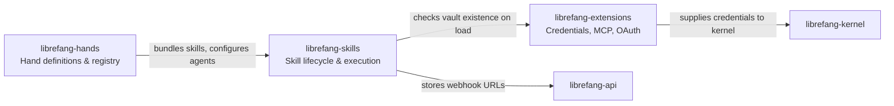

# Skills & Extensions

# Skills & Extensions

The Skills & Extensions module group provides LibreFang's pluggable capability layer — everything from individual tool scripts to full autonomous agent packages, plus the credential and server infrastructure they depend on.

## Sub-modules

| Sub-module | Role |
|---|---|
| [librefang-skills](librefang-skills.md) | Pluggable tool bundles — discovery, security scanning, installation, marketplace download, format conversion (OpenClaw/SkillMD), agent-driven evolution, and execution |
| [librefang-extensions](librefang-extensions.md) | Infrastructure services — MCP server catalog, AES-256-GCM credential vault, OAuth2 PKCE flows, health monitoring, and dotenv loading |
| [librefang-hands](librefang-hands.md) | Curated autonomous capability packages — pre-built, domain-complete agent configurations parsed from `HAND.toml` and managed through a thread-safe registry |

## How they fit together

**Hands** sit at the top — they compose one or more skills into a self-contained agent configuration that users activate from a marketplace and let run autonomously. A Hand definition references skills, which the registry resolves at activation time.

**Skills** are the unit of executable capability. The skills crate handles the full lifecycle: discovering local skills, downloading from ClawHub or Skillhub marketplaces, converting OpenClaw/SkillMD formats, running security scans (prompt exfiltration, shell redirection bypasses), and managing agent-driven evolution (install, update, delete). On startup, `load_all` checks the extensions vault to gate features that require credentials.

**Extensions** provide shared infrastructure. The `CredentialResolver` feeds secrets (from the encrypted vault, dotenv, config, or environment) to both the kernel's MCP OAuth provider and to skills that need external service access. The MCP catalog and health monitor support long-running Hands that depend on external tool servers.

## Key cross-module workflows

- **Skill installation with credentials** — A skill downloaded from a marketplace may declare a dependency on a vault secret. The registry (`load_all`) calls into the extensions vault to check availability before marking the skill as ready.
- **Hand activation** — `HandRegistry::activate` resolves a `HandDefinition` into a `HandInstance`, which wires skill references and settings into the kernel for agent spawning.
- **Agent-driven evolution** — An agent can invoke `evolve_delete_skill`, which acquires a skill lock, validates a webhook URL through the API layer (including private-IP checks), and finalizes removal.
- **OAuth-protected MCP tools** — A Hand's agents call MCP servers whose tokens are obtained via extensions' OAuth PKCE flow, with secrets stored in the credential vault and refreshed under health-monitor backoff.