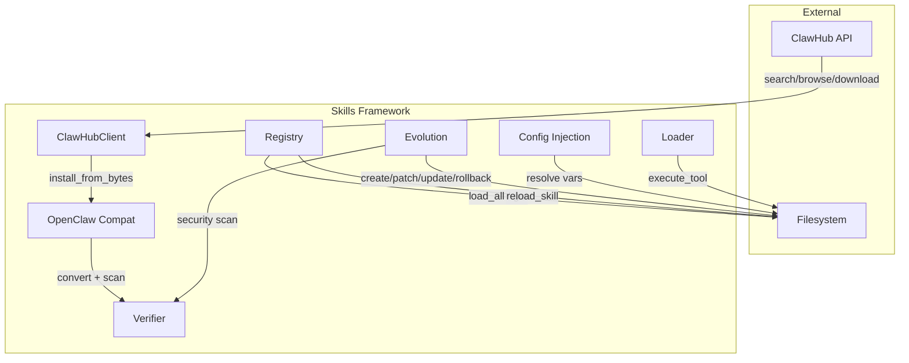

# Skills Framework

# Skills Framework

The Skills Framework (`librefang-skills`) manages the full lifecycle of skills: discovery, installation, conversion, configuration, agent-driven evolution, and security scanning. Skills are self-contained units of capability—prompts, tools, and configuration—that agents can load, invoke, and autonomously refine.

## Architecture Overview



---

## Skill Formats and Manifest

A skill is a directory containing a `skill.toml` manifest and associated files. The framework recognizes three source formats and converts all of them into a unified `SkillManifest`:

| Format | Detection | Conversion |
|---|---|---|
| **SKILL.md** (prompt-only) | File starts with `---` (YAML frontmatter) | `openclaw_compat::convert_skillmd` |
| **package.json** (OpenClaw/Node.js) | `openclaw_compat::detect_openclaw_skill` | `openclaw_compat::convert_openclaw_skill` |
| **skill.toml** (native LibreFang) | Direct parse | No conversion needed |

### Manifest Structure (`skill.toml`)

```toml
[skill]
name = "my-skill"
version = "0.1.0"
description = "Does useful things"
author = "agent-evolved"
license = "MIT"
tags = ["automation"]

[runtime]
runtime_type = "PromptOnly"   # or "Shell", "Python"
entry = ""                    # script path for non-PromptOnly

[tools]

[[config_vars]]
key = "wiki.base_url"
description = "Base URL of the internal wiki"
default = "https://wiki.example.com"

[source]
type = "Local"                # "Local", "Native", "ClawHub", etc.
```

The `source` field is written by every install path and is checked by `delete_skill` to prevent agents from deleting marketplace or bundled skills. Only `Local` and `Native` sources are deletable through the agent-facing API; `uninstall_skill` (user-facing) removes any source.

---

## ClawHub Marketplace Client (`clawhub`)

The `ClawHubClient` handles all interaction with the ClawHub skill marketplace at `https://clawhub.ai/api/v1`.

### Client Construction

```rust
let client = ClawHubClient::new(cache_dir);
// or with a custom URL:
let client = ClawHubClient::with_url("http://localhost:8080/api/v1", cache_dir);
```

TLS verification can be disabled for testing by setting `LIBREFANG_DANGEROUSLY_SKIP_TLS_VERIFICATION=true` or `1`.

### API Methods

| Method | Endpoint | Purpose |
|---|---|---|
| `search(query, limit)` | `GET /search?q=...&limit=N` | Semantic search; returns `ClawHubSearchResponse` with `results` key |
| `browse(sort, limit, cursor)` | `GET /skills?sort=...&limit=N&cursor=...` | Paginated listing; returns `ClawHubBrowseResponse` with `items` key |
| `get_skill(slug)` | `GET /skills/{slug}` | Full detail including owner, stats, moderation status |
| `get_file(slug, path)` | `GET /skills/{slug}/file?path=...` | Fetch a single file (e.g., `SKILL.md`) |
| `install(slug, target_dir)` | `GET /download?slug=...` | Download + extract + scan + write |
| `is_installed(slug, skills_dir)` | — | Checks for `skill.toml` in `{skills_dir}/{slug}/` |

### Rate Limit Handling

All HTTP requests go through `get_with_retry`, which implements:

- Up to **5 attempts** (`MAX_RETRIES`)
- Exponential backoff: `BASE_DELAY_MS * 2^attempt`, capped at `MAX_DELAY_MS` (30 s)
- Jitter: 0–25% random addition using system-time nanosecond hashing
- `Retry-After` header respect (capped at `MAX_DELAY_MS`)
- 429 and 5xx trigger retries; other 4xx errors fail immediately

### Installation Pipeline

`install` and `install_from_bytes` share a seven-step pipeline:

1. **SHA256 hash** of downloaded content (logged for audit)
2. **Format detection** — SKILL.md (starts with `---`), zip archive (`PK` magic bytes), or raw package.json
3. **Zip extraction** with path-traversal protection via `resolve_skill_child_path` (rejects absolute paths, `..` components)
4. **Format conversion** to `SkillManifest` via `openclaw_compat`
5. **Manifest security scan** via `SkillVerifier::security_scan`
6. **Prompt injection scan** via `SkillVerifier::scan_prompt_content` — critical findings block installation and clean up the skill directory
7. **Write `skill.toml`** with `verified: false`

The install result (`ClawHubInstallResult`) includes all security warnings, tool name translations (OpenClaw → LibreFang naming), and whether the skill is prompt-only.

### Slug Validation

Skill slugs must be non-empty ASCII alphanumeric + `-` + `_`. This is enforced by `validate_slug` at every API boundary.

---

## Config Injection (`config_injection`)

Skills declare external configuration they need via `[[config_vars]]` in their manifest. The config injection pipeline resolves these at prompt-build time.

### Resolution Flow

1. **Collection**: `collect_config_vars(skills)` gathers declarations from enabled skills, deduplicating by key (first declaration wins)
2. **Resolution**: `resolve_config_vars(vars, config_toml)` walks `skills.config.<logical.key>` in the user's `config.toml`, falling back to the declared default
3. **Formatting**: `format_config_section(resolved)` produces a compact text block for the system prompt

### Storage Convention

A declared key `wiki.base_url` is stored in `~/.librefang/config.toml` as:

```toml
[skills.config.wiki]
base_url = "https://wiki.corp.example.com"
```

Resolution walks the dotted path `skills` → `config` → `wiki` → `base_url` through the TOML tree. Empty strings are treated as absent, triggering fallback to the default. Variables with neither a config value nor a default are omitted entirely.

### Output Format

```text
## Skill Config Variables
wiki.base_url = https://wiki.corp.example.com
db.host = localhost
```

---

## Skill Evolution (`evolution`)

The evolution module enables agents to create, modify, and manage skills autonomously. Every mutation goes through security scanning, version tracking, and atomic filesystem writes.

### Core Operations

| Function | Purpose | Mutation Counter |
|---|---|---|
| `create_skill` | Create a new PromptOnly skill | No (initial creation) |
| `update_skill` | Full rewrite of `prompt_context.md` | Yes |
| `patch_skill` | Fuzzy find-and-replace on prompt content | Yes |
| `rollback_skill` | Restore previous content snapshot | Yes |
| `delete_skill` | Remove agent-created skills (source-checked) | — |
| `uninstall_skill` | Remove any installed skill (user-initiated) | — |
| `write_supporting_file` | Add files under `references/`, `templates/`, `scripts/`, `assets/` | No |
| `remove_supporting_file` | Remove supporting files, clean empty dirs | No |
| `record_skill_usage` | Increment use counter after successful invocation | No |

### Security Validation

All prompt content passes through `validate_prompt_content` which:
- Enforces a **160,000 character** limit (~55k tokens)
- Runs `SkillVerifier::scan_prompt_content` for injection detection
- Blocks content with **Critical** severity findings, returning `SkillError::SecurityBlocked`

Name validation (`validate_name`) enforces lowercase alphanumeric + hyphens/underscores, max 64 characters, must start with alphanumeric.

### Concurrency: File Locking

Every mutation acquires an **exclusive file lock** via `acquire_skill_lock` before touching the filesystem. Lock files live at `{skills_dir}/.evolution-locks/{name}.lock` — outside the skill directory so they survive `remove_dir_all` on Windows.

The lock ensures:
- Concurrent `create_skill` calls for the same name serialize (the second finds the directory already exists)
- `update_skill`/`patch_skill` re-read the current on-disk version **under the lock** to avoid duplicate version bumps from stale cached copies
- `delete_skill` and `uninstall_skill` hold the lock across directory removal so mid-deletion reads are impossible

### Atomic Writes

All file writes use `atomic_write`: content is written to a temp file (named with pid, thread id, monotonic counter, and nanosecond timestamp) then renamed. This prevents partial files on crash. A process-wide `AtomicU64` counter ensures unique temp-file names even when multiple threads target the same path.

### Fuzzy Patching

`patch_skill` uses `fuzzy_find_and_replace` which tries six strategies in order from strict to loose:

1. **Exact** — literal substring match
2. **LineTrimmed** — trim leading/trailing whitespace per line
3. **WhitespaceNormalized** — collapse whitespace runs to single space
4. **IndentFlexible** — strip all leading indentation
5. **BlockAnchor** — match first + last lines, verify middle ≥60% similar (≥70% for subsequent matches)
6. **WhitespaceStripped** — remove all whitespace from both sides; substring match. Requires ≥3 non-whitespace chars to prevent false positives on short English fragments. Designed for CJK content where inter-character spaces have no semantic meaning.

When no strategy matches, the error includes up to 3 closest existing lines (Jaccard character-overlap similarity > 0.3) so the agent can self-correct on the next attempt.

Empty `old_str` is rejected before any strategy runs to prevent catastrophic insertion at every character boundary.

### Version Management

Each skill tracks evolution metadata in `.evolution.json` alongside `skill.toml`:

```rust
struct SkillEvolutionMeta {
    versions: Vec<SkillVersionEntry>,   // newest last, max 10
    use_count: u64,                      // successful invocations
    evolution_count: u64,                // total version entries written
    mutation_count: u64,                 // post-create edits only
}
```

- **Version bumping** uses `semver::Version` for robust patch increment (`0.1.0` → `0.1.1`), with a fallback split-parse for non-standard strings
- **Rollback snapshots** are saved to `.rollback/prompt_context_{timestamp}_{nanos}_{pid}.md` before every mutation, capped at 10 entries
- **Author tracking**: each `SkillVersionEntry` records who made the change (`"agent:<uuid>"`, `"cli"`, `"dashboard"`, `"reviewer"`)

### Supporting Files

Skills can store auxiliary files in four allowed subdirectories: `references/`, `templates/`, `scripts/`, `assets/`. Operations:

- **`write_supporting_file`** validates the path, enforces a 1 MiB size limit, canonicalizes both paths to verify the resolved target stays within the skill directory (symlink defense), and security-scans the content before writing
- **`remove_supporting_file`** removes the file and walks upward pruning empty ancestor directories
- **`list_supporting_files`** recursively walks each allowed subdirectory (max depth 16, symlinks not followed) and returns paths relative to the subdirectory root

---

## Security Scanning (`verify`)

Referenced throughout the codebase, `SkillVerifier` provides two scan entry points:

- **`security_scan(&manifest)`** — examines the manifest structure for dangerous configurations
- **`scan_prompt_content(content)`** — pattern-matches prompt text for injection attempts (e.g., reverse shells, instruction overrides)

Both return `Vec<SkillWarning>` with severity levels. **Critical** warnings block installation or mutation; lower severities are recorded but allow the operation to proceed.

`SkillVerifier::sha256_hex` is also used for content hashing in version entries.

---

## OpenClaw Compatibility (`openclaw_compat`)

The compatibility layer converts two external formats into native `SkillManifest`:

- **`detect_skillmd` / `convert_skillmd`** — SKILL.md with YAML frontmatter (prompt-only skills). Produces tool name translations (OpenClaw → LibreFang naming) and identifies required binaries.
- **`detect_openclaw_skill` / `convert_openclaw_skill`** — package.json-based skills with Node.js runtime declarations.

Both paths write a `skill.toml` and (for prompt-only skills) `prompt_context.md`.

---

## Registry (`registry`)

The skill registry loads and indexes installed skills from the filesystem. Key operations referenced by the rest of the codebase:

- **`load_all`** — scans the skills directory, loading each valid `skill.toml`
- **`load_workspace_skills`** — loads skills from project-local directories, includes `scan_prompt_content` validation
- **`get` / `find_tool_provider`** — lookup skills by name or tool name
- **`reload_skill`** — hot-reload a single skill from disk
- **`is_frozen`** — checked by `ensure_not_frozen` before agent evolution tools execute, preventing mutation during locked contexts

The registry supports progressive prompt-context loading to avoid reading all prompt files into memory at startup.

---

## Loader (`loader`)

The loader handles skill tool execution:

- **`execute_skill_tool`** dispatches to the appropriate runtime (shell, Python)
- **`execute_shell`** runs shell-based skill tools
- **`execute_python`** locates the Python interpreter via `find_python` and executes

After successful execution, `record_skill_usage` is called to bump the skill's use counter (serialized via the evolution lock).

---

## Integration Points

### From the Runtime (`librefang-runtime`)

The tool runner (`tool_runner.rs`) bridges agent tool calls into the skills framework:

- **Evolution tools**: `tool_skill_evolve_create`, `tool_skill_evolve_patch`, `tool_skill_evolve_update`, `tool_skill_evolve_rollback`, `tool_skill_evolve_delete`, `tool_skill_evolve_write_file`, `tool_skill_evolve_remove_file` — each acquires the skills directory and delegates to the corresponding `evolution` function
- **Skill tool execution**: `execute_tool_raw` looks up the tool provider via the registry and dispatches through `execute_skill_tool`
- **Usage tracking**: `tool_skill_read_file` and `execute_tool_raw` call `record_skill_usage`
- **Freeze guard**: `ensure_not_frozen` checks `is_frozen` before any evolution tool executes

### From the CLI (`librefang-cli`)

- **`cmd_doctor`** runs `load_all`, `scan_prompt_content`, and `list` for diagnostics
- **`cmd_skill_install`** delegates to `marketplace::install`

### From the API (`librefang-api`)

Route handlers in `src/routes/skills.rs` call evolution functions directly (`evolve_delete_skill`, `evolve_update_skill`, `evolve_rollback_skill`) which flow through the same lock + validate + atomic-write pipeline.