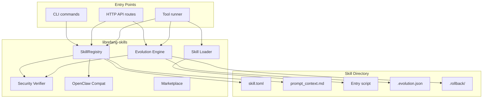

# Skills & Marketplace

# Skills & Marketplace Module

## Overview

The `librefang-skills` crate implements LibreFang's pluggable skill system. Skills are self-contained bundles that extend agent capabilities — they can provide executable tools (Python, Node.js, Shell, WASM) or inject instructional context directly into the LLM's system prompt (PromptOnly skills). The module handles the full lifecycle: discovery, loading, execution, agent-driven evolution, marketplace installation, security verification, and version management.

## Architecture



## Skill Manifest Format

Every skill is rooted in a directory containing a `skill.toml` manifest:

```toml
[skill]
name = "web-summarizer"
version = "0.1.0"
description = "Summarizes any web page into bullet points"
author = "librefang-community"
license = "MIT"
tags = ["web", "summarizer", "research"]

[runtime]
type = "python"          # python | wasm | node | shell | builtin | promptonly
entry = "src/main.py"    # relative to skill directory

[[tools.provided]]
name = "summarize_url"
description = "Fetch a URL and return a concise summary"
input_schema = { type = "object", properties = { url = { type = "string" } }, required = ["url"] }

[requirements]
tools = ["web_fetch"]
capabilities = ["NetConnect(*)"]

[config]
apiKey = "sk-..."
max_retries = 3
```

Key fields:

- **`skill`** — Metadata: name (unique identifier), version (semver), description, author, license, tags.
- **`runtime`** — Execution model. `type` defaults to `promptonly` if omitted. `entry` points to the executable file relative to the skill directory.
- **`tools.provided`** — Array of tool definitions the skill exposes. Each has a `name`, `description`, and JSON Schema `input_schema`.
- **`requirements`** — Declared dependencies on built-in tools and host capabilities.
- **`config`** — Arbitrary user-defined key-value pairs passed to the skill's runtime at execution time.

### Prompt Context

For `promptonly` skills, the instructional content lives either inline in the manifest or in a companion `prompt_context.md` file. The registry uses **progressive loading**: if `prompt_context` is absent from the TOML, it reads `prompt_context.md` from the same directory. This separation keeps large Markdown bodies out of the manifest.

## Core Types

| Type | Location | Purpose |
|------|----------|---------|
| `SkillManifest` | `lib.rs` | Parsed representation of `skill.toml` |
| `SkillRuntime` | `lib.rs` | Enum: `Python`, `Wasm`, `Node`, `Shell`, `Builtin`, `PromptOnly` |
| `SkillSource` | `lib.rs` | Provenance tracking: `Native`, `Local`, `OpenClaw`, `ClawHub`, `Skillhub` |
| `InstalledSkill` | `lib.rs` | A loaded skill: manifest, absolute path, enabled flag |
| `SkillToolDef` | `lib.rs` | Tool name, description, JSON Schema input |
| `SkillToolResult` | `lib.rs` | Execution output with error flag |
| `SkillError` | `lib.rs` | Error enum covering all failure modes |

## SkillRegistry

The registry (`registry.rs`) is the central index of installed skills, keyed by name. It owns the skills directory path and handles:

### Loading

- **`load_all()`** — Scans the skills directory, parses manifests, auto-converts `SKILL.md` files via the OpenClaw compat layer, runs prompt injection scans, and rejects critical threats.
- **`load_skill(path)`** — Loads a single skill. Checks disabled list, platform compatibility, performs progressive prompt context loading, and canonicalizes the directory path to an absolute form.
- **`load_external_dirs(dirs)`** — Loads skills from additional read-only directories. Local skills take precedence on name collisions.
- **`load_workspace_skills(dir)`** — Loads workspace-scoped skills that override global ones with the same name.

### Platform Filtering

Skills can declare OS compatibility via reserved tags: `macos`, `linux`, `windows` (and `-only` variants). `skill_matches_platform()` checks these against the compile-time target OS. Skills with no platform tags load everywhere. Platform tags are also excluded from category derivation via `is_platform_tag()` and `derive_category()`.

### Freezing

`freeze()` locks the registry into read-only mode after initial boot (Stable mode). Frozen registries reject `load_skill()` calls. `reload_skill()` still works — it refreshes existing entries without adding new ones.

### Tool Resolution

- **`all_tool_definitions()`** — Collects tools from all enabled skills.
- **`tool_definitions_for_skills(names)`** — Filters to named skills.
- **`find_tool_provider(tool_name)`** — Locates which skill provides a given tool.

### Evolution Integration

The registry exposes convenience methods that delegate to the evolution module:

- **`evolve_update()`** — Full prompt context rewrite.
- **`evolve_patch()`** — Fuzzy find-and-replace on prompt context.
- **`evolve_rollback()`** — Revert to previous version.

These acquire the skill, call the evolution function, then `reload_skill()` to refresh the in-memory entry.

## Skill Loader

The loader (`loader.rs`) dispatches tool execution to the appropriate runtime:

### Execution Protocol

All script-based runtimes (Python, Node, Shell) follow the same protocol:

1. **Path validation** — `validate_script_path()` resolves the entry point and confirms it stays within the skill directory, blocking `../` traversal, absolute paths, and symlink escapes.
2. **Subprocess spawn** — The runtime binary is located (`find_python`, `find_node`, `find_shell`) and launched with the script as an argument, `cwd` set to the skill directory.
3. **Environment isolation** — `env_clear()` strips the inherited environment. Only `PATH`, `HOME`, `TERM`, `SHELL`, `PYTHONIOENCODING`, `NODE_NO_WARNINGS`, and platform essentials (`SYSTEMROOT`, `TEMP` on Windows) are preserved. This prevents third-party skill code from accessing host API keys or tokens.
4. **Stdin payload** — JSON object `{ "tool": name, "input": value, "config": {...} }` is written to stdin (config included only when non-empty).
5. **Output parsing** — Stdout is parsed as JSON. If parsing fails, the raw trimmed output is wrapped as `{ "result": text }`. Non-zero exit codes produce `{ "error": stderr }` with `is_error: true`.

### Runtime-Specific Notes

| Runtime | Binary lookup | Timeout | Notes |
|---------|--------------|---------|-------|
| `Python` | `python3`, `python` | None | Sets `PYTHONIOENCODING=utf-8` |
| `Node` | `node` | None | Sets `NODE_NO_WARNINGS=1` |
| `Shell` | `bash`, `sh` | 120 seconds | Hard timeout with `tokio::time::timeout` |
| `Wasm` | — | — | Returns `RuntimeNotAvailable` (not yet implemented) |
| `Builtin` | — | — | Handled directly by the kernel, not this module |
| `PromptOnly` | — | — | Returns a hint to use built-in tools; instructions are in the system prompt |

### Security: Path Traversal Prevention

`validate_script_path()` canonicalizes both the skill directory and the resolved script path, then checks that the script path starts with the directory path. This blocks:

- `../` traversal sequences
- Absolute paths like `/etc/passwd`
- Symlinks pointing outside the skill directory

## Evolution Engine

The evolution module (`evolution.rs`) enables agents to autonomously create, modify, and version skills. All mutation operations use exclusive file locks and atomic writes.

### Core Operations

**`create_skill()`** — Creates a new PromptOnly skill. Validates name format (lowercase alphanumeric + `-_`, max 64 chars), description length (max 1024 chars), and prompt content (max 160,000 chars, scanned for injection attacks). Writes `skill.toml` and `prompt_context.md` atomically. Records the initial version with `mutation_count = 0`.

**`update_skill()`** — Full rewrite of prompt context. Saves a rollback snapshot, bumps the semver patch version, and writes the new content. Re-reads the live version from disk under the lock to avoid duplicate versions from concurrent writers.

**`patch_skill()`** — Fuzzy find-and-replace on prompt context. Uses a 6-strategy matching algorithm (see below). Saves a rollback snapshot, bumps version, records which `MatchStrategy` succeeded.

**`rollback_skill()`** — Reverts to the previous version by restoring the most recent snapshot from `.rollback/`.

**`delete_skill()`** — Removes the skill directory entirely.

**`write_supporting_file()` / `remove_supporting_file()`** — Manages auxiliary files (e.g., examples, templates) alongside the skill.

### Fuzzy Matching Strategies

When an LLM generates a patch, the exact whitespace and formatting of `old_string` rarely matches the actual content. The engine tries six strategies in strict-to-loose order:

1. **Exact** — Literal substring match. Fast path.
2. **LineTrimmed** — Trim leading/trailing whitespace on each line, then line-based match.
3. **WhitespaceNormalized** — Collapse whitespace runs to single spaces, then match.
4. **IndentFlexible** — Strip all leading indentation, then match.
5. **BlockAnchor** — Match first and last lines exactly, verify middle lines have ≥60% similarity. Useful for large blocks with minor interior changes.
6. **WhitespaceStripped** — Remove ALL whitespace from both sides, substring match. Last-resort strategy designed for CJK content where inter-character spaces carry no semantic meaning. Requires minimum 3-character needle to prevent false positives on short English words.

When all strategies fail, the error includes the closest matching lines from the content (character-overlap similarity) to help the agent self-correct on the next attempt.

### Concurrency Control

**File locking** — `acquire_skill_lock()` uses `fs2::FileExt::lock_exclusive()` (flock on Unix, LockFileEx on Windows). Lock files live in `.evolution-locks/` adjacent to the skills directory so they survive `remove_dir_all` on Windows.

**Atomic writes** — `atomic_write()` writes to a temp file named with pid + thread id + monotonic counter + nanosecond timestamp, then renames. Prevents partial files on crash.

### Version History

Each skill stores `.evolution.json` alongside its manifest:

```json
{
  "versions": [
    {
      "version": "0.1.2",
      "timestamp": "2025-01-15T10:30:00Z",
      "changelog": "Fixed citation format [strategy: Exact, matches: 1]",
      "content_hash": "sha256:abc123...",
      "author": "agent:a1b2c3d4"
    }
  ],
  "use_count": 47,
  "evolution_count": 3,
  "mutation_count": 2
}
```

- **`evolution_count`** — Total version entries written (includes initial creation).
- **`mutation_count`** — Post-creation edits only. A fresh skill has `mutation_count = 0`.
- **`use_count`** — Bumped by `record_skill_usage()` after successful tool invocations.
- **`author`** — Tracks mutation origin: `"agent:<uuid>"`, `"cli"`, `"dashboard"`, `"reviewer"`.
- Version history is capped at 10 entries (`MAX_VERSION_HISTORY`). Oldest entries are pruned.

Rollback snapshots are stored in `.rollback/` with nanosecond-precision filenames and are similarly capped.

## OpenClaw Compatibility

The `openclaw_compat` module auto-converts the legacy `SKILL.md` format (YAML frontmatter + Markdown body) to LibreFang's `skill.toml` + `prompt_context.md` structure. Conversion happens automatically during `load_all()` when no `skill.toml` exists but a `SKILL.md` is found. The converted manifest is written to disk so subsequent loads skip the conversion.

Converted skills default to `SkillRuntime::PromptOnly` and `SkillSource::OpenClaw`.

## Security Verification

The `verify` module provides:

- **Prompt injection scanning** — `scan_prompt_content()` detects critical patterns in prompt-only skill content. Skills with critical-severity findings are blocked at load time. This was motivated by the discovery of 341 malicious skills on ClawHub.
- **SHA256 checksums** — `sha256_hex()` computes content hashes for version tracking.
- **Integrity verification** — Checksum validation for installed skills.

## Marketplace Integration

Skills can be installed from remote registries:

- **ClawHub** (`clawhub.rs`) — Primary marketplace with rate limiting support.
- **Skillhub** (`skillhub.rs`) — Alternative registry.
- **Install flow** — `install()` resolves the skill directory, downloads the package, and records the source as `SkillSource::ClawHub` or `SkillSource::Skillhub` with slug and version.

The `publish` module handles packaging local skills for distribution: manifest validation, security scanning, and bundle creation.

## Error Handling

`SkillError` covers all failure modes:

| Variant | When |
|---------|------|
| `NotFound` | Skill or tool doesn't exist |
| `InvalidManifest` | Parse errors, validation failures (name format, size limits) |
| `AlreadyInstalled` | Duplicate skill name on create |
| `RuntimeNotAvailable` | Python/Node/Shell binary not found, or WASM not implemented |
| `ExecutionFailed` | Script errors, path traversal attempts |
| `Io` | Filesystem errors |
| `Network` | Marketplace download failures |
| `RateLimited` | ClawHub throttling |
| `TomlParse` / `YamlParse` | Manifest parsing errors |
| `SecurityBlocked` | Prompt injection detection blocked the content |

## Integration Points

The module connects to the rest of LibreFang through:

- **`librefang-runtime`** (`tool_runner.rs`) — The primary consumer. Calls `execute_skill_tool()` for tool dispatch, `find_tool_provider()` for tool resolution, and the evolution methods for skill management.
- **`librefang-cli`** (`main.rs`) — `cmd_doctor` loads and lists skills; `cmd_skill_install` calls marketplace install.
- **HTTP API routes** (`routes/skills.rs`) — Exposes evolution operations (create, update, patch, rollback, delete, write/remove file) as endpoints.
- **Agent tools** — Agents can call `skill_evolve_create`, `skill_evolve_update`, `skill_evolve_patch`, `skill_evolve_rollback`, `skill_evolve_delete`, `skill_evolve_write_file`, `skill_evolve_remove_file`, and `skill_read_file`. These are gated by the registry's frozen state — `ensure_not_frozen()` in the tool runner checks `is_frozen()` before allowing mutations.