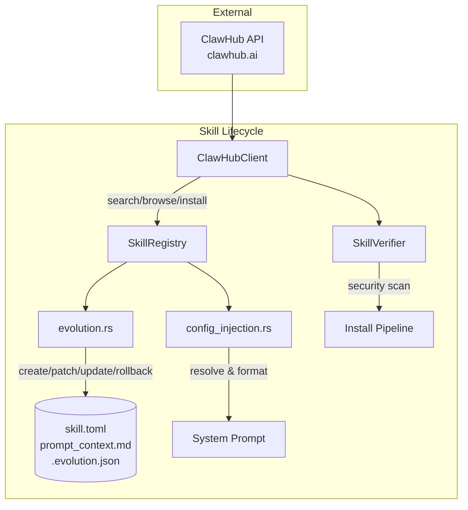

# Skills & Marketplace

# Skills & Marketplace Module

The `librefang-skills` crate manages the full lifecycle of skills: discovery on community marketplaces, local installation with security scanning, agent-driven creation and mutation, configuration injection into system prompts, and version-controlled evolution with rollback.

## Architecture Overview



---

## ClawHub Marketplace Client (`clawhub.rs`)

HTTP client for the ClawHub skill registry at `clawhub.ai/api/v1`. Handles search, browsing, detail lookup, file retrieval, and installation with SHA256 integrity verification.

### API Endpoints Used

| Endpoint | Method | Purpose |
|----------|--------|---------|
| `/api/v1/search?q=...&limit=N` | GET | Semantic/keyword search |
| `/api/v1/skills?limit=N&sort=...` | GET | Paginated browsing |
| `/api/v1/skills/{slug}` | GET | Full skill detail + owner + checksum |
| `/api/v1/download?slug=...` | GET | Download skill archive |
| `/api/v1/skills/{slug}/file?path=...` | GET | Fetch individual file |

### Retry and Rate Limiting

All requests go through `get_with_retry`, which handles HTTP 429 and 5xx responses with exponential backoff:

- **Max retries**: 5 attempts (including the first)
- **Base delay**: 1,500 ms, doubled each attempt, capped at 30,000 ms
- **Jitter**: 0–25% added via a hash of the system clock nanoseconds
- **`Retry-After` header**: Respected when present, also capped at 30 s

On final failure, 429 returns `SkillError::RateLimited`; 5xx returns `SkillError::Network`.

### Key Types

- **`ClawHubBrowseEntry`** — A skill from the browse endpoint. Contains `stats: ClawHubStats`, `tags: HashMap<String, String>` (e.g. `{"latest": "1.0.0"}`), and an optional `latest_version: ClawHubVersionInfo`. Timestamps are **Unix milliseconds**.
- **`ClawHubSearchEntry`** — A flatter result from the search endpoint with a `score: f64`. The response uses `results` (not `items`).
- **`ClawHubSkillDetail`** — Full detail including `owner`, `moderation` status, and `expected_sha256` for download integrity.
- **`ClawHubSort`** — Enum: `Trending`, `Updated`, `Downloads`, `Stars`, `Rating`.
- **`ClawHubInstallResult`** — Post-install summary: skill name, version, slug, security warnings, tool translations applied, and `is_prompt_only` flag.

Backward-compat aliases exist: `ClawHubListResponse = ClawHubBrowseResponse`, `ClawHubSearchResults = ClawHubSearchResponse`, `ClawHubEntry = ClawHubBrowseEntry`.

### Installation Pipeline

`ClawHubClient::install` follows a seven-step security pipeline:

1. **Fetch detail** to obtain `expected_sha256` (best-effort — proceeds without it on failure).
2. **Download** archive bytes, compute SHA256, validate against registry checksum. Mismatch returns `SkillError::SecurityBlocked`.
3. **Detect format** — SKILL.md (starts with `---`), zip archive (PK header), or raw package.json.
4. **Convert** to LibreFang manifest via `openclaw_compat::convert_skillmd` or `convert_openclaw_skill`.
5. **Prompt injection scan** — critical-severity findings block the install. Non-critical findings become warnings on the result.
6. **Binary dependency check** — verifies each `required_bins` entry exists on `$PATH`.
7. **Write `skill.toml`** with `verified: false`.

All extraction happens in a **staging directory** (`.staging-{slug}-{pid}-{counter}`). Only after all scans pass does `std::fs::rename` atomically promote it to the final skill directory. This prevents partial installs from loading on the next daemon start.

### TLS Configuration

Set `LIBREFANG_DANGEROUSLY_SKIP_TLS_VERIFICATION=true` or `1` to disable TLS verification (testing only). The client builder comes from `crate::http_client`.

### Slug Validation

`validate_slug` rejects empty strings and any byte outside `[a-zA-Z0-9_-]`. This is applied before every API call that takes a slug.

### Path Safety

`resolve_skill_child_path` rejects absolute paths and any `Component` other than `Normal` — this blocks `..` traversal in zip archives and file paths.

---

## Skill Configuration Injection (`config_injection.rs`)

Skills declare runtime configuration they need via `[[config_vars]]` in `skill.toml`. This module collects, resolves, and formats those variables for injection into the system prompt.

### Declaration Format (in `skill.toml`)

```toml
[[config_vars]]
key = "wiki.base_url"
description = "Base URL of the internal wiki"
default = "https://wiki.example.com"

[[config_vars]]
key = "wiki.api_key"
description = "API key for wiki access"
```

### Resolution Convention

A logical key like `wiki.base_url` maps to the config TOML path `skills.config.wiki.base_url`:

```toml
# ~/.librefang/config.toml
[skills.config.wiki]
base_url = "https://wiki.corp.example.com"
```

Resolution precedence: config TOML value → declared default → omitted from output.

### Public Functions

- **`collect_config_vars(skills: &[InstalledSkill])`** — Gathers all `config_vars` from enabled skills. Deduplicates by key (first skill wins). Skips entries with empty key or description.
- **`resolve_config_vars(vars: &[SkillConfigVar], config_toml: &toml::Value)`** — Walks the dotted path inside the config tree. Returns `(key, value)` pairs in declaration order. Empty-string values are treated as absent (falls back to default).
- **`format_config_section(resolved: &[(String, String)])`** — Produces:

  ```
  ## Skill Config Variables
  wiki.base_url = https://wiki.corp.example.com
  db.host = localhost
  ```

  Returns empty string when `resolved` is empty, so callers can cheaply skip injection with an `is_empty()` guard.

---

## Skill Evolution (`evolution.rs`)

Agent-driven skill creation, mutation, and version management. Allows autonomous agents to capture reusable approaches as PromptOnly skills and iteratively refine them.

### Limits

| Constant | Value | Purpose |
|----------|-------|---------|
| `MAX_PROMPT_CONTEXT_CHARS` | 160,000 | ≈55k tokens |
| `MAX_NAME_LEN` | 64 | Skill name length |
| `MAX_VERSION_HISTORY` | 10 | Snapshots retained per skill |
| `MAX_SUPPORTING_FILE_SIZE` | 1,048,576 | 1 MiB per supporting file |
| `SUPPORTING_FILE_MAX_DEPTH` | 16 | Directory walk recursion limit |

### Core Operations

| Function | Purpose | Version Bump |
|----------|---------|-------------|
| `create_skill` | New PromptOnly skill | Set to `0.1.0` |
| `update_skill` | Full prompt rewrite | Patch +1 |
| `patch_skill` | Fuzzy find-and-replace | Patch +1 |
| `rollback_skill` | Revert to previous snapshot | Patch +1 |
| `delete_skill` | Agent-initiated (local skills only) | — |
| `uninstall_skill` | User-initiated (any source) | — |
| `write_supporting_file` | Add file to `references/`, `templates/`, `scripts/`, `assets/` | — |
| `remove_supporting_file` | Remove supporting file + prune empty dirs | — |
| `list_supporting_files` | Recursive listing by subdirectory | — |

### Versioning

Each mutation appends a `SkillVersionEntry` to `.evolution.json`:

```json
{
  "versions": [
    {
      "version": "0.1.2",
      "timestamp": "2026-03-15T10:30:00+00:00",
      "changelog": "Refined error handling [strategy: LineTrimmed, matches: 1]",
      "content_hash": "sha256hex...",
      "author": "agent:uuid-here"
    }
  ],
  "use_count": 42,
  "evolution_count": 3,
  "mutation_count": 2
}
```

- **`evolution_count`** — total entries written (including initial create).
- **`mutation_count`** — post-create edits only. A fresh skill has `mutation_count = 0`.
- **`use_count`** — bumped by `record_skill_usage` after successful tool invocations.

Version bumping uses `semver::Version::parse` for robustness, with a manual fallback for non-standard strings. Old versions are trimmed to `MAX_VERSION_HISTORY`.

### Fuzzy Matching (6-Strategy Pipeline)

`patch_skill` uses `fuzzy_find_and_replace`, which tries strategies strict-to-loose until one succeeds:

1. **Exact** — literal substring match
2. **LineTrimmed** — trim each line's leading/trailing whitespace
3. **WhitespaceNormalized** — collapse whitespace runs to single space
4. **IndentFlexible** — strip all leading whitespace per line
5. **BlockAnchor** — match first + last line anchors, require ≥60% middle similarity (≥70% for subsequent candidates)
6. **WhitespaceStripped** — remove all whitespace from both sides, substring match. Has a 3-character minimum needle length to prevent false positives (e.g., stripping "a" matching inside "banana")

When multiple matches are found but `replace_all` is false, the function returns an error rather than guessing. On complete failure, the error includes the 3 closest existing lines (by character-overlap Jaccard similarity) as a "did you mean?" hint.

### Concurrency Safety

**File locking**: `acquire_skill_lock` uses `fs2::FileExt::lock_exclusive()` (flock on Unix, LockFileEx on Windows). Lock files live in `{parent}/.evolution-locks/{name}.lock` — outside the skill directory — so `remove_dir_all` doesn't conflict with an open lock handle on Windows.

**Lock-then-recheck pattern**: Every mutation acquires the lock first, then re-checks existence and re-reads the current version from disk. This prevents:
- Two concurrent `create_skill` calls from both succeeding
- Concurrent patches from bumping off the same stale version
- Resurrection of a skill that was deleted between the caller's snapshot and lock acquisition

**Atomic writes**: All file writes use `atomic_write` (temp file + rename). Temp file names incorporate pid, thread id, a monotonic process-local counter, and nanosecond timestamp to avoid collisions.

### Rollback

`rollback_skill` restores the most recent snapshot from `.rollback/`. Snapshot filenames embed nanosecond timestamps and pid: `prompt_context_{YYYYMMDD_HHMMSS}_{nanos}_{pid}.md`. At most `MAX_VERSION_HISTORY` snapshots are kept.

### Supporting Files

Supported subdirectories: `references/`, `templates/`, `scripts/`, `assets/`.

`write_supporting_file` and `remove_supporting_file` both:
- Validate against path traversal (no `..`, no absolute paths)
- Canonicalize paths and verify they remain under the skill directory
- Acquire the skill lock before I/O
- Run security scans on content before writing

`remove_supporting_file` prunes empty ancestor directories upward after removal.

### Security Scanning

All prompt content passes through `SkillVerifier::scan_prompt_content` before write. Content with **critical** severity warnings is rejected with `SkillError::SecurityBlocked` — this blocks installation/update entirely. The temp directory is cleaned up on blocked installs.

### Delete vs. Uninstall

- **`delete_skill`** — Agent-facing. Refuses to delete skills with `source` other than `Local` or `Native`. Skills with no `source` field are also rejected (unclassified). Validates name format.
- **`uninstall_skill`** — User-facing (dashboard, CLI). Removes any installed skill regardless of source. Checks for path traversal but does not require `validate_name` format.

Both acquire the lock and re-check existence under the lock.

### EvolutionResult

Every operation returns `EvolutionResult` with:
- `success`, `message`, `skill_name`, `version`
- `match_strategy` / `match_count` — populated for patch operations
- `evolution_count`, `mutation_count`, `use_count` — post-operation counters read from `.evolution.json`

These counters allow agent tools to report state without making a second query.