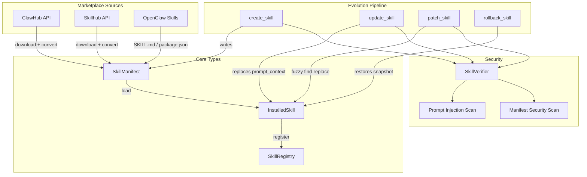

# Skills & Marketplace

# Skills & Marketplace Module

## Overview

The `librefang-skills` crate implements the skill system for LibreFang — a pluggable architecture where skills extend agent capabilities at runtime. Skills are self-contained bundles (a TOML manifest plus optional executable code or prompt context) that agents can discover, install, invoke, and even create themselves.

The module covers the full skill lifecycle:

- **Definition** — `SkillManifest` parsed from `skill.toml`, supporting six runtime types
- **Registry** — loading, indexing, and querying installed skills
- **Marketplace** — searching, browsing, and installing from ClawHub and Skillhub
- **Evolution** — agent-driven skill creation, fuzzy patching, version history, and rollback
- **Security** — prompt injection scanning, manifest validation, path traversal prevention
- **Compatibility** — automatic conversion from OpenClaw (`SKILL.md` / `package.json`) formats

## Architecture



## Skill Manifest (`skill.toml`)

Every skill is defined by a `skill.toml` file. The manifest structure maps directly to the `SkillManifest` struct:

```toml
[skill]
name = "web-summarizer"
version = "0.1.0"
description = "Summarizes any web page into bullet points"
author = "librefang-community"
license = "MIT"
tags = ["web", "summarizer", "research"]

[runtime]
type = "python"          # python | wasm | node | shell | builtin | promptonly
entry = "src/main.py"

[[tools.provided]]
name = "summarize_url"
description = "Fetch a URL and return a concise bullet-point summary"
input_schema = { type = "object", properties = { url = { type = "string" } }, required = ["url"] }

[requirements]
tools = ["web_fetch"]
capabilities = ["NetConnect(*)"]

[config]
apiKey = "sk-..."
custom_endpoint = "https://api.example.com"
```

### Runtime Types

Defined by `SkillRuntime` (defaults to `PromptOnly` when omitted):

| Runtime | Description |
|---------|-------------|
| `PromptOnly` | No executable code. The Markdown body (`prompt_context.md`) is injected into the LLM system prompt. Default. |
| `Python` | Python script executed in a subprocess via the `entry` path |
| `Wasm` | WASM module executed in a sandbox |
| `Node` | Node.js module (OpenClaw compatibility layer) |
| `Shell` | Shell/Bash script executed in a subprocess |
| `Builtin` | Compiled into the LibreFang binary |

### Provenance (`SkillSource`)

Every skill tracks where it came from via the `source` field in the manifest:

- `Native` — built into LibreFang or manually installed
- `Local` — user-created or agent-evolved
- `OpenClaw` — converted from OpenClaw format
- `ClawHub { slug, version }` — downloaded from clawhub.ai
- `Skillhub { slug, version }` — downloaded from Skillhub

Provenance is enforced by `delete_skill`, which refuses to remove non-local skills (agents can only delete skills they created). `uninstall_skill` is the user-facing path that removes any skill regardless of source.

### Custom Config (`[config]` table)

Skills declare arbitrary configuration keys under `[config]`. These are stored as `HashMap<String, serde_json::Value>` and are discoverable at runtime via `extract_skill_config_vars` / `discover_config`. The discovery functions detect conflicts when multiple skills claim the same config key.

## Error Handling

All errors flow through `SkillError`, a single enum with variants for every failure mode:

- `NotFound` / `AlreadyInstalled` — lifecycle errors
- `InvalidManifest` — TOML parse failures, validation errors, fuzzy match failures
- `RuntimeNotAvailable` / `ExecutionFailed` — loader errors
- `Network` / `RateLimited` — marketplace API errors
- `SecurityBlocked` — prompt injection, path traversal, unauthorized deletion
- `Io` / `TomlParse` / `YamlParse` — infrastructure errors

## ClawHub Marketplace Client (`clawhub.rs`)

`ClawHubClient` talks to the ClawHub API at `https://clawhub.ai/api/v1`. ClawHub hosts 3,000+ community skills in SKILL.md (prompt-only) and package.json (Node.js) formats.

### API Endpoints Used

| Method | Endpoint | Purpose |
|--------|----------|---------|
| `search()` | `GET /search?q=...&limit=N` | Semantic/vector search |
| `browse()` | `GET /skills?limit=N&sort=...` | Paginated listing |
| `get_skill()` | `GET /skills/{slug}` | Full detail with owner and stats |
| `get_file()` | `GET /skills/{slug}/file?path=SKILL.md` | Fetch a single file |
| `install()` | `GET /download?slug=...` | Download and install |

### Retry and Rate Limiting

All API calls go through `get_with_retry`, which handles HTTP 429 and 5xx responses with up to 5 retries using exponential backoff (`BASE_DELAY_MS = 1500ms`, cap at `MAX_DELAY_MS = 30s`) with jitter. The `Retry-After` header is respected when present. On final failure, a `RateLimited` or `Network` error is returned.

TLS verification can be disabled for testing via the `LIBREFANG_DANGEROUSLY_SKIP_TLS_VERIFICATION` environment variable.

### Install Pipeline

`install()` and `install_from_bytes()` run a multi-step security pipeline:

1. **SHA256 hash** of downloaded content (logged, not enforced)
2. **Format detection** — SKILL.md (frontmatter), zip archive, or raw package.json
3. **Zip extraction** with path traversal protection via `resolve_skill_child_path` (rejects absolute paths and non-`Normal` components)
4. **Format conversion** — SKILL.md or package.json → LibreFang `SkillManifest` via `openclaw_compat`
5. **Security scan** — `SkillVerifier::security_scan` on the manifest
6. **Prompt injection scan** — `SkillVerifier::scan_prompt_content` on prompt-only skills; **critical warnings block installation** and clean up the skill directory
7. **Binary dependency check** — `which_check` for required executables
8. **Write `skill.toml`** with `verified: false`

## Skill Evolution (`evolution.rs`)

The evolution module enables agents to autonomously create, refine, and manage skills. This is the self-improvement loop: an agent discovers a reusable methodology during task execution and saves it as a PromptOnly skill that other agents (or future turns) can use.

### Core Operations

| Function | Purpose |
|----------|---------|
| `create_skill()` | Create a new PromptOnly skill from scratch |
| `update_skill()` | Full rewrite of prompt context |
| `patch_skill()` | Fuzzy find-and-replace on prompt context |
| `rollback_skill()` | Restore previous version from snapshot |
| `delete_skill()` | Agent-initiated delete (local skills only) |
| `uninstall_skill()` | User-initiated delete (any skill) |
| `write_supporting_file()` | Add files to `references/`, `templates/`, `scripts/`, `assets/` |
| `remove_supporting_file()` | Remove supporting files with empty-dir cleanup |
| `list_supporting_files()` | Recursive listing of all supporting files |
| `record_skill_usage()` | Increment usage counter after successful tool invocation |
| `get_evolution_info()` | Read `.evolution.json` metadata |

### Fuzzy Patching

The key innovation is `fuzzy_find_and_replace`, a 6-strategy matcher that tolerates LLM formatting variance. When an agent provides `old_string` / `new_string` for a patch, the system tries strategies in order from strict to loose:

1. **Exact** — literal substring match
2. **LineTrimmed** — trim each line's leading/trailing whitespace
3. **WhitespaceNormalized** — collapse whitespace runs to single space
4. **IndentFlexible** — strip all leading whitespace per line
5. **BlockAnchor** — match first + last lines, require ≥60% middle similarity
6. **WhitespaceStripped** — remove ALL whitespace from both sides, substring match (CJK-friendly fallback)

Each strategy uses line-based match counting (not substring-based) to avoid false "multiple matches" errors when `old_str` is a substring of a longer line. The `MatchStrategy` used is reported back in `EvolutionResult.match_strategy` so agents can self-correct.

On failure, the error message includes the closest matching lines from the content (Jaccard similarity on character sets) so the agent can retry with better context.

### Concurrency and Atomicity

All mutation operations are serialized per-skill using exclusive file locks (`fs2::FileExt::lock_exclusive`). Lock files live in `{skills_dir}/.evolution-locks/{name}.lock`, outside the skill directory itself, so `remove_dir_all` doesn't conflict with an open lock handle on Windows.

All file writes go through `atomic_write`, which writes to a temp file (named with pid, thread id, monotonic counter, and nanosecond timestamp) then renames. This prevents partial files on crash.

Every mutation operation:
1. Acquires the per-skill lock
2. Re-reads the live manifest from disk under the lock (not the caller's cached snapshot)
3. Saves a rollback snapshot before modifying content
4. Validates new content (size limit + security scan)
5. Writes atomically
6. Records version in `.evolution.json`
7. Returns post-operation counters in `EvolutionResult`

### Version History

`.evolution.json` tracks:
- `versions[]` — ordered list of `SkillVersionEntry` (version, timestamp, changelog, content hash, author)
- `evolution_count` — total entries written (including initial creation)
- `mutation_count` — post-creation edits only
- `use_count` — successful tool invocations

History is capped at `MAX_VERSION_HISTORY = 10` entries (oldest trimmed first). Rollback snapshots in `.rollback/` follow the same cap.

Versions are bumped using `semver::Version` patch increments (`0.1.0` → `0.1.1`), with fallback string parsing for non-standard version formats.

### Validation Limits

| Constant | Value | Purpose |
|----------|-------|---------|
| `MAX_PROMPT_CONTEXT_CHARS` | 160,000 | ~55k tokens, prevents runaway context |
| `MAX_NAME_LEN` | 64 | Skill name length |
| `MAX_VERSION_HISTORY` | 10 | Snapshots retained per skill |
| `MAX_SUPPORTING_FILE_SIZE` | 1 MiB | Per-file limit for `write_supporting_file` |
| `SUPPORTING_FILE_MAX_DEPTH` | 16 | Directory recursion bound |

### Security Guards on Evolution

- `create_skill`: validates name format (lowercase alphanumeric + `-_`, must start alphanumeric), prompt content size, prompt injection scan
- `patch_skill` / `update_skill`: validates new content, re-reads from disk under lock, saves rollback snapshot
- `delete_skill`: refuses non-local skills, rejects manifests without a `source` field, validates name against path traversal
- `uninstall_skill`: path traversal check on name, lock-then-check existence
- `write_supporting_file`: path must be under `references/`, `templates/`, `scripts/`, or `assets/`; no `..`, no absolute paths; canonical path must stay within skill directory; security scan runs before write
- `remove_supporting_file`: same containment checks, lists available files on not-found

### Loading Skills from Disk

`load_installed_skill_from_disk` reads `skill.toml` and `prompt_context.md` directly from the filesystem, bypassing the in-memory registry. This is used by the runtime's tool runner when an agent creates and immediately updates a skill within a single turn — the registry hasn't reloaded yet, but the files are on disk and ready.

## OpenClaw Compatibility (`openclaw_compat.rs`)

The `openclaw_compat` module handles conversion from OpenClaw skill formats to LibreFang manifests. It supports two source formats:

- **SKILL.md** — YAML frontmatter + Markdown body (prompt-only skills). Detected by looking for `---` at the start.
- **package.json** — Node.js skills with OpenClaw metadata. Detected by checking for specific OpenClaw fields in the JSON.

Conversion produces a `SkillManifest` with appropriate `SkillSource::OpenClaw` provenance and translates tool names from OpenClaw conventions to LibreFang conventions (e.g., `Read` → `file_read`). The tool translations are returned in `ClawHubInstallResult.tool_translations`.

Key functions called during marketplace install:
- `detect_skillmd()` / `detect_openclaw_skill()` — format detection
- `convert_skillmd()` / `convert_openclaw_skill()` — manifest conversion
- `write_librefang_manifest()` — serialize converted manifest to `skill.toml`
- `write_prompt_context()` — write the Markdown body to `prompt_context.md`

## Security Verification (`verify.rs`)

`SkillVerifier` provides two scanning modes:

- **`security_scan(manifest)`** — validates the manifest structure, checks tool definitions for suspicious patterns
- **`scan_prompt_content(content)`** — detects prompt injection attempts in Markdown content. Returns a list of `SkillWarning` with severity levels (`Critical`, `Warning`, `Info`). Critical-severity warnings **block** skill installation and evolution operations.

The `cmd_doctor` CLI command also uses `scan_prompt_content` to audit all installed skills.

## Registry (`registry.rs`)

`SkillRegistry` is the in-memory index of installed skills. It provides:

- `load_all()` — scans the skills directory, auto-converts OpenClaw/SKILL.md formats
- `load_workspace_skills()` — loads skills from project-local directories
- `get()` / `list()` / `find_tool_provider()` — lookup by name or tool name
- `skills_dir()` — returns the filesystem root for skill operations
- `freeze()` / `is_frozen()` — locks the registry to prevent further loads (used during agent execution to prevent mid-run mutation of the skill set)

The registry implements progressive loading of prompt context: `skill.toml` is read first, and `prompt_context.md` is only loaded on demand (when the prompt context field is empty). This avoids reading large Markdown files for skills that aren't being actively used.

## Integration Points

### Tool Runner → Skills

The runtime's `execute_tool_raw` dispatches skill tool invocations by:
1. Calling `find_tool_provider` on the registry to locate which skill provides the requested tool
2. Calling `execute_skill_tool` on the appropriate loader (Python, Shell, Node, WASM, or prompt injection)
3. Calling `record_skill_usage` on success to bump the skill's use counter

### Agent Tools → Evolution

The runtime exposes these agent tools (all gated by `is_frozen()` checks):
- `skill_evolve_create` → `create_skill()`
- `skill_evolve_update` → `update_skill()`
- `skill_evolve_patch` → `patch_skill()`
- `skill_evolve_rollback` → `rollback_skill()`
- `skill_evolve_delete` → `delete_skill()`
- `skill_evolve_write_file` → `write_supporting_file()`
- `skill_evolve_remove_file` → `remove_supporting_file()`
- `skill_read_file` → reads supporting files and calls `record_skill_usage()`

All evolution tools use `load_installed_skill_from_disk` rather than the registry for lookups, since the registry may be stale within a single agent turn.

### CLI → Skills

- `cmd_doctor` — loads all skills via registry, runs prompt injection scans
- `cmd_skill_install` — delegates to `marketplace::install()`

### Web API → Skills

The skill routes in `src/routes/skills.rs` call evolution functions (delete, remove_file, write_file) which acquire per-skill locks, ensuring web-dashboard mutations serialize correctly against agent-initiated mutations on the same skill.