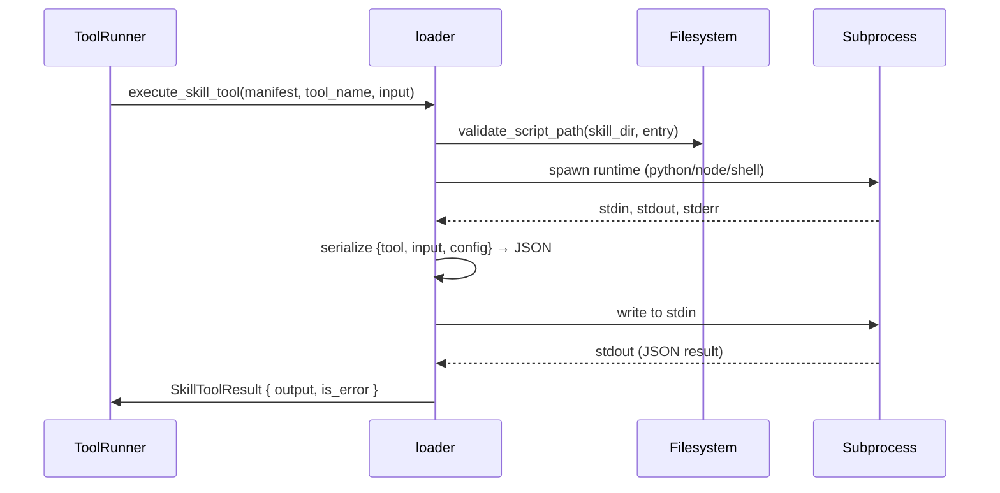
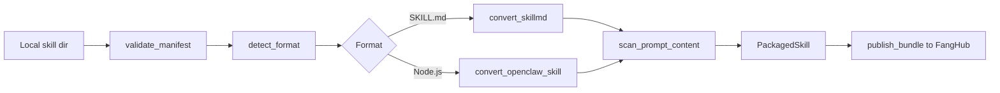

# Skills System

# Skills System

The Skills System (`librefang-skills`) provides a pluggable architecture for extending LibreFang agent capabilities. Skills are self-contained bundles that can define tools, inject prompt context, or execute code in sandboxed runtimes.

## Overview

Skills extend the agent by:

- **Providing tools** — Executable functions with JSON schemas that the LLM can call
- **Injecting prompt context** — Markdown content that augments the system prompt
- **Declaring requirements** — Built-in tools and host capabilities the skill depends on

A single skill can provide all three, or focus on just one (e.g., a prompt-only skill that teaches the LLM without adding executable tools).

## Skill Manifest Format

Every skill lives in a directory with a `skill.toml` manifest:

```toml
[skill]
name = "web-summarizer"
version = "0.1.0"
description = "Summarizes any web page into bullet points"
author = "librefang-community"
license = "MIT"
tags = ["web", "research"]

[runtime]
type = "python"
entry = "src/main.py"

[[tools.provided]]
name = "summarize_url"
description = "Fetch a URL and return a concise bullet-point summary"
input_schema = {
    type = "object",
    properties = { url = { type = "string" } },
    required = ["url"]
}

[requirements]
tools = ["web_fetch"]
capabilities = ["NetConnect(*)"]

[config]
apiKey = "sk-..."
custom_endpoint = "https://api.example.com"
```

The `[config]` section is arbitrary key-value pairs that skill authors define. LibreFang passes these to the skill at runtime, keeping them separate from the manifest metadata.

## Runtime Types

| Runtime | Execution Model | Use Case |
|---------|----------------|----------|
| `python` | Subprocess (`python3` / `python`) | Most community skills |
| `node` | Subprocess (`node`) | OpenClaw compatibility |
| `shell` | Subprocess (`bash` / `sh`) | System utilities |
| `wasm` | Sandboxed module | Future secure execution |
| `promptonly` | Injected into system prompt | Teaching the LLM without code |
| `builtin` | Handled by kernel | Core capabilities |

### Execution Flow

When a tool call arrives, the loader:

1. Validates the entry path stays within the skill directory (prevents path traversal)
2. Spawns the appropriate runtime subprocess
3. Passes the tool name and input as JSON via stdin
4. Isolates the environment (clears all env vars except `PATH`, `HOME`, platform essentials)
5. Returns stdout parsed as JSON



## Skill Sources

`SkillSource` tracks where each skill originated:

```rust
pub enum SkillSource {
    Native,                        // Built into LibreFang
    Local,                         // Workspace / manual install
    OpenClaw,                      // Converted from OpenClaw format
    ClawHub { slug, version },     // clawhub.ai marketplace
    Skillhub { slug, version },    // Skillhub marketplace
}
```

Provenance is recorded at install time and stored in `skill.toml` so the system can distinguish community skills from trusted built-ins.

## Marketplace Integration

The system integrates with three marketplace backends.

### ClawHub (`clawhub.rs`)

ClawHub (clawhub.ai) hosts 3,000+ community skills in both SKILL.md and package.json formats.

**API endpoints used:**

- `GET /api/v1/search?q=...&limit=N` — semantic search
- `GET /api/v1/skills?limit=N&sort=trending` — browse
- `GET /api/v1/skills/{slug}` — skill detail
- `GET /api/v1/download?slug=...` — download bundle
- `GET /api/v1/skills/{slug}/file?path=SKILL.md` — fetch specific file

**Rate limit handling:** The client implements exponential backoff with jitter for 429 and 5xx responses, respecting `Retry-After` headers when present. Maximum 5 attempts with a 30s cap.

```rust
// Example: Installing from ClawHub
let client = ClawHubClient::new(cache_dir);
let result = client.install("github-helper", target_dir).await?;
// Result includes: warnings, tool translations, is_prompt_only flag
```

### FangHub (`marketplace.rs`)

FangHub uses GitHub releases as its registry backend. Community skills live in the `librefang-skills` org, with each repo's latest release serving as the installable bundle.

```rust
// Search FangHub
let client = MarketplaceClient::new(MarketplaceConfig::default());
let results = client.search("social media tools").await?;

// Install from FangHub
let version = client.install("twitter-skill", target_dir).await?;
```

### Skillhub (`skillhub.rs`)

Skillhub is an alternative registry with its own API, providing browse/search/install operations similar to ClawHub.

## OpenClaw Compatibility

OpenClaw skills come in two formats that LibreFang converts automatically.

### SKILL.md (Prompt-Only)

SKILL.md is a Markdown file with YAML frontmatter:

```markdown
---
name: GitHub Helper
description: Interact with GitHub repositories
metadata:
  openclaw:
    commands:
      - name: create_pr
        description: Create a pull request
      - name: review_code
        description: Review code changes
---
# GitHub Helper

You are an expert at navigating GitHub. When the user mentions a repository,
use the `create_pr` or `review_code` tools to help them.

[Additional LLM guidance...]
```

The `convert_skillmd()` function:
1. Parses YAML frontmatter for command definitions
2. Maps OpenClaw tool names to LibreFang equivalents via `tool_compat`
3. Stores the Markdown body as `prompt_context`
4. Generates a `skill.toml` manifest

### package.json (Executable)

OpenClaw Node.js skills have `package.json` + `index.js` (or `dist/index.js` for compiled TypeScript). The manifest is extracted from package.json fields and the `openclaw` metadata block if present.

## Security Model

The skills system implements multiple layers of defense against malicious or poorly-written skills.

### Path Traversal Prevention

All file paths are validated to stay within the skill directory before any filesystem access:

```rust
fn validate_script_path(skill_dir: &Path, entry: &str) -> Result<PathBuf, SkillError> {
    let script_path = skill_dir.join(entry);
    let canonical_dir = skill_dir.canonicalize()?;
    let canonical_script = script_path.canonicalize()?;

    if !canonical_script.starts_with(&canonical_dir) {
        return Err(SkillError::ExecutionFailed(
            "Script path escapes skill directory".into()
        ));
    }
    Ok(canonical_script)
}
```

This blocks:
- `../etc/passwd` style traversal
- Symlinks pointing outside the skill directory
- Absolute paths

### Environment Isolation

Subprocess execution clears the environment before spawning:

```rust
cmd.env_clear();
cmd.env("PATH", path);           // Binary resolution
cmd.env("HOME", home);           // User directory
cmd.env("PYTHONIOENCODING", "utf-8");  // Output encoding
```

No API keys, tokens, or credentials leak into skill subprocesses.

### Prompt Injection Scanning

Before installing prompt-only skills, the verifier scans for prompt injection patterns:

```rust
pub fn scan_prompt_content(content: &str) -> Vec<SkillWarning> {
    // Detects known injection patterns
    // Returns warnings with severity: Info, Warning, Critical
}
```

Skills with **Critical** severity warnings are blocked entirely. The install is aborted and the skill directory is cleaned up.

### Binary Dependency Checking

When installing SKILL.md skills that declare required binaries, the system checks `PATH`:

```rust
fn which_check(name: &str) -> Option<PathBuf> {
    std::process::Command::new("which").arg(name).output()
}
```

Missing binaries generate **Warning**-level alerts but don't block installation.

## Registry

The `SkillRegistry` manages installed skills across multiple directories:

```rust
pub struct SkillRegistry {
    manifest_dirs: Vec<PathBuf>,
    frozen: HashMap<PathBuf, InstalledSkill>,
}
```

Key operations:

- **`load_all()`** — Scans all manifest directories, loads manifests, runs prompt content scan
- **`get(name)`** — Looks up a skill by name, checking frozen cache first
- **`list()`** — Returns all enabled skills with their manifests
- **`all_tool_definitions()`** — Aggregates tools from all enabled skills

Workspace skills (in the current project) are loaded separately via `load_workspace_skills()` with a different priority than installed skills.

## Publishing Skills

The publish pipeline prepares and uploads skill bundles:



```rust
// Example: Publishing a skill
let pkg = prepare_local_skill(skill_dir).await?;
let release = client.publish_bundle(MarketplacePublishRequest {
    repo: "librefang-skills/my-skill",
    tag: "v1.0.0",
    bundle_path: &pkg.bundle_path,
    release_name: "My Skill v1.0.0",
    release_notes: "...",
    token: github_token,
}).await?;
```

## Integration Points

The skills system connects to several other LibreFang components:

| Caller | Function Used | Purpose |
|--------|---------------|---------|
| `tool_runner.rs` | `find_tool_provider()` | Route tool calls to skills |
| `tool_runner.rs` | `execute_skill_tool()` | Invoke skill tools |
| `main.rs` CLI | `install()`, `search()`, `publish()` | User-facing commands |
| `routes/skills.rs` | Marketplace clients | Web UI integration |
| `event.rs` | `skill_names()` | TUI skill listing |

The HTTP client builder (`http_client.rs`) uses `rustls` with platform-native certificate store (falling back to webpki roots) for TLS verification across all marketplace clients.

## Error Handling

All errors flow through `SkillError`:

```rust
pub enum SkillError {
    NotFound(String),
    InvalidManifest(String),
    AlreadyInstalled(String),
    RuntimeNotAvailable(String),
    ExecutionFailed(String),
    Io(std::io::Error),
    Network(String),
    RateLimited(String),       // ClawHub-specific
    TomlParse(toml::de::Error),
    YamlParse(String),
    SecurityBlocked(String),   // Prompt injection detected
}
```

`RateLimited` and `SecurityBlocked` are particularly important for user feedback — `RateLimited` includes a human-readable message asking the user to wait, while `SecurityBlocked` surfaces the specific injection pattern that was detected.