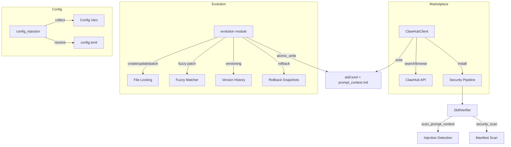

# Skills System

# Skills System

The skills system provides a complete lifecycle for agent capabilities: discovery and installation from the ClawHub marketplace, agent-driven self-evolution (create, patch, update, rollback), configuration injection into system prompts, and a multi-layer security pipeline that validates every mutation.

## Architecture



## Key Types

All core types live in `librefang-skills/src/lib.rs` and are referenced throughout the module:

| Type | Purpose |
|------|---------|
| `SkillManifest` | Root TOML manifest (`skill.toml`) defining name, version, runtime, tools, config vars |
| `InstalledSkill` | A loaded skill with its manifest, filesystem path, and enabled state |
| `SkillMeta` | Skill identity: name, version, description, author, license, tags |
| `SkillRuntimeConfig` | Runtime type (`PromptOnly` or `Shell`) plus entry point |
| `SkillConfigVar` | A declared config variable with key, description, and optional default |
| `SkillSource` | Origin: `Local`, `Native`, `ClawHub`, `Skillhub`, `OpenClaw` |
| `SkillError` | Error enum: `Network`, `Io`, `InvalidManifest`, `SecurityBlocked`, `NotFound`, `AlreadyInstalled`, `RateLimited` |

## ClawHub Marketplace Client

`ClawHubClient` interacts with the [ClawHub API](https://clawhub.ai/api/v1/) to search, browse, and install community skills.

### Construction

```rust
// Default client — points to https://clawhub.ai/api/v1
let client = ClawHubClient::new(cache_dir.into());

// Custom endpoint (used for regional mirrors like cn.clawhub.ai)
let client = ClawHubClient::with_url("https://cn.clawhub.ai/api/v1", cache_dir.into());
```

Set `LIBREFANG_DANGEROUSLY_SKIP_TLS_VERIFICATION=true` or `1` to disable TLS verification for servers with expired certificates. Only use this in testing.

### API Methods

| Method | Endpoint | Returns |
|--------|----------|---------|
| `search(query, limit)` | `GET /api/v1/search?q=...&limit=N` | `ClawHubSearchResponse` (key: `results`) |
| `browse(sort, limit, cursor)` | `GET /api/v1/skills?limit=N&sort=trending` | `ClawHubBrowseResponse` (key: `items`, paginated via `next_cursor`) |
| `get_skill(slug)` | `GET /api/v1/skills/{slug}` | `ClawHubSkillDetail` (includes `expected_sha256` for checksum validation) |
| `get_file(slug, path)` | `GET /api/v1/skills/{slug}/file?path=SKILL.md` | Raw file content as `String` |
| `install(slug, target_dir)` | Downloads and installs a skill | `ClawHubInstallResult` |
| `install_from_bytes(slug, target_dir, bytes)` | Installs from raw bytes (no checksum) | `ClawHubInstallResult` |
| `is_installed(slug, skills_dir)` | Checks if skill exists locally | `bool` |
| `entry_version(entry)` | Extracts version from a browse entry | `&str` |

Sort orders: `ClawHubSort::Trending`, `Updated`, `Downloads`, `Stars`, `Rating`.

### Retry and Rate Limiting

All HTTP requests go through `get_with_retry`, which handles 429 and 5xx responses with exponential backoff:

- **Max retries**: 5 (including first attempt)
- **Base delay**: 1.5s, doubling per attempt, capped at 30s
- **Jitter**: 0–25% randomization using system clock nanos
- **Retry-After header**: Respected when present, capped at 30s

After exhausting retries on a 429, the client returns `SkillError::RateLimited` with a human-readable message.

### Installation Pipeline

`install` and `install_with_expected_sha256` execute this sequence:

1. **Fetch detail** — retrieves `expected_sha256` from the registry (best-effort; proceeds without it if unavailable)
2. **Checksum validation** — computed SHA256 of downloaded bytes compared against registry hash. Mismatch returns `SkillError::SecurityBlocked` immediately, before any files are written
3. **Detect format** — SKILL.md (YAML front matter starting with `---`), zip archive (magic bytes `PK`), or package.json
4. **Extract** — zip entries are extracted with path-traversal protection via `resolve_skill_child_path`; SKILL.md/package.json saved directly
5. **Convert** — SKILL.md converted via `openclaw_compat::convert_skillmd`, package.json via `openclaw_compat::convert_openclaw_skill`
6. **Security scan** — `SkillVerifier::scan_prompt_content` checks for prompt injection (critical findings block installation); `SkillVerifier::security_scan` audits the manifest
7. **Binary dependency check** — `which_check` verifies required binaries exist on `PATH`
8. **Atomic promotion** — content is staged in a `.staging-{slug}-{pid}-{counter}` directory, then `rename()`d to the final location. This prevents partial installs from loading on daemon restart

Staging directory names use a process-local `AtomicU64` counter (not just nanosecond timestamps) to guarantee uniqueness even when two threads race within OS clock resolution.

### Slug Validation

`validate_slug` rejects empty slugs and any slug containing characters outside `[a-zA-Z0-9-_]`. This is applied to all API methods that take a slug parameter.

### Path Safety

`resolve_skill_child_path` rejects:
- Absolute paths
- Path components other than `Component::Normal` (blocks `..`, device namespaces, etc.)

This is applied to both zip extraction and direct file writes.

## Skill Evolution

The evolution module (`evolution.rs`) enables agents to create, modify, and delete PromptOnly skills autonomously. Every mutation goes through security scanning, version tracking, and atomic filesystem writes.

### Core Operations

| Function | Purpose | Version Bump |
|----------|---------|--------------|
| `create_skill` | Create a new PromptOnly skill | Initial `0.1.0` |
| `update_skill` | Full rewrite of `prompt_context.md` | Patch (`0.1.0` → `0.1.1`) |
| `patch_skill` | Fuzzy find-and-replace on prompt context | Patch |
| `rollback_skill` | Revert to previous version snapshot | Patch |
| `delete_skill` | Remove a local/agent-evolved skill | N/A |
| `uninstall_skill` | Remove any installed skill (user-initiated) | N/A |

All operations return `EvolutionResult` with post-operation counters (`evolution_count`, `mutation_count`, `use_count`) so callers can report state without a second disk read.

### Concurrency: File Locking

Every mutation acquires an exclusive file lock before touching the filesystem:

```
{skills_dir}/.evolution-locks/{skill_name}.lock
```

Lock files live **outside** the skill directory so that `delete_skill` can hold the lock across `remove_dir_all` (on Windows, open file handles inside the directory would block deletion). Locking uses `fs2::FileExt::lock_exclusive()` — `flock` on Unix, `LockFileEx` on Windows.

Under the lock, operations re-read `skill.toml` from disk to get the current version, preventing concurrent writers from producing duplicate version numbers.

### Atomic Writes

All file mutations use `atomic_write`, which writes to a temp file and renames:

```rust
fn atomic_write(path: &Path, content: &str) -> Result<(), SkillError>
```

Temp file names encode the process ID, thread ID, a monotonic `AtomicU64` counter, and a nanosecond timestamp to avoid collisions across threads and processes.

### Fuzzy Matching for Patches

`fuzzy_find_and_replace` applies a 6-strategy cascade, from strictest to most lenient:

1. **Exact** — literal substring match
2. **LineTrimmed** — trim leading/trailing whitespace per line
3. **WhitespaceNormalized** — collapse whitespace runs to single space
4. **IndentFlexible** — strip all leading whitespace per line
5. **BlockAnchor** — match first and last lines exactly, verify middle ≥60% similar (lowered to ≥50% for the first candidate)
6. **WhitespaceStripped** — remove all whitespace on both sides, substring match. Includes a 3-character minimum guard to prevent short English words from matching spuriously (e.g., "a" inside "banana"). Designed primarily for CJK content where inter-character spaces carry no semantic meaning

When `replace_all=false` and multiple matches are found, the function returns `SkillError::InvalidManifest` with the match count so the agent can decide whether to widen context or set `replace_all=true`.

On complete failure, `closest_lines` surfaces the top 3 most similar lines in the content (Jaccard similarity on character sets, threshold >0.3) as "did you mean?" hints in the error message.

`old_str` must be non-empty — an empty pattern would match at every character boundary and corrupt the content.

### Version Management

Version history is stored in `.evolution.json` alongside `skill.toml`:

```rust
struct SkillEvolutionMeta {
    versions: Vec<SkillVersionEntry>,  // newest last, capped at 10
    use_count: u64,                     // successful invocations
    evolution_count: u64,               // total entries written (including create)
    mutation_count: u64,                // post-create mutations only
}
```

- `evolution_count` bumps on every `record_version` call (including initial creation)
- `mutation_count` bumps only on post-create edits (update, patch, rollback)
- A freshly created skill reports `mutation_count = 0`
- Version strings are bumped using `semver::Version::parse` with a fallback for non-standard formats

Rollback snapshots are stored in `.rollback/` with nanosecond-precision filenames:

```
prompt_context_20260401_143052_042157823_12345.md
```

Older snapshots beyond the 10-entry cap are pruned automatically.

### Supporting Files

Skills can maintain auxiliary files in four whitelisted subdirectories: `references/`, `templates/`, `scripts/`, `assets/`.

| Function | Purpose |
|----------|---------|
| `write_supporting_file(skill, rel_path, content)` | Write a file (max 1 MiB), with security scan and path containment check |
| `remove_supporting_file(skill, rel_path)` | Delete a file and prune empty ancestor directories |
| `list_supporting_files(skill)` | Recursively list all supporting files, keyed by subdirectory |

Path validation rejects absolute paths, `..` traversal, and any path not rooted in one of the four allowed subdirectories. Symlinks are not followed during recursive walks (bounded to 16 levels deep).

Both write and remove operations acquire the per-skill lock and perform a `canonicalize`-based containment check to detect symlink-based escape attempts.

### `delete_skill` vs `uninstall_skill`

- `delete_skill` — agent-facing. Refuses to delete non-local skills (checks `manifest.source`). Rejects manifests with no `source` field. Missing manifests (orphaned scaffolding) are allowed.
- `uninstall_skill` — user-facing (dashboard, CLI). Removes any skill regardless of source. Still acquires the lock and checks existence under it.

Both reject path-traversal attempts in the skill name.

## Config Injection

The config injection module (`config_injection.rs`) resolves skill-declared configuration variables and formats them for system prompt injection.

### Declaration

Skills declare config variables in `skill.toml`:

```toml
[[config_vars]]
key = "wiki.base_url"
description = "Base URL of the internal wiki"
default = "https://wiki.example.com"

[[config_vars]]
key = "api.timeout"
description = "Request timeout in seconds"
```

### Storage Convention

In `~/.librefang/config.toml`, values live under `skills.config`:

```toml
[skills.config.wiki]
base_url = "https://wiki.corp.example.com"

[skills.config.api]
timeout = 30
```

The logical dotted key `wiki.base_url` resolves by walking `skills` → `config` → `wiki` → `base_url` in the TOML tree.

### Resolution Pipeline

1. **`collect_config_vars(skills)`** — Gathers declarations from enabled skills, deduplicating by key (first declaration wins). Skips entries with empty keys or descriptions.
2. **`resolve_config_vars(vars, config_toml)`** — Walks the dotted path for each variable. Empty config values fall back to the declared default. Variables with neither a config value nor a default are omitted entirely.
3. **`format_config_section(resolved)`** — Formats as:

```
## Skill Config Variables
wiki.base_url = https://wiki.corp.example.com
api.timeout = 30
```

Returns an empty string when no variables resolve, so callers can skip injection with an `is_empty()` guard.

## Security Pipeline

Security scanning runs at two critical points:

### During ClawHub Install

1. **SHA256 checksum** — validated against registry-provided hash before extraction
2. **Prompt injection scan** — `SkillVerifier::scan_prompt_content` on prompt context; critical findings block installation
3. **Manifest scan** — `SkillVerifier::security_scan` on the converted manifest
4. **Binary dependency check** — warns (does not block) if declared binaries are missing

### During Evolution

1. **`validate_prompt_content`** — enforces the 160,000 character limit (≈55k tokens) and runs `scan_prompt_content`; critical findings block the mutation
2. **Supporting file writes** — scanned before writing; blocked content is never written to disk
3. **Supporting file removes** — `canonicalize`-based containment check prevents symlink escapes

## Error Handling

`SkillError` is the unified error type:

| Variant | When |
|---------|------|
| `Network(msg)` | HTTP failures, parse errors, retries exhausted |
| `RateLimited(msg)` | 429 after all retries (includes guidance to wait and retry) |
| `Io(err)` | Filesystem errors during install, evolution, or atomic writes |
| `InvalidManifest(msg)` | Malformed TOML, missing fields, invalid names, fuzzy match failures |
| `SecurityBlocked(msg)` | Checksum mismatches, prompt injection detection, unauthorized deletes |
| `NotFound(msg)` | Skill or file doesn't exist |
| `AlreadyInstalled(name)` | Attempting to create a skill that already exists |

All error messages are designed to be actionable — fuzzy match failures include closest-line hints, rate limit errors include retry guidance, and multi-match errors tell the agent to set `replace_all=true` or provide more context.