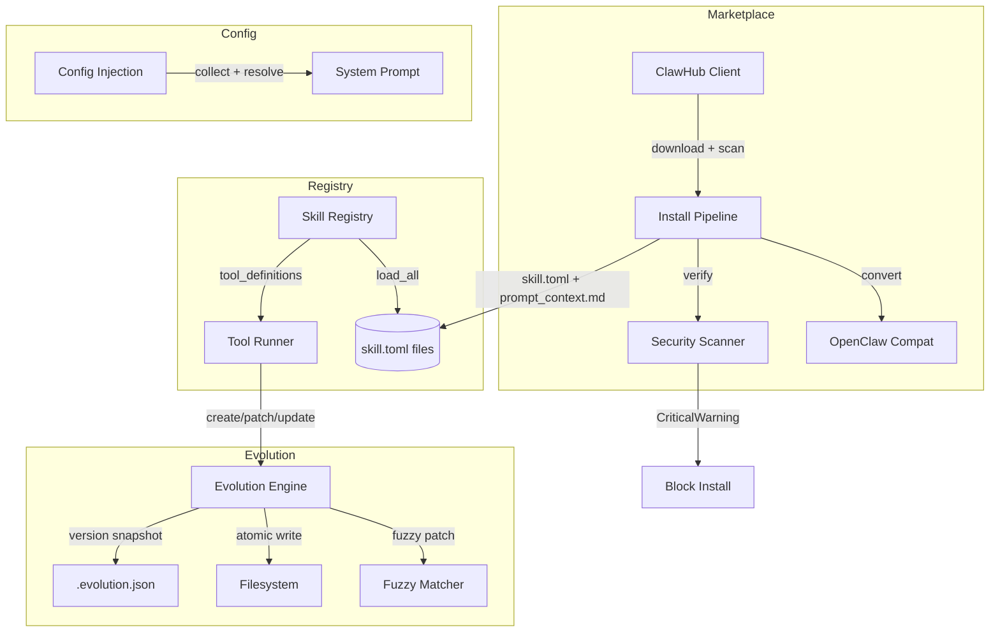

# Skills System

# Skills System

## Overview

The Skills System (`librefang-skills`) manages the full lifecycle of agent skills: discovery, installation, execution, self-evolution, and deletion. A **skill** is a self-contained unit of capability — typically a prompt template or a set of tool definitions — that teaches an agent how to approach a class of tasks.

The module handles three major concerns:

- **Marketplace integration** — search, browse, download, and install community skills from ClawHub
- **Skill evolution** — let agents autonomously create, patch, and refine their own skills with versioned rollback
- **Configuration injection** — declare and resolve skill-specific config variables into system prompts



## Skill Format

Every installed skill is a directory containing at minimum a `skill.toml` manifest. Prompt-only skills also carry a `prompt_context.md` file with their instruction template.

### Manifest (`skill.toml`)

```toml
[skill]
name = "wiki-helper"
version = "0.1.0"
description = "Integrate with an internal wiki"
author = "agent-evolved"
tags = ["research", "wiki"]

[runtime]
runtime_type = "PromptOnly"
entry = ""

[[tools]]
name = "wiki_search"
description = "Search the wiki for a topic"

[[config_vars]]
key = "wiki.base_url"
description = "Base URL of the internal wiki"
default = "https://wiki.example.com"
```

Key fields:

| Field | Purpose |
|---|---|
| `skill.name` | Lowercase alphanumeric + hyphens/underscores, max 64 chars |
| `runtime.runtime_type` | `PromptOnly` or `NodeJs` — determines execution model |
| `tools[]` | Tool definitions exposed to the agent when this skill is active |
| `config_vars[]` | Declared config keys the skill depends on |
| `source` | Origin: `Local`, `Native`, `ClawHub`, `OpenClaw` — controls deletion permissions |

### Source Formats

The install pipeline accepts three formats and converts them to `skill.toml`:

1. **SKILL.md** — Prompt-only format with YAML front matter. Detected by leading `---`. Converted by `openclaw_compat::convert_skillmd`.
2. **package.json** — Node.js skill packages with OpenClaw metadata. Detected by `openclaw_compat::detect_openclaw_skill`. Converted by `openclaw_compat::convert_openclaw_skill`.
3. **skill.toml** — Native LibreFang manifest. Used directly.

## ClawHub Marketplace Client

`ClawHubClient` (`clawhub.rs`) connects to the ClawHub API at `https://clawhub.ai/api/v1`. It handles search, browse, detail lookup, file fetching, and full skill installation.

### API Endpoints

| Method | Endpoint | Returns |
|---|---|---|
| `search()` | `GET /api/v1/search?q=...&limit=N` | `ClawHubSearchResponse` (key: `results`) |
| `browse()` | `GET /api/v1/skills?limit=N&sort=...` | `ClawHubBrowseResponse` (key: `items`) |
| `get_skill()` | `GET /api/v1/skills/{slug}` | `ClawHubSkillDetail` |
| `get_file()` | `GET /api/v1/skills/{slug}/file?path=...` | Raw file text |
| `install()` | `GET /api/v1/download?slug=...` | Downloads zip/SKILL.md |

### Sort Orders

`ClawHubSort` enum: `Trending`, `Updated`, `Downloads`, `Stars`, `Rating`.

### Retry Behavior

All HTTP requests use `get_with_retry()` with:
- Up to **5 attempts** on 429 (rate-limit) and 5xx (server error) responses
- Exponential backoff starting at 1.5s, capped at 30s
- Jitter (0–25%) to avoid thundering herd
- `Retry-After` header respected when present

### Installation Pipeline

`install()` and `install_from_bytes()` execute a seven-step pipeline:

1. **SHA256 hash** of downloaded content for audit
2. **Format detection** — SKILL.md front matter, zip magic bytes (`PK`), or fallback to `package.json`
3. **Zip extraction** — all entries extracted with path-traversal protection via `resolve_skill_child_path()`
4. **Format conversion** — SKILL.md or OpenClaw format converted to native `SkillManifest`
5. **Manifest security scan** — `SkillVerifier::security_scan()` checks for dangerous patterns
6. **Prompt injection scan** — `SkillVerifier::scan_prompt_content()` blocks critical-severity injection patterns; installation is aborted and the skill directory is cleaned up
7. **Binary dependency check** — warns if declared binaries are missing from `PATH`

The result is a `ClawHubInstallResult` containing the skill name, version, any warnings, tool name translations (OpenClaw → LibreFang naming), and whether the skill is prompt-only.

### Path Safety

All file paths are validated by `resolve_skill_child_path()`, which rejects:
- Absolute paths
- `..` components (path traversal)
- Any component that is not `Component::Normal`

Slug validation (`validate_slug`) restricts characters to ASCII alphanumeric, `-`, and `_`.

### TLS Configuration

Set the environment variable `LIBREFANG_DANGEROUSLY_SKIP_TLS_VERIFICATION=true` or `1` to disable TLS certificate verification (testing only).

## Skill Evolution

The evolution module (`evolution.rs`) lets agents create and refine skills from their execution experience. Every mutation is versioned, security-scanned, and protected by file locks.

### Core Operations

| Function | Purpose | Version Bump |
|---|---|---|
| `create_skill()` | Create a new PromptOnly skill | Initial `0.1.0` |
| `update_skill()` | Full rewrite of `prompt_context.md` | Patch bump |
| `patch_skill()` | Fuzzy find-and-replace on prompt content | Patch bump |
| `rollback_skill()` | Revert to previous version snapshot | Patch bump |
| `delete_skill()` | Remove agent-created skills only | — |
| `uninstall_skill()` | Remove any installed skill | — |
| `write_supporting_file()` | Add files to `references/`, `templates/`, `scripts/`, `assets/` | — |
| `remove_supporting_file()` | Remove supporting files | — |
| `record_skill_usage()` | Increment use counter in `.evolution.json` | — |

All operations return `EvolutionResult` with post-operation counters (`evolution_count`, `mutation_count`, `use_count`) so callers don't need a separate metadata read.

### Fuzzy Patching

`patch_skill()` uses a 6-strategy fuzzy matcher (`fuzzy_find_and_replace`) to tolerate LLM formatting variance. Strategies are tried in order from strict to loose:

1. **Exact** — literal substring match
2. **LineTrimmed** — each line trimmed of leading/trailing whitespace
3. **WhitespaceNormalized** — whitespace runs collapsed to single space
4. **IndentFlexible** — all leading whitespace stripped
5. **BlockAnchor** — match first + last lines, require ≥50% middle similarity
6. **WhitespaceStripped** — all whitespace removed from both sides; substring match. Last resort for CJK content where inter-character spaces carry no semantic meaning. Requires ≥3 characters to avoid false positives on short English fragments.

If all strategies fail, the error message includes the closest matching lines from the content as a hint for the next patch attempt.

When `replace_all` is `false` and multiple matches are found, the operation fails with an error asking for more context — this prevents accidental bulk replacement.

### Version History

Each skill maintains a `.evolution.json` file alongside `skill.toml`:

```json
{
  "versions": [
    {
      "version": "0.1.2",
      "timestamp": "2026-03-15T10:30:00+00:00",
      "changelog": "Improved analysis section [strategy: Exact, matches: 1]",
      "content_hash": "sha256:...",
      "author": "agent:abc-123"
    }
  ],
  "use_count": 42,
  "evolution_count": 4,
  "mutation_count": 3
}
```

- **`evolution_count`** — total version entries written (including initial creation)
- **`mutation_count`** — changes after creation (update/patch/rollback)
- **`use_count`** — incremented by `record_skill_usage()` after successful tool invocations
- **`author`** — tracks mutation origin: `"agent:<id>"`, `"cli"`, `"dashboard"`, `"reviewer"`

History is capped at 10 entries (`MAX_VERSION_HISTORY`). Rollback snapshots are stored in `.rollback/` with nanosecond-precision filenames to avoid collisions.

### Deletion Safety

Two deletion paths exist:

- **`delete_skill()`** — agent-facing. Only removes skills with `source = "Local"` or `source = "Native"`. Refuses to delete marketplace/bundled skills or skills without a `source` field.
- **`uninstall_skill()`** — user-facing (CLI/dashboard). Removes any skill regardless of source.

Both acquire the per-skill lock before deletion and re-check existence under the lock to prevent TOCTOU races.

### Supporting Files

Agents can write supporting files to four allowed subdirectories: `references/`, `templates/`, `scripts/`, `assets/`. Files are capped at 1 MiB (`MAX_SUPPORTING_FILE_SIZE`). Path traversal and symlink-escape attacks are blocked by canonical-path containment checks. Empty parent directories are cleaned up on removal. Directory walking is bounded to 16 levels deep (`SUPPORTING_FILE_MAX_DEPTH`).

### Concurrency Model

All evolution operations use **per-skill file locks** via `fs2::FileExt::lock_exclusive()`:

- Lock files live at `{skills_dir}/.evolution-locks/{name}.lock` — outside the skill directory so they survive `remove_dir_all()` on Windows.
- Locks are acquired **before** any filesystem work, including directory existence checks.
- All mutations read the live on-disk state under the lock (re-reading `skill.toml` for version, re-reading `prompt_context.md` for current content) to avoid stale-snapshot bugs under concurrent writers.

All file writes use **atomic write** (`atomic_write()`): content is written to a temp file with pid + thread-id + monotonic-counter + nanosecond naming, then renamed. A global `AtomicU64` counter prevents same-process temp-file collisions even without the per-skill lock.

## Config Injection

The config injection module (`config_injection.rs`) resolves skill-declared configuration variables into system prompt sections.

### Declaration

Skills declare variables in `skill.toml`:

```toml
[[config_vars]]
key = "wiki.base_url"
description = "Base URL of the internal wiki"
default = "https://wiki.example.com"
```

### Resolution

1. `collect_config_vars()` gathers declarations from all enabled skills, deduplicating by key (first declaration wins).
2. `resolve_config_vars()` looks up each key in the user's `~/.librefang/config.toml` under `skills.config.<key>`. For example, `wiki.base_url` resolves from:
   ```toml
   [skills.config.wiki]
   base_url = "https://wiki.corp.example.com"
   ```
3. Empty config values fall back to the declared `default`. Variables with neither value nor default are omitted.
4. `format_config_section()` produces a prompt section:
   ```
   ## Skill Config Variables
   wiki.base_url = https://wiki.corp.example.com
   db.host = localhost
   ```

Incomplete declarations (empty key or description) are silently skipped.

## Security Pipeline

The `verify` module provides two scanning functions:

- **`SkillVerifier::security_scan(manifest)`** — inspects the manifest structure for dangerous configurations
- **`SkillVerifier::scan_prompt_content(content)`** — detects prompt injection patterns in skill instructions

Scanning runs at two points:
1. **Installation time** — during `install_from_bytes()`, both manifest and prompt content are scanned. Critical-severity warnings block installation and clean up the partially-created skill directory.
2. **Evolution time** — `validate_prompt_content()` scans all new/patched prompt content before writing. Critical warnings block the mutation.

Content size is also enforced: prompt context is capped at 160,000 characters (~55k tokens).

## Tool Runner Integration

The runtime layer (`librefang-runtime/src/tool_runner.rs`) exposes evolution operations as agent tools:

- `tool_skill_evolve_create` → `create_skill()`
- `tool_skill_evolve_update` → `update_skill()`
- `tool_skill_evolve_patch` → `patch_skill()`
- `tool_skill_evolve_rollback` → `rollback_skill()`
- `tool_skill_evolve_delete` → `delete_skill()`
- `tool_skill_evolve_write_file` → `write_supporting_file()`
- `tool_skill_evolve_remove_file` → `remove_supporting_file()`
- `tool_skill_read_file` → reads file + `record_skill_usage()`
- `execute_tool_raw` → `record_skill_usage()` on every skill tool invocation

The tool runner checks `is_frozen()` on the registry before allowing any mutations. The CLI's `cmd_doctor` command also runs `scan_prompt_content()` across all installed skills for proactive auditing.

## Error Handling

All functions return `Result<_, SkillError>` where `SkillError` variants include:

| Variant | Meaning |
|---|---|
| `Network(msg)` | HTTP failure after all retries |
| `RateLimited(msg)` | 429 after 5 attempts |
| `InvalidManifest(msg)` | Parse error, validation failure, or fuzzy-match failure |
| `SecurityBlocked(msg)` | Prompt injection detected or deletion of non-local skill |
| `AlreadyInstalled(name)` | Skill directory already exists |
| `NotFound(name)` | Skill or file not found |
| `Io(err)` | Filesystem error |