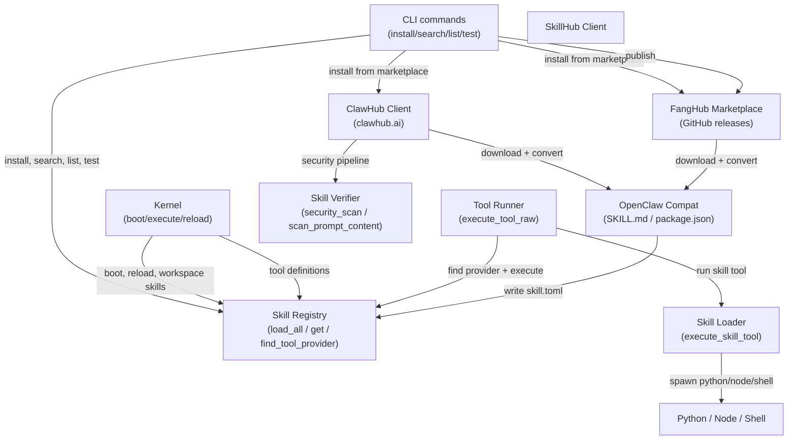

# Skills System

# Skills System (`librefang-skills`)

## Overview

The skills system is LibreFang's pluggable extension mechanism. Skills are self-contained tool bundles that extend agent capabilities — they can provide new tools for the LLM to call, inject context into the system prompt, or both.

Skills come from multiple sources and runtimes:

| Runtime | Description |
|---------|-------------|
| `PromptOnly` | Markdown body injected into the LLM system prompt — no executable code |
| `Python` | Python script executed in a subprocess |
| `Shell` | Bash/sh script executed in a subprocess |
| `Node` | Node.js module (OpenClaw compatibility) |
| `Wasm` | WASM sandbox module (not yet implemented) |
| `Builtin` | Compiled into the binary, handled by the kernel |

| Source | Description |
|--------|-------------|
| `Native` | Built into LibreFang |
| `Local` | User-created workspace skill |
| `OpenClaw` | Converted from OpenClaw format |
| `ClawHub` | Downloaded from clawhub.ai marketplace |
| `Skillhub` | Downloaded from Skillhub marketplace |

## Architecture



## Skill Manifest (`skill.toml`)

Every skill is defined by a `skill.toml` manifest in its directory. The manifest declares metadata, runtime configuration, provided tools, and requirements.

```toml
[skill]
name = "web-summarizer"
version = "0.1.0"
description = "Summarizes any web page into bullet points"
author = "librefang-community"
license = "MIT"
tags = ["web", "summarizer", "research"]

[runtime]
type = "python"          # python | wasm | node | shell | builtin | promptonly
entry = "src/main.py"    # relative to skill directory

[[tools.provided]]
name = "summarize_url"
description = "Fetch a URL and return a concise bullet-point summary"
input_schema = { type = "object", properties = { url = { type = "string" } }, required = ["url"] }

[requirements]
tools = ["web_fetch"]
capabilities = ["NetConnect(*)"]

[config]                  # arbitrary user-defined keys passed to skill at runtime
apiKey = "sk-..."
max_retries = 3
```

Key manifest types (from `lib.rs`):

- **`SkillManifest`** — Top-level struct. Contains `skill` (metadata), `runtime` (type + entry point), `tools` (provided tool definitions), `requirements`, `prompt_context`, `source`, and `config`.
- **`SkillMeta`** — Name, version (defaults to `"0.1.0"`), description, author, license, tags.
- **`SkillRuntimeConfig`** — Runtime type and entry file path.
- **`SkillToolDef`** — Tool name, description, and JSON Schema for inputs.
- **`SkillRequirements`** — Declared dependencies on built-in tools and host capabilities.
- **`SkillSource`** — Provenance tracking (Native, Local, OpenClaw, ClawHub, Skillhub).

The `config` field is a `HashMap<String, serde_json::Value>` that round-trips through TOML serialization, so skill authors can store arbitrary configuration without schema changes.

## Module Breakdown

### Registry (`registry`)

The `SkillRegistry` manages installed skills on disk. It handles:

- **`load_all(skills_dir)`** — Scans a directory for skill subdirectories, parsing each `skill.toml`.
- **`load_skill(dir)`** — Loads a single skill from a directory.
- **`get(name)` / `find_tool_provider(tool_name)`** — Lookup by skill name or by tool name.
- **`list()`** — Returns all installed skills.
- **`remove(name)`** — Uninstalls a skill.
- **`tool_definitions_for_skills()`** — Collects tool definitions from all enabled skills for LLM tool-use.
- **`load_workspace_skills()`** — Discovers and converts SKILL.md files in the workspace `.librefang/skills/` directory, running prompt injection scans on them.

The kernel calls `load_all` at boot, `load_workspace_skills` when building agent context, and `freeze` to persist registry state.

### Loader (`loader`)

The loader dispatches tool execution to the appropriate runtime via `execute_skill_tool(manifest, skill_dir, tool_name, input)`.

**Subprocess runtimes** (Python, Node, Shell) all follow the same pattern:

1. **Path validation** — `validate_script_path` canonicalizes the entry path and verifies it stays within the skill directory, blocking `../` traversal and symlink escapes.
2. **Environment isolation** — The subprocess environment is cleared (`env_clear()`) and only `PATH`, `HOME`, and platform essentials are forwarded. This prevents API keys and credentials from leaking to third-party skill code.
3. **Input via stdin** — Tool name, input JSON, and optional config are serialized as JSON and written to the child's stdin.
4. **Output parsing** — Stdout is parsed as JSON. If parsing fails, the raw stdout is wrapped in `{"result": "..."}`.

Shell skills have a 120-second timeout. Python skills set `PYTHONIOENCODING=utf-8`.

**`PromptOnly`** runtime returns a note directing the LLM to use built-in tools; the actual instructions are already in the system prompt via `prompt_context`.

**Wasm** and **Builtin** are stubbed — Wasm is not yet implemented, and Builtin skills are handled directly by the kernel.

### OpenClaw Compatibility (`openclaw_compat`)

Converts two OpenClaw skill formats into LibreFang manifests:

**SKILL.md format** (prompt-only):
- YAML frontmatter between `---` delimiters contains name, description, and optional `metadata.openclaw` with commands and requirements.
- The Markdown body becomes `prompt_context`, injected into the LLM system prompt.
- Commands are translated to LibreFang tool names via `tool_compat::map_tool_name`. For example, OpenClaw's `Read` maps to LibreFang's `file_read`.
- Detects required binaries and environment variables from the `requires` block.

**package.json format** (Node.js):
- Requires `package.json` plus one of `index.js`, `index.ts`, or `dist/index.js`.
- Reads name, version, description from `package.json`.
- If the package has an `openclaw.tools` array, those are converted to `SkillToolDef`s.
- Runtime is set to `Node`.

Key functions:
- `detect_skillmd(dir)` / `detect_openclaw_skill(dir)` — Format detection.
- `convert_skillmd(dir)` / `convert_skillmd_str(name, content)` — SKILL.md conversion (file-based and in-memory).
- `convert_openclaw_skill(dir)` — package.json conversion.
- `write_librefang_manifest(dir, manifest)` — Writes the resulting `skill.toml`.
- `write_prompt_context(dir, content)` — Writes `prompt_context.md`.

### ClawHub Client (`clawhub`)

HTTP client for the [ClawHub marketplace](https://clawhub.ai/api/v1/), which hosts 3,000+ community skills in SKILL.md and package.json formats.

**API endpoints:**
| Method | Endpoint | Description |
|--------|----------|-------------|
| GET | `/api/v1/search?q=...&limit=N` | Semantic search |
| GET | `/api/v1/skills?limit=N&sort=trending` | Browse (paginated via cursor) |
| GET | `/api/v1/skills/{slug}` | Skill detail |
| GET | `/api/v1/skills/{slug}/file?path=SKILL.md` | Fetch a file |
| GET | `/api/v1/download?slug=...` | Download skill bundle |

**Retry logic** — All requests go through `get_with_retry`, which handles 429 (rate limit) and 5xx responses with up to 5 attempts using exponential backoff with jitter. The `Retry-After` header is respected when present.

**Install pipeline** (`install` / `install_from_bytes`):
1. Download and compute SHA256 hash.
2. Detect format (SKILL.md starts with `---`, zip starts with `PK` magic bytes, else raw package.json).
3. Extract to skill directory with path sanitization (no absolute paths, no `..` components).
4. Convert via `openclaw_compat` (SKILL.md → prompt-only, package.json → Node).
5. Run security scans (manifest scan + prompt injection scan). Critical prompt injection findings **block installation** and clean up the skill directory.
6. Check for required binaries on PATH.
7. Write `skill.toml`.

**TLS** — Uses native system certificates with `webpki_roots` fallback. Set `LIBREFANG_DANGEROUSLY_SKIP_TLS_VERIFICATION=true` to bypass (testing only).

### FangHub Marketplace (`marketplace`)

GitHub-backed registry for LibreFang-native skills. Uses GitHub releases as the distribution mechanism — each skill is a repo under a configurable GitHub org (default: `librefang-skills`).

**Search** queries GitHub's repository search API. **Install** downloads the latest release zipball, extracts it (stripping the single-root directory that GitHub adds), and converts via `openclaw_compat` if no `skill.toml` is present. A `marketplace_meta.json` is written alongside the manifest.

**Publish** creates or updates a GitHub release, uploads the bundle zip as an asset (deleting any existing asset with the same name first).

### Skill Verifier (`verify`)

Security scanning pipeline for skills:

- `security_scan(manifest)` — Checks the manifest for dangerous patterns.
- `scan_prompt_content(content)` — Scans prompt-only skill Markdown for injection attacks. Returns warnings with severity levels (`Critical`, `Warning`, `Info`). Critical findings block installation.
- `sha256_hex(bytes)` — Computes content hashes.

### Publish (`publish`)

Utilities for packaging a skill for distribution:

- `validate_manifest(dir)` / `load_manifest_from_dir(dir)` — Validate and load a local skill.
- `package_prepared_skill(dir)` — Bundle a skill directory into a zip archive.
- `has_critical_warnings(warnings)` — Check if any warnings should block publishing.

### HTTP Client (`http_client`)

Shared `reqwest::ClientBuilder` factory:

- `client_builder()` — Builds a client with native TLS roots + `webpki_roots` fallback using `aws_lc_rs` crypto provider.
- `dangerous_client_builder()` — Disables TLS verification for testing.

## Error Handling

`SkillError` covers all failure modes:

| Variant | Meaning |
|---------|---------|
| `NotFound` | Skill or tool not in registry |
| `InvalidManifest` | Malformed `skill.toml`, invalid slug, unsafe paths |
| `AlreadyInstalled` | Duplicate skill name |
| `RuntimeNotAvailable` | Python/Node/Shell not found on PATH |
| `ExecutionFailed` | Script error, path traversal, spawn failure, timeout |
| `Io` | Filesystem errors |
| `Network` | HTTP failures, parse errors |
| `RateLimited` | ClawHub 429 after all retries |
| `TomlParse` / `YamlParse` | Deserialization errors |
| `SecurityBlocked` | Critical prompt injection or security scan failure |

## Security Model

The skills system treats all third-party code as untrusted:

1. **Path containment** — `validate_script_path` and `resolve_skill_child_path` ensure no file access escapes the skill directory. Symlinks that point outside are rejected after canonicalization.
2. **Environment isolation** — Subprocess runtimes start with a cleared environment. Only `PATH`, `HOME`, `SYSTEMROOT` (Windows), and `TEMP` (Windows) are forwarded. Skill config is passed via stdin JSON, not environment variables.
3. **Prompt injection scanning** — SKILL.md content is scanned for patterns that could manipulate the LLM. Critical findings block installation.
4. **Manifest security scanning** — The `SkillVerifier` pipeline checks manifests before writing.
5. **Slug validation** — ClawHub slugs are restricted to `[a-zA-Z0-9_-]` to prevent injection into URLs or paths.
6. **Zip extraction safety** — Archive entries with `..` components or absolute paths are skipped. A shared root prefix is detected and stripped.

## Integration Points

**From the kernel** (`src/kernel/mod.rs`):
- `boot_with_config` → `registry.load_all()` — Load skills at startup.
- `execute_llm_agent` / `send_message_streaming_with_sender` → `registry.load_workspace_skills()` — Discover workspace SKILL.md files.
- `available_tools` → `registry.tool_definitions_for_skills()` / `all_tool_definitions()` — Collect tool schemas for LLM.
- `reload_skills` → `registry.load_all()` — Hot-reload after install/remove.

**From the tool runner** (`librefang-runtime/src/tool_runner.rs`):
- `execute_tool_raw` → `registry.find_tool_provider()` + `loader.execute_skill_tool()` — Dispatch tool calls to skill runtimes.

**From the CLI** (`librefang-cli/src/main.rs`):
- `cmd_skill_install` — Marketplace/ClawHub install, OpenClaw conversion.
- `cmd_skill_list` / `cmd_skill_remove` — Registry operations.
- `cmd_skill_search` — Marketplace search.
- `cmd_skill_test` — Validate + execute a skill tool locally.
- `cmd_skill_publish` — Validate, package, and upload to GitHub releases.
- `cmd_doctor` — Registry load check, prompt injection scan verification.