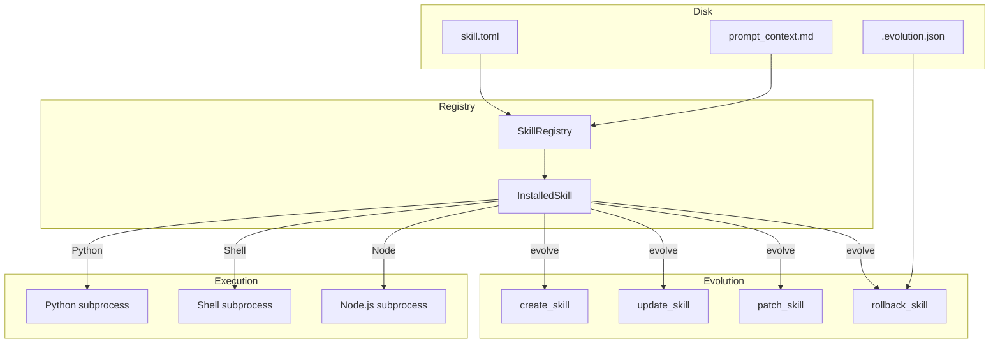

# Skills System

# Skills System

## Overview

The skills system is LibreFang's pluggable extension mechanism. A **skill** is a self-contained bundle—manifest + optional executable code or prompt context—that extends what an agent can do. Skills are loaded at startup, registered as tools the LLM can invoke, and can be created, mutated, and versioned at runtime by the agent itself through the evolution subsystem.

Skills come in several flavors:

| Runtime | Execution model |
|---|---|
| `promptonly` | Injects Markdown instructions into the LLM system prompt. No executable code. |
| `python` | Python script spawned as a subprocess; receives JSON on stdin, returns JSON on stdout. |
| `shell` | Bash/sh script spawned as a subprocess; same I/O contract as Python. |
| `node` | Node.js script spawned as a subprocess; same I/O contract. |
| `wasm` | WASM module executed in a sandbox (not yet implemented). |
| `builtin` | Compiled into the binary; handled directly by the kernel. |

## Architecture



## Skill Manifest (`skill.toml`)

Every skill is defined by a `skill.toml` file in its own directory. The manifest is parsed into `SkillManifest`.

### Minimal manifest

```toml
[skill]
name = "my-skill"
version = "0.1.0"
description = "What this skill does"
```

This produces a `PromptOnly` skill (the default runtime). Place a `prompt_context.md` file alongside the manifest containing Markdown that teaches the LLM how to behave.

### Full manifest

```toml
[skill]
name = "web-summarizer"
version = "0.2.0"
description = "Summarizes any web page into bullet points"
author = "librefang-community"
license = "MIT"
tags = ["web", "summarizer", "research"]

[runtime]
type = "python"
entry = "src/main.py"

[[tools.provided]]
name = "summarize_url"
description = "Fetch a URL and return a concise bullet-point summary"
input_schema = { type = "object", properties = { url = { type = "string" } }, required = ["url"] }

[requirements]
tools = ["web_fetch"]
capabilities = ["NetConnect(*)"]

[config]
apiKey = "sk-..."
endpoint = "https://api.example.com"

[[config_vars]]
key = "wiki.base_url"
description = "Base URL of the internal wiki"
default = "https://wiki.example.com"
```

### Key fields

- **`skill.name`** — Unique identifier. Must be lowercase alphanumeric + hyphens/underscores, max 64 characters, must start with an alphanumeric character.
- **`runtime.type`** — One of `python`, `wasm`, `node`, `shell`, `builtin`, `promptonly`. Defaults to `promptonly`.
- **`runtime.entry`** — Path to the entry-point file, relative to the skill directory.
- **`tools.provided`** — Array of tool definitions the skill exposes. Each tool has a `name`, `description`, and JSON Schema `input_schema`.
- **`requirements.tools`** — Built-in tools this skill needs access to.
- **`requirements.capabilities`** — Host capabilities required (e.g., network access).
- **`config`** — Arbitrary key-value pairs passed to the skill's runtime via stdin payload.
- **`config_vars`** — Declared global config keys resolved at prompt-build time and injected into the system prompt.
- **`source`** — Provenance tracking: `Native`, `Local`, `OpenClaw`, `ClawHub`, `ClawHubCn`, or `Skillhub`.

## Registry (`SkillRegistry`)

The registry is the central index of installed skills. It is constructed with a root skills directory and loads all subdirectories containing a `skill.toml`.

### Loading skills

```rust
let mut registry = SkillRegistry::new(skills_dir);
let count = registry.load_all()?;
```

`load_all` scans the skills directory. For each subdirectory:

1. Look for `skill.toml`. If absent, check for `SKILL.md` (OpenClaw format) and auto-convert.
2. Parse the manifest.
3. Run prompt injection scanning on the content. Skills with **critical** severity warnings are blocked.
4. Skip skills that are in the global disabled list.
5. Skip skills whose platform tags don't match the current OS (e.g., a `linux-only` skill on macOS).
6. If the manifest has no inline `prompt_context`, load `prompt_context.md` from the same directory (progressive loading).
7. Canonicalize the directory path for reliable entry-point resolution.

### Platform filtering

Skills can declare OS compatibility via tags: `macos`, `linux`, `windows`, `macos-only`, `linux-only`, `windows-only`. If a skill declares any platform tags, it only loads on a matching OS. Skills with no platform tags load everywhere.

`derive_category` extracts the first non-platform tag for UI grouping, falling back to `"general"`.

### Freezing

In Stable mode the registry is frozen after initial load:

```rust
registry.freeze();
// All subsequent load_skill calls return SkillError::NotFound
```

`reload_skill` is exempt—it refreshes an existing entry even when frozen. This is used by the evolution system after mutations.

### Workspace and external skills

- **`load_workspace_skills`** — Loads skills from a workspace-scoped directory. Workspace skills override global skills with the same name.
- **`load_external_dirs`** — Loads skills from additional directories. External skills do **not** override local skills with the same name.

### Querying

```rust
// Get a specific skill
let skill = registry.get("my-skill");

// List all installed skills
let all = registry.list();

// Get all tool definitions from enabled skills (for LLM tool registration)
let tools = registry.all_tool_definitions();

// Find which skill provides a tool
let provider = registry.find_tool_provider("summarize_url");

// Tool definitions filtered to specific skills
let tools = registry.tool_definitions_for_skills(&["web-summarizer".to_string()]);
```

## Execution (`loader`)

`execute_skill_tool` is the entry point for running a skill tool. It dispatches based on `SkillRuntime`:

### Subprocess runtimes (Python, Node, Shell)

All three follow the same contract:

1. **Path validation** — `validate_script_path` canonicalizes both the skill directory and the script path, then verifies the script path starts with the skill directory. This blocks `../` traversal, absolute paths, and symlink escapes.
2. **Payload construction** — A JSON object with `tool` (tool name), `input` (arguments), and optionally `config` (skill config map) is serialized.
3. **Process spawn** — The script is executed with:
   - `env_clear()` — the environment is scrubbed to prevent leaking host secrets (API keys, tokens) to third-party skill code.
   - Only `PATH`, `HOME`, and platform essentials (`SYSTEMROOT`, `TEMP` on Windows) are preserved.
   - Runtime-specific env vars: `PYTHONIOENCODING=utf-8` for Python, `NODE_NO_WARNINGS=1` for Node.
4. **I/O** — The JSON payload is written to stdin. Stdout is parsed as JSON on success; if parsing fails, the raw stdout is wrapped as `{"result": "<trimmed text>"}`. Stderr is captured for error reporting.
5. **Timeout** — Shell skills have a 120-second timeout. Python and Node run without a hard timeout.

### PromptOnly runtime

When a tool from a `PromptOnly` skill is invoked, execution returns immediately with a note directing the LLM to use built-in tools—the actual skill content is already in the system prompt.

### Builtin and WASM runtimes

These return `SkillError::RuntimeNotAvailable`. Builtin skills are handled by the kernel directly; WASM is not yet implemented.

## Evolution System

The evolution module enables agents to autonomously create, modify, and version skills. Every mutation is serialized through per-skill file locks and recorded in a version history.

### File locking

Mutations acquire an exclusive lock via `acquire_skill_lock`. The lock file lives at `{skills_dir}/.evolution-locks/{skill_name}.lock`—**outside** the skill directory—so that `delete_skill` can hold the lock across `remove_dir_all` without conflicting open handles on Windows.

### Atomic writes

All file mutations use `atomic_write`, which writes to a temp file (named with pid, thread id, monotonic counter, and nanosecond timestamp) and renames it into place. This prevents partial files on crash.

### Operations

#### `create_skill`

Creates a new `PromptOnly` skill from scratch:

```rust
create_skill(
    &skills_dir,
    "my-approach",
    "Handles X by doing Y",
    "# Instructions\n\n...",
    vec!["category".to_string()],
    Some("agent:uuid"),
)?;
```

- Validates name and prompt content (size limit, injection scan).
- Creates the skill directory, `skill.toml`, and `prompt_context.md`.
- Records initial version `0.1.0` in `.evolution.json`.

#### `update_skill`

Full rewrite of a skill's prompt context:

```rust
update_skill(&installed_skill, "# New content...", "Rewritten for clarity", Some("agent:uuid"))?;
```

- Saves a rollback snapshot of the current `prompt_context.md` in `.rollback/`.
- Re-reads `skill.toml` from disk under the lock to get the current version (avoids stale snapshots under concurrent writes).
- Bumps the semver patch version.
- Writes the new content and updated manifest atomically.
- Records the version with `is_mutation = true`.

#### `patch_skill`

Fuzzy find-and-replace on prompt content. Designed to be tolerant of LLM formatting variance:

```rust
patch_skill(
    &installed_skill,
    "old text to find",
    "new replacement text",
    "Fixed typo",
    false,  // replace_all
    Some("agent:uuid"),
)?;
```

Uses a 6-strategy fuzzy matching cascade (strict → loose):

1. **Exact** — literal substring match.
2. **LineTrimmed** — trim leading/trailing whitespace per line.
3. **WhitespaceNormalized** — collapse whitespace runs to single space.
4. **IndentFlexible** — strip all leading indentation.
5. **BlockAnchor** — match first and last lines exactly, verify middle ≥60% similar.
6. **WhitespaceStripped** — remove all whitespace from both sides; substring match. Last resort for CJK content where inter-character spaces are insignificant. Requires ≥3 non-whitespace characters in the needle to avoid false positives.

Each strategy reports back via `MatchStrategy` so callers can know what worked. Multi-match results require `replace_all = true` or produce an error. On complete failure, the error includes the closest matching lines from the content as a diagnostic hint.

#### `rollback_skill`

Restores the previous version from `.rollback/`:

```rust
rollback_skill(&installed_skill, Some("agent:uuid"))?;
```

#### Supporting files

- **`write_supporting_file`** — Adds or overwrites an arbitrary file in the skill directory.
- **`remove_supporting_file`** — Removes a supporting file from the skill directory.

#### Usage tracking

`record_skill_usage` bumps `use_count` in `.evolution.json` after a successful tool invocation, without touching the version chain.

### Version history

`.evolution.json` stores:

- **`versions`** — Array of `SkillVersionEntry` (version, timestamp, changelog, content hash, author). Capped at 10 entries; oldest are pruned.
- **`evolution_count`** — Total version entries written (including creation).
- **`mutation_count`** — Post-creation mutations only. A freshly created skill has `mutation_count = 0`.
- **`use_count`** — Successful tool invocations.

`EvolutionResult` returns post-operation counters so agents don't need a second query to check state.

## OpenClaw Compatibility

The `openclaw_compat` module auto-detects skills in the legacy `SKILL.md` format (YAML frontmatter + Markdown body) and converts them to `skill.toml` + `prompt_context.md`. This conversion happens automatically during `load_all` and `load_workspace_skills`.

## Security

### Prompt injection scanning

All prompt content passes through `SkillVerifier::scan_prompt_content` before being accepted. Skills with **critical** severity findings are blocked entirely at load time and during evolution operations.

### Subprocess isolation

Subprocess-based runtimes (Python, Node, Shell) run with a scrubbed environment (`env_clear()`) to prevent host secrets from leaking into third-party skill code. Only essential variables (`PATH`, `HOME`, platform necessities) are preserved.

### Path traversal prevention

`validate_script_path` canonicalizes both the skill directory and the resolved script path, then verifies containment. This blocks `../` traversal, absolute paths pointing outside the skill directory, and symlink escapes.

### Name validation

Skill names must be 1–64 characters, start with an alphanumeric character, and contain only `[a-z0-9_-]`. This prevents directory traversal via crafted names.

## Error Handling

All errors flow through `SkillError`:

| Variant | Meaning |
|---|---|
| `NotFound` | Skill or tool doesn't exist |
| `InvalidManifest` | Malformed `skill.toml` or failed validation |
| `AlreadyInstalled` | Attempt to create a skill that already exists |
| `RuntimeNotAvailable` | Required runtime (Python, Node, etc.) not found on system |
| `ExecutionFailed` | Subprocess failed, timed out, or returned non-zero exit |
| `Io` | Filesystem error |
| `Network` | Remote operation failed |
| `RateLimited` | ClawHub rate limit hit |
| `TomlParse` | Invalid TOML |
| `YamlParse` | Invalid YAML (OpenClaw conversion) |
| `SecurityBlocked` | Prompt injection scan rejected the content |

## Integration Points

The skills system is consumed by the runtime via `tool_runner`:

- **`execute_tool_raw`** — Looks up the tool provider in the registry, calls `execute_skill_tool`, and records usage.
- **Evolve tools** — `tool_skill_evolve_create`, `_update`, `_patch`, `_rollback`, `_delete`, `_write_file`, `_remove_file` all delegate to the evolution module.
- **CLI** — `cmd_skill_install` uses the marketplace module; `cmd_doctor` loads the registry and runs prompt scanning.
- **API routes** — Skill CRUD endpoints in `src/routes/skills.rs` delegate to evolution operations.