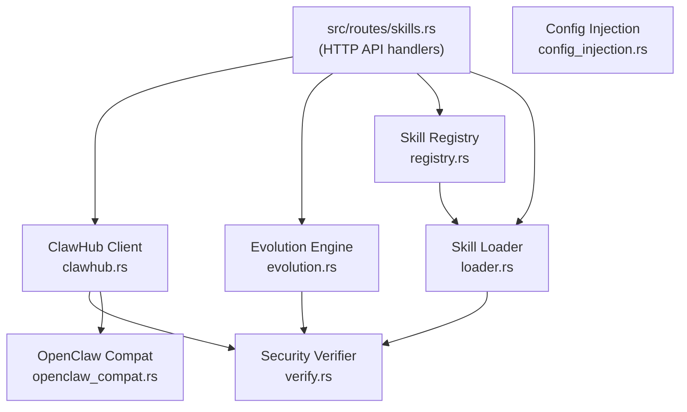

# Skills System

# Skills System

The `librefang-skills` crate manages the full lifecycle of skills: discovery, installation, execution, self-evolution, and configuration injection. Skills are modular capabilities that agents can load at runtime, ranging from simple prompt-only instructions to packaged Node.js tools.

## Architecture



## Skill Manifest (`skill.toml`)

Every installed skill has a `skill.toml` manifest in its directory. Key fields:

| Section | Fields |
|---------|--------|
| `[skill]` | `name`, `version`, `description`, `author`, `license`, `tags` |
| `[runtime]` | `runtime_type` (`PromptOnly`, `Shell`, `Python`, `NodeJS`), `entry` |
| `[tools]` | Tool definitions with JSON Schema input/output |
| `[[config_vars]]` | Declared config keys with description and optional default |
| `source` | Origin: `Local`, `Native`, or marketplace source |

Prompt-only skills store their content in a separate `prompt_context.md` file alongside the manifest.

---

## ClawHub Marketplace Client (`clawhub.rs`)

`ClawHubClient` connects to the ClawHub registry at `clawhub.ai/api/v1` to search, browse, and install community skills.

### Creating a Client

```rust
let client = ClawHubClient::new(PathBuf::from("/path/to/cache"));
```

For alternative registries or testing:

```rust
let client = ClawHubClient::with_url("https://mirror.clawhub.ai/api/v1", cache_dir);
```

TLS verification can be disabled by setting `LIBREFANG_DANGEROUSLY_SKIP_TLS_VERIFICATION=true` or `1` — intended only for development against servers with expired certificates.

### API Methods

| Method | Endpoint | Returns |
|--------|----------|---------|
| `search(query, limit)` | `GET /api/v1/search?q=...&limit=...` | `ClawHubSearchResponse` — note the root key is `results`, not `items` |
| `browse(sort, limit, cursor)` | `GET /api/v1/skills?sort=...&limit=...` | `ClawHubBrowseResponse` with paginated `items` |
| `get_skill(slug)` | `GET /api/v1/skills/{slug}` | `ClawHubSkillDetail` with owner, stats, version info |
| `get_file(slug, path)` | `GET /api/v1/skills/{slug}/file?path=...` | Raw file content as `String` |
| `install(slug, target_dir)` | `GET /api/v1/download?slug=...` | `ClawHubInstallResult` |
| `is_installed(slug, skills_dir)` | — | `bool` |

Sort orders for `browse`: `Trending`, `Updated`, `Downloads`, `Stars`, `Rating`.

### Retry and Rate Limiting

All HTTP requests go through `get_with_retry`, which automatically retries on:

- **429 Too Many Requests** — respects the `Retry-After` header when present
- **5xx server errors**
- **Network/timeout failures**

Configuration:

| Constant | Value | Purpose |
|----------|-------|---------|
| `MAX_RETRIES` | 5 | Total attempts per request |
| `BASE_DELAY_MS` | 1,500 | Base for exponential backoff |
| `MAX_DELAY_MS` | 30,000 | Delay cap |

Backoff uses exponential scaling with ±25% jitter derived from system clock nanos. A final 429 produces `SkillError::RateLimited` with a human-readable message; other terminal failures produce `SkillError::Network`.

### Installation Pipeline

`install()` executes this sequence:

1. **Fetch detail** — retrieves `expected_sha256` from the registry (best-effort; continues without it on failure)
2. **Download archive** — via `get_with_retry` to the `/download` endpoint
3. **SHA256 verification** — computed digest compared against registry-supplied hash; mismatch returns `SkillError::SecurityBlocked` immediately, before creating any directories (supply-chain tampering protection, issue #3827)
4. **Atomic staging** — content extracted into a sibling `.staging-{slug}-{pid}-{counter}` directory, then renamed to the final location. Prevents partial installs from being loaded on daemon restart (#3719)
5. **Format detection** — SKILL.md (starts with `---`), zip archive (`PK` magic bytes), or package.json
6. **Format conversion** — `openclaw_compat::convert_skillmd` or `convert_openclaw_skill` produces a `SkillManifest` and applies tool name translations (OpenClaw → LibreFang)
7. **Security scanning** — manifest scan via `SkillVerifier::security_scan`, then prompt injection scan via `SkillVerifier::scan_prompt_content`
8. **Binary dependency check** — warns if declared `required_bins` aren't on `PATH`
9. **Write manifest** — `skill.toml` written with `verified: false`

Critical prompt injection findings block installation; the staging directory is cleaned up before returning the error.

### Path Safety

Slug validation (`validate_slug`) accepts only ASCII alphanumeric, hyphen, and underscore characters. The `resolve_skill_child_path` function rejects absolute paths and any path component that isn't `Component::Normal`, preventing zip-slip attacks during archive extraction.

### Backward Compatibility Aliases

Several type aliases exist for older code:

- `ClawHubListResponse` → `ClawHubBrowseResponse`
- `ClawHubSearchResults` → `ClawHubSearchResponse`
- `ClawHubEntry` → `ClawHubBrowseEntry`

---

## Skill Evolution Engine (`evolution.rs`)

The evolution system enables agents to create, modify, and delete skills autonomously. All mutations go through security scanning, version tracking, and rollback support.

### Core Operations

| Function | Purpose |
|----------|---------|
| `create_skill(skills_dir, name, description, prompt_context, tags, author)` | Create a new PromptOnly skill at v0.1.0 |
| `update_skill(skill, new_prompt_context, changelog, author)` | Full rewrite of prompt_context, bumps patch version |
| `patch_skill(skill, old_str, new_str, changelog, replace_all, author)` | Fuzzy find-and-replace on prompt_context |
| `rollback_skill(skill, author)` | Revert to the previous version snapshot |
| `delete_skill(skills_dir, name)` | Agent-facing delete; refuses non-local skills |
| `uninstall_skill(skills_dir, name)` | User-facing delete; removes any skill regardless of source |
| `write_supporting_file(skill, rel_path, content)` | Write to `references/`, `templates/`, `scripts/`, or `assets/` |
| `remove_supporting_file(skill, rel_path)` | Remove a supporting file and clean empty parent dirs |
| `list_supporting_files(skill)` | List all supporting files by subdirectory |

### Concurrency Model

Every mutation acquires a per-skill exclusive file lock via `acquire_skill_lock`. Lock files live in `{parent}/.evolution-locks/{name}.lock` — outside the skill directory so they survive `remove_dir_all` on Windows (where open handles block deletion).

Locking uses `fs2::FileExt::lock_exclusive` (flock on Unix, LockFileEx on Windows).

The pattern is: **lock → re-check existence → re-read current state from disk → mutate → write → unlock**. This prevents:

- Two concurrent `create_skill` calls producing duplicate directories
- Concurrent `update_skill`/`patch_skill` computing the same version number from a stale snapshot
- Resurrection of a deleted skill by a concurrent writer that held a pre-delete snapshot

### Atomic File Writes

All file writes go through `atomic_write`, which:

1. Writes to a temp file named `.tmp.{filename}.{pid}.{tid}.{counter}.{nanos}`
2. Renames to the final path

Temp file names include a per-process monotonic counter (`ATOMIC_WRITE_COUNTER`) to guarantee uniqueness even when OS clock resolution is insufficient to distinguish concurrent writes.

### Fuzzy Patching (`fuzzy_find_and_replace`)

Patching uses a 6-strategy cascade, from strictest to most permissive:

1. **Exact** — literal substring match
2. **LineTrimmed** — trim each line's leading/trailing whitespace
3. **WhitespaceNormalized** — collapse whitespace runs to single space
4. **IndentFlexible** — strip all leading whitespace per line
5. **BlockAnchor** — match first + last lines, require ≥60% middle line similarity
6. **WhitespaceStripped** — remove all whitespace from both sides, substring match. Has a 3-character minimum on the stripped needle to prevent English false positives (e.g., `"a"` matching inside `"banana"`). Designed for CJK content where inter-character spaces carry no semantic meaning.

Line-based match counting (not substring-based) prevents false "Multiple matches" errors when a short `old_str` appears as a substring of a longer line.

Empty `old_str` is rejected immediately — `content.replace("", new_str)` inserts at every character boundary.

When all strategies fail, the error message includes up to 3 closest-matching lines from the content (by Jaccard character-set similarity) so agents can self-correct.

### Version Management

Each mutation records a `SkillVersionEntry` in `.evolution.json`:

```json
{
  "versions": [
    {
      "version": "0.1.2",
      "timestamp": "2026-03-15T10:30:00+00:00",
      "changelog": "Fixed output format [strategy: Exact, matches: 1]",
      "content_hash": "sha256hex...",
      "author": "agent:uuid-here"
    }
  ],
  "use_count": 42,
  "evolution_count": 3,
  "mutation_count": 2
}
```

Counters:

| Counter | Meaning |
|---------|---------|
| `evolution_count` | Total version entries written, including initial creation |
| `mutation_count` | Post-creation edits only (create reports `0`) |
| `use_count` | Successful skill-tool invocations (bumped externally by `record_skill_usage`) |

Version history is capped at `MAX_VERSION_HISTORY` (10) entries; oldest are pruned. Rollback snapshots (in `.rollback/`) are similarly capped.

Version bumping uses the `semver` crate: `"0.1.0"` → `"0.1.1"`, stripping pre-release tags and build metadata per SemVer spec. Falls back to simple string splitting for non-standard versions.

### Supporting Files

Allowed subdirectories: `references`, `templates`, `scripts`, `assets`. Maximum file size: 1 MiB. Path traversal and absolute paths are rejected. Symlinks are not followed during directory walks, which are capped at 16 levels deep.

### `EvolutionResult`

Every operation returns an `EvolutionResult` with:

- `success`, `message`, `skill_name`, `version`
- `match_strategy` / `match_count` — populated for patch operations
- `evolution_count`, `mutation_count`, `use_count` — post-operation counters so callers don't need a separate query

### Name Validation

`validate_name` enforces: 1–64 characters, starts with alphanumeric, contains only `[a-z0-9_-]`. Description is capped at 1024 characters. Prompt context is capped at 160,000 characters (~55k tokens).

---

## Config Injection (`config_injection.rs`)

Skills declare configuration variables they need via `[[config_vars]]` in their manifests. The config injection system collects, resolves, and formats these for injection into the system prompt.

### Declaration in `skill.toml`

```toml
[[config_vars]]
key = "wiki.base_url"
description = "Base URL of the internal wiki"
default = "https://wiki.example.com"

[[config_vars]]
key = "api.timeout"
description = "API timeout in seconds"
```

### Resolution Flow

1. **`collect_config_vars(skills)`** — gathers declarations from enabled skills, deduplicating by key (first declaration wins), skipping entries with empty keys or descriptions.

2. **`resolve_config_vars(vars, config_toml)`** — for each key, walks the path `skills.config.<key>` in the parsed config TOML. Falls back to the declared `default`. Empty strings and missing values are omitted (they'd add noise without information).

3. **`format_config_section(resolved)`** — formats as a system-prompt section:

```
## Skill Config Variables
wiki.base_url = https://wiki.corp.example.com
api.timeout = 30
```

Returns an empty string when no variables resolve, so callers can skip injection with a cheap `is_empty()` check.

### Storage Convention

The logical dotted key `wiki.base_url` maps to:

```toml
[skills.config.wiki]
base_url = "https://wiki.corp.example.com"
```

in `~/.librefang/config.toml`. The `resolve_dotpath` helper walks the nested TOML table tree segment by segment.

---

## Security Pipeline

Security scanning runs at multiple points:

| Checkpoint | Scanner | Blocking? |
|------------|---------|-----------|
| ClawHub install — manifest | `SkillVerifier::security_scan` | No (warnings) |
| ClawHub install — prompt content | `SkillVerifier::scan_prompt_content` | Yes on Critical |
| ClawHub install — SHA256 | Hash comparison | Yes on mismatch |
| Evolution create/update/patch — prompt | `SkillVerifier::scan_prompt_content` | Yes on Critical |
| Supporting file write | `SkillVerifier::scan_prompt_content` | Yes on Critical |

`SkillVerifier::scan_prompt_content` uses Aho-Corasick pattern matching (via `build_threat_patterns`) for efficient multi-pattern scanning across threat categories including prompt injection, reverse shells, and tool override attempts.

---

## Integration Points

### HTTP Routes (`src/routes/skills.rs`)

Route handlers create `ClawHubClient` instances per request via `with_url` (for CN mirrors) or the default URL, then delegate to the client methods. Evolution operations are called directly from route handlers like `evolve_patch_skill` → `patch_skill`, `evolve_rollback_skill` → `rollback_skill`.

### Skill Registry (`registry.rs`)

The registry loads installed skills via `load_all`, provides `find_tool_provider` for tool dispatch, and supports a frozen mode (`is_frozen`) that blocks further modifications after initial load. Tool definitions are produced deterministically regardless of insertion order.

### Skill Execution (`loader.rs`)

`execute_skill_tool` dispatches to `execute_shell` or `execute_python` depending on the runtime type. Input validation uses `validate_input_against_schema`. Shell execution caps output and enforces timeouts, killing runaway child processes. Environment variable passthrough is governed by `EnvPassthroughPolicy` with glob-based allow/deny patterns.

### Skill Workshop (`src/skill_workshop/storage.rs`)

The workshop's `approve_candidate` calls `create_skill` to materialize a workshop candidate into an installed skill. The `save_candidate` function runs `scan_prompt_content` before persisting.

### TUI (`src/tui/event.rs`)

The TUI fetches installed skill names via `registry::skill_names` during startup to populate the skill browser.