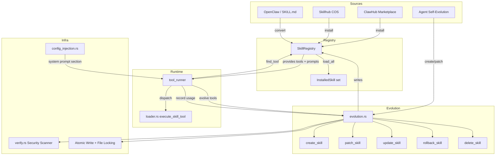

# Skills System

# Skills System

The Skills System (`librefang-skills`) manages the full lifecycle of reusable capability modules — from marketplace discovery and installation through agent-driven creation, mutation, and deletion. Skills are the primary extensibility mechanism: they inject tool definitions, prompt context, and configuration into agent sessions.

## Architecture



## Core Data Types

### `SkillManifest`

The canonical skill definition, serialized as `skill.toml` in each skill directory. Key fields:

| Field | Type | Purpose |
|-------|------|---------|
| `skill` | `SkillMeta` | Name, version, description, author, tags |
| `runtime` | `SkillRuntimeConfig` | `runtime_type` (`PromptOnly`, `Node`, etc.) + entry point |
| `tools` | `SkillTools` | Tool definitions exposed to the agent |
| `prompt_context` | `Option<String>` | Inline prompt text (or `None` if stored in `prompt_context.md`) |
| `source` | `Option<SkillSource>` | Origin: `Local`, `Native`, marketplace source |
| `config_vars` | `Vec<SkillConfigVar>` | Declared configuration dependencies |
| `requirements` | `SkillRequirements` | Required binaries, permissions |

### `InstalledSkill`

A loaded skill bound to a filesystem path:

```rust
pub struct InstalledSkill {
    pub manifest: SkillManifest,
    pub path: PathBuf,    // Absolute path to skill directory
    pub enabled: bool,
}
```

### `SkillConfigVar`

Skills declare config keys they depend on in `[[config_vars]]`:

```toml
[[config_vars]]
key = "wiki.base_url"
description = "Base URL of the internal wiki"
default = "https://wiki.example.com"
```

Resolved values are injected into the system prompt at session start (see [Config Injection](#config-injection)).

### Skill Directory Layout

```
skills/
└── my-skill/
    ├── skill.toml              # Manifest
    ├── prompt_context.md       # Prompt text (for evolved/PromptOnly skills)
    ├── .evolution.json         # Version history + usage counters
    ├── .rollback/              # Previous version snapshots
    │   └── prompt_context_20260301_120000_001_12345.md
    ├── references/             # Supporting files
    ├── templates/
    ├── scripts/
    └── assets/
```

## Skill Sources and Format Conversion

The system ingests skills from multiple sources and formats:

| Source | Format | Conversion Path |
|--------|--------|----------------|
| ClawHub marketplace | ZIP (package.json) or raw SKILL.md | `openclaw_compat::convert_openclaw_skill` or `convert_skillmd` |
| Skillhub COS | ZIP | Same ClawHub conversion pipeline |
| OpenClaw / SKILL.md | YAML frontmatter + markdown | `openclaw_compat::parse_skillmd` → LibreFang manifest |
| Agent evolution | Direct writes | `evolution::create_skill` writes `skill.toml` + `prompt_context.md` |

Format detection runs in order during `load_all`:
1. Check for `skill.toml` (native LibreFang)
2. Check for `SKILL.md` frontmatter (`detect_skillmd`)
3. Check for OpenClaw package.json (`detect_openclaw_skill`)

Non-native formats are auto-converted on first load and the resulting `skill.toml` is written back to disk.

## ClawHub Marketplace Client

`ClawHubClient` (`clawhub.rs`) communicates with the ClawHub API (`https://clawhub.ai/api/v1`) for search, browse, and install operations.

### API Endpoints

| Method | Endpoint | Returns |
|--------|----------|---------|
| `search(query, limit)` | `GET /api/v1/search?q=...&limit=N` | `ClawHubSearchResponse` (key: `results`) |
| `browse(sort, limit, cursor)` | `GET /api/v1/skills?sort=...&limit=N` | `ClawHubBrowseResponse` (key: `items`, paginated via `next_cursor`) |
| `get_skill(slug)` | `GET /api/v1/skills/{slug}` | `ClawHubSkillDetail` |
| `get_file(slug, path)` | `GET /api/v1/skills/{slug}/file?path=...` | Raw file content |
| `install(slug, target_dir)` | `GET /api/v1/download?slug=...` → process | `ClawHubInstallResult` |

### Rate Limiting and Retry

All HTTP calls go through `get_with_retry`, which implements exponential backoff with jitter:

- **5 attempts** maximum (`MAX_RETRIES`)
- **1.5s base delay**, doubling per attempt, capped at **30s** (`MAX_DELAY_MS`)
- Respects the `Retry-After` header when present (capped to 30s)
- Retries on **429** and **5xx**; non-retryable 4xx errors fail immediately
- Returns `SkillError::RateLimited` or `SkillError::Network` when retries exhaust

TLS verification can be disabled for testing via `LIBREFANG_DANGEROUSLY_SKIP_TLS_VERIFICATION=true`.

### Install Security Pipeline

`install` and `install_from_bytes` run a 7-step pipeline:

1. **SHA256 hash** of downloaded content
2. **Format detection** — SKILL.md (starts with `---`), ZIP (magic bytes `0x50 0x4b`), or raw package.json
3. **Zip extraction** with path-traversal protection (`resolve_skill_child_path` rejects absolute paths and non-`Normal` components)
4. **Format conversion** to LibreFang manifest via `openclaw_compat`
5. **Prompt injection scan** via `SkillVerifier::scan_prompt_content` — **critical-severity findings block installation** and clean up the skill directory
6. **Binary dependency check** — warns if declared binaries are missing from `$PATH`
7. **Manifest security scan** via `SkillVerifier::security_scan` — warnings attached to result but don't block

The result includes all warnings and any tool-name translations applied (e.g., OpenClaw `Read` → LibreFang `file_read`).

### Slug Validation

`validate_slug` enforces ASCII alphanumeric + hyphens/underscores only. This is applied before any URL construction to prevent injection into API paths.

## Skill Evolution

The evolution subsystem (`evolution.rs`) enables agents to autonomously create, refine, and manage PromptOnly skills. All mutation operations are serialized per-skill via file locks and use atomic writes.

### Operations

| Operation | Function | Mutates Version | Bumps `mutation_count` |
|-----------|----------|:-:|:-:|
| Create | `create_skill` | ✓ (initial `0.1.0`) | ✗ |
| Full update | `update_skill` | ✓ (patch bump) | ✓ |
| Fuzzy patch | `patch_skill` | ✓ (patch bump) | ✓ |
| Rollback | `rollback_skill` | ✓ (patch bump) | ✓ |
| Delete | `delete_skill` | — | — |
| Uninstall | `uninstall_skill` | — | — |
| Write supporting file | `write_supporting_file` | ✗ | ✗ |
| Remove supporting file | `remove_supporting_file` | ✗ | ✗ |
| Record usage | `record_skill_usage` | ✗ | ✗ (bumps `use_count`) |

### Fuzzy Find-and-Replace

`patch_skill` uses `fuzzy_find_and_replace`, which tries 6 matching strategies in order from strict to loose:

1. **Exact** — literal substring match
2. **LineTrimmed** — trim each line's whitespace, then match
3. **WhitespaceNormalized** — collapse whitespace runs to single space
4. **IndentFlexible** — strip all leading whitespace
5. **BlockAnchor** — match first + last lines, require ≥60% middle-line similarity
6. **WhitespaceStripped** — remove all whitespace from both sides, substring match (last resort for CJK content)

When no strategy matches, the error includes the closest existing lines (Jaccard similarity on character sets, threshold ≥0.3) so the agent can self-correct on its next attempt.

The successful strategy is reported in `EvolutionResult::match_strategy` for diagnostics.

### Concurrency Model

All mutations acquire a per-skill exclusive lock before touching the filesystem:

```
{skills_dir}/.evolution-locks/{skill_name}.lock
```

Lock files live **outside** the skill directory so that `delete_skill`/`uninstall_skill` can hold the lock across `remove_dir_all` (important on Windows where open file handles block directory deletion). Uses `fs2::FileExt::lock_exclusive` (`flock` on Unix, `LockFileEx` on Windows).

All file writes use `atomic_write`: write to a temp file named with pid + thread id + monotonic counter + nanosecond timestamp, then `fs::rename`. No partial files on crash.

Under the lock, mutations re-read `skill.toml` from disk to get the current version, preventing concurrent writers from producing duplicate version numbers.

### Version History

Each skill stores `.evolution.json` with:

- `versions`: up to **10** entries (`MAX_VERSION_HISTORY`), newest last, each with version, timestamp, changelog, content hash, and author
- `evolution_count`: total version entries written (including initial creation)
- `mutation_count`: post-creation edits only
- `use_count`: successful tool invocations (incremented by `record_skill_usage`)

Rollback snapshots are stored in `.rollback/` with nanosecond-precision filenames. After a rollback, the consumed snapshot is removed but the pre-rollback content is saved as a new snapshot, making rollback itself reversible.

### Delete vs. Uninstall

- **`delete_skill`** — agent-facing. Validates `source` field; only deletes `Local`/`Native` skills. Refuses to touch marketplace or unclassified skills.
- **`uninstall_skill`** — user-facing (dashboard/CLI). Removes any skill regardless of source. The operator has explicitly decided to remove it.

Both acquire the skill lock and re-check existence under the lock to prevent races with concurrent patches/updates.

### Supporting Files

Skills can store auxiliary files in whitelisted subdirectories: `references/`, `templates/`, `scripts/`, `assets/`. Files are limited to **1 MiB** each and undergo prompt injection scanning before write.

`write_supporting_file` and `remove_supporting_file` both:
- Validate the path is under an allowed subdirectory
- Check for path traversal (`..`, absolute paths)
- Canonicalize paths and verify they don't escape the skill directory (symlink protection)
- Acquire the per-skill lock

`list_supporting_files` walks subdirectories recursively (up to depth 16, no symlink following) and returns a `HashMap<subdir_name, Vec<relative_paths>>`.

## Config Injection

The `config_injection` module resolves skill-declared configuration variables and formats them for the system prompt.

### Resolution Pipeline

1. **Collect** — `collect_config_vars(skills)` gathers all `[[config_vars]]` from enabled skills, deduplicating by key (first declaration wins)
2. **Resolve** — `resolve_config_vars(vars, config_toml)` walks `skills.config.<key>` in the user's config TOML, falling back to declared defaults
3. **Format** — `format_config_section(resolved)` produces the prompt section

### Storage Convention

A declared key `wiki.base_url` is stored in `~/.librefang/config.toml`:

```toml
[skills.config.wiki]
base_url = "https://wiki.corp.example.com"
```

The resolver walks the dotted path `skills` → `config` → `wiki` → `base_url`. Empty-string values are treated as absent and fall back to the default. Variables with neither a config value nor a default are omitted entirely.

### Prompt Format

```
## Skill Config Variables
wiki.base_url = https://wiki.corp.example.com
db.host = localhost
```

The function returns an empty string when no variables resolve, allowing callers to skip injection with an `is_empty()` guard.

## Security Scanning

All skill content passes through `SkillVerifier` (defined in `verify.rs`):

- **`security_scan(manifest)`** — inspects the manifest for suspicious tool definitions, dangerous runtime configurations, etc.
- **`scan_prompt_content(content)`** — detects prompt injection patterns (exfiltration attempts, shell redirection bypasses, etc.)
- **`sha256_hex(bytes)`** — content hashing for version integrity

Critical-severity findings from `scan_prompt_content` **block** skill installation and creation. Lower-severity warnings are attached to the result for display.

## Integration Points

### From `librefang-runtime` (`tool_runner.rs`)

The runtime is the primary consumer. Each agent tool dispatch follows this pattern:

- **Skill tool execution**: `execute_tool_raw` → `find_tool_provider` (registry) → `execute_skill_tool` (loader) → `record_skill_usage` (evolution)
- **Evolve tools**: `tool_skill_evolve_create/update/patch/rollback/delete/write_file/remove_file` → load skill from disk → call evolution function → return `EvolutionResult`
- All evolve tools call `ensure_not_frozen` before mutating, preventing changes when the registry is frozen

### From `librefang-cli` (`main.rs`)

- `cmd_skill_install` → `marketplace::install`
- `cmd_doctor` → `registry::load_all` + `scan_prompt_content` for health checks

### From the Dashboard (`src/routes/skills.rs`)

HTTP handlers call evolution functions directly:
- `evolve_delete_skill` → `delete_skill`
- `evolve_write_file` → `write_supporting_file`
- `evolve_remove_file` → `remove_supporting_file`

All routes go through the same lock + security pipeline as the agent tools.

## Key Constants

| Constant | Value | Location | Purpose |
|----------|-------|----------|---------|
| `MAX_RETRIES` | 5 | `clawhub.rs` | ClawHub API retry attempts |
| `BASE_DELAY_MS` | 1,500 | `clawhub.rs` | Retry backoff base |
| `MAX_DELAY_MS` | 30,000 | `clawhub.rs` | Retry backoff cap |
| `MAX_PROMPT_CONTEXT_CHARS` | 160,000 | `evolution.rs` | ≈55k tokens limit |
| `MAX_NAME_LEN` | 64 | `evolution.rs` | Skill name length |
| `MAX_VERSION_HISTORY` | 10 | `evolution.rs` | Retained version snapshots |
| `MAX_SUPPORTING_FILE_SIZE` | 1,048,576 | `evolution.rs` | 1 MiB per supporting file |
| `SUPPORTING_FILE_MAX_DEPTH` | 16 | `evolution.rs` | Directory walk depth limit |