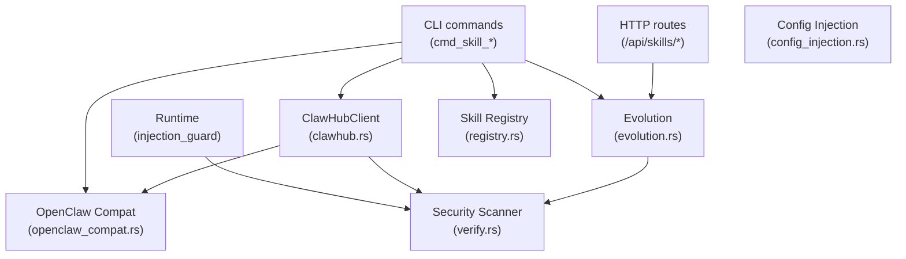

# Skills System

# Skills System

The Skills System (`librefang-skills`) manages the full lifecycle of skills: discovery and installation from the ClawHub marketplace, agent-driven creation and mutation, config variable injection into prompts, security scanning, and atomic filesystem operations.

## Architecture


```mermaid
graph TD
    CLI["CLI commands<br/>(cmd_skill_*)"]
    Routes["HTTP routes<br/>(/api/skills/*)"]
    Runtime["Runtime<br/>(injection_guard)"]

    ClawHub["ClawHubClient<br/>(clawhub.rs)"]
    Evolution["Evolution<br/>(evolution.rs)"]
    ConfigInj["Config Injection<br/>(config_injection.rs)"]
    Verify["Security Scanner<br/>(verify.rs)"]
    OpenClaw["OpenClaw Compat<br/>(openclaw_compat.rs)"]
    Registry["Skill Registry<br/>(registry.rs)"]

    CLI --> ClawHub
    CLI --> Evolution
    CLI --> Registry
    CLI --> OpenClaw
    Routes --> Evolution
    Runtime --> Verify

    ClawHub --> OpenClaw
    ClawHub --> Verify
    Evolution --> Verify
```

---

## Skill Formats

The system recognizes three skill formats, auto-detected during installation:

| Format | Detection | Description |
|--------|-----------|-------------|
| **SKILL.md** | Content starts with `---` (YAML frontmatter) | Prompt-only skill; no code execution |
| **package.json** | JSON file with skill metadata | Node.js skill with tool implementations |
| **skill.toml** | LibreFang native manifest | The internal canonical format; all other formats are converted to this on install |

Each installed skill lives in its own directory under the skills root, containing at minimum a `skill.toml` manifest and optionally a `prompt_context.md` file.

---

## ClawHub Marketplace Client

**File:** `clawhub.rs`

`ClawHubClient` handles all interaction with the ClawHub marketplace at `clawhub.ai/api/v1`. It downloads, converts, security-scans, and installs community skills.

### Construction

```rust
let client = ClawHubClient::new(cache_dir_path);
// Or with a custom base URL (for testing):
let client = ClawHubClient::with_url("http://localhost:8080/api/v1", cache_dir);
```

TLS verification is skipped when the environment variable `LIBREFANG_DANGEROUSLY_SKIP_TLS_VERIFICATION` is set to `true` or `1` — intended exclusively for local testing.

### API Methods

| Method | Endpoint | Returns |
|--------|----------|---------|
| `search(query, limit)` | `GET /api/v1/search?q=...&limit=N` | `ClawHubSearchResponse` — note the root key is `results`, not `items` |
| `browse(sort, limit, cursor)` | `GET /api/v1/skills?sort=...&limit=N&cursor=...` | `ClawHubBrowseResponse` with paginated `items` |
| `get_skill(slug)` | `GET /api/v1/skills/{slug}` | `ClawHubSkillDetail` with nested `skill`, `owner`, `latestVersion` |
| `get_file(slug, path)` | `GET /api/v1/skills/{slug}/file?path=SKILL.md` | Raw file content as `String` |
| `install(slug, target_dir)` | `GET /api/v1/download?slug=...` | `ClawHubInstallResult` after full security pipeline |
| `install_from_bytes(slug, target_dir, bytes)` | (no network call) | Same pipeline on raw bytes from an external source |
| `is_installed(slug, skills_dir)` | (no network call) | `bool` |

Browse sort orders: `ClawHubSort::Trending`, `Updated`, `Downloads`, `Stars`, `Rating`.

### Rate Limiting and Retry

All HTTP calls go through `get_with_retry`, which handles:

- **429 Too Many Requests** — respects the `Retry-After` header (capped at 30 s); otherwise uses exponential backoff with jitter
- **5xx server errors** — same retry strategy
- Up to **5 attempts** total, with base delay 1.5 s doubling each round

On final failure, returns either `SkillError::RateLimited` (for 429) or `SkillError::Network`.

### Install Security Pipeline

`install()` runs a multi-stage pipeline before writing anything to disk:

1. **Fetch detail** to obtain `expected_sha256` from the registry (best-effort; installation proceeds without it if the endpoint fails)
2. **Download** the skill archive
3. **SHA256 checksum** — if the registry provided an expected hash, a mismatch returns `SkillError::SecurityBlocked` immediately (no files written)
4. **Detect format** (SKILL.md frontmatter vs ZIP magic bytes `PK` vs package.json)
5. **Extract** into a staging directory (`.staging-{slug}-{pid}-{counter}`) on a blocking thread to avoid stalling the tokio runtime
6. **Convert** to LibreFang `skill.toml` via the OpenClaw compatibility layer
7. **Prompt injection scan** — blocks installation on critical-severity findings; the staging directory is cleaned up
8. **Manifest security scan** via `SkillVerifier::security_scan`
9. **Binary dependency check** — warns (does not block) if declared binaries are missing from `PATH`
10. **Atomic promotion** — `rename()` the staging directory to the final skill directory, replacing any previous version

### Slug Validation

`validate_slug` rejects empty slugs and any slug containing characters other than `[a-zA-Z0-9_-]`. This prevents path traversal during directory construction.

### Path Safety

`resolve_skill_child_path` rejects absolute paths and any path component that is not `Component::Normal` — blocking `..`, prefix, and root components inside zip archives.

---

## Skill Evolution

**File:** `evolution.rs`

The evolution module enables agents to create, update, patch, and delete PromptOnly skills autonomously. Every mutation is versioned, security-scanned, and serialized through file locks.

### Core Operations

| Function | Purpose | Version Bump |
|----------|---------|-------------|
| `create_skill(skills_dir, name, description, prompt_context, tags, author)` | Create a new PromptOnly skill | Sets `0.1.0` |
| `update_skill(skill, new_prompt_context, changelog, author)` | Full rewrite of prompt_context | Patch bump (`0.1.0` → `0.1.1`) |
| `patch_skill(skill, old_str, new_str, changelog, replace_all, author)` | Fuzzy find-and-replace on prompt_context | Patch bump |
| `rollback_skill(skill, author)` | Revert to previous version | Patch bump |
| `delete_skill(skills_dir, name)` | Agent-facing delete; refuses non-local skills | — |
| `uninstall_skill(skills_dir, name)` | User-facing delete; removes any skill | — |
| `write_supporting_file(skill, rel_path, content)` | Write to `references/`, `templates/`, `scripts/`, or `assets/` | No version change |
| `remove_supporting_file(skill, rel_path)` | Remove a supporting file; cleans empty parent dirs | No version change |

### Fuzzy Matching (6 Strategies)

`patch_skill` delegates to `fuzzy_find_and_replace`, which tries six strategies in order from strict to loose:

1. **Exact** — literal substring match
2. **LineTrimmed** — trim leading/trailing whitespace on each line, then substring match
3. **WhitespaceNormalized** — collapse whitespace runs to single space per line
4. **IndentFlexible** — strip all leading whitespace
5. **BlockAnchor** — match first + last lines exactly, require ≥60% middle-line similarity
6. **WhitespaceStripped** — remove all whitespace from both sides, then substring match. Includes a 3-character minimum needle guard to prevent English false positives (designed for CJK content where inter-character spaces carry no semantic meaning)

If all strategies fail, the error includes the closest-matching lines from the content (Jaccard character-set similarity > 0.3) to help the agent self-correct.

Empty `old_str` is rejected unconditionally — `str.replace("", new_str)` would insert at every character boundary.

### Concurrency Control

Every mutation acquires an exclusive file lock via `fs2::FileExt::lock_exclusive` (flock on Unix, LockFileEx on Windows):

- Lock files live in `.evolution-locks/` **adjacent to** the skill directory, not inside it — this allows `delete_skill` to hold the lock across `remove_dir_all` (Windows cannot delete a directory containing an open file handle)
- Under the lock, operations re-read `skill.toml` and `prompt_context.md` from disk to get the current version, preventing lost updates from concurrent writers
- The lock is held until the function returns (RAII via the `_lock` variable)

### Atomic Writes

`atomic_write` writes to a temp file named `.tmp.{filename}.{pid}.{tid}.{counter}.{nanos}`, then `rename()`s it into place. The monotonic `ATOMIC_WRITE_COUNTER` prevents same-process collisions even when two threads target the same path through different call paths.

### Version History

Each skill tracks evolution metadata in `.evolution.json` alongside `skill.toml`:

```rust
pub struct SkillEvolutionMeta {
    pub versions: Vec<SkillVersionEntry>,  // newest last, capped at 10
    pub use_count: u64,
    pub evolution_count: u64,  // total entries ever written (pre-truncation)
    pub mutation_count: u64,   // changes after initial create
}
```

- `evolution_count` bumps on every `record_version` call (including the initial create)
- `mutation_count` bumps only on post-create edits (update, patch, rollback)
- `use_count` is bumped by `record_skill_usage` after successful tool invocations (separate from the evolve operations themselves)
- Version history is capped at `MAX_VERSION_HISTORY` (10); oldest entries are trimmed
- Rollback snapshots are stored in `.rollback/prompt_context_{timestamp}_{nanos}_{pid}.md`

### Delete vs. Uninstall

- `delete_skill` — the **agent-facing** path. Validates the skill name, checks the manifest `source` field, and refuses to delete anything not marked `Local` or `Native`. Skills with no `source` field are also rejected (prevents deleting unclassified legacy installs).
- `uninstall_skill` — the **user-facing** path (dashboard "Uninstall" button, CLI `librefang skill remove`). Removes any installed skill regardless of source. Only validates against path-traversal characters.

Both acquire the per-skill lock and re-check existence under it.

### Supporting Files

Supporting files must live under one of four allowed subdirectories: `references`, `templates`, `scripts`, `assets`. Files are size-limited to 1 MiB and undergo prompt injection scanning before write. Path traversal and absolute paths are rejected; canonical-path containment is verified to prevent symlink escape. Directory walking for listing is depth-limited to 16 levels.

### EvolutionResult

All operations return `EvolutionResult`, which carries:

- `success`, `message`, `skill_name`, `version`
- `match_strategy` and `match_count` (patch operations only)
- `evolution_count`, `mutation_count`, `use_count` — post-operation counters read from `.evolution.json`, so callers don't need a separate query

---

## Config Injection

**File:** `config_injection.rs`

Skills declare global configuration values via `[[config_vars]]` in their `skill.toml`. This module collects, resolves, and formats them for injection into the system prompt.

### Declaration Format (in `skill.toml`)

```toml
[[config_vars]]
key = "wiki.base_url"
description = "Base URL of the internal wiki"
default = "https://wiki.example.com"

[[config_vars]]
key = "wiki.api_key"
description = "API key for wiki access"
```

### Resolution Pipeline

1. **`collect_config_vars(skills)`** — gathers declarations from all enabled skills, deduplicating by key (first declaration wins; duplicate keys from different skills keep the first skill's description). Skips entries with empty key or description.

2. **`resolve_config_vars(vars, config_toml)`** — walks each logical key as `skills.config.<key>` in the parsed TOML tree (e.g., `wiki.base_url` resolves against `[skills.config.wiki] base_url = "..."`). Falls back to the declared `default`. Omits variables with neither a config value nor a default (avoids injecting empty noise). Empty-string values are treated as absent.

3. **`format_config_section(resolved)`** — produces the prompt section:

```
## Skill Config Variables
wiki.base_url = https://wiki.example.com
db.host = localhost
```

Returns an empty string when there are no resolved variables, so callers can cheaply skip injection with `is_empty()`.

### Storage Convention

Declared keys use a logical dotted path. In `~/.librefang/config.toml`:

```toml
[skills.config.wiki]
base_url = "https://wiki.corp.example.com"
```

This resolves the key `wiki.base_url` to `"https://wiki.corp.example.com"`. TOML scalars (strings, integers, booleans, datetimes) render directly; tables and arrays render as compact TOML (unlikely in practice but handled gracefully).

---

## Integration Points

### CLI

The CLI (`librefang-cli`) drives most skill operations:
- `cmd_skill_install` → `ClawHubClient::install`, `detect_openclaw_skill`, `convert_openclaw_skill`
- `cmd_skill_search` → `ClawHubClient::search`
- `cmd_skill_list` → `SkillRegistry::load_all`
- `cmd_skill_evolve` → `create_skill`, `patch_skill`, `update_skill`, `delete_skill`, `rollback_skill`, `write_supporting_file`, `remove_supporting_file`
- `cmd_skill_publish` → `prepare_local_skill`, `package_prepared_skill`, `publish_bundle`
- `cmd_doctor` → `SkillRegistry::load_all`, `SkillVerifier::scan_prompt_content`

### HTTP API

The web routes (`src/routes/skills.rs`) expose evolution operations to the frontend and agents:
- `evolve_patch_skill` → `patch_skill` → `fuzzy_find_and_replace`
- `evolve_update_skill` → `update_skill`
- `evolve_remove_file` → `remove_supporting_file`
- `approve_pending_candidate` → `create_skill` (via the skill workshop)

### Runtime

The runtime's injection guard calls `SkillVerifier::scan_prompt_content` to scan tool results for prompt injection, reusing the same scanner that the evolution pipeline uses for skill content.

---

## Error Handling

Operations return `Result<_, SkillError>` with variants including:

- `SkillError::NotFound` — skill or file doesn't exist
- `SkillError::AlreadyInstalled` — create on an existing name
- `SkillError::SecurityBlocked` — prompt injection, checksum mismatch, unauthorized delete, path escape
- `SkillError::InvalidManifest` — validation failures (name, size, empty old_str, unrecognized format)
- `SkillError::Network` — HTTP failures after all retries exhausted
- `SkillError::RateLimited` — 429 after 5 attempts
- `SkillError::Io` — filesystem errors, lock acquisition failures