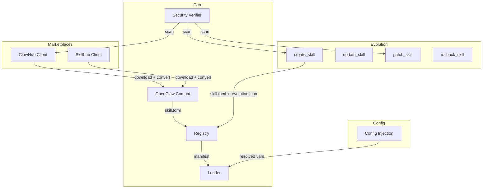

# Skills System

# Skills System

The Skills System is LibreFang's plugin architecture for extending agent capabilities. Skills encapsulate reusable knowledge, tool definitions, and runtime behaviors that agents can load on demand. The module handles the full lifecycle: discovery on community marketplaces, installation with security scanning, agent-driven creation and mutation, configuration injection, and execution.

## Architecture


```mermaid
graph TD
    subgraph Marketplaces
        CH[ClawHub Client]
        SH[Skillhub Client]
    end

    subgraph Core
        REG[Registry]
        LDR[Loader]
        OCS[OpenClaw Compat]
        VFY[Security Verifier]
    end

    subgraph Evolution
        CRT[create_skill]
        UPD[update_skill]
        PAT[patch_skill]
        ROL[rollback_skill]
    end

    subgraph Config
        CCI[Config Injection]
    end

    CH -->|download + convert| OCS
    SH -->|download + convert| OCS
    OCS -->|skill.toml| REG
    REG -->|manifest| LDR
    VFY -->|scan| CH
    VFY -->|scan| CRT
    VFY -->|scan| PAT
    CRT -->|skill.toml + .evolution.json| REG
    CCI -->|resolved vars| LDR
```

Skills come in two runtime types:

- **PromptOnly** — pure prompt text injected into the agent's system prompt. No code execution. Stored as `SKILL.md` or `prompt_context.md`.
- **Node.js / Shell** — executable skills with tool definitions that the agent invokes at runtime. Defined in `package.json` or `skill.toml` with `runtime.entry`.

Every installed skill is represented on disk as a directory containing at minimum a `skill.toml` manifest. The registry discovers skills by scanning the skills directory on startup.

---

## ClawHub Marketplace Client

**File:** `clawhub.rs`

`ClawHubClient` handles search, browse, detail-fetching, and installation of skills from the ClawHub community registry at `clawhub.ai/api/v1`.

### API Endpoints

| Method | Endpoint | Purpose |
|--------|----------|---------|
| `search` | `GET /api/v1/search?q=...&limit=N` | Semantic/keyword search |
| `browse` | `GET /api/v1/skills?limit=N&sort=trending` | Paginated browsing |
| `get_skill` | `GET /api/v1/skills/{slug}` | Full skill detail + SHA256 |
| `get_file` | `GET /api/v1/skills/{slug}/file?path=SKILL.md` | Fetch a single file |
| `install` | `GET /api/v1/download?slug=...` | Download and install |

### Retry and Rate Limiting

All HTTP requests go through `get_with_retry`, which implements exponential backoff with jitter:

- Up to **5 attempts** (`MAX_RETRIES`)
- Base delay of **1.5s**, doubling each attempt, capped at **30s** (`MAX_DELAY_MS`)
- Respects the `Retry-After` header when the API returns 429
- Retries on 429 and 5xx; fails immediately on 4xx (other than 429)

### TLS Configuration

Set `LIBREFANG_DANGEROUSLY_SKIP_TLS_VERIFICATION=true` or `1` to disable TLS verification (testing only). This uses `crate::http_client::dangerous_client_builder()`.

### Installation Pipeline

`install()` executes a 7-step security pipeline:

1. **Fetch detail** — retrieves `expected_sha256` from the registry (best-effort; continues without it on failure)
2. **Download + SHA256** — computes `sha256` of the downloaded bytes; if the registry provided `expected_sha256`, mismatches are rejected immediately (`SkillError::SecurityBlocked`)
3. **Detect format** — SKILL.md (starts with `---`), zip archive (PK header), or raw package.json
4. **Convert** — `openclaw_compat` converts SKILL.md or OpenClaw format into a LibreFang `SkillManifest`
5. **Prompt injection scan** — `SkillVerifier::scan_prompt_content` blocks skills with critical-severity findings
6. **Binary dependency check** — warns for each required binary not found on `$PATH` via `which_check`
7. **Write** — writes `skill.toml` with `verified: false`

All extraction happens in a **staging directory** (`.staging-{slug}-{pid}-{counter}`), then atomically renamed to the final skill directory. A process-local `AtomicU64` counter guarantees unique staging paths even under concurrent installs.

### Path Safety

Two helpers enforce safe path resolution:

- **`resolve_skill_dir(target_dir, slug)`** — joins `target_dir` with a validated slug
- **`resolve_skill_child_path(skill_dir, relative)`** — rejects absolute paths and non-`Normal` path components (no `..`, no root)

### Slug Validation

`validate_slug` requires non-empty ASCII alphanumeric + `-` + `_` only. This is applied before any URL construction or filesystem operation.

### Key Types

| Type | Source Endpoint | Notes |
|------|----------------|-------|
| `ClawHubBrowseEntry` | `/api/v1/skills` | Full stats, version tags (map, not list) |
| `ClawHubSearchEntry` | `/api/v1/search` | Flatter; includes relevance `score` |
| `ClawHubSkillDetail` | `/api/v1/skills/{slug}` | Nested `skill`, `owner`, `expected_sha256` |
| `ClawHubInstallResult` | — | Post-install summary with warnings and tool translations |

All timestamps from ClawHub are **Unix milliseconds**. The `tags` field is a `HashMap<String, String>` (e.g. `{"latest": "1.0.0"}`), not a list. Search responses use the key `results` (not `items`).

### Backward Compatibility Aliases

`ClawHubListResponse`, `ClawHubSearchResults`, and `ClawHubEntry` are type aliases kept for callers that reference the old names.

---

## Skill Self-Evolution

**File:** `evolution.rs`

The evolution module enables agents to autonomously create, modify, and manage PromptOnly skills. Every mutation is versioned, locked, and security-scanned.

### Core Operations

| Function | Purpose | Locks | Version Bump |
|----------|---------|-------|-------------|
| `create_skill` | New PromptOnly skill | Yes | Sets `0.1.0` |
| `update_skill` | Full prompt rewrite | Yes | Patch bump |
| `patch_skill` | Fuzzy find-and-replace | Yes | Patch bump |
| `rollback_skill` | Revert to previous snapshot | Yes | Patch bump |
| `delete_skill` | Agent-initiated removal (local skills only) | Yes | — |
| `uninstall_skill` | User-initiated removal (any source) | Yes | — |
| `write_supporting_file` | Add file under `references/`, `templates/`, etc. | Yes | — |
| `remove_supporting_file` | Remove supporting file | Yes | — |

### Concurrency: File Locking

Every mutation acquires an **exclusive file lock** via `acquire_skill_lock` before touching the filesystem. Lock files live at `{skills_dir}/.evolution-locks/{name}.lock` — outside the skill directory so that `remove_dir_all` doesn't conflict with the open handle (important on Windows).

The pattern is: **lock → re-check existence → read live state → mutate → write → release**. This prevents TOCTOU races between concurrent `patch_skill` calls or a `delete_skill` racing with an `update_skill`.

### Atomic Writes

All file writes go through `atomic_write`, which writes to a temp file (named with pid + thread id + monotonic counter + nanosecond timestamp) then renames to the final path. A process-local `AtomicU64` counter prevents temp-file collisions within a single process.

### Fuzzy Find-and-Replace

`fuzzy_find_and_replace` tries 6 strategies in strict-to-loose order:

1. **Exact** — literal substring
2. **LineTrimmed** — trim each line's whitespace
3. **WhitespaceNormalized** — collapse whitespace runs to single space
4. **IndentFlexible** — strip all leading whitespace per line
5. **BlockAnchor** — match first+last lines, require ≥60% middle-line similarity
6. **WhitespaceStripped** — remove all whitespace from both sides, substring match (CJK-friendly)

Each strategy returns a `MatchStrategy` enum variant and match count. When `old_str` is empty, the operation is rejected outright (would insert `new_str` at every character boundary). When multiple matches exist and `replace_all` is false, an error lists the count so the agent can decide.

On failure, `closest_lines` surfaces the top 3 most-similar lines (Jaccard character overlap ≥ 0.3) as "did you mean?" hints.

### Version Tracking

Version history is stored in `.evolution.json` alongside `skill.toml`:

```
SkillEvolutionMeta {
    versions: Vec<SkillVersionEntry>,  // newest last, max 10
    use_count: u64,                    // bumped by record_skill_usage
    evolution_count: u64,              // total entries written
    mutation_count: u64,               // post-creation mutations only
}
```

`create_skill` records the initial version with `is_mutation = false`, so `mutation_count` starts at 0. Each subsequent update/patch/rollback increments `mutation_count`. `evolution_count` tracks total version entries (including creation).

Rollback snapshots are saved as `.rollback/prompt_context_{timestamp_ns}_{pid}.md`, capped at 10 per skill.

### Security Checks

- **Name validation** (`validate_name`): 1–64 chars, `[a-z0-9_-]`, must start with alphanumeric
- **Content validation** (`validate_prompt_content`): max 160,000 chars; `SkillVerifier::scan_prompt_content` blocks critical-severity findings
- **Delete guard**: `delete_skill` refuses to remove non-local skills (checks `manifest.source`). `uninstall_skill` has no source restriction — operator intent overrides
- **Path traversal**: `delete_skill`, `uninstall_skill`, `write_supporting_file`, and `remove_supporting_file` all validate paths and canonicalize to prevent symlink-based escapes

### Supporting Files

Skills can store additional files in four subdirectories: `references/`, `templates/`, `scripts/`, `assets/`. Maximum file size is 1 MiB. `write_supporting_file` runs a security scan before writing and a containment check after canonicalization. `list_supporting_files` walks subdirectories recursively (max depth 16, symlinks not followed).

### `EvolutionResult`

Every operation returns an `EvolutionResult` carrying post-operation counters (`evolution_count`, `mutation_count`, `use_count`) so agents don't need a separate metadata query. Patch operations additionally return `match_strategy` and `match_count`.

---

## Config Variable Injection

**File:** `config_injection.rs`

Skills declare config dependencies via `[[config_vars]]` in `skill.toml`:

```toml
[[config_vars]]
key = "wiki.base_url"
description = "Base URL of the internal wiki"
default = "https://wiki.example.com"
```

### Resolution Pipeline

1. **`collect_config_vars(skills)`** — gathers declarations from all enabled skills, deduplicating by key (first declaration wins)
2. **`resolve_config_vars(vars, config_toml)`** — walks `skills.config.<key>` in the user's `config.toml`, falling back to the declared `default`; omits keys with no value and no default
3. **`format_config_section(resolved)`** — formats as a system-prompt section:

```
## Skill Config Variables
wiki.base_url = https://wiki.corp.example.com
db.host = localhost
```

### Storage Convention

Logical keys use dotted paths. `wiki.base_url` resolves by walking `skills` → `config` → `wiki` → `base_url` in the TOML tree. The `resolve_dotpath` helper descends through tables only; non-table nodes return `None`. Scalar values are stringified directly; arrays and tables fall back to TOML serialization.

Incomplete declarations (empty key or empty description) are silently skipped. Empty-string values in config are treated as absent and fall back to the default.

---

## Integration Points

### HTTP Client (`http_client.rs`)

`ClawHubClient` uses `crate::http_client::client_builder()` (with rustls and system root certs) or `dangerous_client_builder()` when the `LIBREFANG_DANGEROUSLY_SKIP_TLS_VERIFICATION` env var is set.

### OpenClaw Compatibility (`openclaw_compat.rs`)

The `ClawHubClient::install` pipeline delegates format detection and conversion to the `openclaw_compat` module:
- `detect_skillmd` / `convert_skillmd` for SKILL.md-format skills
- `detect_openclaw_skill` / `convert_openclaw_skill` for package.json-format skills
- `write_librefang_manifest` serializes the final `skill.toml`

### Security Verification (`verify.rs`)

`SkillVerifier` provides two scan entry points used across the module:
- `scan_prompt_content` — prompt injection detection (blocks on `WarningSeverity::Critical`)
- `security_scan` — manifest-level security checks
- `sha256_hex` — content hashing for version tracking

### Registry and Routes

Installed skills are discovered by the registry (`registry.rs`) on startup. The HTTP routes in `src/routes/skills.rs` are the primary callers:
- `clawhub_search`, `clawhub_browse`, `clawhub_install` → `ClawHubClient`
- `evolve_update_skill`, `evolve_patch_skill`, `evolve_rollback_skill` → evolution operations
- `get_skill_detail` → `list_supporting_files` + `get_evolution_info`

### Error Types

All operations return `Result<_, SkillError>`. Key variants used by this module:

| Variant | Meaning |
|---------|---------|
| `Network(msg)` | HTTP failures, parse errors, retries exhausted |
| `RateLimited(msg)` | 429 after all retries |
| `SecurityBlocked(msg)` | SHA256 mismatch, prompt injection, delete guard |
| `InvalidManifest(msg)` | Validation failures (name, slug, content size, format) |
| `AlreadyInstalled(name)` | `create_skill` on an existing skill |
| `NotFound(name)` | Rollback/patch/delete on a missing skill |
| `Io(err)` | Filesystem errors |