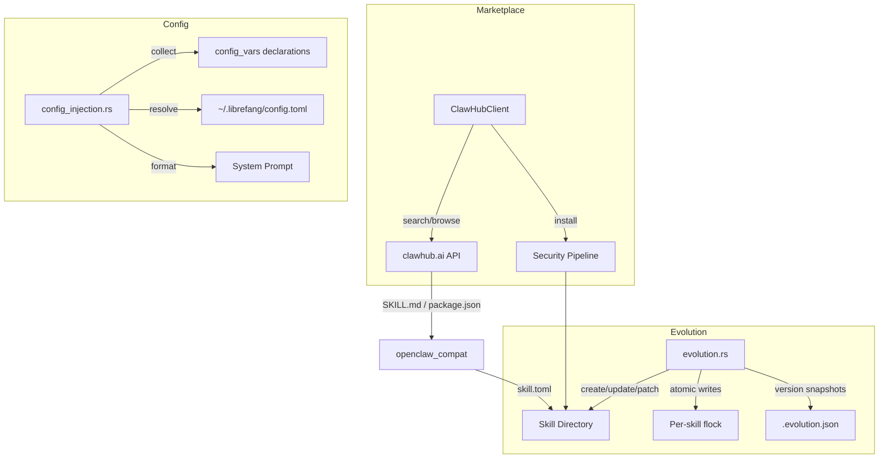

# Skills System

# Skills System

The Skills System manages the full lifecycle of skills — searchable units of capability that agents can invoke at runtime. It covers marketplace discovery, installation with security scanning, agent-driven creation and mutation, configuration injection, and version-tracked evolution with rollback.

## Architecture Overview


```mermaid
graph TD
    subgraph "Marketplace"
        CH[ClawHubClient]
        CH -->|search/browse| API[clawhub.ai API]
        CH -->|install| SEC[Security Pipeline]
    end

    subgraph "Evolution"
        EV[evolution.rs]
        EV -->|create/update/patch| SKILL[Skill Directory]
        EV -->|atomic writes| LOCK[Per-skill flock]
        EV -->|version snapshots| HIST[.evolution.json]
    end

    subgraph "Config"
        CI[config_injection.rs]
        CI -->|collect| VARS[config_vars declarations]
        CI -->|resolve| CFG[~/.librefang/config.toml]
        CI -->|format| PROMPT[System Prompt]
    end

    SEC --> SKILL
    API --> |"SKILL.md / package.json"| COMPAT[openclaw_compat]
    COMPAT --> |"skill.toml"| SKILL
```

## Skill Package Format

Every installed skill is a directory containing a `skill.toml` manifest. Prompt-only skills also have a `prompt_context.md` file.

```
skills/
└── my-skill/
    ├── skill.toml              # Manifest (always present)
    ├── prompt_context.md       # Prompt content (PromptOnly runtime)
    ├── .evolution.json         # Version history + counters
    ├── .rollback/              # Named snapshots for rollback
    ├── references/             # Supporting files
    ├── templates/
    ├── scripts/
    └── assets/
```

The `skill.toml` follows this structure:

```toml
[skill]
name = "my-skill"
version = "0.1.0"
description = "What this skill does"
author = "agent-evolved"
tags = ["automation"]

[runtime]
runtime_type = "PromptOnly"
entry = ""

[[config_vars]]
key = "wiki.base_url"
description = "Base URL of the internal wiki"
default = "https://wiki.example.com"

[env_passthrough]
# ...
```

## ClawHub Marketplace Client

**Source:** `clawhub.rs`

`ClawHubClient` connects to the ClawHub marketplace API (`https://clawhub.ai/api/v1`) to search, browse, and install community skills. Skills arrive in two formats — SKILL.md (prompt-only) or package.json (Node.js) — and are converted to the LibreFang `skill.toml` manifest before installation.

### Construction

```rust
let client = ClawHubClient::new(PathBuf::from("/path/to/cache"));
// Or with a custom URL (e.g. staging):
let client = ClawHubClient::with_url("https://staging.clawhub.ai/api/v1", cache_dir);
```

TLS verification can be disabled by setting `LIBREFANG_DANGEROUSLY_SKIP_TLS_VERIFICATION=true` or `1` — intended only for testing against servers with expired certificates.

### API Methods

| Method | Endpoint | Purpose |
|--------|----------|---------|
| `search(query, limit)` | `GET /search?q=...&limit=...` | Semantic/vector search. Returns `ClawHubSearchResponse` with `results` key. |
| `browse(sort, limit, cursor)` | `GET /skills?sort=...&limit=...&cursor=...` | Paginated browsing by `Trending`, `Updated`, `Downloads`, `Stars`, or `Rating`. |
| `get_skill(slug)` | `GET /skills/{slug}` | Full detail including owner, stats, and `expected_sha256`. |
| `get_file(slug, path)` | `GET /skills/{slug}/file?path=...` | Fetch a specific file (e.g. `SKILL.md`, `README`). |
| `install(slug, target_dir)` | `GET /download?slug=...` | Full install pipeline (download → scan → extract → write). |
| `is_installed(slug, skills_dir)` | — | Check if `skill.toml` exists locally. |

### Rate Limit Handling

All API calls go through `get_with_retry`, which implements exponential backoff with jitter on HTTP 429 and 5xx responses. Up to 5 attempts (`MAX_RETRIES`). The `Retry-After` header is respected when present. Final failure returns either `SkillError::RateLimited` (for 429) or `SkillError::Network`.

### Installation Security Pipeline

`install()` and the shared `install_with_expected_sha256()` run this sequence:

1. **Fetch detail** — retrieve `expected_sha256` from the registry (best-effort; proceeds without it on failure).
2. **SHA256 verification** — computed digest is compared against the registry-supplied hash. Mismatch returns `SkillError::SecurityBlocked` immediately, before any files are created.
3. **Format detection & extraction** — content is classified as SKILL.md (starts with `---`), zip archive (magic bytes `PK`), or raw package.json. Extraction runs on a blocking thread to avoid stalling the tokio runtime.
4. **Conversion** — SKILL.md and OpenClaw formats are converted to LibreFang manifests via `openclaw_compat`, including tool name translation.
5. **Prompt injection scan** — `SkillVerifier::scan_prompt_content()` checks for critical injection patterns. Critical-severity findings block installation and clean up the staging directory.
6. **Manifest security scan** — `SkillVerifier::security_scan()` validates the manifest itself.
7. **Supply-chain audit** — `supply_chain::scan()` rejects bundles containing dangerous files (e.g. `.pth`, `.pyc`). Blocked bundles are deleted before reaching the live directory.
8. **Atomic promotion** — extraction happens in a `.staging-{slug}-{pid}-{counter}` directory, then `rename()` swaps it into the final location. Previous versions are replaced atomically.

### Slug Validation

All public methods validate slugs via `validate_slug`: non-empty, ASCII alphanumeric plus `-` and `_` only. This prevents path traversal through the slug parameter.

### Path Safety

`resolve_skill_child_path` rejects absolute paths and any path component that isn't `Component::Normal` — this blocks `..` traversal in zip entries and file paths.

## Skill Evolution

**Source:** `evolution.rs`

The evolution module enables agents to autonomously create, update, patch, and delete PromptOnly skills. All mutations are serialized with per-skill file locks, versioned with rollback snapshots, and scanned for security threats.

### Core Operations

#### `create_skill(skills_dir, name, description, prompt_context, tags, author)`

Creates a new PromptOnly skill from scratch. Validates the name (`[a-z0-9_-]`, max 64 chars), prompt content size (max 160,000 chars), and runs prompt injection scanning. Writes `skill.toml` and `prompt_context.md` atomically. Records the initial version in `.evolution.json` with `mutation_count = 0`.

#### `update_skill(skill, new_prompt_context, changelog, author)`

Full replacement of a skill's prompt content. Re-reads the manifest from disk under the lock to get the current version (preventing duplicate versions under concurrent writes), saves a rollback snapshot, bumps the patch version, and writes both files atomically.

#### `patch_skill(skill, old_str, new_str, changelog, replace_all, author)`

Incremental fuzzy find-and-replace on the prompt content. Reads current content from disk under the lock, applies fuzzy matching (see below), validates the result, bumps version, and records the change. Returns the `MatchStrategy` that succeeded and the match count in `EvolutionResult`.

#### `delete_skill(skills_dir, name)`

Agent-facing deletion. Only allows removing skills with `source = "local"` or `source = "native"` in their manifest. Refuses to delete marketplace or bundled skills. Requires the same `validate_name` constraints as creation.

#### `uninstall_skill(skills_dir, name)`

User-facing deletion (dashboard, CLI). Removes any installed skill regardless of source. Less restrictive name validation (allows any existing name) but still blocks path traversal.

### Fuzzy Matching Strategies

LLM-generated patches often don't match source content exactly. `fuzzy_find_and_replace` tries six strategies in order, from strictest to most lenient:

| # | Strategy | Description |
|---|----------|-------------|
| 1 | **Exact** | Literal substring match |
| 2 | **LineTrimmed** | Trim leading/trailing whitespace per line |
| 3 | **WhitespaceNormalized** | Collapse whitespace runs to single space |
| 4 | **IndentFlexible** | Strip all leading whitespace per line |
| 5 | **BlockAnchor** | Match first + last line, verify middle ≥60% similar |
| 6 | **WhitespaceStripped** | Remove ALL whitespace from both sides (CJK-friendly) |

When all strategies fail, the error message includes the closest matching lines from the content (Jaccard character-set similarity, top 3, threshold >0.3) so the agent can self-correct on the next attempt.

The WhitespaceStripped strategy requires a minimum needle length of 3 characters to avoid false positives (e.g., stripped `"a"` matching inside `"banana"`). Match positions are mapped back to original byte offsets to preserve surrounding content.

### Version Management

Each skill stores a `.evolution.json` file alongside its manifest:

```json
{
  "versions": [
    {
      "version": "0.1.2",
      "timestamp": "2026-03-15T10:30:00+00:00",
      "changelog": "Fixed output format [strategy: Exact, matches: 1]",
      "content_hash": "sha256hex...",
      "author": "agent:abc-123"
    }
  ],
  "use_count": 42,
  "evolution_count": 5,
  "mutation_count": 3
}
```

- **`evolution_count`** — total version entries written, including the initial creation.
- **`mutation_count`** — post-creation edits only. A freshly created skill reports `0`.
- **`use_count`** — bumped by `record_skill_usage` after successful tool invocation.
- Version history is capped at 10 entries (`MAX_VERSION_HISTORY`); oldest entries are trimmed.
- `bump_patch_version` uses the `semver` crate, clearing pre-release tags and build metadata on bump.

### Concurrency and Atomicity

**File locking:** Every mutation acquires an exclusive flock (`fs2::FileExt::lock_exclusive`) on `{skills_dir}/.evolution-locks/{name}.lock` — a file *outside* the skill directory so it survives `remove_dir_all` (important on Windows where open handles block deletion). The lock is held for the entire operation, including the final rename or delete.

**Atomic writes:** All file mutations use `atomic_write`, which writes to a temp file (named with pid, thread id, monotonic counter, and nanosecond timestamp) then renames into place. A per-process `AtomicU64` counter prevents same-nanosecond collisions.

**Lock-first, read-after-lock:** `update_skill` and `patch_skill` re-read `skill.toml` from disk *after* acquiring the lock to compute the correct next version. Without this, concurrent updates would all compute the same bump (e.g., 10 writers all computing `0.1.0 → 0.1.1`).

### Supporting Files

Skills can store reference material in four allowed subdirectories: `references/`, `templates/`, `scripts/`, `assets/`.

- `write_supporting_file(skill, rel_path, content)` — validates path containment (canonicalizes both paths to detect symlink escapes), enforces a 1 MiB size limit, scans content for prompt injection, writes atomically.
- `remove_supporting_file(skill, rel_path)` — same containment check, removes the file, cleans up empty parent directories upward. On missing files, lists available files in the subdirectory as a hint.

### Security Checks in the Evolution Pipeline

Every mutation flows through `validate_prompt_content`, which:

1. Enforces the 160,000 character limit (~55k tokens).
2. Calls `SkillVerifier::scan_prompt_content` which runs the global scanner with compiled threat patterns.
3. Blocks on `WarningSeverity::Critical` findings, returning `SkillError::SecurityBlocked` with the specific violations.

The call graph shows this security scan is invoked consistently across all mutation paths — `update_skill`, `patch_skill`, `rollback_skill`, and `write_supporting_file` — ensuring no content bypasses threat detection.

## Config Variable Injection

**Source:** `config_injection.rs`

Skills declare configuration dependencies via `[[config_vars]]` in their manifest. The config injection pipeline resolves these against the user's `~/.librefang/config.toml` and formats them as a system-prompt section.

### Three-Phase Pipeline

```rust
// 1. Collect declarations from enabled skills (dedup by key, first wins)
let vars = collect_config_vars(&installed_skills);

// 2. Resolve against config TOML
let resolved = resolve_config_vars(&vars, &config_toml);

// 3. Format as prompt section (returns "" when empty)
let section = format_config_section(&resolved);
```

### Resolution Logic

For a declared key `wiki.base_url`, the resolver walks the TOML path `skills.config.wiki.base_url`. If the path is missing or its value is an empty string, the declared `default` is used. Variables with neither a config value nor a default are omitted entirely (empty strings add noise without information).

The `format_config_section` output:

```
## Skill Config Variables
wiki.base_url = https://wiki.corp.example.com
db.host = localhost
```

### Deduplication

When multiple skills declare the same config key, the first declaration encountered wins. This preserves deterministic behavior based on skill ordering. Disabled skills are excluded by the caller before calling `collect_config_vars`.

## Error Handling

The module uses `SkillError` variants throughout:

| Variant | When |
|---------|------|
| `Network` | HTTP failures, parse errors, retries exhausted |
| `RateLimited` | HTTP 429 after all retries |
| `InvalidManifest` | Bad slug, empty content, oversized content, unrecognized format |
| `SecurityBlocked` | SHA256 mismatch, prompt injection, supply-chain audit failure, unauthorized delete |
| `AlreadyInstalled` | `create_skill` on an existing name |
| `NotFound` | Operation on a non-existent skill or file |
| `Io` | Filesystem errors, lock acquisition failures |

## Testing Conventions

Tests across the module follow these patterns:

- **Serde round-trips** — API response types are tested against real ClawHub JSON payloads (verified Feb 2026).
- **Concurrent mutation** — `test_concurrent_updates_produce_unique_versions` spawns multiple tasks calling `update_skill` simultaneously and verifies no duplicate versions.
- **Lock contention** — `test_lock_prevents_concurrent_access` verifies that a held lock blocks a second writer.
- **Security rejection** — `install_rejects_bundle_with_pth_via_supply_chain_audit` crafts a zip with a `.pth` file and verifies it's rejected before reaching the live directory.
- **Fuzzy matching** — strategies are tested with CJK content, indented blocks, and whitespace variations.