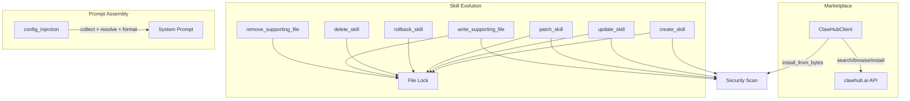

# Skills System

# Skills System

The skills system lets LibreFang agents discover, install, create, and iteratively refine reusable prompt-based capabilities. It spans three concerns: marketplace integration (ClawHub), configuration injection into the system prompt, and agent-driven skill evolution with version control.

## Architecture Overview


```mermaid
graph TD
    subgraph "Marketplace"
        CH[ClawHubClient] --> |search/browse/install| API[clawhub.ai API]
    end

    subgraph "Skill Evolution"
        CR[create_skill] --> LOCK[File Lock]
        UP[update_skill] --> LOCK
        PA[patch_skill] --> LOCK
        RB[rollback_skill] --> LOCK
        DEL[delete_skill] --> LOCK
        WF[write_supporting_file] --> LOCK
        RF[remove_supporting_file] --> LOCK
    end

    subgraph "Prompt Assembly"
        CI[config_injection] --> |collect + resolve + format| SP[System Prompt]
    end

    CH --> |install_from_bytes| SEC[Security Scan]
    CR --> SEC
    UP --> SEC
    PA --> SEC
    WF --> SEC
```

## Module Layout

All code lives under `librefang-skills/src/`:

| File | Purpose |
|------|---------|
| `clawhub.rs` | ClawHub marketplace HTTP client |
| `config_injection.rs` | Config variable declaration, resolution, and prompt formatting |
| `evolution.rs` | Agent-driven skill CRUD, fuzzy patching, version history |
| `verify.rs` | Security scanning pipeline (referenced, not shown) |
| `openclaw_compat.rs` | SKILL.md / OpenClaw format conversion (referenced, not shown) |

---

## ClawHub Marketplace Client

`ClawHubClient` handles all interaction with the ClawHub skill registry at `clawhub.ai/api/v1`.

### Construction

```rust
// Default production client
let client = ClawHubClient::new(PathBuf::from("/path/to/cache"));

// Custom endpoint (testing, mirrors)
let client = ClawHubClient::with_url("https://staging.clawhub.ai/api/v1", cache_dir);
```

TLS verification can be bypassed by setting the environment variable `LIBREFANG_DANGEROUSLY_SKIP_TLS_VERIFICATION=true` — intended only for testing against servers with expired certificates.

### API Methods

| Method | Endpoint | Returns |
|--------|----------|---------|
| `search(query, limit)` | `GET /api/v1/search?q=...&limit=N` | `ClawHubSearchResponse` (key: `results`) |
| `browse(sort, limit, cursor)` | `GET /api/v1/skills?limit=N&sort=...` | `ClawHubBrowseResponse` (key: `items`) |
| `get_skill(slug)` | `GET /api/v1/skills/{slug}` | `ClawHubSkillDetail` |
| `get_file(slug, path)` | `GET /api/v1/skills/{slug}/file?path=...` | Raw `String` |
| `install(slug, target_dir)` | `GET /api/v1/download?slug=...` + extraction | `ClawHubInstallResult` |
| `is_installed(slug, skills_dir)` | Local filesystem check | `bool` |

Browse sort orders: `Trending`, `Updated`, `Downloads`, `Stars`, `Rating` (enum `ClawHubSort`).

Search results are flatter than browse results — they carry `score` and a single `version` string rather than nested stats. The response key is `results`, not `items`.

### Retry and Rate Limiting

All HTTP calls go through `get_with_retry`, which:

1. Attempts up to `MAX_RETRIES` (5) requests.
2. On **429** or **5xx**: respects the `Retry-After` header (capped at 30 seconds), otherwise uses exponential backoff starting at 1.5 s with light jitter.
3. On final failure: returns `SkillError::RateLimited` (for 429) or `SkillError::Network`.

### Installation Pipeline

`install()` and `install_with_expected_sha256()` implement a multi-stage pipeline:

1. **Fetch detail** — retrieves `expected_sha256` from the registry (best-effort; proceeds without it on failure).
2. **Download** — fetches the skill archive bytes via `get_with_retry`.
3. **SHA256 verification** — if the registry provided `expected_sha256`, the computed digest must match. A mismatch returns `SkillError::SecurityBlocked` before any files are written to disk (supply-chain tampering protection, issue #3827).
4. **Extract to staging directory** — a sibling `.staging-{slug}-{pid}-{counter}` directory. A process-local `AtomicU64` counter guarantees uniqueness within a single process even when threads race. Zip archives are extracted entry-by-entry; SKILL.md frontmatter is detected and saved directly.
5. **Format detection and conversion** — `openclaw_compat` detects SKILL.md or OpenClaw `package.json` formats and converts to the LibreFang `SkillManifest` schema.
6. **Security scan** — `SkillVerifier::security_scan` on the manifest; `SkillVerifier::scan_prompt_content` on prompt text. Critical-severity prompt injection findings block the install (`SkillError::SecurityBlocked`), and the staging directory is cleaned up.
7. **Binary dependency check** — each `required_bins` entry is checked via `which`/`where`.
8. **Atomic promotion** — the staging directory is `rename()`'d to the final `{target_dir}/{slug}/` path. If a previous version exists, it is removed first.

### Slug Validation

`validate_slug` rejects empty strings and any byte not in `[a-zA-Z0-9_-]`. All public methods that accept a slug call this before constructing URLs or paths.

### Path Safety

`resolve_skill_child_path` rejects absolute paths and any path component that is not `Component::Normal` (blocks `..` traversal in zip entries).

### Backward-Compatible Aliases

`ClawHubListResponse`, `ClawHubSearchResults`, and `ClawHubEntry` are type aliases for their renamed counterparts, kept for compatibility with code referencing the old names.

---

## Config Injection

Skills declare configuration dependencies via `[[config_vars]]` in `skill.toml`. The config injection pipeline resolves these against the user's `~/.librefang/config.toml` and injects the results into the system prompt.

### Storage Convention

A declared key like `wiki.base_url` is looked up at the TOML path `skills.config.wiki.base_url`:

```toml
# ~/.librefang/config.toml
[skills.config.wiki]
base_url = "https://wiki.corp.example.com"
```

### Pipeline

```rust
// 1. Collect declarations from enabled skills (deduplicates by key; first wins)
let vars = collect_config_vars(&enabled_skills);

// 2. Resolve against the parsed config TOML tree
let resolved = resolve_config_vars(&vars, &config_toml);

// 3. Format as a prompt section (returns "" when empty)
let section = format_config_section(&resolved);
```

### Resolution Rules

- The dotted logical key is walked segment-by-segment through the TOML table tree.
- Empty-string values are treated as absent and fall back to the declared `default`.
- Variables with neither a config value nor a default are omitted entirely (avoids injecting blank noise).
- Scalar TOML types (string, integer, float, boolean, datetime) render as their natural string representation. Tables and arrays render as compact TOML as a fallback.

### Prompt Output Format

```
## Skill Config Variables
wiki.base_url = https://wiki.corp.example.com
db.host = localhost
```

The trailing newline is trimmed so the caller controls spacing. An empty `resolved` slice produces an empty string for a cheap `is_empty()` guard.

---

## Skill Evolution

The evolution module enables agents to autonomously create, mutate, and manage PromptOnly skills. All mutations are serialized per-skill via file locks, versioned with rollback snapshots, and security-scanned before write.

### Core Operations

| Function | Purpose | Mutates Version? |
|----------|---------|:-:|
| `create_skill` | Create a new PromptOnly skill from scratch | Creates v0.1.0 |
| `update_skill` | Full rewrite of `prompt_context.md` | Bumps patch |
| `patch_skill` | Fuzzy find-and-replace within `prompt_context.md` | Bumps patch |
| `rollback_skill` | Restore the previous version's content | Bumps patch |
| `delete_skill` | Remove a local/agent-created skill (source-gated) | — |
| `uninstall_skill` | Remove any installed skill regardless of source | — |
| `write_supporting_file` | Write to `references/`, `templates/`, `scripts/`, `assets/` | No |
| `remove_supporting_file` | Delete a supporting file and prune empty parents | No |
| `list_supporting_files` | Enumerate all supporting files recursively | No |

### Skill Naming Rules

`validate_name` enforces: 1–64 characters, starts with an alphanumeric, contains only `[a-z0-9_-]`.

### Prompt Content Validation

`validate_prompt_content` enforces:
- Maximum 160,000 characters (~55k tokens).
- Passes content through `SkillVerifier::scan_prompt_content`. Any `Critical`-severity finding blocks the operation and returns `SkillError::SecurityBlocked`.

### File Locking

Every mutation acquires an exclusive lock via `acquire_skill_lock` before touching the filesystem:

- Lock files live at `{skills_dir}/.evolution-locks/{skill_name}.lock` — outside the skill directory so `remove_dir_all` on the skill dir doesn't conflict with an open lock handle (Windows compatibility).
- Uses `fs2::FileExt::lock_exclusive()` (flock on Unix, LockFileEx on Windows).
- Operations re-check directory existence under the lock to handle concurrent deletes.

### Atomic Writes

All file writes go through `atomic_write`, which writes to a uniquely-named temp file then `rename()`s it into place. Temp file names incorporate PID, thread ID, a monotonic `AtomicU64` counter, and a nanosecond timestamp to prevent collisions. If either the write or the rename fails, the temp file is cleaned up.

### Version History

Each skill stores `.evolution.json` alongside `skill.toml`:

```rust
pub struct SkillEvolutionMeta {
    pub versions: Vec<SkillVersionEntry>,  // newest last
    pub use_count: u64,                    // successful invocations
    pub evolution_count: u64,              // total version entries written
    pub mutation_count: u64,               // post-create edits only
}
```

- `evolution_count` includes the initial creation. `mutation_count` starts at 0 on create and increments only on update/patch/rollback.
- History is capped at `MAX_VERSION_HISTORY` (10 entries). Oldest entries are pruned.
- Each version entry records the version string, ISO 8601 timestamp, changelog, SHA256 of the prompt content, and an optional `author` field (e.g. `"agent:<uuid>"`, `"cli"`, `"dashboard"`).

Version bumping uses the `semver` crate: `0.1.0` → `0.1.1`. Pre-release tags and build metadata are stripped on bump.

### Rollback Snapshots

Before any content mutation, the current `prompt_context.md` is copied to `.rollback/prompt_context_{timestamp}_{nanos}_{pid}.md`. Snapshot filenames use nanosecond precision plus PID to avoid collisions from rapid sequential mutations. Snapshots are capped at `MAX_VERSION_HISTORY` (10).

### Fuzzy Find-and-Replace

`fuzzy_find_and_replace` is the core patching primitive, designed to tolerate LLM formatting variance. It tries six strategies in order from strictest to loosest:

1. **Exact** — literal substring match.
2. **LineTrimmed** — trim leading/trailing whitespace on each line.
3. **WhitespaceNormalized** — collapse whitespace runs to a single space.
4. **IndentFlexible** — strip all leading whitespace per line.
5. **BlockAnchor** — match first and last lines exactly, verify middle lines ≥60% similar (≥70% for subsequent matches).
6. **WhitespaceStripped** — remove all whitespace entirely, substring-match on the stripped forms, map byte ranges back to the original content. Last resort for CJK content where inter-character spaces are semantically meaningless. Short needles (<3 non-whitespace characters) are rejected to prevent false positives on English text.

When a single match is found, it is replaced. Multiple matches require `replace_all=true` or the call returns an error with the match count. When all strategies fail, the error includes the closest-matching lines from the content as a hint for the agent to self-correct.

### Supporting Files

Skills can store auxiliary files under four allowed subdirectories: `references/`, `templates/`, `scripts/`, `assets/`.

- `write_supporting_file` validates the path stays within an allowed subdirectory, rejects path traversal, limits size to 1 MiB, canonicalizes paths to detect symlink escapes, and security-scans content before writing.
- `remove_supporting_file` prunes empty ancestor directories up to (but not including) the skill root after deletion.
- `list_supporting_files` walks recursively (up to depth 16), skips symlinks, and returns a `HashMap<String, Vec<String>>` keyed by subdirectory name.

### Delete vs. Uninstall

Two separate operations with different safety models:

- **`delete_skill`** — the agent-facing path. Validates `source` in the manifest: only `Local` and `Native` skills are deletable. Skills with no source field are rejected as unclassified. Orphaned directories (no `skill.toml`) are allowed for cleanup.
- **`uninstall_skill`** — the user/operator path (dashboard, CLI). Removes any installed skill regardless of origin (ClawHub, OpenClaw, local). Still acquires the per-skill lock and re-checks existence under it.

Both reject path-traversal attempts in the skill name before constructing filesystem paths.

### EvolutionResult

Every operation returns `EvolutionResult` with post-operation counters:

```rust
pub struct EvolutionResult {
    pub success: bool,
    pub message: String,
    pub skill_name: String,
    pub version: Option<String>,
    pub match_strategy: Option<MatchStrategy>,  // patch only
    pub match_count: Option<usize>,             // patch only
    pub evolution_count: Option<u64>,           // from .evolution.json
    pub mutation_count: Option<u64>,            // from .evolution.json
    pub use_count: Option<u64>,                 // from .evolution.json
}
```

Including counters in the result lets agent tools report current state without issuing a separate read query.

### Under-the-Lock Re-Read Pattern

`update_skill` and `patch_skill` re-read `skill.toml` from disk **after** acquiring the lock. This prevents a race where multiple concurrent writers each compute the same version bump from a stale cached manifest. If the re-read fails (torn write, disk error), the caller's cached version is used as a fallback — worst case is a duplicate version number, not data corruption.

---

## Integration Points

### Route Handlers (src/routes/skills.rs)

HTTP route handlers delegate to this module:

- **ClawHub routes** construct a `ClawHubClient` via `with_url` (supporting regional mirrors) and call `search`, `browse`, `get_skill`, `install`, `get_file`, `is_installed`.
- **Evolution routes** call `update_skill`, `patch_skill`, `delete_skill`, `write_supporting_file` directly, passing loaded `InstalledSkill` references.

### Tool Runner (src/tool_runner/skill.rs)

Agent-accessible tools wrap evolution operations:

- `tool_skill_evolve_create` → `create_skill`
- `tool_skill_evolve_update` → `update_skill`
- `tool_skill_evolve_patch` → `patch_skill`
- `tool_skill_evolve_delete` → `delete_skill`
- `tool_skill_evolve_write_file` → `write_supporting_file`
- `tool_skill_evolve_remove_file` → `remove_supporting_file`

### Skill Workshop (src/skill_workshop/storage.rs)

`approve_candidate` delegates to `create_skill` to materialize a workshop-approved candidate into a live skill.

### CLI (librefang-cli/src/main.rs)

`cmd_skill_evolve` exposes all evolution operations from the command line: `create`, `update`, `patch`, `delete`, `write_supporting_file`.