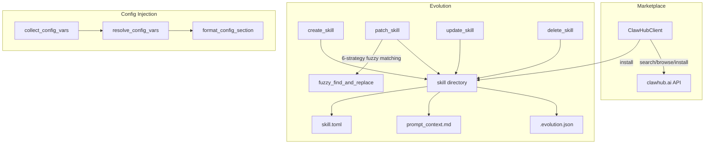

# Skills

# Skills Module

The Skills module (`librefang-skills`) manages the full lifecycle of skills in LibreFang: discovering and installing community skills from the ClawHub marketplace, resolving runtime configuration, and enabling agents to autonomously create, mutate, and version their own skills.

## Architecture Overview



## Core Types

All types live in `librefang-skills/src/lib.rs` and are re-exported from the crate root.

| Type | Purpose |
|------|---------|
| `SkillManifest` | Deserialized `skill.toml` — the canonical skill definition |
| `InstalledSkill` | A loaded skill with its filesystem `path` and `enabled` flag |
| `SkillMeta` | Name, version, description, author, license, tags |
| `SkillRuntime` | Enum: `PromptOnly`, `Shell`, `Node`, `Wasm` |
| `SkillRuntimeConfig` | Runtime type + entry point path |
| `SkillTools` | Declared tool definitions the skill exposes |
| `SkillSource` | Origin: `Local`, `Native`, or marketplace-specific |
| `SkillConfigVar` | A single `[[config_vars]]` declaration (key, description, default) |
| `SkillError` | Error enum: `Io`, `Network`, `InvalidManifest`, `SecurityBlocked`, `RateLimited`, `NotFound`, `AlreadyInstalled` |

A skill on disk is a directory containing at minimum `skill.toml` and, for PromptOnly skills, `prompt_context.md`.

---

## ClawHub Marketplace Client (`clawhub.rs`)

### `ClawHubClient`

HTTP client for the ClawHub skill registry at `https://clawhub.ai/api/v1`. Handles search, browse, detail retrieval, file fetch, and full download-and-install.

#### Construction

```rust
let client = ClawHubClient::new(cache_dir);
// or with a custom base URL (used for regional mirrors):
let client = ClawHubClient::with_url("https://cn.clawhub.ai/api/v1", cache_dir);
```

TLS verification can be disabled by setting `LIBREFANG_DANGEROUSLY_SKIP_TLS_VERIFICATION=true` or `1` — intended only for testing against servers with expired certificates.

#### Retry and Rate Limiting

All HTTP requests go through `get_with_retry`, which implements exponential backoff with jitter:

- Up to **5 attempts** (`MAX_RETRIES`)
- Base delay of **1.5 seconds**, doubling per attempt, capped at **30 seconds**
- Respects the `Retry-After` header when the API sends a 429
- Retries on 429 and 5xx; fails immediately on other 4xx

#### API Methods

| Method | Endpoint | Returns |
|--------|----------|---------|
| `search(query, limit)` | `GET /search?q=...&limit=...` | `ClawHubSearchResponse` (key: `results`) |
| `browse(sort, limit, cursor)` | `GET /skills?limit=...&sort=...&cursor=...` | `ClawHubBrowseResponse` (key: `items`) |
| `get_skill(slug)` | `GET /skills/{slug}` | `ClawHubSkillDetail` |
| `get_file(slug, path)` | `GET /skills/{slug}/file?path=...` | Raw `String` |
| `install(slug, target_dir)` | `GET /download?slug=...` | `ClawHubInstallResult` |
| `install_from_bytes(slug, target_dir, bytes)` | — (offline) | `ClawHubInstallResult` |
| `is_installed(slug, skills_dir)` | — (local check) | `bool` |

`ClawHubSort` variants: `Trending`, `Updated`, `Downloads`, `Stars`, `Rating`.

#### Install Security Pipeline

`install()` and `install_with_expected_sha256()` run a multi-step pipeline before writing files:

1. **Fetch detail** — retrieves `expected_sha256` from the registry (best-effort; installation proceeds without it if the detail endpoint fails)
2. **Download + SHA256** — computes a SHA256 digest of the downloaded bytes; compares against `expected_sha256` if present. A mismatch returns `SkillError::SecurityBlocked` immediately, before any directories are created
3. **Format detection** — distinguishes SKILL.md (YAML front-matter `---`), zip archive (`PK` magic bytes), and package.json
4. **Conversion** — SKILL.md skills are converted via `openclaw_compat::convert_skillmd`; package.json skills via `openclaw_compat::convert_openclaw_skill`
5. **Prompt injection scan** — prompt-only skills run through `SkillVerifier::scan_prompt_content`; critical-severity findings block installation
6. **Binary dependency check** — each entry in `converted.required_bins` is checked against PATH
7. **Manifest security scan** — `SkillVerifier::security_scan` on the final manifest
8. **Write `skill.toml`** — marked `verified: false`

Extraction and zip decompression are offloaded to `tokio::task::spawn_blocking` to avoid stalling the async runtime.

#### Atomic Directory Swap

Installation writes into a staging directory (`.staging-{slug}-{pid}-{counter}`), then atomically renames it to the final skill directory. This prevents partial installs from being loaded on the next daemon start. The staging counter is a process-local `AtomicU64` that guarantees uniqueness even under concurrent installs within the same process.

#### Path Safety

All archive entry paths pass through `resolve_skill_child_path`, which rejects absolute paths and any component other than `Component::Normal` (blocks `..` traversal).

---

## Config Injection (`config_injection.rs`)

Skills declare configuration values they depend on via `[[config_vars]]` in `skill.toml`:

```toml
[[config_vars]]
key = "wiki.base_url"
description = "Base URL of the internal wiki"
default = "https://wiki.example.com"
```

### Resolution Flow

1. **`collect_config_vars(skills)`** — gathers declarations from all enabled `InstalledSkill`s. Deduplicates by key (first declaration wins; later skills silently reuse the first). Skips entries with empty keys or descriptions.

2. **`resolve_config_vars(vars, config_toml)`** — walks `skills.config.<logical_key>` in the parsed config TOML. Empty-string values are treated as absent and the declared `default` is used instead. Variables with neither a config value nor a default are omitted.

3. **`format_config_section(resolved)`** — produces a compact Markdown section for the system prompt:

```
## Skill Config Variables
wiki.base_url = https://wiki.corp.example.com
db.host = localhost
```

Returns an empty string when there are no resolved variables, so callers can skip injection with a simple `is_empty()` guard.

### Storage Convention in `config.toml`

```toml
[skills.config.wiki]
base_url = "https://wiki.corp.example.com"
```

The logical key `wiki.base_url` maps to the TOML path `skills` → `config` → `wiki` → `base_url` via dotted-path traversal in `resolve_dotpath`.

---

## Skill Evolution (`evolution.rs`)

Agent-driven skill creation, mutation, and version management. This is the core self-improvement mechanism: agents discover reusable approaches and persist them as skills.

### Concurrency Safety

All mutation operations acquire an exclusive file lock **before** touching the filesystem:

- Lock files live in `.evolution-locks/` **beside** the skill directory (not inside it), so `remove_dir_all` on the skill dir doesn't collide with an open lock handle on Windows
- Uses `fs2::FileExt::lock_exclusive` (flock on Unix, LockFileEx on Windows)
- All operations re-check directory existence under the lock to guard against concurrent deletes

### Atomic File Writes

`atomic_write(path, content)` writes to a uniquely-named temp file (incorporating pid, thread id, monotonic counter, and nanosecond timestamp), then renames to the final path. Ensures no partial files are visible on crash.

### Version History

Each skill stores `.evolution.json` alongside `skill.toml`:

```rust
struct SkillEvolutionMeta {
    versions: Vec<SkillVersionEntry>,  // newest last, capped at 10
    use_count: u64,
    evolution_count: u64,              // total version entries written
    mutation_count: u64,               // post-create edits only
}
```

`SkillVersionEntry` records version, ISO 8601 timestamp, changelog, SHA256 content hash, and optional author (e.g. `"agent:<uuid>"`, `"cli"`, `"dashboard"`).

Version bumps use `semver::Version::parse` to correctly handle pre-release tags and build metadata, with a manual fallback for non-standard version strings.

### Core Operations

#### `create_skill`

Creates a new PromptOnly skill. Validates the name (lowercase alphanumeric + `-_`, max 64 chars), prompt content size (max 160,000 chars), and runs prompt injection scanning. Writes `skill.toml` and `prompt_context.md` atomically, records the initial version (mutation_count stays 0). Rejects if the skill directory already exists.

#### `update_skill`

Full rewrite of `prompt_context.md`. Re-reads `skill.toml` from disk **under the lock** to get the current version (avoids duplicate version bumps from stale snapshots). Saves a rollback snapshot, bumps the patch version, writes the new content, and records a version entry with `is_mutation = true`.

#### `patch_skill`

Incremental update via fuzzy find-and-replace. Reads `prompt_context.md` from disk under the lock, applies `fuzzy_find_and_replace`, validates the result, saves a rollback snapshot, bumps version, and writes. Returns the `MatchStrategy` that succeeded and the match count in `EvolutionResult`.

#### `delete_skill`

Agent-facing deletion. Refuses to delete non-local skills (checks `source` field in manifest). Acquires the lock, re-checks existence, then `remove_dir_all`. A missing or unreadable manifest is rejected for safety — only skills with `source = { type = "local" }` or `source = { type = "native" }` are deletable.

#### `uninstall_skill`

User-facing uninstall (dashboard / CLI). Removes any installed skill regardless of source. Validates the skill name to prevent path traversal, acquires the lock, and removes the directory.

#### `rollback_skill`

Restores from a previous rollback snapshot in `.rollback/`. Validated by version hash.

### Fuzzy Find-and-Replace

`fuzzy_find_and_replace(content, old_str, new_str, replace_all)` tries six strategies in order from strictest to loosest:

| # | Strategy | Description |
|---|----------|-------------|
| 1 | **Exact** | Literal substring match |
| 2 | **LineTrimmed** | Trim leading/trailing whitespace per line |
| 3 | **WhitespaceNormalized** | Collapse whitespace runs to single space |
| 4 | **IndentFlexible** | Strip all leading whitespace per line |
| 5 | **BlockAnchor** | Match first + last line; require ≥60% middle similarity |
| 6 | **WhitespaceStripped** | Remove ALL whitespace on both sides, substring match. Minimum 3-character needle to prevent English false positives. Designed for CJK content. |

Strategies 2–4 use line-based matching (not substring) to avoid false multi-match errors when the normalized `old_str` appears as a substring of a longer line.

Strategy 6 maps stripped-match character positions back to original byte offsets via a span table, so the replacement is precise to the matched characters without absorbing surrounding whitespace.

If all strategies fail, the error message includes the 3 closest-matching lines from the content (by character-overlap Jaccard similarity) to help the agent self-correct.

Empty `old_str` is rejected outright — `content.replace("", new_str)` would insert at every character boundary.

### Supporting Files

Skills can store auxiliary files in four subdirectories: `references/`, `templates/`, `scripts/`, `assets/`.

| Function | Behavior |
|----------|----------|
| `write_supporting_file(skill, rel_path, content)` | Validates path containment (canonicalization + symlink check), enforces 1 MiB size limit, runs security scan before writing |
| `remove_supporting_file(skill, rel_path)` | Removes file and prunes empty parent directories upward |
| `list_supporting_files(skill)` | Returns `HashMap<subdir_name, Vec<relative_paths>>`, recursive to depth 16 |

All supporting-file operations acquire the per-skill lock and re-validate that resolved paths stay within the skill directory.

### `EvolutionResult`

Every evolution operation returns this struct:

```rust
struct EvolutionResult {
    success: bool,
    message: String,
    skill_name: String,
    version: Option<String>,
    match_strategy: Option<MatchStrategy>,  // patch operations only
    match_count: Option<usize>,              // patch operations only
    evolution_count: Option<u64>,
    mutation_count: Option<u64>,
    use_count: Option<u64>,
}
```

Counter fields are populated by reading `.evolution.json` after the operation, so callers get the current state without a second filesystem query. They are `None` after delete/uninstall (directory no longer exists).

---

## Integration Points

The module is consumed by:

- **`src/routes/skills.rs`** — HTTP API handlers for search, browse, install, detail, code view, and all evolution endpoints
- **`src/tool_runner/skill.rs`** — Agent tool implementations (`tool_skill_evolve_create`, `_patch`, `_update`, `_delete`, `_write_file`, `_remove_file`)
- **`src/skill_workshop/storage.rs`** — Workshop approval flow calls `create_skill` after review
- **`librefang-cli/src/main.rs`** — CLI `cmd_skill_evolve` subcommand
- **`src/tool_runner/wasm_skill.rs`** — Uses `SkillToolResult` for WASM skill execution