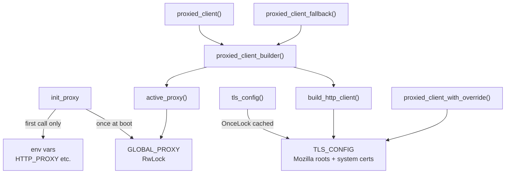

# Support Libraries — librefang-http-src

# librefang-http

Centralized HTTP client construction with proxy support and fallback TLS CA roots.

Every outbound HTTP request in the daemon should flow through this module's builders so that proxy settings and TLS trust anchors are applied uniformly. Building a `reqwest::Client` anywhere else risks missing proxy configuration or hitting TLS failures on minimal systems (musl builds on Termux/Android, scratch Docker images) where system CA certificates are absent.

## Architecture



## Startup sequence

1. **`init_proxy(cfg)`** — call once with the `[proxy]` section from `config.toml`. This populates the global proxy state and, on the first invocation only, exports `HTTP_PROXY` / `HTTPS_PROXY` / `NO_PROXY` environment variables so that crates building their own `reqwest::Client` (e.g. `librefang-channels`) automatically inherit proxy settings.
2. After that, any call to `proxied_client_builder()` or `proxied_client()` picks up the configured proxy automatically.

`init_proxy` can be called again during hot-reload. On subsequent calls, only the in-memory `GLOBAL_PROXY` is updated—environment variables are left untouched because `std::env::set_var` is racy in a multi-threaded Tokio runtime.

## TLS trust chain

`tls_config()` returns a cached `rustls::ClientConfig` built by `init_tls_config()`:

1. **Mozilla CA roots** (`webpki_roots::TLS_SERVER_ROOTS`) are loaded first, guaranteeing that common public CAs are always trusted even on systems with incomplete or missing cert stores.
2. **System CA certificates** are layered on top via `rustls_native_certs::load_native_certs()`, adding org-internal and self-signed CAs without requiring a librefang release.
3. If no system certs are found, a debug log is emitted and the bundled Mozilla roots serve as the sole trust anchors.

The result is stored in a `OnceLock` and cloned on each client build, so the cert-loading work happens exactly once.

## Proxy resolution

When `build_http_client` constructs a client, it applies proxy settings in this order of specificity:

| Priority | Source | How it's applied |
|----------|--------|------------------|
| 1 | Explicit `ProxyConfig` fields (`http_proxy`, `https_proxy`, `no_proxy`) | Set directly on the `reqwest::ClientBuilder` |
| 2 | Environment variables (`HTTP_PROXY`, `HTTPS_PROXY`, `NO_PROXY`) | `reqwest` reads these automatically when config fields are `None` |

This avoids double-applying settings—`init_proxy` exports env vars, and when `ProxyConfig` fields are `None`, reqwest's built-in env-var detection provides the fallback.

Supported proxy URL schemes: `http://`, `https://`, `socks5://`, `socks5h://`. Invalid schemes are logged with a warning and the proxy URL is redacted.

## Public API

### Initialization

#### `init_proxy(cfg: ProxyConfig)`

Must be called at daemon startup. Sets the global proxy configuration and exports environment variables on the first call. Safe to call again during hot-reload (only the in-memory config updates; env vars are not re-set).

### Client builders

#### `proxied_client_builder() -> reqwest::ClientBuilder`

Returns a builder pre-configured with the global proxy settings and fallback TLS. Callers can customize timeouts or other options before calling `.build()`.

#### `proxied_client() -> reqwest::Client`

Convenience wrapper—builds and returns a ready-to-use client. Panics only if the internal builder is misconfigured (should never happen in practice).

#### `proxied_client_fallback() -> reqwest::Client`

Identical to `proxied_client()` but enforces a **300-second total per-request timeout** on top of the default connect/read timeouts. Used when a per-provider proxy override is invalid and the caller needs a best-effort fallback. Intended to be called after logging a `tracing::warn!`.

#### `proxied_client_with_override(proxy_url: &str) -> reqwest::Result<reqwest::Client>`

Builds a client that routes **all** traffic through the given proxy URL, completely ignoring the global proxy config. Used for per-provider proxy overrides specified in provider-specific configuration.

Returns `Err` if the URL is invalid or the client cannot be built. **Does not silently fall back**—callers should handle the error by falling back to `proxied_client()` explicitly and logging a warning.

### TLS

#### `tls_config() -> rustls::ClientConfig`

Returns the cached TLS configuration. Useful for code outside this crate that needs to construct its own reqwest client with the same trust chain.

### Backward-compatible aliases

| Alias | Canonical function |
|-------|--------------------|
| `client_builder()` | `proxied_client_builder()` |
| `new_client()` | `proxied_client()` |

## Default timeouts

All clients built through this module ship with sensible defaults (issue #2340):

| Timeout | Duration | Rationale |
|---------|----------|-----------|
| `connect_timeout` | 30 s | Caps TCP + TLS handshake; generous for slow international links to LLM providers. |
| `read_timeout` | 300 s | Per-read inactivity timeout, not total request time. Streaming LLM responses keep this alive as long as tokens arrive; a true upstream stall fires it. |
| total (fallback only) | 300 s | Hard ceiling on the entire request lifecycle for `proxied_client_fallback()`. |

Callers can override these on the builder returned by `proxied_client_builder()`.

## Usage examples

### Typical startup

```rust
use librefang_http::init_proxy;
use librefang_types::config::ProxyConfig;

let proxy_cfg: ProxyConfig = config.proxy; // from config.toml
init_proxy(proxy_cfg);
```

### Making a request elsewhere in the daemon

```rust
use librefang_http::proxied_client;

let resp = proxied_client()
    .get("https://api.example.com/health")
    .send()
    .await?;
```

### Per-provider proxy override with fallback

```rust
use librefang_http::{proxied_client_with_override, proxied_client};

let client = match proxied_client_with_override(&provider.proxy_url) {
    Ok(c) => c,
    Err(e) => {
        tracing::warn!("invalid proxy for provider {}: {e}", provider.name);
        proxied_client_fallback()
    }
};
```

## Consumers across the codebase

The call graph shows `proxied_client_builder()` and `proxied_client()` are used pervasively:

- **OAuth flows** — `chatgpt_oauth`, `copilot_oauth`, `mcp_oauth` all use `proxied_client_builder()`
- **Provider health checks** — `probe_client` / `probe_model` in `provider_health`
- **Media transcription** — `whisper_transcribe`, `gemini_transcribe`, `elevenlabs_transcribe` in `librefang-runtime-media`
- **Plugin management** — `install_plugin_with_deps`, `plugin_registry_search`, `plugin_update_check`
- **Tool execution** — `tool_web_fetch_legacy`, `tool_web_search_legacy`, `tool_location_get`
- **Webhook testing** — `test_webhook`
- **Image generation** — `generate_image`
- **Dashboard sync** — `sync_dashboard`
- **Cron/delivery** — `cron_deliver_response`, `build_fan_out_http_client`