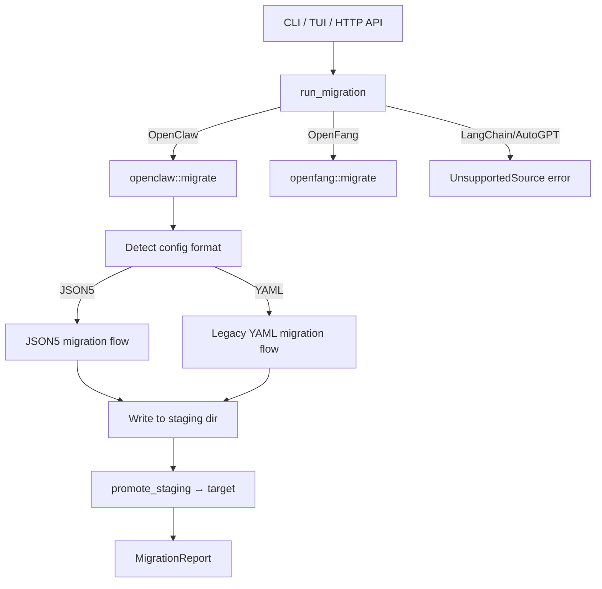

# Support Libraries — librefang-import-src

# librefang-import-src — Migration Engine

## Purpose

This crate imports agent workspaces from external frameworks (OpenClaw, OpenFang, and planned LangChain/AutoGPT) into LibreFang's native format. It converts config files, agent manifests, memory, sessions, and workspace directories, producing a complete LibreFang home directory with a `MigrationReport` detailing what succeeded, what was skipped, and why.

## Architecture

## Top-Level API (`lib.rs`)

### `MigrateSource`

Enum identifying the source framework. Currently active variants are `OpenClaw` and `OpenFang`. `LangChain` and `AutoGpt` return `MigrateError::UnsupportedSource`.

### `MigrateOptions`

| Field | Purpose |
|---|---|
| `source` | Which framework to migrate from |
| `source_dir` | Path to the source workspace (e.g. `~/.openclaw`) |
| `target_dir` | Path to the LibreFang home directory (e.g. `~/.librefang`) |
| `dry_run` | If `true`, report what would happen without touching disk |

### `run_migration`

The primary entry point. Dispatches to `openclaw::migrate` or `openfang::migrate` based on `options.source`. Returns `Result<MigrationReport, MigrateError>`.

Called from:
- `librefang-cli/src/main.rs` — `cmd_migrate`
- `src/routes/config.rs` — `run_migrate` (HTTP API)
- `tui/screens/init_wizard.rs` — `handle_migration_key`

### `MigrateError`

Variants cover missing source dirs, parse failures (JSON5, YAML, TOML), unsupported schema versions, path-traversal rejection, and stale staging directories. All variants implement `std::error::Error` via `thiserror`.

## OpenClaw Migration (`openclaw.rs`)

This is the largest submodule, handling both modern JSON5-based OpenClaw installations and very old YAML-based ones.

### Workspace Layout Detection

OpenClaw has had several directory conventions. `find_config_file` probes for config files in this order:

1. `openclaw.json`, `clawdbot.json`, `moldbot.json`, `moltbot.json` (modern JSON5)
2. `config.yaml` (legacy YAML)

`detect_openclaw_home` checks environment variable `OPENCLAW_STATE_DIR`, then standard paths (`~/.openclaw`, `~/.clawdbot`, `~/.moldbot`, `~/.moltbot`, `~/.config/openclaw`, Windows `APPDATA`/`LOCALAPPDATA`) for a recognizable workspace.

### JSON5 Migration Flow

Activated when a `.json` config file is found. `migrate_from_json5` executes these steps in order:

1. **Config migration** (`migrate_config_from_json`) — Extracts default model, provider, API key env var, memory decay rate, and channel data. Writes `config.toml` with `config_version` set to the current `CONFIG_VERSION` so the kernel skips its own versioned-migration step.
2. **Agent migration** (`migrate_agents_from_json`) — Iterates `agents.list` from the JSON5 root. Each `OpenClawAgentEntry` is validated, converted to a LibreFang `agent.toml` manifest, and written to `agents/<id>/agent.toml`.
3. **Memory migration** (`migrate_memory_files`) — Copies `memory/<agent>/MEMORY.md` (and legacy `agents/<agent>/MEMORY.md`) to `agents/<agent>/imported_memory.md`.
4. **Workspace migration** (`migrate_workspace_dirs`) — Recursively copies `workspaces/<agent>/` (and legacy `agents/<agent>/workspace/`) to `agents/<agent>/workspace/`.
5. **Session migration** (`migrate_sessions`) — Copies `.jsonl` files from `sessions/` to `imported_sessions/`.
6. **Skipped features** (`report_skipped_features`) — Reports cron, hooks, auth profiles, skills, vector index, and memory backend config as skipped with explanations.

### Legacy YAML Migration Flow

Activated when only `config.yaml` is found. Follows a parallel structure:

- `migrate_legacy_config` — Parses `config.yaml` and produces `config.toml`.
- `migrate_legacy_agents` — Scans `agents/` subdirectories for `agent.yaml` files, converts each via `convert_legacy_agent`.
- `migrate_legacy_memory` — Copies `MEMORY.md` from each agent directory.
- `migrate_legacy_workspaces` — Copies `workspace/` subdirectories.
- `parse_legacy_channels` — Scans `messaging/*.yaml` files.

### Channel Handling

All messaging channels have been migrated from in-process adapters to out-of-process sidecars. The migrator no longer writes `[channels.<name>]` TOML blocks. Instead:

- **Secrets** (bot tokens, app tokens) are extracted and written to `secrets.env` via `write_secret_env`, which upserts `KEY=value` lines and restricts file permissions to `0o600` on Unix.
- Each channel is reported as a `SkippedItem` with instructions for creating a `[[sidecar_channels]]` entry pointing at the appropriate sidecar adapter (e.g. `python3 -m librefang.sidecar.adapters.telegram`).

This applies to: Telegram, Discord, Slack, WhatsApp, Signal, Matrix, Google Chat, Teams, IRC, Mattermost, Feishu, iMessage, BlueBubbles, and any unknown channels from the catch-all map.

### Agent Conversion

`convert_agent_from_json` and `convert_legacy_agent` produce LibreFang `agent.toml` manifests. Key transformations:

| OpenClaw concept | LibreFang output |
|---|---|
| `identity` (string or structured object) | `model.system_prompt` — extracted via recursive key search (`systemPrompt`, `prompt`, `instructions`, etc.) |
| `model` (e.g. `"anthropic/claude-..."`) | Split into `model.provider` + `model.model` via `split_model_ref` |
| `model.fallbacks` | `[[fallback_models]]` array |
| `tools.allow` / `tools.also_allow` | Mapped through `map_tool_name` / `is_known_librefang_tool`; unmapped tools produce warnings |
| `tools.deny` | `tool_blocklist` field — previously dropped, now preserved |
| `tools.profile` | `profile` field via `map_profile_to_librefang` |
| `skills` | `skills` array — previously dropped, now preserved |
| `workspace` | `workspace` field — previously dropped, now preserved |
| Tool names | Capability grants (`shell`, `network`, `agent_message`, `agent_spawn`) derived via `derive_capabilities` |
| Provider names | Normalized via `map_provider` (e.g. `"claude"` → `"anthropic"`, `"grok"` → `"xai"`) |

### Security and Integrity

**Path traversal protection (#3794):** `validate_migration_id` rejects agent IDs containing `..`, absolute path components, or NUL bytes. Only single normal path components are accepted. Applied to both JSON5 agent `id` fields and legacy directory-derived names.

**Schema version checking (#3797):** The JSON5 config's `version` field is checked against `SUPPORTED_OPENCLAW_VERSIONS` (currently `[1, 2]`). Unknown versions produce `MigrateError::UnsupportedVersion`.

**Atomic staging (#3798):** All writes go to a sibling staging directory (e.g. `.librefang.migrate-staging`) before being promoted. The staging directory has a fixed name so stale directories from failed runs are detectable. If staging already exists, the migration refuses to proceed with `MigrateError::StagingExists`.

**Atomic file writes:** `atomic_write` writes to a `.tmp` sibling then renames into place, preventing torn writes.

**Backup-before-overwrite:** `write_with_backup` renames any existing target file to `<name>.bak.<timestamp>` (with nanosecond fallback on collision) before writing the new content.

**Idempotency:** A `.openclaw_migrated` marker file is written after successful migration. Subsequent runs detect this marker and skip to preserve user edits. The marker includes a timestamp and instructions for forcing a re-import.

### Non-clobber promotion

`promote_staging` recursively moves files from the staging tree into the real target. Existing files in the target are never overwritten (#3795) — staged copies that would clobber are dropped and reported as warnings. The promotion rewrites all `destination` paths in the report from staging paths to real target paths.

### Scanning

`scan_openclaw_workspace` inspects a workspace without migrating, returning a `ScanResult` with lists of agents (including model, provider, tool count, memory/session/workspace presence), channels, skills, and whether memory exists. Used by the TUI init wizard and HTTP API to preview what's available.

## Report (`report.rs`)

`MigrationReport` collects:
- `imported: Vec<MigrateItem>` — Items successfully written, each with `kind` (Config, Agent, Memory, Session, Secret, Channel, Skill), `name`, and `destination` path.
- `skipped: Vec<SkippedItem>` — Items not migrated, with `reason` explaining why and how to proceed.
- `warnings: Vec<String>` — Non-fatal issues (unmapped tools, backup locations).
- `to_markdown()` — Serializes the report for display and for the `migration_report.md` file written into the target.

## Integration Points

- **`librefang_types::config`** — Provides `CONFIG_VERSION`, `DEFAULT_API_LISTEN`, and the `KernelConfig` struct (the output TOML is a compatible subset).
- **`librefang_types::tool_compat`** — `is_known_librefang_tool` and `map_tool_name` handle tool name translation between frameworks.
- **`librefang_types::agent::ToolProfile`** — Enum used by `tools_for_profile` to expand profile names into concrete tool lists.
- **`librefang_types::VERSION`** — Written into each agent manifest's `version` field.
- **External crates:** `json5` (parsing), `serde_yaml` (legacy YAML), `toml` (output serialization), `walkdir` (recursive directory traversal), `chrono` (timestamps), `dirs` (home directory detection).