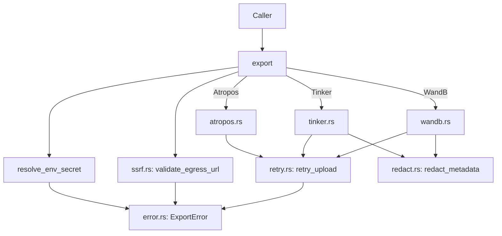

# Support Libraries — librefang-rl-export-src

# librefang-rl-export

Long-horizon RL rollout trajectory exporter — the LibreFang-side egress surface that turns a finished agent rollout into an upload to an upstream RL-tracking service.

## Overview

This crate takes a completed RL trajectory (opaque bytes + structured metadata) and delivers it to one of three upstream targets:

| Target | Type | Authentication | Protocol |
|--------|------|---------------|----------|
| **Weights & Biases** | Cloud-hosted experiment tracker | HTTP Basic (`api:<key>`) | `POST /api/runs` → `POST /files/…` |
| **Tinker** | Cloud-hosted post-training API | `X-API-Key` header | `POST /api/v1/create_session` → `POST /api/v1/telemetry` |
| **Atropos** | Local FastAPI microservice | None | `POST /register-env` → `POST /scored_data` |

All three exporters follow the same two-step pattern: **register** the run/session/environment, then **submit** the trajectory bytes. All outbound HTTP flows through `librefang_http::proxied_client()`.

## Architecture

## Public API

### `export(target, payload) -> Result<ExportReceipt, ExportError>`

The sole public entry point. Dispatches on the `ExportTarget` variant after performing SSRF validation and secret resolution. Fully async; requires a Tokio runtime.

**Execution order within `export()`:**

1. Resolve the API key from the environment variable named in `api_key_env` (W&B, Tinker only) via `resolve_env_secret`
2. Validate the outbound base URL against the SSRF egress allowlist via `ssrf::validate_egress_url`
3. Delegate to the per-target private module (`wandb`, `tinker`, `atropos`)
4. Return `ExportReceipt` on success

### `ExportTarget` (enum, `#[non_exhaustive]`)

| Variant | Key fields |
|---------|-----------|
| `WandB` | `project`, `entity`, `run_id`, `api_key_env` |
| `Tinker` | `project`, `api_key_env`, `base_url` (optional, defaults to prod) |
| `Atropos` | `project`, `base_url` (required), `max_token_length`, `group_size`, `weight` (optional tuning) |

**Secret handling:** Variants that require credentials carry an `api_key_env: String` field holding the *name* of an environment variable (not the secret itself). The exporter reads the env var at upload time and fails closed with `ExportError::InvalidConfig` if unset or empty. This keeps secrets out of `config.toml`, history snapshots, and process dumps.

### `RlTrajectoryExport`

Carries a finished rollout ready for export:

- `run_id: String` — caller-side identifier, used as a hint where the upstream accepts one
- `trajectory_bytes: Vec<u8>` — opaque payload; the exporter never inspects, validates, or transcodes it
- `toolset_metadata: Option<serde_json::Value>` — optional structured metadata about the producing agent/environment; scrubbed before upload
- `started_at` / `finished_at: DateTime<Utc>` — rollout window timestamps

Wire-format decoupling is intentional (refs #3330): the crate is agnostic to the trajectory serialization format, so the format can be locked later without changing this surface.

### `ExportReceipt`

Returned on success:

- `target_run_url: String` — browser-loadable URL on the upstream (W&B run page, Tinker session endpoint, Atropos `/latest_example` fragment)
- `bytes_uploaded: u64` — mirrors `trajectory_bytes.len()`
- `uploaded_at: DateTime<Utc>` — wall-clock completion time

### `ExportError` (enum, `#[non_exhaustive]`)

| Variant | When | Retryable |
|---------|------|-----------|
| `NetworkError(String)` | DNS, TCP/TLS, read timeout | Yes |
| `AuthError` | HTTP 401/403 | No |
| `UpstreamRejected { status, body }` | Non-auth 4xx/5xx; body truncated to 4 KiB | 429 or 5xx only |
| `MalformedResponse(String)` | 2xx body didn't match expected shape | No |
| `InvalidConfig(String)` | Empty project, unset env var, SSRF block, etc. | No |
| `TrainerNotReady { status_label }` | Atropos: trainer hasn't booted yet | No (caller polls) |

The `#[non_exhaustive]` attribute reserves room for future variants like a structured `RateLimited { retry_after }`.

## Per-Target Exporters

### Weights & Biases (`wandb.rs`)

**Step 1:** `POST {base}/api/runs` — creates a run under the given `entity`/`project` with the run window timestamps and (optional) metadata. Returns the server-assigned `run_id` and a browser URL.

**Step 2:** `POST {base}/files/{entity}/{project}/{run_id}` — uploads the opaque trajectory bytes as `application/octet-stream`. All three path segments are percent-encoded to prevent path corruption from caller-controlled strings.

Authentication: HTTP Basic with the literal user `api` and the API key as the password (`Authorization: Basic base64("api:<key>")`), per W&B REST docs.

Default base URL: `https://api.wandb.ai`.

### Tinker (`tinker.rs`)

Tinker has no dedicated opaque-trajectory upload endpoint. The exporter maps onto the closest stable pair:

**Step 1:** `POST {base}/api/v1/create_session` — registers a session with sorted tags (`["librefang-rollout", "<project>"]`), the scrubbed `user_metadata`, `sdk_version`, and `project_id`. Returns `session_id`.

**Step 2:** `POST {base}/api/v1/telemetry` — submits a single `GenericEvent` under the session. The trajectory bytes are base64-encoded into `event_data.trajectory_bytes_b64` alongside the run ID, byte length, and rollout timestamps.

Authentication: `X-API-Key` header. The key is forwarded verbatim; Tinker's upstream enforces the `tml-` prefix.

Default base URL: `https://tinker.thinkingmachines.dev/services/tinker-prod`.

### Atropos (`atropos.rs`)

Atropos is a **local FastAPI microservice** — no cloud, no auth. The exporter talks to whatever base URL the operator provides.

**Step 1:** `POST {base}/register-env` — registers this producer with the running trainer. Sends `desired_name` (= `project`), `max_token_length`, `weight`, `group_size`. Returns `env_id` and `wandb_name`.

**Trainer-not-ready handling:** If the trainer hasn't booted yet, Atropos returns HTTP 200 with `{"status": "wait for trainer to start"}` and no `env_id`. The exporter detects the missing `env_id` and surfaces `ExportError::TrainerNotReady` so callers can poll with backoff.

**Step 2:** `POST {base}/scored_data` — forwards `trajectory_bytes` verbatim as `application/json`. The bytes **must** already be valid `ScoredData` JSON (`tokens`, `masks`, `scores`, …); Atropos validates server-side and returns 422 on malformed payloads.

There is no implicit `localhost:8000` default — operators must set `base_url` explicitly.

## Support Modules

### Error Classification (`error.rs`)

- `classify_status(status, body)` — maps HTTP status codes to `ExportError` variants. 401/403 → `AuthError`; everything else → `UpstreamRejected`.
- `classify_response_decode_error(err, context)` — distinguishes JSON decode failures (`MalformedResponse`) from transport errors during body read (`NetworkError`).
- `read_body_truncated(resp)` — reads the response body, truncating to 4 KiB with lossy UTF-8 decoding to prevent pathological payloads from bloating the error.

### Retry Logic (`retry.rs`)

`retry_upload(label, op)` — retries transient failures up to 3 attempts with exponential backoff (200ms, 400ms base).

**Transient classification** (`is_transient`):
- `NetworkError` — always retried
- `UpstreamRejected` with status 429 or 5xx — retried
- Everything else (auth, config, decode, `TrainerNotReady`) — returned immediately

**Timing divergence from the workspace LLM retry loop** is deliberate: 200ms/3 attempts is tuned for the exporter's post-rollout latency profile (sub-second failure feedback) rather than the agent loop's 1000ms/4 attempts. Do not "fix" this to match.

### SSRF Egress Protection (`ssrf.rs`)

Two egress modes enforced before any HTTP I/O:

- **`EgressMode::Public`** (W&B, Tinker): rejects loopback, RFC-1918 private, link-local (169.254/16), IMDS hostnames, IPv4-mapped IPv6 loopback, non-HTTP schemes, and userinfo in URLs.
- **`EgressMode::LoopbackOrPrivate`** (Atropos): accepts only loopback (`127.0.0.0/8`, `::1`) and RFC-1918 (`10/8`, `172.16/12`, `192.168/16`); rejects everything else including public IPs and link-local/IMDS.

The check is purely syntactic (no DNS resolution). Known-dangerous hostnames (`localhost`, `metadata.google.internal`) are blocked by literal match.

### Credential Redaction (`redact.rs`)

Before any metadata leaves the process, `redact_metadata` walks the `serde_json::Value` tree and rewrites credential-shaped substrings in string values:

| Pattern | Replacement | Example |
|---------|-------------|---------|
| JWT (`eyJ…`) | `<REDACTED:JWT>` | `eyJhbGci…` |
| API keys (`sk_…`, `api_key=…`, `token …`) | `<REDACTED:CREDENTIAL>` | `API_KEY=sk-live-…` |
| Long base64 (≥40 chars) | `<REDACTED:BLOB>` | opaque tokens |

JSON keys are never rewritten (they carry no secret material in practice and rewriting them would corrupt upstream schemas). The pattern set is duplicated from `librefang_kernel::trajectory::RedactionPolicy` rather than imported (to avoid pulling the kernel's ~50 transitive crates into a leaf egress crate). A snapshot test (`regex_set_matches_kernel_snapshot`) verifies parity against a checked-in fixture and fails CI on drift.

## Integration with the Rest of the Workspace

- **HTTP client:** All outbound requests use `librefang_http::proxied_client()`, the workspace's shared reqwest client. This is mandatory — the shared client carries the configured proxy, TLS fallback roots, and `User-Agent: librefang/<version>`. No bespoke `reqwest::Client` instances.
- **`librefang-kernel` parity:** The credential redaction patterns must stay in sync with the kernel's `RedactionPolicy`. Changes to either side require updating the other and the shared snapshot fixture at `tests/fixtures/kernel_redaction_patterns.txt`.
- **`librefang-runtime-mcp` parity:** The SSRF block set mirrors `librefang_runtime_mcp::mcp_oauth::is_ssrf_blocked_host`. The two must change together.
- **Downstream consumers:** The CLI, dashboard, and runtime telemetry hook consume `ExportError` and `ExportReceipt` directly — the error enum is string-payload-heavy so callers can render the upstream's own diagnostic to the operator.

## Testing Strategy

Each exporter has an identical test structure using `wiremock::MockServer`:

1. Stand up a mock server
2. Register expected request/response pairs for each endpoint
3. Call the `*_with_base` variant pointing at the mock
4. Assert receipt contents and error variant mapping

Tests cover: happy path (two-step register+upload), auth errors (401→`AuthError`), upstream rejections (4xx→`UpstreamRejected` with body forwarding), malformed responses (2xx with bad JSON→`MalformedResponse`), pre-flight validation (empty project/key/bytes→`InvalidConfig`), credential redaction (end-to-end scrub before W&B upload), path encoding (percent-encoding of `/`, space, `+` in URL segments), and SSRF rejection (IMDS and public IPs blocked).

The `*_with_base` functions are `pub(crate)` specifically so in-crate tests can point them at loopback mocks without tripping the SSRF guard. Production callers go through the public `export()` function, which always validates first.