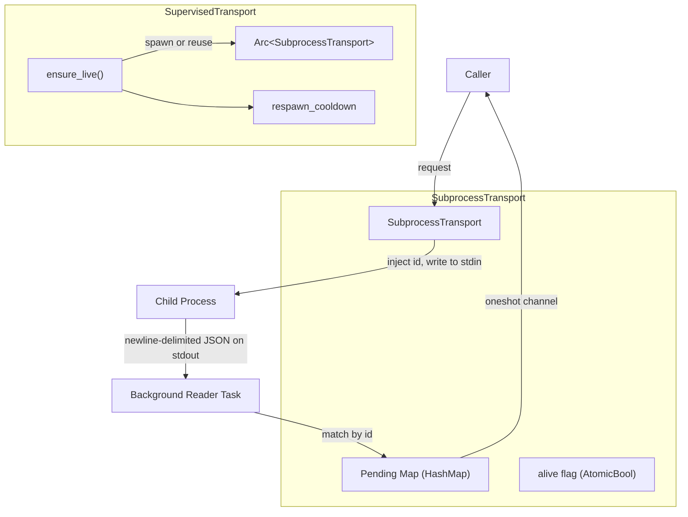

# Support Libraries — librefang-subprocess-src

# librefang-subprocess — Persistent JSON-over-stdio Subprocess Transport

## Purpose

This crate provides a small, dependency-light bridge for communicating with a long-lived child process over a newline-delimited JSON request/reply protocol. It consolidates the plumbing that every LibreFang sidecar bridge was re-implementing: spawning the child, reading replies on a background task, matching them to waiters by `id`, bounding both write and reply-line size, forwarding stderr to the log, and reaping the child on drop.

It sits below both `librefang-channels` and `librefang-runtime` in the dependency graph and pulls in no other `librefang-*` crate.

## Protocol Contract

The transport is deliberately protocol-light:

1. The caller supplies a JSON request **object**.
2. The transport injects a unique `id` field and writes `{"id": N, …caller fields}\n` to the child's stdin.
3. The child replies with a newline-delimited JSON line: `{"id": N, "ok": <value>}` or `{"id": N, "error": "<msg>"}`.
4. The background reader matches the reply `id` to the waiting caller and resolves it.

Any reply lacking an `id`, or lacking both `ok` and `error`, is dropped with a warning log.

## Architecture



## Key Types

### `TransportConfig`

Configuration for how to launch and frame a subprocess transport.

| Field | Type | Description |
|---|---|---|
| `command` | `String` | Executable to launch (resolved via `PATH`) |
| `args` | `Vec<String>` | Arguments passed to the command |
| `request_timeout` | `Duration` | Per-request wall-clock budget, applied to both the stdin write and the reply wait |
| `max_reply_line_bytes` | `usize` | Cap on a single reply line; exceeding it drops the transport (default 16 MiB) |
| `label` | `String` | Short label for logs and the `subprocess_transport_exited` metric |

Constructed via `TransportConfig::new`, which sets `max_reply_line_bytes` to `DEFAULT_MAX_REPLY_LINE_BYTES` (16 MiB).

### `TransportError`

Errors returned by `SubprocessTransport::request`:

| Variant | Meaning |
|---|---|
| `Dead` | The child has exited (or never spawned); no further requests can succeed |
| `Timeout(Duration)` | The write or the reply wait exceeded the configured timeout |
| `Remote(String)` | The child replied with `{"error": "<msg>"}` |
| `BadRequest` | The request was not a JSON object, so an `id` could not be attached |

### `SubprocessTransport`

A live connection to a long-lived child process. Cheaply shared behind an `Arc`. Dropping it kills and reaps the child (the handle uses `kill_on_drop`).

#### `SubprocessTransport::spawn(cfg: TransportConfig) -> io::Result<Self>`

Spawns the child process with piped stdin/stdout/stderr and starts two background tasks:

- **Reader task**: Reads newline-delimited replies from stdout, matches them to pending waiters by `id`. Ends on EOF, a read error, or an over-cap line. On exit it marks the transport as dead, clears all pending waiters (so they resolve as `TransportError::Dead`), and increments the `subprocess_transport_exited` counter.
- **Stderr drain task**: Reads lines from stderr and emits them at `DEBUG` level under the `subprocess_transport` target.

#### `SubprocessTransport::request(&self, request: Value) -> Result<Value, TransportError>`

Sends one request and awaits its reply. The `id` is injected before writing. The write itself is timeout-bounded — a child that stops reading its stdin (full pipe buffer) cannot wedge the caller past the deadline. On write timeout or failure, the transport marks itself dead.

#### `SubprocessTransport::is_alive(&self) -> bool`

Returns `true` until the child exits or a fatal protocol error drops it.

### `SupervisedTransport`

A `SubprocessTransport` that automatically re-spawns the child after it dies. Construction is lazy and never fails — the child is spawned on the first `request` and re-spawned on the first request after a crash.

#### Cooldown behavior

A `respawn_cooldown` rate-limits re-spawn attempts so a persistently-broken command cannot cause a spawn storm. When the cooldown has not elapsed since the last attempt, `request` returns `TransportError::Dead` immediately without attempting to spawn. The default cooldown is 5 seconds (via `SupervisedTransport::new`), configurable via `SupervisedTransport::with_cooldown`.

#### Contention model

The liveness check and (re)spawn are serialized behind a `tokio::Mutex` in `ensure_live()`, but the actual request runs on a cloned `Arc<SubprocessTransport>` outside that lock. This preserves the underlying transport's id-matched concurrency while ensuring exactly one spawn per crash event.

### `Line`

The outcome of `read_capped_line`:

| Variant | Meaning |
|---|---|
| `Data(String)` | A `\n`-terminated line (terminator stripped), or a partial line at EOF (which downstream JSON parsing will reject) |
| `Eof` | The stream reached EOF with no pending bytes |
| `TooLong` | The line exceeded the byte cap before `\n`; the stream should be treated as untrustworthy |

### `read_capped_line`

```rust
pub async fn read_capped_line<R: AsyncBufRead + Unpin>(
    reader: &mut R,
    buf: &mut Vec<u8>,
    max: usize,
) -> io::Result<Line>
```

Reads one `\n`-terminated line, capping accumulation at `max` bytes. The `AsyncBufRead` bound (rather than `AsyncRead`) ensures per-byte reads are served from the reader's in-memory buffer — calling this on an unbuffered `ChildStdout` would issue one syscall per byte. All internal callers wrap stdout in `BufReader`.

Reused externally: `librefang-channels::sidecar::read_event_line` calls this function directly.

### `write_line_timeout`

```rust
pub async fn write_line_timeout(
    stdin: &mut ChildStdin,
    line: &[u8],
    timeout: Duration,
) -> io::Result<()>
```

Writes `line` to `stdin` and flushes, bounded by `timeout`. Returns `io::ErrorKind::TimedOut` on deadline exceeded. Note: `SubprocessTransport::request` implements its own inline write timeout rather than calling this function.

## Stdio Pitfalls Handled

- **Unbounded reply lines**: A buggy child that streams output without newlines cannot grow memory without bound — `read_capped_line` enforces a byte cap and treats over-cap as fatal.
- **Blocked stdin writes**: The write is timeout-bounded, not just the reply wait. A child that stops reading its stdin fills the pipe buffer; an unbounded `write_all` would block forever while holding the stdin lock.
- **Pipe buffer deadlock**: Both read and write sides are independently bounded, preventing a deadlock where the child blocks on stdout because nobody reads it while the caller blocks on stdin because the child won't read.

## Integration Points

- **`librefang-channels::sidecar`** calls `read_capped_line` directly for its own line-reading needs.
- **`librefang-channels`** and **`librefang-runtime`** both depend on this crate for their sidecar bridge transports.
- The `subprocess_transport_exited` metric (with a `label` tag) is emitted each time the reader task exits, making dead transports observable to operators.

## Error Recovery Pattern

The expected caller pattern is:

1. Call `request`. If it returns `Ok`, use the result.
2. If it returns any `TransportError`, fall back to an in-process path (e.g., a built-in implementation of whatever the sidecar was providing).
3. With `SupervisedTransport`, the next request after the cooldown window will automatically attempt a fresh spawn — no manual restart required.