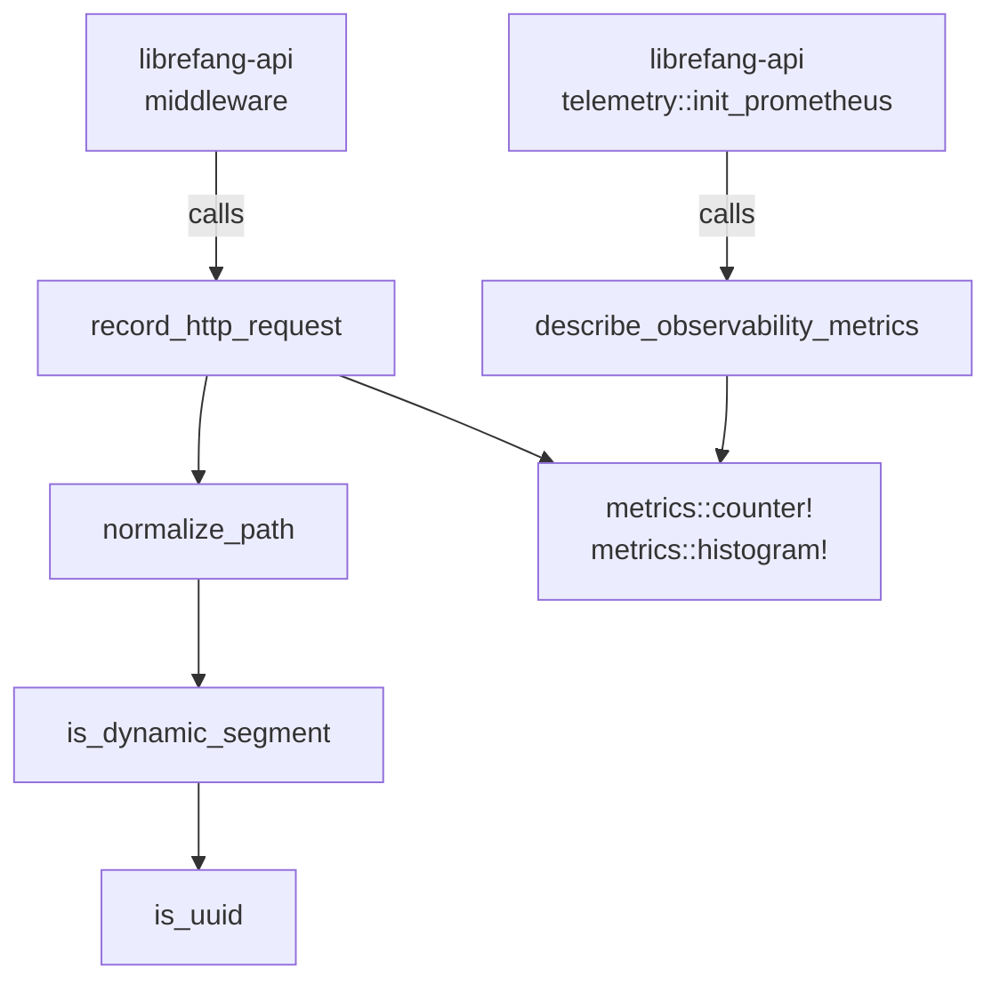

# Support Libraries — librefang-telemetry-src

# librefang-telemetry

OpenTelemetry + Prometheus metrics instrumentation for LibreFang. This crate provides centralized telemetry (metrics and tracing) for monitoring the LibreFang Agent OS across all crates.

## Architecture



The crate itself does **not** own the metrics recorder. It delegates to the `metrics` crate's facade macros (`metrics::counter!`, `metrics::histogram!`), which route data through whichever recorder `librefang-api::telemetry::init_prometheus` has installed — typically a Prometheus exporter. This separation keeps the telemetry library free of global state while remaining usable from any crate.

## Module Structure

| Module | Purpose |
|--------|---------|
| `config` | Re-exports `TelemetryConfig` from `librefang-types` for backward compatibility |
| `metrics` | HTTP metrics recording, path normalization, and metric descriptions |

## Public API

### `record_http_request`

```rust
pub fn record_http_request(path: &str, method: &str, status: u16, duration: Duration)
```

The main entry point called by the request-logging middleware in `librefang-api`. Records two metrics:

- **`librefang_http_requests_total`** — a counter labeled by `method`, `path` (normalized), and `status`.
- **`librefang_http_request_duration_seconds`** — a histogram labeled by `method` and `path` (normalized), recording wall-clock request time.

The `path` is automatically normalized before recording to prevent high-cardinality labels (see [Path Normalization](#path-normalization) below).

### `normalize_path`

```rust
pub fn normalize_path(path: &str) -> String
```

Collapses dynamic path segments into `{id}` so that metrics don't explode in cardinality. Static prefixes like `api`, `v1`, `v2`, and `a2a` are preserved. Examples:

| Input | Output |
|-------|--------|
| `/api/health` | `/api/health` |
| `/api/agents/550e8400-e29b-41d4-a716-446655440000/message` | `/api/agents/{id}/message` |
| `/api/agents/deadbeef01234567/message` | `/api/agents/{id}/message` |
| `/.well-known/agent.json` | `/.well-known/agent.json` |
| `/api/my-agent/status` | `/api/my-agent/status` |

### `describe_observability_metrics`

```rust
pub fn describe_observability_metrics()
```

Registers `# HELP` and `# TYPE` metadata with the installed recorder for all LibreFang metrics. Called once from `init_prometheus` after the recorder is installed. Idempotent — repeated calls are deduped by the recorder.

Metrics described:

| Metric | Type | Unit | Description |
|--------|------|------|-------------|
| `librefang_http_requests_total` | Counter | — | Total HTTP requests by method/path/status |
| `librefang_http_request_duration_seconds` | Histogram | Seconds | Request wall-clock time by method/path |
| `librefang_queue_wait_seconds` | Histogram | Seconds | Time waiting for a CommandQueue lane permit |
| `librefang_mcp_reconnect_total` | Counter | — | MCP reconnect attempts by server id and outcome |
| `librefang_llm_provider_errors_total` | Counter | — | LLM provider errors by provider and HTTP status |
| `librefang_tool_call_total` | Counter | — | Tool invocations by tool name and outcome |

### `get_http_metrics_summary`

```rust
pub fn get_http_metrics_summary() -> String
```

Legacy function kept for backward compatibility. Returns a comment string explaining that full metrics output is available via the `/api/metrics` endpoint or the `PrometheusHandle` directly. Callers needing actual Prometheus output should use the handle in `librefang-api::telemetry` instead.

## Path Normalization

The normalization algorithm works segment-by-segment:

1. Split the path on `/`.
2. Preserve known static prefixes: `api`, `v1`, `v2`, `a2a`.
3. Look ahead: if the **next** segment is dynamic (UUID or hex), replace it with `{id}` and skip it.
4. Otherwise, keep the segment as-is.

A segment is considered dynamic if it matches either:

- **UUID format**: exactly five hyphen-separated hex groups of lengths 8-4-4-4-12 (e.g., `550e8400-e29b-41d4-a716-446655440000`).
- **Pure hex string**: 8–64 ASCII hex characters with no hyphens (e.g., SHA-256 hashes, short hex IDs).

Hyphenated words like `well-known` or `my-agent` are **not** matched, because they fail both the UUID group-length check and the "no hyphens" hex check. This ensures human-readable path segments survive normalization.

## Configuration

`TelemetryConfig` is defined in `librefang-types::config` alongside all other kernel configuration structs. This crate re-exports it at `librefang_telemetry::config::TelemetryConfig` so that existing imports continue to resolve.

## Integration Points

**Inbound** (other crates calling into this one):

- `librefang-api::middleware::request_logging` calls `record_http_request` on every HTTP request.
- `librefang-api::telemetry::init_prometheus` calls `describe_observability_metrics` during startup.

**Outbound** (this crate depends on):

- `metrics` crate — the facade for all metric recording. The actual recorder (Prometheus exporter) is installed elsewhere.
- `librefang-types` — provides the `TelemetryConfig` struct.