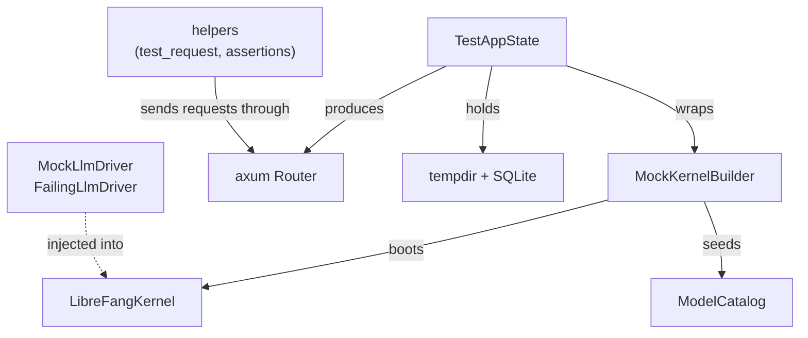

# Support Libraries — librefang-testing-src

# librefang-testing — Test Infrastructure

## Purpose

`librefang-testing` provides reusable mock infrastructure for unit and integration testing across the LibreFang workspace. It allows tests to exercise API routes, kernel logic, and LLM interactions **without** starting a full daemon, hitting the network, or depending on external services.

The crate is consumed by:
- `librefang-api` integration tests (workflow, provider, and route tests)
- `librefang-kernel` unit tests (session operations, summary driver)
- Its own internal test suite in `src/tests.rs`

## Architecture



## Module Structure

| File | Re-exports | Role |
|------|-----------|------|
| `lib.rs` | Public facade — re-exports all public items | Crate root, module declarations |
| `helpers.rs` | `test_request`, `assert_json_ok`, `assert_json_error` | HTTP request building and response assertions |
| `mock_driver.rs` | `MockLlmDriver`, `FailingLlmDriver` | Fake LLM provider with call recording |
| `mock_kernel.rs` | `MockKernelBuilder`, `CatalogSeed`, `test_catalog_baseline`, `test_kernel` | Minimal kernel boot with in-memory SQLite |
| `test_app.rs` | `TestAppState` | Full `AppState` + `Router` construction for axum tests |

---

## MockKernelBuilder

Boots a real `LibreFangKernel` with a temporary directory and SQLite file, skipping networking, OFP, and cron initialization. This is the foundation for nearly all integration tests.

### Key Design Decisions

**Process-wide vault key.** The builder calls `ensure_test_vault_key()` (via `std::sync::Once`) before any kernel boots. This sets `LIBREFANG_VAULT_KEY` to a fixed 32-byte base64 value. Without it, parallel tests race on the shared `<data_local_dir>/librefang/.keyring` file — one test's `init()` overwrites another's master key, causing `vault_get`/`vault_set` decryption failures.

**Process-wide state secret.** Similarly, `ensure_test_state_secret()` sets `LIBREFANG_STATE_SECRET` so that tests enabling `external_auth` don't fail the boot gate that requires a base64-encoded 32-byte value.

**Self-handle wiring.** After boot, `kernel.set_self_handle()` is called so internal `kernel_handle()` lookups (used by `send_message_*`, agent forking, etc.) succeed the same way they do in production.

### Usage

```rust,ignore
// Minimal kernel
let (kernel, _tmp) = MockKernelBuilder::new().build();

// With custom config
let (kernel, _tmp) = MockKernelBuilder::new()
    .with_config(|cfg| {
        cfg.default_model.provider = "openai".into();
    })
    .build();

// With deterministic model catalog (no network dependency)
let (kernel, _tmp) = MockKernelBuilder::new()
    .with_catalog_seed(test_catalog_baseline())
    .build();

// Convenience shorthand
let (kernel, _tmp) = test_kernel();
```

### Directory Layout

`build()` creates this structure under a temp directory:

```
<tmp>/
├── data/
│   └── test.db          # SQLite database
├── skills/
└── workspaces/
    ├── agents/
    └── hands/
```

The returned `TempDir` **must be held** by the caller for the lifetime of the kernel. Dropping it deletes the directory and invalidates all kernel file paths.

### Catalog Seeding

`test_catalog_baseline()` returns a deterministic `(Vec<ProviderInfo>, Vec<ModelCatalogEntry>)` pair containing `gpt-4o-mini` under the `openai` provider. This bypasses the network-dependent `sync_registry` call that `boot_with_config` performs internally. Use it whenever a test asserts on a specific model ID — without seeding, the catalog depends on a live fetch from `github.com/librefang-registry`, which flakes on CI due to rate-limiting or network partitions.

When `with_catalog_seed` is used, the builder calls `kernel.model_catalog_update()` after boot, replacing whatever catalog state `boot_with_config` produced (including partial results from a failed network fetch).

---

## TestAppState

Wraps `MockKernelBuilder` output into a full production-compatible `AppState` and provides an axum `Router` wired with all API routes.

### Router Construction

`router()` returns a `Router` nested under `/api` with routes covering:

- **System** — `/health`, `/health/detail`, `/status`, `/version`, `/metrics`
- **Agents CRUD** — `/agents`, `/agents/{id}`, `/agents/{id}/message`, `/agents/{id}/stop`, `/agents/{id}/model`, `/agents/{id}/mode`, `/agents/{id}/session`, `/agents/{id}/sessions`, `/agents/{id}/session/reset`, `/agents/{id}/tools`, `/agents/{id}/skills`, `/agents/{id}/logs`
- **Profiles** — `/profiles`, `/profiles/{name}`
- **Skills** — `/skills`, `/skills/create`
- **Config** — `/config`, `/config/schema`, `/config/set`, `/config/reload`
- **Memory** — `/memory/search`, `/memory/stats`
- **Usage** — `/usage`, `/usage/summary`
- **Tools & Commands** — `/tools`, `/tools/{name}`, `/commands`
- **Models & Providers** — `/models`, `/providers`
- **Sessions** — `/sessions`

### Usage

```rust,ignore
// Default setup
let test = TestAppState::new();
let router = test.router();

// With custom builder
let test = TestAppState::with_builder(
    MockKernelBuilder::new().with_catalog_seed(test_catalog_baseline())
);

// With API key for authenticated endpoints
let test = TestAppState::new().with_api_key("test-key");

// With per-user API keys
let test = TestAppState::new()
    .with_user_api_keys(vec![ApiUserAuth { /* ... */ }]);

// From an existing kernel
let test = TestAppState::from_kernel(kernel, tmp);
```

### Auth Configuration

- `with_api_key(key)` — sets the global API key accepted by auth middleware
- `with_user_api_keys(keys)` — pre-populates the per-user API key list

Both modify `AppState` runtime locks. If a test writes config to disk via `with_config_path` and then reloads, values set through these methods are **not** persisted — bake them into `KernelConfig` via `MockKernelBuilder::with_config` instead.

### Config Snapshot

`with_config_path(path)` serializes the kernel's internal `KernelConfig` to a TOML file. Used by tests exercising the `/api/config/reload` endpoint. Call it after any builder/config modifications:

```rust,ignore
let config_path = tmp.path().join("test_config.toml");
let test = TestAppState::new().with_config_path(config_path);
```

### Deconstruction

`into_parts()` consumes the `TestAppState`, returning `(Arc<AppState>, TempDir, Option<PathBuf>)` for tests that need direct ownership of these components.

---

## MockLlmDriver

A configurable fake LLM provider implementing the `LlmDriver` trait. It returns canned responses in sequence and records every call for post-test assertions.

### Response Behavior

Responses are returned in order from the `responses` vector. When the vector is exhausted, the driver returns the **last** response for all subsequent calls (wrap-around). At least one response is required — `new()` panics on an empty vector.

Default response metadata:
- Token usage: input=10, output=5 (customizable via `with_tokens`)
- Stop reason: `StopReason::EndTurn` (customizable via `with_stop_reason`)
- Content is wrapped in `ContentBlock::Text`
- `tool_calls` is always empty
- `is_configured()` always returns `true`

### Streaming

The `stream()` implementation sends the response text as a single `StreamEvent::TextDelta` followed by `StreamEvent::ContentComplete`. It does not chunk the text — the entire response arrives in one delta event.

### Call Recording

Every call to `complete()` (including those made internally by `stream()`) records a `RecordedCall`:

| Field | Description |
|-------|-------------|
| `model` | Model name from the request |
| `message_count` | Number of messages in the prompt |
| `tool_count` | Number of tool definitions |
| `system` | System prompt, if provided |

Retrieve recordings:
- `recorded_calls()` — returns all recorded calls as `Vec<RecordedCall>`
- `call_count()` — returns the number of calls made

### Builder Pattern

```rust,ignore
// Single canned response
let driver = MockLlmDriver::with_response("Hello!");

// Multiple responses (returned in order, last one repeats)
let driver = MockLlmDriver::new(vec![
    "First response".into(),
    "Second response".into(),
]);

// Custom token usage and stop reason
let driver = MockLlmDriver::with_response("hi")
    .with_tokens(100, 50)
    .with_stop_reason(StopReason::MaxTokens);

// Inspect calls after use
let calls = driver.recorded_calls();
assert_eq!(calls[0].model, "gpt-4o-mini");
```

---

## FailingLlmDriver

A `LlmDriver` implementation that always returns an error. Used for testing error-handling paths in the kernel and API layers.

```rust,ignore
let driver = FailingLlmDriver::new("upstream timeout");
let result = driver.complete(request).await;
assert!(result.is_err());
```

Returns `LlmError::Api { status: 500, message, code: None }` on every `complete()` call. `is_configured()` returns `false`.

---

## HTTP Test Helpers

### test_request

Builds an `axum::http::Request<Body>` suitable for use with `tower::ServiceExt::oneshot`.

```rust,ignore
// GET with no body
let req = test_request(Method::GET, "/api/health", None);

// POST with JSON body (automatically sets content-type: application/json)
let req = test_request(
    Method::POST,
    "/api/agents",
    Some(r#"{"name": "test"}"#),
);
```

When `body` is `Some(...)`, the `content-type` header is automatically set to `application/json`.

### assert_json_ok

Asserts the response status is `200 OK` and parses the body as JSON. Returns `serde_json::Value`.

```rust,ignore
let response = router.oneshot(request).await.unwrap();
let body = assert_json_ok(response).await;
assert_eq!(body["status"], "healthy");
```

Panics with a descriptive message including the raw response body if either assertion fails.

### assert_json_error

Asserts the response status matches an expected error code and parses the body as JSON. Returns `serde_json::Value`.

```rust,ignore
let response = router.oneshot(request).await.unwrap();
let body = assert_json_error(response, StatusCode::NOT_FOUND).await;
assert_eq!(body["error"], "agent not found");
```

---

## Typical Integration Test Pattern

```rust,ignore
#[tokio::test]
async fn test_agent_lifecycle() {
    // 1. Build test app with deterministic catalog
    let test = TestAppState::with_builder(
        MockKernelBuilder::new().with_catalog_seed(test_catalog_baseline())
    );
    let router = test.router();

    // 2. Spawn an agent
    let req = test_request(
        Method::POST,
        "/api/agents",
        Some(r#"{"name": "test-agent"}"#),
    );
    let resp = router.oneshot(req).await.unwrap();
    let body = assert_json_ok(resp).await;
    let agent_id = body["id"].as_str().unwrap();

    // 3. Verify agent appears in listing
    let req = test_request(Method::GET, "/api/agents", None);
    let resp = router.oneshot(req).await.unwrap();
    let body = assert_json_ok(resp).await;
    assert!(body.as_array().unwrap().len() == 1);

    // 4. Test error path
    let req = test_request(Method::GET, "/api/agents/nonexistent", None);
    let resp = router.oneshot(req).await.unwrap();
    let body = assert_json_error(resp, StatusCode::NOT_FOUND).await;
}
```