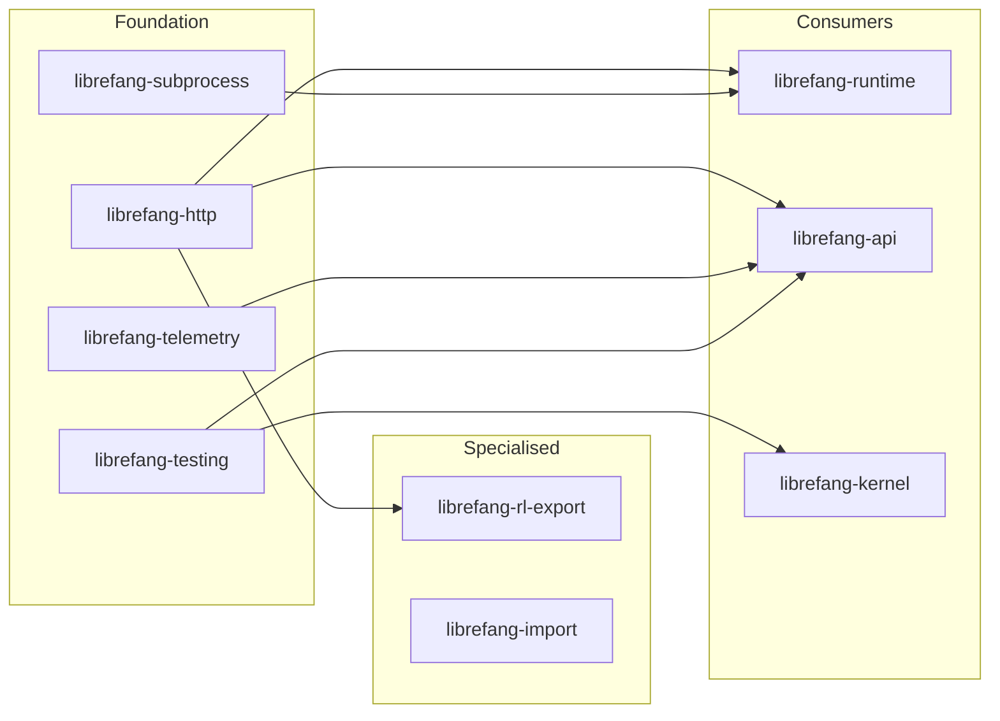

# Support Libraries

# Support Libraries

Shared infrastructure crates that underpin the LibreFang daemon. None of these contain business logic themselves; instead they provide the HTTP transport, subprocess bridging, observability, testing, migration, and RL export surfaces that the kernel, runtime, and API layers depend on.

## Module Map

| Crate | Role | Depends on |
|---|---|---|
| [librefang-http](librefang-http-src.md) | Centralised `reqwest::Client` construction — proxy settings, TLS roots | — |
| [librefang-subprocess](librefang-subprocess-src.md) | JSON-over-stdio transport to long-lived child processes | — |
| [librefang-telemetry](librefang-telemetry-src.md) | OpenTelemetry/Prometheus metrics and tracing helpers | — |
| [librefang-testing](librefang-testing-src.md) | Mock kernel, model catalog, and test-app scaffolding | — |
| [librefang-import](librefang-import-src.md) | Migrate workspaces from OpenClaw, OpenFang, etc. | — |
| [librefang-rl-export](librefang-rl-export-src.md) | Upload RL rollout trajectories to W&B, Tinker, or Atropos | **librefang-http** |

`librefang-http` and `librefang-subprocess` are leaf crates with no intra-workspace dependencies. `librefang-rl-export` is the only support crate that reaches back into another, calling `proxied_client()` from **librefang-http** so every outbound upload respects the global proxy and TLS configuration.

## How They Fit Together

- **Outbound HTTP** — Every `reqwest::Client` in the daemon should be built through `proxied_client_builder()` so that the global proxy (`RwLock<Proxy>`) and the `OnceLock`-cached TLS config (Mozilla roots + system certs) are applied uniformly. The provider-health probe path (`list_providers` → `probe_provider_cached` → … → `proxied_client_builder` → `tls_config` / `active_proxy`) is the canonical example of this flow.
- **Subprocess transport** — `librefang-subprocess` owns the JSON-over-stdio protocol used by sidecar bridges. It sits below `librefang-channels` and `librefang-runtime` and has no knowledge of other support crates.
- **Observability** — `librefang-telemetry` registers Prometheus counters/histograms via the `metrics` facade. `librefang-api` middleware calls `record_http_request`, which normalises paths and emits `metrics::counter!` / `metrics::histogram!` macros.
- **Testing** — `librefang-testing` exposes `MockKernelBuilder` and `TestAppState` so that integration tests in `librefang-api` and unit tests in `librefang-kernel` can exercise routes and logic without a live daemon or network.
- **Migration** — `librefang-import` converts external workspace formats into a LibreFang home directory and emits a `MigrationReport`. It is self-contained and invoked from the CLI/TUI/HTTP API surface.
- **RL export** — `librefang-rl-export` packages finished trajectories and uploads them to one of three backends (Weights & Biases, Tinker, Atropos). All three export paths call back into `librefang-http` for their HTTP client, ensuring proxy and TLS settings are respected.

## Key Cross-Module Workflows

1. **Provider health probing** — `librefang-api` → `librefang-runtime` (probe logic) → `librefang-http` (TLS + proxy). See the *List_providers → Tls_config* flow.
2. **RL trajectory upload** — `librefang-rl-export` chooses a backend (W&B, Tinker, Atropos), builds a `proxied_client` from `librefang-http`, and POSTs the trajectory + metadata.
3. **Integration testing** — `librefang-testing` boots a `MockKernelBuilder` which is consumed by `librefang-api` route tests and `librefang-kernel` unit tests, covering session operations, provider routes, and summary drivers without external dependencies.