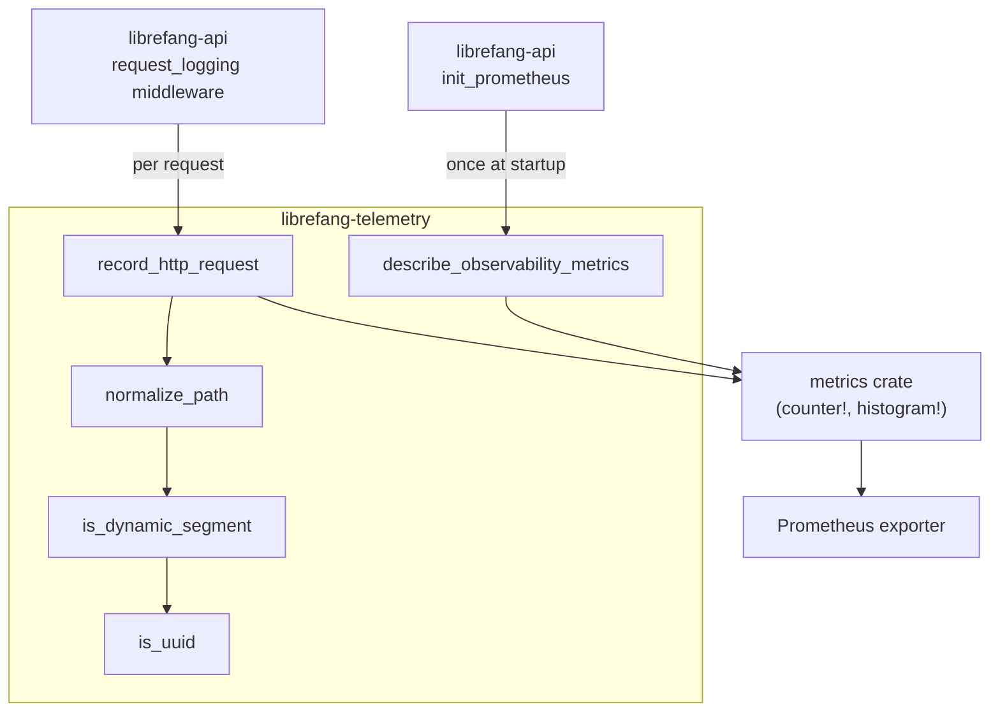

# Telemetry & Metrics

# Telemetry & Metrics (`librefang-telemetry`)

## Overview

`librefang-telemetry` provides centralized OpenTelemetry + Prometheus metrics instrumentation for the LibreFang Agent OS. It serves as a thin, purpose-built wrapper around the `metrics` crate macros, offering a stable public API while delegating all actual recording to whichever metrics recorder is installed at runtime (typically the Prometheus exporter initialized in `librefang-api`).

The crate's primary responsibilities are:

1. **Path normalization** — collapsing high-cardinality dynamic segments (UUIDs, hex IDs) into `{id}` placeholders so that metric labels remain bounded.
2. **HTTP request recording** — emitting counters and histograms for every request passing through the API middleware.
3. **Metric description registration** — declaring `# HELP` / `# TYPE` metadata for the Prometheus exporter.
4. **Configuration re-export** — surfacing `TelemetryConfig` from `librefang-types` for downstream convenience.

## Architecture



## Public API

The crate re-exports three items at the root level:

```rust
pub use metrics::{get_http_metrics_summary, normalize_path, record_http_request};
```

Additionally, `librefang_telemetry::config::TelemetryConfig` re-exports the canonical configuration struct from `librefang-types`.

---

### `record_http_request`

```rust
pub fn record_http_request(path: &str, method: &str, status: u16, duration: Duration)
```

The main entry point for HTTP instrumentation. Called by the request-logging middleware in `librefang-api` on every inbound HTTP request.

**Behavior:**

1. Normalizes `path` via `normalize_path` to collapse dynamic segments.
2. Emits a `metrics::counter!` increment on `librefang_http_requests_total` with labels `method`, `path` (normalized), and `status`.
3. Emits a `metrics::histogram!` record on `librefang_http_request_duration_seconds` with labels `method` and `path` (normalized), recording the wall-clock duration in seconds.

**Metrics produced:**

| Metric Name | Type | Labels |
|---|---|---|
| `librefang_http_requests_total` | Counter | `method`, `path`, `status` |
| `librefang_http_request_duration_seconds` | Histogram | `method`, `path` |

---

### `normalize_path`

```rust
pub fn normalize_path(path: &str) -> String
```

Reduces cardinality of HTTP path labels by replacing dynamic segments with the literal token `{id}`.

**Algorithm:**

The function splits the path on `/` and walks segments left-to-right:

- Static prefixes (`api`, `v1`, `v2`, `a2a`) are preserved as-is.
- When a segment is immediately followed by a dynamic segment, the pair is emitted as `<segment>/{id}` (skipping the next segment).
- Empty segments (leading/trailing slashes) pass through unchanged.

**Dynamic segment detection** (via `is_dynamic_segment`) matches:

- **UUIDs** — strings matching the `8-4-4-4-12` hex pattern (e.g., `550e8400-e29b-41d4-a716-446655440000`).
- **Pure hex strings** — 8–64 hex characters with no hyphens (e.g., `deadbeef01234567`, SHA-256 hashes).

It intentionally does **not** match hyphenated words like `well-known` or `my-agent`, so these pass through unmodified.

**Examples:**

| Input | Output |
|---|---|
| `/api/health` | `/api/health` |
| `/api/agents/550e8400-e29b-41d4-a716-446655440000/message` | `/api/agents/{id}/message` |
| `/api/agents/deadbeef01234567/message` | `/api/agents/{id}/message` |
| `/.well-known/agent.json` | `/.well-known/agent.json` |
| `/api/my-agent/status` | `/api/my-agent/status` |

---

### `describe_observability_metrics`

```rust
pub fn describe_observability_metrics()
```

Registers `# HELP` and `# TYPE` metadata with the installed metrics recorder for all LibreFang observability metrics. Called once during startup by `librefang-api::telemetry::init_prometheus`.

Idempotent — the recorder deduplicates redundant descriptions.

**Metrics registered:**

| Metric | Kind | Description |
|---|---|---|
| `librefang_http_requests_total` | Counter | Total HTTP requests labeled by method/path/status |
| `librefang_http_request_duration_seconds` | Histogram (Seconds) | Wall-clock request duration labeled by method/path |
| `librefang_queue_wait_seconds` | Histogram (Seconds) | Time waiting for a CommandQueue lane permit |
| `librefang_mcp_reconnect_total` | Counter | MCP server reconnect attempts by server id and outcome |
| `librefang_llm_provider_errors_total` | Counter | LLM provider errors by provider and HTTP status |
| `librefang_tool_call_total` | Counter | Tool invocations by tool name and outcome |

---

### `get_http_metrics_summary`

```rust
pub fn get_http_metrics_summary() -> String
```

Legacy compatibility function. Returns a static comment string directing callers to the `/api/metrics` endpoint or the `PrometheusHandle`. The actual Prometheus rendering now happens directly in the route handler via the handle installed at startup.

---

### `TelemetryConfig`

Re-exported from `librefang_types::config::TelemetryConfig`. See the `librefang-types` documentation for field definitions. Available at `librefang_telemetry::config::TelemetryConfig`.

## Integration Points

### Inbound calls (who calls this crate)

- **`librefang-api::middleware::request_logging`** — calls `record_http_request` on every HTTP request passing through the middleware layer.
- **`librefang-api::telemetry::init_prometheus`** — calls `describe_observability_metrics` once during application startup to register metric metadata with the Prometheus exporter.

### Outbound dependency

- **`metrics` crate** — all recording and description calls delegate to `metrics::counter!`, `metrics::histogram!`, `metrics::describe_counter!`, and `metrics::describe_histogram!`. The concrete recorder (Prometheus) is installed externally; this crate never initializes a recorder itself.

## Adding New Metrics

To introduce a new metric:

1. **Declare it** in `describe_observability_metrics` using the appropriate `metrics::describe_*` macro.
2. **Record it** at the call site using `metrics::counter!` or `metrics::histogram!` directly — there is no need to add a wrapper function in this crate unless you need path normalization or other preprocessing.
3. **Use the `librefang_` prefix** on all metric names to avoid collisions in shared Prometheus registries.