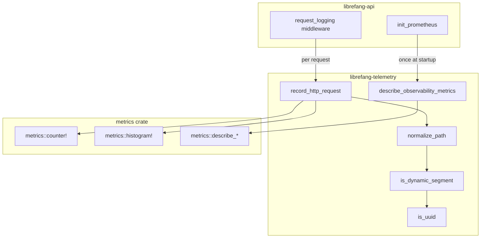

# Telemetry & Observability

# Telemetry & Observability (`librefang-telemetry`)

## Purpose

`librefang-telemetry` provides centralized OpenTelemetry-compatible metrics instrumentation for the LibreFang Agent OS. It acts as a thin, focused layer over the `metrics` crate, offering path normalization to prevent cardinality explosions and a single entry point for recording HTTP request metrics. The actual metrics recorder (Prometheus exporter) is installed elsewhere—in `librefang-api::telemetry`—making this crate a pure recording/declaration library with no side effects at import time.

## Architecture



## Module Structure

```
librefang-telemetry/src/
├── lib.rs       # Public re-exports and module declarations
├── config.rs    # Convenience re-export of TelemetryConfig
└── metrics.rs   # HTTP metrics recording and path normalization
```

---

## `config` Module

A one-line re-export of the canonical `TelemetryConfig` from `librefang-types::config`. This exists so that downstream crates can import from `librefang_telemetry::config` without adding a direct dependency on `librefang-types`.

```rust
pub use librefang_types::config::TelemetryConfig;
```

---

## `metrics` Module

The core of the crate. Provides three public functions and two internal helpers.

### `normalize_path(path: &str) -> String`

Collapses dynamic path segments into `{id}` to keep Prometheus label cardinality bounded. Without this, every unique UUID or hex identifier in a URL path would produce a distinct metric series.

**Algorithm:**

1. Split the path on `/`.
2. For each segment, check if the *next* segment is a dynamic identifier.
3. If so, replace the next segment with `{id}` and skip ahead.
4. Static keywords (`api`, `v1`, `v2`, `a2a`) are always preserved verbatim.

**Examples:**

| Input | Output |
|---|---|
| `/api/health` | `/api/health` |
| `/api/agents/550e8400-e29b-41d4-a716-446655440000/message` | `/api/agents/{id}/message` |
| `/api/agents/deadbeef01234567/message` | `/api/agents/{id}/message` |
| `/.well-known/agent.json` | `/.well-known/agent.json` |
| `/api/my-agent/status` | `/api/my-agent/status` |

The last two cases are important: `well-known` and `my-agent` contain hyphens but are not UUIDs or hex strings, so they pass through unchanged.

**What counts as dynamic:**

- **UUIDs** — strings matching the `8-4-4-4-12` hex pattern (e.g., `550e8400-e29b-41d4-a716-446655440000`).
- **Hex strings** — purely hexadecimal ASCII strings between 8 and 64 characters with no hyphens (e.g., `deadbeef01234567`, SHA-256 hashes).

The `is_dynamic_segment` and `is_uuid` functions are internal (`fn`, not `pub`) and are not part of the stable API.

### `record_http_request(path: &str, method: &str, status: u16, duration: Duration)`

The primary entry point, called by the `request_logging` middleware in `librefang-api` on every HTTP response. It:

1. Normalizes the path via `normalize_path`.
2. Emits a `librefang_http_requests_total` counter increment with labels `method`, `path`, `status`.
3. Records a `librefang_http_request_duration_seconds` histogram observation with labels `method`, `path`.

All recording delegates to the `metrics` crate macros, which route to whichever global recorder has been installed (the Prometheus exporter in production).

### `describe_observability_metrics()`

Registers `# HELP` and `# TYPE` metadata with the active metrics recorder so that the Prometheus scrape endpoint includes human-readable documentation. Called once during startup from `librefang-api::telemetry::init_prometheus`.

Idempotent—calling it twice simply re-registers the same descriptions, which the recorder deduplicates.

**Metrics declared:**

| Metric Name | Type | Unit | Description |
|---|---|---|---|
| `librefang_http_requests_total` | counter | — | Total HTTP requests, labeled by method/path/status |
| `librefang_http_request_duration_seconds` | histogram | seconds | Wall-clock request duration, labeled by method/path |
| `librefang_queue_wait_seconds` | histogram | seconds | Time waiting for a CommandQueue lane permit |
| `librefang_mcp_reconnect_total` | counter | — | MCP server reconnect attempts, labeled by server id and outcome |
| `librefang_llm_provider_errors_total` | counter | — | LLM provider errors from the rate-limit guard, labeled by provider and HTTP status |
| `librefang_tool_call_total` | counter | — | Tool invocations from the agent loop, labeled by tool name and outcome |

The bottom four metrics were introduced in issue #3495. Although they are *recorded* from other crates (the agent loop, the MCP client, etc.), their descriptions are centrally registered here so the Prometheus exporter can emit full metadata.

### `get_http_metrics_summary() -> String`

A backward-compatibility shim. Originally rendered a textual metrics summary directly. Now that the Prometheus `PrometheusHandle` in `librefang-api` owns the rendering, this function returns a comment explaining that callers should use the `/api/metrics` endpoint or the handle directly. Kept to avoid breaking any external consumers.

---

## Integration Points

### Who calls into this crate

| Caller | Function called | When |
|---|---|---|
| `librefang-api::middleware::request_logging` | `record_http_request` | On every HTTP response |
| `librefang-api::telemetry::init_prometheus` | `describe_observability_metrics` | Once at application startup |

### Where the recorder lives

This crate does **not** install a metrics recorder. The `metrics` crate macros (`counter!`, `histogram!`, `histogram!`) are no-ops until a global recorder is set. The Prometheus recorder is installed in `librefang-api::telemetry::init_prometheus`, which runs during server bootstrap. This separation means the telemetry library can be imported by any crate in the workspace without side effects or circular dependencies.

### Adding a new metric

1. Add `metrics::describe_*` calls in `describe_observability_metrics` with the metric name, optional unit, and help text.
2. Record the metric from wherever it's meaningful using `metrics::counter!` / `metrics::histogram!` / `metrics::gauge!` macros—no need to import anything from this crate for recording.
3. The Prometheus exporter will automatically include the new metric in its scrape output.

The convention is to prefix all metric names with `librefang_` to avoid collisions in shared Prometheus environments.