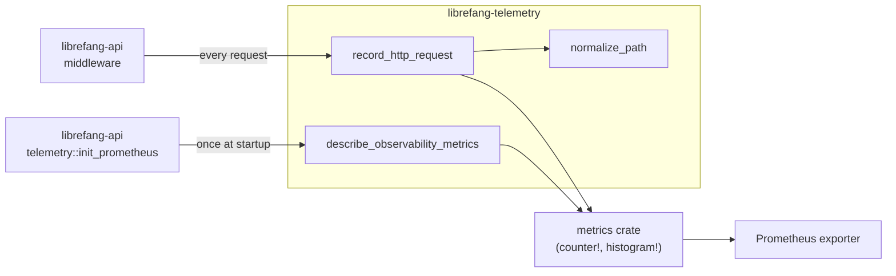

# Telemetry & Observability

# Telemetry & Observability (`librefang-telemetry`)

## Purpose

`librefang-telemetry` provides centralized metrics instrumentation for the LibreFang Agent OS. It wraps the standard `metrics` crate facade—using `metrics::counter!` and `metrics::histogram!` macros—so that all telemetry data flows through whichever recorder is installed at runtime (typically the Prometheus exporter initialized in `librefang-api`).

The crate is consumed by the API layer's middleware and telemetry initialization, and its public API is deliberately small: record an HTTP request, normalize a path, describe all known metrics, and expose a legacy metrics summary endpoint.

## Architecture



## Module Layout

| File | Responsibility |
|---|---|
| `config.rs` | Re-exports `TelemetryConfig` from `librefang-types` for backward compatibility. |
| `metrics.rs` | All metric recording, path normalization, and metric description logic. |
| `lib.rs` | Crate root; re-exports the three primary public symbols. |

## Public API

The crate exposes three functions (re-exported at the crate root):

```rust
pub use metrics::{get_http_metrics_summary, normalize_path, record_http_request};
```

### `record_http_request`

```rust
pub fn record_http_request(path: &str, method: &str, status: u16, duration: Duration)
```

The primary entry point, called by the request-logging middleware in `librefang-api` on every inbound HTTP request. It:

1. Normalizes the request path via `normalize_path` to collapse high-cardinality segments.
2. Increments the `librefang_http_requests_total` counter with labels `method`, `path`, and `status`.
3. Records the `librefang_http_request_duration_seconds` histogram with labels `method` and `path`.

The function delegates to `metrics::counter!` and `metrics::histogram!`, which are no-ops until a recorder is installed. This means the telemetry crate has zero cost if the API layer hasn't initialized the Prometheus exporter.

### `normalize_path`

```rust
pub fn normalize_path(path: &str) -> String
```

Rewrites a raw HTTP path into a low-cardinality form by replacing dynamic segments with the literal `{id}`. This prevents Prometheus label explosion when agents, tasks, or other entities have UUID- or hex-based identifiers in their URLs.

**Examples:**

| Input | Output |
|---|---|
| `/api/health` | `/api/health` |
| `/api/agents/550e8400-e29b-41d4-a716-446655440000/message` | `/api/agents/{id}/message` |
| `/api/agents/deadbeef01234567/message` | `/api/agents/{id}/message` |
| `/.well-known/agent.json` | `/.well-known/agent.json` |
| `/api/my-agent/status` | `/api/my-agent/status` |

**Normalization algorithm:**

1. Split the path on `/`.
2. Skip static keywords (`api`, `v1`, `v2`, `a2a`) unchanged.
3. For each remaining segment, peek at the next segment. If the next segment is a dynamic identifier, emit the current segment as-is and replace the next with `{id}`, advancing by two.
4. A segment is considered dynamic if it matches:
   - A standard UUID (8-4-4-4-12 hex-digit pattern).
   - A pure hex string between 8 and 64 characters with no hyphens.
5. Hyphenated words like `well-known` or `my-agent` are **not** treated as dynamic, because they fail both the UUID check (wrong group count/lengths) and the hex check (contain hyphens or non-hex characters).

### `get_http_metrics_summary`

```rust
pub fn get_http_metrics_summary() -> String
```

A backward-compatibility shim. The actual Prometheus text output is now rendered directly from the `PrometheusHandle` in `librefang-api`'s `/api/metrics` route handler. This function returns a comment explaining that callers should use the endpoint or handle directly.

### `describe_observability_metrics`

```rust
pub fn describe_observability_metrics()
```

Registers `# HELP` and `# TYPE` metadata for all LibreFang metrics with the installed recorder. Called once during `init_prometheus` in `librefang-api`. Idempotent—the recorder deduplicates repeated descriptions.

**Metrics registered:**

| Metric Name | Kind | Unit | Labels | Description |
|---|---|---|---|---|
| `librefang_http_requests_total` | Counter | — | `method`, `path`, `status` | Total HTTP requests handled by the API server. |
| `librefang_http_request_duration_seconds` | Histogram | Seconds | `method`, `path` | Wall-clock request serving time. |
| `librefang_queue_wait_seconds` | Histogram | Seconds | — | Time spent waiting for a CommandQueue lane permit. |
| `librefang_mcp_reconnect_total` | Counter | — | `server_id`, `outcome` | MCP server reconnect attempts (success/failure). |
| `librefang_llm_provider_errors_total` | Counter | — | `provider`, `status` | LLM provider error responses from the rate-limit guard. |
| `librefang_tool_call_total` | Counter | — | `tool`, `outcome` | Tool invocations from the agent loop (success/failure). |

The last four metrics were added in PR #3495. They are described here but recorded in their respective crates (command queue, MCP connector, LLM provider guard, agent loop) using the same `metrics::counter!` / `metrics::histogram!` macros.

## Configuration

The crate re-exports `TelemetryConfig` from `librefang-types`:

```rust
pub use librefang_types::config::TelemetryConfig;
```

This keeps the canonical configuration struct in the shared types crate while allowing imports from `librefang_telemetry::config` for existing code.

## Integration Points

**Inbound (who calls this crate):**

- `librefang-api/src/middleware.rs` — calls `record_http_request` on every HTTP request passing through the request-logging middleware.
- `librefang-api/src/telemetry.rs` — calls `describe_observability_metrics` from `init_prometheus` during server startup to register metric descriptions with the Prometheus exporter.

**Outbound (what this crate depends on):**

- The `metrics` crate facade — all recording is done through `metrics::counter!` and `metrics::histogram!`, making this crate agnostic to the actual exporter backend.
- `librefang-types` — for the `TelemetryConfig` re-export.

## Adding New Metrics

1. **Describe it.** Add a `metrics::describe_counter!` or `metrics::describe_histogram!` call inside `describe_observability_metrics` in `metrics.rs`. Include the PR number in the description string for traceability.

2. **Record it.** In whichever crate owns the relevant logic, call `metrics::counter!` or `metrics::histogram!` with the metric name and labels. No direct dependency on `librefang-telemetry` is needed for recording—the `metrics` crate macros resolve to whatever global recorder is installed.

3. **Keep label cardinality low.** If the metric includes a path or identifier label, use `normalize_path` or a similar collapsing strategy to avoid label explosion in Prometheus.