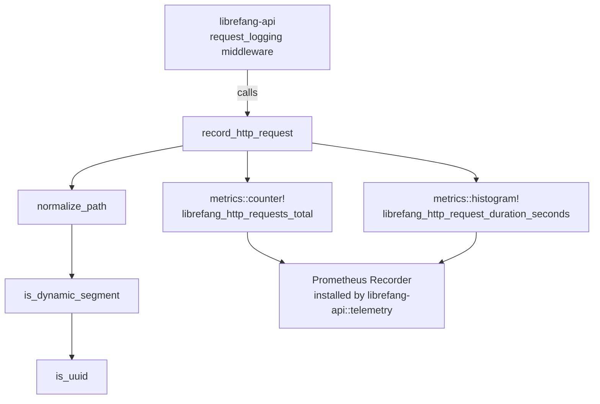

# Telemetry & Observability

# Telemetry & Observability (`librefang-telemetry`)

Centralized metrics and tracing instrumentation for the LibreFang Agent OS. This crate wraps the `metrics` crate facade and provides HTTP-specific utilities consumed by the API layer's request-logging middleware.

## Architecture



The crate does **not** install a metrics recorder itself. That responsibility belongs to `librefang-api::telemetry`, which wires up a `PrometheusHandle`. This crate only emits metrics through the `metrics` crate macros — the recorder is injected from outside.

## Module Layout

| Module | Purpose |
|--------|---------|
| `config` | Re-exports `TelemetryConfig` from `librefang-types` for import convenience |
| `metrics` | Path normalization and HTTP request recording |

## Key Components

### `normalize_path`

```rust
pub fn normalize_path(path: &str) -> String
```

Collapses high-cardinality dynamic segments in HTTP paths to the placeholder `{id}`. This prevents metric label explosion when paths contain per-resource identifiers.

**How it works:** The path is split on `/`, then each segment is checked in context. A segment is replaced with `{id}` when it follows a static prefix (like `agents`, `tasks`) and is itself a dynamic identifier. Well-known structural segments (`api`, `v1`, `v2`, `a2a`) are always preserved.

| Input | Output |
|-------|--------|
| `/api/health` | `/api/health` |
| `/api/agents/550e8400-e29b-41d4-a716-446655440000/message` | `/api/agents/{id}/message` |
| `/api/agents/deadbeef01234567/message` | `/api/agents/{id}/message` |
| `/.well-known/agent.json` | `/.well-known/agent.json` |
| `/api/my-agent/status` | `/api/my-agent/status` |

### `record_http_request`

```rust
pub fn record_http_request(path: &str, method: &str, status: u16, duration: Duration)
```

The primary entry point, called from the `request_logging` middleware in `librefang-api`. It:

1. Normalizes the path via `normalize_path`.
2. Emits a counter increment to `librefang_http_requests_total` with labels `method`, `path`, and `status`.
3. Records a histogram observation to `librefang_http_request_duration_seconds` with labels `method` and `path`.

Both metrics flow through whatever recorder is globally installed.

### `get_http_metrics_summary`

```rust
pub fn get_http_metrics_summary() -> String
```

A backward-compatibility shim. Returns a comment explaining that full Prometheus output is available via the `/api/metrics` endpoint or the `PrometheusHandle` directly. Callers needing actual metric data should use the Prometheus handle in `librefang-api::telemetry`.

## Dynamic Segment Detection

A path segment is considered dynamic if it matches either of:

- **UUID format** — exactly five hyphen-separated hex groups with lengths 8-4-4-4-12 (e.g., `550e8400-e29b-41d4-a716-446655440000`).
- **Pure hex string** — 8 to 64 ASCII hex characters with no hyphens (e.g., `deadbeef01234567`, SHA-256 hashes).

Hyphenated words like `well-known` or `my-agent` are intentionally **not** treated as dynamic, because they fail both the UUID structure check and the "no hyphens" hex check.

## Configuration

Telemetry configuration is defined by `TelemetryConfig` in the `librefang-types` crate, re-exported here as `librefang_telemetry::config::TelemetryConfig`. This keeps all kernel configuration in one canonical location.

## Integration Points

**Downstream consumer:** The `request_logging` middleware in `librefang-api/src/middleware.rs` calls `record_http_request` on every inbound HTTP request.

**Recorder installation:** `librefang-api/src/telemetry.rs` installs the Prometheus exporter that receives the metrics this crate emits.

**Metrics endpoint:** The `/api/metrics` route in the API layer renders the Prometheus text output from the installed `PrometheusHandle`.