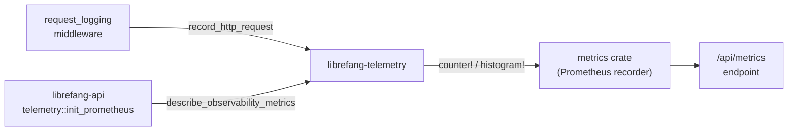

# Telemetry & Observability

# Telemetry & Observability (`librefang-telemetry`)

## Purpose

Centralized metrics instrumentation for the LibreFang Agent OS. This crate wraps the `metrics` crate façade and provides path normalization, HTTP request recording, and metric description registration so that all 14 crates in the workspace emit consistent, low-cardinality telemetry to a single Prometheus exporter.

## Architecture

```mermaid
flowchart LR
    MW["request_logging<br/>middleware"]
    API["librefang-api<br/>telemetry::init_prometheus"]
    SUB["librefang-telemetry"]
    REC["metrics crate<br/>(Prometheus recorder)"]
    EP["/api/metrics<br/>endpoint"]

    MW -->|"record_http_request"| SUB
    API -->|"describe_observability_metrics"| SUB
    SUB -->|"counter! / histogram!"| REC
    REC --> EP
```

The recorder itself is installed by `librefang-api::telemetry::init_prometheus`. This crate only calls the `metrics::counter!` and `metrics::histogram!` macros, which are no-ops until a recorder is installed.

## Module Layout

| File | Responsibility |
|---|---|
| `config.rs` | Re-exports `TelemetryConfig` from `librefang-types` for backward compatibility. |
| `metrics.rs` | Path normalization, HTTP recording, metric descriptions. |
| `lib.rs` | Crate root; re-exports the public API. |

## Public API

### `record_http_request(path, method, status, duration)`

The primary entry point, called by the request-logging middleware in `librefang-api`.

**Parameters:**
- `path: &str` — raw request URI (e.g. `/api/agents/550e8400-…/message`)
- `method: &str` — HTTP method (`"GET"`, `"POST"`, etc.)
- `status: u16` — response status code
- `duration: Duration` — wall-clock time spent serving the request

**Emitted metrics:**

| Metric Name | Type | Labels |
|---|---|---|
| `librefang_http_requests_total` | counter | `method`, `path`, `status` |
| `librefang_http_request_duration_seconds` | histogram | `method`, `path` |

The `path` label is automatically normalized via `normalize_path` to prevent cardinality explosions from dynamic segments.

### `normalize_path(path) -> String`

Collapses dynamic segments (UUIDs, hex identifiers) into `{id}` so that `/api/agents/550e8400-e29b-41d4-a716-446655440000/message` becomes `/api/agents/{id}/message`.

**Normalization rules:**
1. Segments matching `api`, `v1`, `v2`, or `a2a` are preserved as-is.
2. A segment is treated as a dynamic identifier if it is:
   - A UUID in `8-4-4-4-12` hex format, **or**
   - A pure hex string between 8 and 64 characters (no hyphens).
3. When a segment `X` is followed by a dynamic segment, both are emitted as `X/{id}`.
4. Hyphenated words like `well-known` or `my-agent` are **not** treated as dynamic.

### `describe_observability_metrics()`

Registers `# HELP` and `# TYPE` descriptions for all LibreFang metrics with the installed recorder. Called once from `librefang-api::telemetry::init_prometheus` after the recorder is set up. Idempotent — duplicate calls are safely deduplicated by the recorder.

**Metrics described:**

| Metric | Type | Unit | Description |
|---|---|---|---|
| `librefang_http_requests_total` | counter | — | Total HTTP requests by method/path/status |
| `librefang_http_request_duration_seconds` | histogram | Seconds | Request serving time |
| `librefang_queue_wait_seconds` | histogram | Seconds | CommandQueue lane permit wait time |
| `librefang_mcp_reconnect_total` | counter | — | MCP server reconnect attempts (success/failure) |
| `librefang_llm_provider_errors_total` | counter | — | LLM provider errors by provider/status |
| `librefang_tool_call_total` | counter | — | Tool invocations by name and outcome |

### `get_http_metrics_summary() -> String`

Backward-compatible stub. The actual Prometheus text output is now served directly from the `PrometheusHandle` via the `/api/metrics` route in `librefang-api`. This function returns a comment explaining where to find the real output.

## Integration Points

**Where this crate is consumed:**

- **`librefang-api::middleware::request_logging`** — calls `record_http_request` on every inbound HTTP request.
- **`librefang-api::telemetry::init_prometheus`** — calls `describe_observability_metrics` during startup.

**Configuration:**

Telemetry configuration is defined by `TelemetryConfig` in `librefang-types::config::types` and re-exported here at `librefang_telemetry::config::TelemetryConfig` for import convenience.