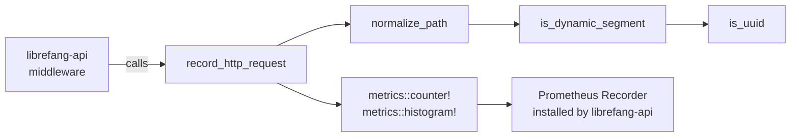

# Telemetry

# Telemetry Module

## Overview

`librefang-telemetry` provides centralized metrics instrumentation for the LibreFang Agent OS. It wraps the `metrics` crate ecosystem, offering HTTP request recording with automatic path normalization to prevent cardinality explosions in Prometheus metric labels.

The crate is intentionally thin — it defines convenience functions and re-exports configuration, while the actual metrics recorder (Prometheus exporter) is installed upstream in `librefang-api`.

## Architecture



## Module Structure

| File | Purpose |
|------|---------|
| `config.rs` | Re-exports `TelemetryConfig` from `librefang-types` for import convenience |
| `metrics.rs` | HTTP metrics recording and path normalization |
| `lib.rs` | Public API surface and module declarations |

## Public API

Three functions are re-exported at the crate root:

```rust
use librefang_telemetry::{get_http_metrics_summary, normalize_path, record_http_request};
```

### `record_http_request`

The primary entry point, called by the request-logging middleware in `librefang-api`.

```rust
pub fn record_http_request(path: &str, method: &str, status: u16, duration: Duration)
```

It emits two metrics via the `metrics` crate macros:

| Metric | Type | Labels |
|--------|------|--------|
| `librefang_http_requests_total` | Counter | `method`, `path` (normalized), `status` |
| `librefang_http_request_duration_seconds` | Histogram | `method`, `path` (normalized) |

The `path` label is always passed through `normalize_path` before recording. This ensures that `/api/agents/550e8400-e29b-41d4-a716-446655440000/message` and `/api/agents/deadbeef01234567/message` both collapse to `/api/agents/{id}/message`, keeping cardinality bounded.

### `normalize_path`

```rust
pub fn normalize_path(path: &str) -> String
```

Replaces dynamic path segments (UUIDs, hex identifiers) with `{id}`. The algorithm walks segments pairwise — when a segment is followed by a dynamic identifier, both are emitted as `segment/{id}` and the iterator advances by two.

Segments that are **never** collapsed:
- Empty segments
- Static prefixes: `api`, `v1`, `v2`, `a2a`
- Hyphenated words like `well-known` or `my-agent` (not hex-only)
- Short strings under 8 characters

A segment is identified as dynamic by `is_dynamic_segment` when it matches either:
- A standard UUID in `8-4-4-4-12` hex format (e.g., `550e8400-e29b-41d4-a716-446655440000`)
- A pure hex string of 8–64 characters with no hyphens (e.g., `deadbeef01234567`, SHA-256 hashes)

### `get_http_metrics_summary`

```rust
pub fn get_http_metrics_summary() -> String
```

A backward-compatible stub. The actual Prometheus output is served directly from `librefang-api`'s `/api/metrics` endpoint using the `PrometheusHandle`. This function returns a comment explaining that callers should use the endpoint or handle directly.

## Integration Points

**Incoming call:** `librefang-api/src/middleware.rs` calls `record_http_request` in its request-logging middleware for every HTTP request passing through the API layer.

**Recorder installation:** The crate does not install a metrics recorder itself. That happens in `crates/librefang-api/src/telemetry.rs`, which sets up the `PrometheusHandle` that the `metrics::counter!` and `metrics::histogram!` macros route to.

**Configuration:** `TelemetryConfig` is defined in `librefang-types::config::types` alongside all other kernel configuration. This crate re-exports it from the `config` submodule so that existing imports from `librefang_telemetry::config` continue to resolve.

## Path Normalization Examples

| Input | Output | Reason |
|-------|--------|--------|
| `/api/health` | `/api/health` | No dynamic segments |
| `/api/agents/550e8400-e29b-41d4-a716-446655440000/message` | `/api/agents/{id}/message` | UUID collapsed |
| `/api/agents/deadbeef01234567/message` | `/api/agents/{id}/message` | Hex string collapsed |
| `/.well-known/agent.json` | `/.well-known/agent.json` | `well-known` is not hex-only |
| `/api/my-agent/status` | `/api/my-agent/status` | Hyphens + non-hex chars → not dynamic |