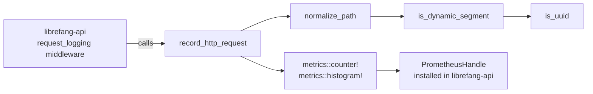

# Telemetry

# LibreFang Telemetry (`librefang-telemetry`)

OpenTelemetry + Prometheus metrics instrumentation for LibreFang. This crate provides centralized metric recording and path normalization so that every crate in the LibreFang Agent OS emits consistent, low-cardinality telemetry.

## Architecture



The crate is intentionally thin. It does **not** own the Prometheus recorder or exporter — that lifecycle is managed by `librefang-api::telemetry`. Instead, this crate provides:

- A **path-normalization algorithm** that collapses high-cardinality route segments before they become metric labels.
- A **recording entry point** (`record_http_request`) that bridges the API middleware layer to the `metrics` crate macros.
- A **re-export** of `TelemetryConfig` from `librefang-types` for convenient imports.

## Configuration

The canonical configuration struct is `librefang_types::config::TelemetryConfig`. This crate re-exports it at `librefang_telemetry::config::TelemetryConfig` so that downstream code can import from either location.

## HTTP Metrics Pipeline

### `record_http_request`

```rust
pub fn record_http_request(path: &str, method: &str, status: u16, duration: Duration)
```

The primary entry point, called by the `request_logging` middleware in `librefang-api`. It:

1. Normalizes the incoming `path` via `normalize_path`.
2. Emits a `librefang_http_requests_total` **counter** labeled with `method`, `path`, and `status`.
3. Emits a `librefang_http_request_duration_seconds` **histogram** labeled with `method` and `path`, recording the elapsed time as a float in seconds.

All recording delegates to `metrics::counter!` and `metrics::histogram!`. Data flows to whichever global recorder has been installed — typically the Prometheus exporter set up in `librefang-api::telemetry`.

### `get_http_metrics_summary`

```rust
pub fn get_http_metrics_summary() -> String
```

A backward-compatible stub. The actual Prometheus text output is now rendered directly from the `PrometheusHandle` in `librefang-api` at the `/api/metrics` endpoint. This function returns a comment explaining where to find the real output. Do not rely on it for new code.

## Path Normalization

### `normalize_path`

```rust
pub fn normalize_path(path: &str) -> String
```

Rewrites an HTTP path so that dynamic segments are replaced with the literal token `{id}`. This prevents unbounded cardinality in metric labels caused by UUIDs, hashes, and other per-request identifiers.

**Examples:**

| Input | Output |
|---|---|
| `/api/health` | `/api/health` |
| `/api/agents/550e8400-e29b-41d4-a716-446655440000/message` | `/api/agents/{id}/message` |
| `/api/agents/deadbeef01234567/message` | `/api/agents/{id}/message` |
| `/.well-known/agent.json` | `/.well-known/agent.json` |
| `/api/my-agent/status` | `/api/my-agent/status` |

#### How it works

The algorithm splits the path on `/` and walks the segments left to right:

1. **Reserved segments** — `"api"`, `"v1"`, `"v2"`, `"a2a"` — are passed through unchanged.
2. For every other segment, the algorithm looks ahead to the **next** segment. If that next segment is dynamic (as determined by `is_dynamic_segment`), the current segment is kept and the next one is replaced with `{id}`.
3. Empty segments (leading/trailing slashes) are preserved.

This look-ahead pattern means that a segment like `"agents"` is only collapsed when it is followed by an identifier, preserving routes like `/api/my-agent/status` where `"my-agent"` is a static slug.

### Dynamic segment detection

A segment is classified as dynamic when it matches either:

- **UUID format** — Five hyphen-separated hex groups with lengths 8-4-4-4-12 (e.g., `550e8400-e29b-41d4-a716-446655440000`).
- **Pure hex string** — 8–64 ASCII hex characters with no hyphens (e.g., `deadbeef01234567`, or a full SHA-256 hash).

Strings like `well-known` or `my-agent` contain hyphens but fail both checks (wrong group lengths, non-hex characters) and are correctly treated as static.

## Metric Names and Labels

| Metric | Type | Labels |
|---|---|---|
| `librefang_http_requests_total` | Counter | `method`, `path` (normalized), `status` |
| `librefang_http_request_duration_seconds` | Histogram | `method`, `path` (normalized) |

When building dashboards or alerting rules, filter on the normalized `path` label (e.g., `/api/agents/{id}/message`) rather than raw request paths.

## Integration with the rest of the codebase

- **`librefang-api`** — The `request_logging` middleware calls `record_http_request` on every inbound HTTP request. The same crate also installs the Prometheus recorder during startup (`librefang-api::telemetry`).
- **`librefang-types`** — Owns `TelemetryConfig`. This crate re-exports it for convenience.
- All other crates can depend on `librefang-telemetry` to record domain-specific metrics using the same `metrics` crate macros directly, sharing the global recorder.

## Adding new metrics

This crate currently only handles HTTP request metrics. To instrument other subsystems:

1. Use `metrics::counter!`, `metrics::histogram!`, or `metrics::gauge!` directly from whichever crate needs instrumentation — they all share the same global recorder.
2. Follow the `librefang_<subsystem>_<metric_name>` naming convention.
3. Keep label cardinality low. If you need path-like labels, call `normalize_path` from this crate.