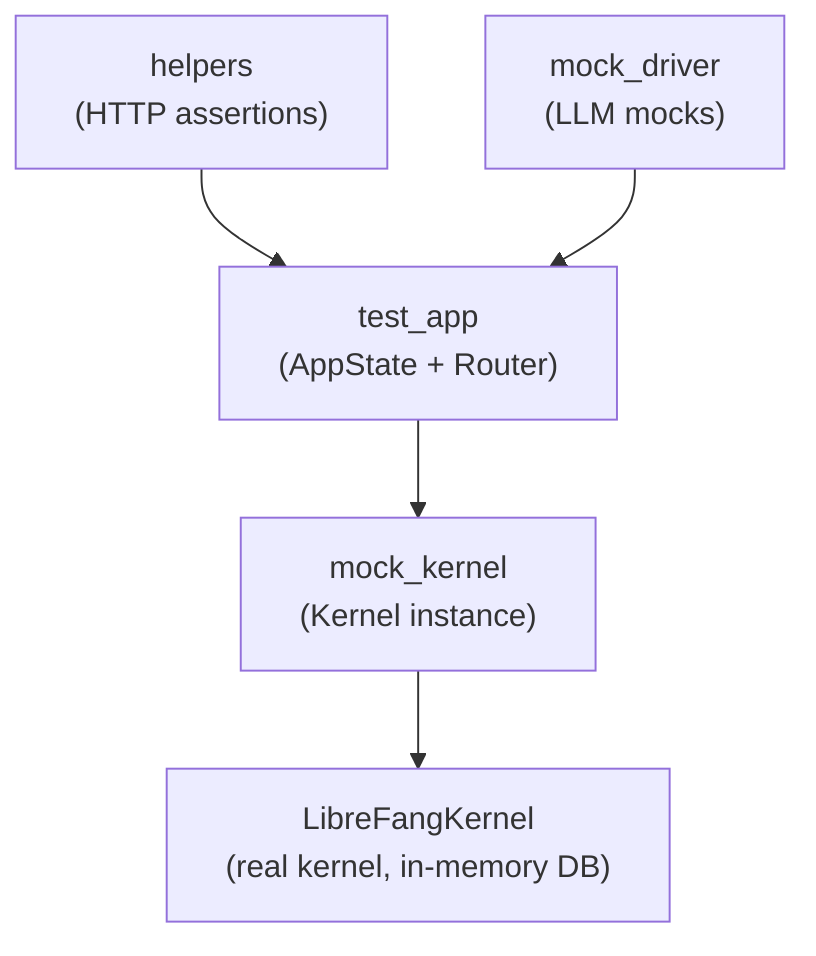

# Testing Framework

# librefang-testing — Test Infrastructure

## Purpose

Provides self-contained mock infrastructure for testing API routes, LLM integrations, and kernel behavior without starting a full daemon, opening network ports, or requiring external services. Everything runs in-process using an in-memory SQLite database and temporary filesystem directories.

## Architecture

The module is organized into four layers, each building on the one below:



Tests typically construct a `TestAppState`, call its `router()` method to get an axum `Router`, then send requests through it using `test_request` and validate responses with `assert_json_ok` / `assert_json_error`.

## Key Components

### `MockKernelBuilder`

Builds a real `LibreFangKernel` instance configured for testing:

- **In-memory SQLite** — database lives at a temp-file path, avoiding external dependencies
- **Temporary home directory** — `TempDir` provides `data/`, `skills/`, `workspaces/agents/`, `workspaces/hands/` under an isolated path
- **Networking disabled** — `network_enabled` is set to `false`
- **No heavy initialization** — skips OFP, cron, and other daemon subsystems

The caller **must retain the `TempDir`** returned from `build()`. Dropping it deletes the temp directory, which invalidates all file paths the kernel references.

```rust
let (kernel, _tmp) = MockKernelBuilder::new()
    .with_config(|cfg| {
        cfg.default_model.provider = "test".into();
    })
    .build();
```

For quick one-off kernels, use the `test_kernel()` convenience function:

```rust
let (kernel, _tmp) = test_kernel();
```

**Custom configuration.** Pass a closure to `with_config` to override any `KernelConfig` fields. This runs after the builder sets its minimal defaults (home dir, data dir, SQLite path, networking off), so the closure takes precedence.

### `MockLlmDriver`

A thread-safe, configurable fake that implements `LlmDriver`. It does two things:

1. **Returns canned responses** in order. When the response list is exhausted, it repeats the last one indefinitely.
2. **Records every call** so tests can assert on what the LLM was asked.

```rust
let driver = MockLlmDriver::new(vec![
    "First response".into(),
    "Second response".into(),
])
.with_tokens(100, 50)
.with_stop_reason(StopReason::MaxTokens);

// After calls are made:
assert_eq!(driver.call_count(), 2);
let calls = driver.recorded_calls();
assert_eq!(calls[0].message_count, 3);
```

Each `RecordedCall` captures:

| Field | Description |
|-------|-------------|
| `model` | Model name from the request |
| `message_count` | Number of messages sent |
| `tool_count` | Number of tool definitions included |
| `system` | System prompt, if any |

**Streaming.** The `stream()` implementation calls `complete()` internally, then emits a single `TextDelta` event followed by a `ContentComplete` event. This simulates the streaming protocol without real I/O.

**Defaults.** Token usage defaults to `input=10, output=5`. Stop reason defaults to `StopReason::EndTurn`. Override with `with_tokens()` and `with_stop_reason()`.

### `FailingLlmDriver`

A simpler mock that always returns an `LlmError::Api` with status 500. Use it to test error-handling paths:

```rust
let driver = FailingLlmDriver::new("API key invalid");
```

Its `is_configured()` returns `false`, matching the behavior of a misconfigured real driver.

### `TestAppState`

The primary entry point for route-level tests. It wires together a `MockKernelBuilder`, constructs a real `AppState`, and exposes an axum `Router` with all API routes registered under `/api`.

```rust
let test = TestAppState::new();
let router = test.router();

// Send a request through the router
let response = router
    .oneshot(test_request(Method::GET, "/api/health", None))
    .await
    .unwrap();

let body = assert_json_ok(response).await;
assert_eq!(body["status"], "ok");
```

**Construction options:**

| Method | When to use |
|--------|------------|
| `TestAppState::new()` | Default kernel, no customization needed |
| `TestAppState::with_builder(builder)` | Custom kernel config via `MockKernelBuilder` |
| `TestAppState::from_kernel(kernel, tmp)` | Pre-built kernel (caller holds `TempDir`) |

**Router coverage.** The `router()` method registers all production API routes under `/api`, including agents CRUD, skills, config, memory, budget, tools, providers, and session endpoints. Paths match the production layout exactly (e.g., `/api/agents/{id}/message`).

**AppState fields.** `build_state()` initializes every field on the production `AppState` struct. Most are empty/default (no peer registry, no bridge manager, no Prometheus handle). The `webhook_store` writes to a temp file within the temp directory.

### Helper Functions

Three functions that eliminate boilerplate from route tests:

**`test_request(method, path, body)`** — Builds an axum `Request<Body>`. Automatically sets `Content-Type: application/json` when a body is provided.

**`assert_json_ok(response)`** — Asserts status 200, parses the body as JSON, returns `serde_json::Value`. Panics with the raw body text on failure for easy debugging.

**`assert_json_error(response, expected_status)`** — Same as `assert_json_ok` but checks for an arbitrary status code. Use it for 404, 422, and other error cases.

## Typical Test Pattern

Most route tests follow this structure:

```rust
#[tokio::test]
async fn test_list_agents() {
    // 1. Build test app
    let test = TestAppState::new();
    let router = test.router();

    // 2. Build request
    let req = test_request(Method::GET, "/api/agents", None);

    // 3. Execute
    let resp = router.oneshot(req).await.unwrap();

    // 4. Assert
    let body = assert_json_ok(resp).await;
    assert!(body["agents"].is_array());
}
```

For error cases:

```rust
#[tokio::test]
async fn test_get_agent_not_found() {
    let test = TestAppState::new();
    let router = test.router();

    let req = test_request(Method::GET, "/api/agents/nonexistent", None);
    let resp = router.oneshot(req).await.unwrap();

    let body = assert_json_error(resp, StatusCode::NOT_FOUND).await;
    assert!(body["error"].is_string());
}
```

For tests that need to verify LLM behavior:

```rust
#[tokio::test]
async fn test_mock_llm_driver_recording() {
    let driver = MockLlmDriver::with_response("pong");

    let request = CompletionRequest {
        model: "test-model".into(),
        messages: vec![/* ... */],
        tools: vec![],
        system: Some("You are a test.".into()),
    };

    driver.complete(request).await.unwrap();

    assert_eq!(driver.call_count(), 1);
    let call = &driver.recorded_calls()[0];
    assert_eq!(call.model, "test-model");
    assert_eq!(call.system.as_deref(), Some("You are a test."));
}
```

## Integration with the Codebase

This module depends on:

- **`librefang-kernel`** — provides `LibreFangKernel` and `KernelConfig`; the builder calls `LibreFangKernel::boot_with_config`
- **`librefang-api`** — provides `AppState` and all route handler functions registered in `TestAppState::router()`
- **`librefang-runtime`** — provides the `LlmDriver` trait that `MockLlmDriver` and `FailingLlmDriver` implement
- **`librefang-types`** — provides `TokenUsage`, `StopReason`, `ContentBlock`, and other message types

Internal tests (`librefang-testing/src/tests.rs`) exercise the framework itself, while the broader project uses it in integration tests across `librefang-api` and `librefang-desktop`. The `MockKernelBuilder` is also used at build time by `librefang-desktop/build.rs` for code generation.