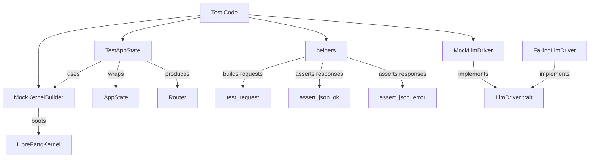

# Testing Framework

# librefang-testing — Test Infrastructure

Provides mock infrastructure for unit and integration testing API routes without starting a full daemon. The crate wraps a real `LibreFangKernel` booted with minimal configuration (in-memory SQLite, temp directory, no networking), letting tests exercise production code paths end-to-end.

## Architecture



## Re-exports

The crate root re-exports the primary API surface:

| Symbol | Source |
|---|---|
| `test_request`, `assert_json_ok`, `assert_json_error` | `helpers` module |
| `MockLlmDriver`, `FailingLlmDriver` | `mock_driver` module |
| `MockKernelBuilder`, `CatalogSeed`, `test_catalog_baseline` | `mock_kernel` module |
| `TestAppState` | `test_app` module |

---

## MockKernelBuilder

Builds a real `LibreFangKernel` with a temp directory and in-memory SQLite database. The kernel goes through the full `boot_with_config` path, skipping networking, OFP, and cron initialization.

### Lifecycle

1. `MockKernelBuilder::new()` — creates a builder with default `KernelConfig`.
2. Optional: chain `.with_config(|cfg| ...)` to mutate config before boot.
3. Optional: chain `.with_catalog_seed(seed)` to inject a deterministic model catalog.
4. `.build()` — boots the kernel, returns `(Arc<LibreFangKernel>, TempDir)`.

**The caller must hold onto the `TempDir`** for the lifetime of the test. Dropping it deletes the temp directory and invalidates kernel file paths.

```rust,ignore
let (kernel, _tmp) = MockKernelBuilder::new()
    .with_config(|cfg| {
        cfg.default_model.provider = "openai".into();
    })
    .with_catalog_seed(test_catalog_baseline())
    .build();
```

### Vault Key Stabilization

Parallel tests share the process's keyring file (`<data_local_dir>/librefang/.keyring`). Without intervention, one test's `init()` overwrites another's master key, causing `vault_get`/`vault_set` decryption failures (historically seen as TOTP test flake on CI).

`MockKernelBuilder::build()` calls `ensure_test_vault_key()`, which uses a `Once` guard to set `LIBREFANG_VAULT_KEY` to a fixed 32-byte value (`AAAAAAAAAAAAAAAAAAAAAAAAAAAAAAAAAAAAAAAAAAA=`) if not already present. This runs before any kernel boots, eliminating the race.

### Model Catalog Seeding

The kernel's `boot_with_config` calls `sync_registry`, which fetches from `github.com/librefang-registry`. On CI runners this flakes due to rate limiting or network partitions, producing an empty or partial catalog. Tests that assert on specific model IDs (e.g., `gpt-4o-mini`) then fail with 404 inconsistently across shards.

`.with_catalog_seed(seed)` replaces the catalog post-boot with a deterministic baseline. Use `test_catalog_baseline()` for a minimal set covering the `librefang-api` integration suite, or construct a custom `(Vec<ProviderInfo>, Vec<ModelCatalogEntry>)` pair.

```rust,ignore
let (kernel, _tmp) = MockKernelBuilder::new()
    .with_catalog_seed(test_catalog_baseline())
    .build();
```

The baseline provides:
- Provider: `openai` with standard OpenAI API configuration
- Model: `gpt-4o-mini` (128k context, 16k max output, tool-use + vision + streaming enabled)

Add entries to `test_catalog_baseline()` as test demands grow — keep the list minimal and intentional.

### Convenience Function

`test_kernel()` is shorthand for `MockKernelBuilder::new().build()`.

---

## TestAppState

Wraps the mock kernel output to produce a production-compatible `AppState` and axum `Router`. This is the primary entry point for route-level integration tests.

### Construction

| Method | Description |
|---|---|
| `TestAppState::new()` | Default mock kernel, zero config |
| `TestAppState::with_builder(builder)` | Custom `MockKernelBuilder` |
| `TestAppState::from_kernel(kernel, tmp)` | Wrap an existing kernel (caller holds `TempDir`) |

### Router

`test_app.router()` returns an axum `Router` with all production API routes nested under `/api`:

- `/api/health`, `/api/status`, `/api/version`, `/api/metrics`
- `/api/agents`, `/api/agents/{id}`, `/api/agents/{id}/message`, etc.
- `/api/skills`, `/api/skills/create`
- `/api/config`, `/api/config/set`, `/api/config/reload`
- `/api/memory/search`, `/api/memory/stats`
- `/api/usage`, `/api/usage/summary`
- `/api/tools`, `/api/models`, `/api/providers`
- `/api/sessions`, `/api/profiles`
- `/api/commands`

Use with `tower::ServiceExt` to send requests directly:

```rust,ignore
let test = TestAppState::new();
let router = test.router();

let response = router
    .oneshot(test_request(Method::GET, "/api/health", None))
    .await
    .unwrap();

let body = assert_json_ok(response).await;
assert_eq!(body["status"], "ok");
```

### Auth Configuration

| Method | Purpose |
|---|---|
| `.with_api_key(key)` | Sets the global API key for auth middleware |
| `.with_user_api_keys(keys)` | Pre-populates per-user API key list (`Vec<ApiUserAuth>`) |

These set runtime locks on `AppState` — they are **not** persisted by `with_config_path`.

### Config File Serialization

`.with_config_path(path)` writes the kernel's internal `KernelConfig` as TOML to disk. Use this for tests that exercise config-reload endpoints. Note: runtime-only values set via `with_api_key` / `with_user_api_keys` must be baked into the config via `MockKernelBuilder::with_config` if the test reloads from the file.

### Destructuring

`.into_parts()` returns `(Arc<AppState>, TempDir, Option<PathBuf>)` for tests that need direct ownership of all components.

---

## MockLlmDriver

A configurable fake `LlmDriver` implementation that returns canned responses and records all calls for post-hoc assertions.

### Creating

```rust,ignore
// Single repeated response
let driver = MockLlmDriver::with_response("Hello, world!");

// Multiple responses, returned in order
let driver = MockLlmDriver::new(vec![
    "First response".into(),
    "Second response".into(),
]);
```

When the canned response list is exhausted, the driver wraps around and returns the **last** response indefinitely.

### Customizing

| Method | Default | Description |
|---|---|---|
| `.with_tokens(input, output)` | `(10, 5)` | Override token counts in `TokenUsage` |
| `.with_stop_reason(reason)` | `EndTurn` | Override `StopReason` in the response |

```rust,ignore
let driver = MockLlmDriver::with_response("hi")
    .with_tokens(100, 50)
    .with_stop_reason(StopReason::MaxTokens);
```

### Call Recording

Every call to `complete` or `stream` records a `RecordedCall`:

| Field | Content |
|---|---|
| `model` | Model name from the request |
| `message_count` | Number of messages sent |
| `tool_count` | Number of tool definitions |
| `system` | System prompt, if any |

Access recordings:
- `driver.recorded_calls()` — `Vec<RecordedCall>`
- `driver.call_count()` — `usize`

### Streaming

`MockLlmDriver` implements `stream()` by calling `complete()` internally, then sending `StreamEvent::TextDelta` followed by `StreamEvent::ContentComplete` on the provided channel. This simulates a basic streaming response.

## FailingLlmDriver

A `LlmDriver` that always returns an error. Use it for testing error-handling paths:

```rust,ignore
let driver = FailingLlmDriver::new("API rate limit exceeded");
```

Returns `LlmError::Api { status: 500, message, code: None }` on every `complete` call. `is_configured()` returns `false`.

---

## HTTP Helpers

Functions for building test requests and asserting on responses. All work with `axum::http::Request<Body>` and `axum::http::Response<Body>`.

### test_request

```rust
pub fn test_request(method: Method, path: &str, body: Option<&str>) -> Request<Body>
```

Builds an HTTP request. When `body` is `Some`, sets `Content-Type: application/json` automatically.

```rust,ignore
let req = test_request(Method::GET, "/api/health", None);
let req = test_request(Method::POST, "/api/agents", Some(r#"{"name": "test"}"#));
```

### assert_json_ok

```rust
pub async fn assert_json_ok(response: Response<Body>) -> serde_json::Value
```

Asserts status `200 OK`, parses the body as JSON, returns the `serde_json::Value`. Panics with a descriptive message including the raw body on either failure.

### assert_json_error

```rust
pub async fn assert_json_error(response: Response<Body>, expected_status: StatusCode) -> serde_json::Value
```

Same contract as `assert_json_ok` but asserts against a caller-specified status code. Use for validating error responses.

### read_body (internal)

Both assertion functions delegate to the private `read_body` helper, which collects the response body bytes and converts to `String` (asserting UTF-8 validity).

---

## Integration Pattern

A typical integration test combines these components:

```rust,ignore
#[tokio::test]
async fn test_agent_lifecycle() {
    // 1. Boot test infrastructure
    let test = TestAppState::with_builder(
        MockKernelBuilder::new()
            .with_catalog_seed(test_catalog_baseline()),
    );

    // 2. Get a router to send requests through
    let router = test.router();

    // 3. Create an agent
    let req = test_request(
        Method::POST,
        "/api/agents",
        Some(r#"{"model": "gpt-4o-mini"}"#),
    );
    let resp = router.oneshot(req).await.unwrap();
    let body = assert_json_ok(resp).await;
    let agent_id = body["id"].as_str().unwrap();

    // 4. Send a message (using MockLlmDriver injected elsewhere)
    let req = test_request(
        Method::POST,
        &format!("/api/agents/{agent_id}/message"),
        Some(r#"{"content": "Hello"}"#),
    );
    let resp = router.oneshot(req).await.unwrap();
    assert_json_ok(resp).await;
}
```

### External Consumers

The testing crate is used across multiple crates in the workspace:

- **librefang-api** — integration tests for all route handlers (agents, providers, workflows, skills, users, TOTP, prompts, terminal, system tools)
- **librefang-channels** — discourse channel auth header tests
- **librefang-api telemetry** — OpenTelemetry tracing initialization tests