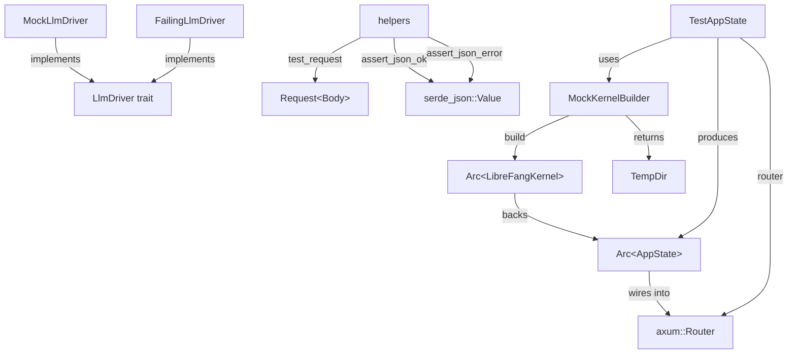

# Testing Framework

# librefang-testing — Test Infrastructure

Provides mock infrastructure for unit and integration testing API routes without starting a full daemon. Every component is designed to produce real kernel/app instances with the heavy bits (networking, LLM providers, persistent storage) swapped out for deterministic fakes.

## Architecture



## Key Components

### MockKernelBuilder

Boots a real `LibreFangKernel` via `LibreFangKernel::boot_with_config` with an in-memory SQLite database, a temp directory, and networking disabled. This is not a stub — it's a full kernel with all subsystems live, just isolated from the outside world.

**Builder methods:**

| Method | Purpose |
|--------|---------|
| `new()` | Default minimal config |
| `with_config(f)` | Mutate `KernelConfig` before boot |
| `with_catalog_seed(seed)` | Replace the model catalog with deterministic entries after boot |
| `build()` | Returns `(Arc<LibreFangKernel>, TempDir)` |

**TempDir lifetime:** The returned `TempDir` must be held for the duration of the test. Dropping it deletes the temp directory, invalidating all kernel file paths (skills, workspaces, vault).

**Vault key stability:** The builder pins a deterministic vault master key (`LIBREFANG_VAULT_KEY` env var) on first construction using `Once`. This prevents parallel test shards from racing on the process-shared keyring file — each test process gets the same key, so `vault_get`/`vault_set` never fails due to decryption mismatches.

**Catalog seeding:** Without seeding, the catalog is populated by `sync_registry` which fetches from the network — flaky on CI under rate-limits or partitions. Use `with_catalog_seed(test_catalog_baseline())` to get a stable baseline containing `gpt-4o-mini` under the `openai` provider. Add entries to `test_catalog_baseline()` as needed, but keep the list minimal.

```rust,ignore
let (kernel, _tmp) = MockKernelBuilder::new()
    .with_config(|cfg| {
        cfg.default_model.provider = "openai".into();
    })
    .with_catalog_seed(test_catalog_baseline())
    .build();
```

The convenience function `test_kernel()` is shorthand for `MockKernelBuilder::new().build()`.

### MockLlmDriver

A configurable fake `LlmDriver` that returns canned responses in order and records every call for assertions.

**Construction:**

```rust
// Multiple responses, returned in order:
let driver = MockLlmDriver::new(vec!["First response".into(), "Second".into()]);

// Single response repeated forever:
let driver = MockLlmDriver::with_response("Always this");
```

When responses are exhausted, the driver repeats the last one indefinitely.

**Configuration (builder pattern):**

| Method | Default | Override |
|--------|---------|----------|
| `with_tokens(input, output)` | 10 / 5 | Custom token counts |
| `with_stop_reason(reason)` | `EndTurn` | Any `StopReason` variant |

**Call recording:**

```rust
let driver = MockLlmDriver::with_response("hi");
// ... exercise code that calls driver.complete() ...

let calls = driver.recorded_calls();
assert_eq!(calls.len(), 1);
assert_eq!(calls[0].model, "gpt-4o-mini");
assert_eq!(calls[0].message_count, 3);
```

Each `RecordedCall` captures: `model`, `message_count`, `tool_count`, `system`.

**Streaming:** The driver implements `stream()` by calling `complete()` internally, then emitting `TextDelta` followed by `ContentComplete` events. This exercises the same event flow as production streaming.

### FailingLlmDriver

Always returns `LlmError::Api { status: 500, ... }` from `complete()`. Use it to test error-handling paths without configuring a mock to fail.

```rust
let driver = FailingLlmDriver::new("provider unreachable");
```

`is_configured()` returns `false`, matching the behavior of a misconfigured real provider.

### TestAppState

Wraps `MockKernelBuilder` output into a production-compatible `AppState` and provides a fully-wired `axum::Router`. This is the primary entry point for API route integration tests.

**Construction paths:**

| Method | When to use |
|--------|-------------|
| `new()` | Default kernel, no customization |
| `with_builder(builder)` | Custom kernel config or catalog |
| `from_kernel(kernel, tmp)` | You've already built a kernel yourself |

**Auth configuration:**

```rust,ignore
let test = TestAppState::new()
    .with_api_key("test-secret-key")
    .with_user_api_keys(vec![ApiUserAuth { ... }]);

// Or with RBAC users writing config to disk:
let test = TestAppState::with_builder(
    MockKernelBuilder::new().with_config(|cfg| { /* ... */ })
)
.with_api_key("secret")
.with_user_api_keys(users)
.with_config_path(tmp_path.join("config.toml"));
```

**Router:** `test.router()` returns an `axum::Router` with all API routes nested under `/api`, matching the production setup. Use `tower::ServiceExt` to send requests directly:

```rust,ignore
let test = TestAppState::new();
let app = test.router();

let response = app
    .oneshot(test_request(Method::GET, "/api/health", None))
    .await
    .unwrap();

let body = assert_json_ok(response).await;
assert_eq!(body["status"], "ok");
```

**Decomposition:** `into_parts()` returns `(Arc<AppState>, TempDir, Option<PathBuf>)` when you need direct access to all components.

### Helper Functions

Three functions for building requests and asserting on responses. All are re-exported at the crate root.

**`test_request(method, path, body)`** — Builds an `axum::http::Request<Body>`. Automatically sets `Content-Type: application/json` when a body is provided.

**`assert_json_ok(response)`** — Asserts status 200, parses body as JSON. Returns `serde_json::Value`. Panics with the raw body on failure.

**`assert_json_error(response, expected_status)`** — Asserts the given status code, parses body as JSON. Returns `serde_json::Value`. Use for verifying error responses:

```rust,ignore
let response = app
    .oneshot(test_request(Method::GET, "/api/agents/nonexistent", None))
    .await
    .unwrap();

let body = assert_json_error(response, StatusCode::NOT_FOUND).await;
```

Both assertion functions read the body via a shared internal `read_body()` helper that collects `Body` into a `String` and includes the raw content in any panic message for debugging.

## Typical Test Patterns

### Basic API route test

```rust,ignore
#[tokio::test]
async fn test_health() {
    let test = TestAppState::new();
    let app = test.router();

    let response = app
        .oneshot(test_request(Method::GET, "/api/health", None))
        .await
        .unwrap();

    let body = assert_json_ok(response).await;
    assert_eq!(body["status"], "ok");
}
```

### Authenticated endpoint

```rust,ignore
#[tokio::test]
async fn test_protected_route() {
    let test = TestAppState::new().with_api_key("secret");
    let app = test.router();

    let req = test_request(Method::GET, "/api/agents", None)
        .with_header("authorization", "Bearer secret");

    let response = app.oneshot(req).await.unwrap();
    assert_json_ok(response).await;
}
```

### Custom kernel config

```rust,ignore
#[tokio::test]
async fn test_custom_config() {
    let test = TestAppState::with_builder(
        MockKernelBuilder::new()
            .with_config(|cfg| {
                cfg.default_model.model = "gpt-4o-mini".into();
            })
            .with_catalog_seed(test_catalog_baseline()),
    );
    let app = test.router();
    // ...
}
```

## Connection to the Rest of the Codebase

This crate sits between `librefang-kernel` (provides `LibreFangKernel::boot_with_config`), `librefang-api` (provides routes and `AppState`), and `librefang-runtime` (provides the `LlmDriver` trait and `ModelCatalog`). Integration tests in `librefang-api/tests/` are the primary consumers:

- Tests call `TestAppState::with_builder(...)` to customize the kernel, then `.with_api_key(...)` / `.with_user_api_keys(...)` for auth, then `.with_config_path(...)` when exercising config-reload endpoints that read from disk.
- `MockLlmDriver` and `FailingLlmDriver` are injected when tests need to control LLM behavior (agent conversations, tool-use flows).
- The vault key initialization in `ensure_test_vault_key()` prevents cross-shard flakiness in CI by ensuring all tests in a process share the same deterministic key before any kernel boots.