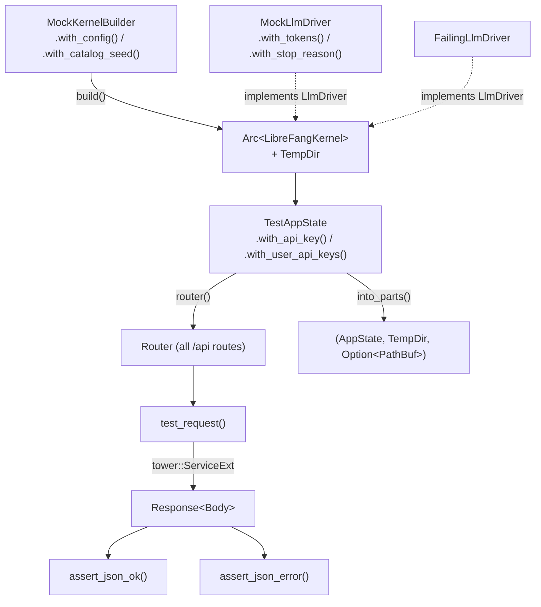

# Testing Framework

# librefang-testing — Test Infrastructure

Provides mock infrastructure for unit and integration testing API routes without starting a full LibreFang daemon. The crate supplies a real kernel instance (in-memory SQLite, temp directories, no network), configurable LLM driver mocks, a complete axum `Router` wired to production route handlers, and HTTP assertion helpers.

## Architecture


```mermaid
graph TD
    MKB["MockKernelBuilder<br/>.with_config() / .with_catalog_seed()"] -->|"build()"| K["Arc&lt;LibreFangKernel&gt;<br/>+ TempDir"]
    K --> TAP["TestAppState<br/>.with_api_key() / .with_user_api_keys()"]
    TAP -->|"router()"| R["Router (all /api routes)"]
    TAP -->|"into_parts()"| parts["(AppState, TempDir, Option&lt;PathBuf&gt;)"]
    R --> REQ["test_request()"]
    REQ -->|tower::ServiceExt| RESP["Response&lt;Body&gt;"]
    RESP --> AJOK["assert_json_ok()"]
    RESP --> AJER["assert_json_error()"]
    MLD["MockLlmDriver<br/>.with_tokens() / .with_stop_reason()"] -.->|implements LlmDriver| K
    FLD["FailingLlmDriver"] -.->|implements LlmDriver| K
```

## Key Components

### MockKernelBuilder

Constructs a minimal but fully functional `LibreFangKernel`. The kernel boots through the real `LibreFangKernel::boot_with_config` path — same initialization as production — but with network disabled, an in-memory SQLite database, and a temp directory that is cleaned up on drop.

**Process-wide safety guarantees:**

- `ensure_test_vault_key()` — pins a deterministic `LIBREFANG_VAULT_KEY` env var via `Once`, preventing parallel tests from racing on the shared keyring file.
- `ensure_test_state_secret()` — pins a deterministic `LIBREFANG_STATE_SECRET` for OAuth HMAC validation, required when `external_auth.enabled = true`.

Both run exactly once per process, before any kernel boots.

**Usage:**

```rust
let (kernel, _tmp) = MockKernelBuilder::new()
    .with_config(|cfg| {
        cfg.default_model.provider = "openai".into();
    })
    .with_catalog_seed(test_catalog_baseline())
    .build();
```

The returned `TempDir` must remain in scope for the entire test — dropping it deletes the temp directory and invalidates all kernel file paths.

**Catalog seeding:** `with_catalog_seed()` replaces the model catalog after boot with deterministic entries. Without this, the catalog depends on `sync_registry` fetching from `github.com/librefang-registry`, which is flaky on CI. Use `test_catalog_baseline()` for a minimal catalog that covers the integration test suite (`gpt-4o-mini` under `openai`).

| Method | Purpose |
|---|---|
| `new()` | Default minimal configuration |
| `with_config(fn)` | Mutate `KernelConfig` before boot |
| `with_catalog_seed(seed)` | Override model catalog with deterministic entries |
| `build()` | Returns `(Arc<LibreFangKernel>, TempDir)` |

Convenience: `test_kernel()` is equivalent to `MockKernelBuilder::new().build()`.

### MockLlmDriver

A configurable fake LLM provider implementing `LlmDriver`. Returns canned responses in order (wraps to the last response when exhausted) and records all calls for post-test assertions.

```rust
let driver = MockLlmDriver::new(vec![
    "First response".into(),
    "Second response".into(),
])
.with_tokens(100, 50)
.with_stop_reason(StopReason::EndTurn);
```

**Call recording:** Every `complete()` or `stream()` call is recorded as a `RecordedCall` containing `model`, `message_count`, `tool_count`, and `system` prompt. Access via `recorded_calls()` or `call_count()`.

**Streaming:** `stream()` simulates real streaming by sending `TextDelta` followed by `ContentComplete` events on the provided channel.

**FailingLlmDriver** always returns an `LlmError::Api` with status 500 — use it to test error-handling paths.

| Method | Purpose |
|---|---|
| `new(responses)` | Create with ordered canned responses |
| `with_response(text)` | Single repeated response |
| `with_tokens(input, output)` | Override default token counts (10/5) |
| `with_stop_reason(reason)` | Override default `EndTurn` |
| `recorded_calls()` | Inspect all recorded calls |
| `call_count()` | Number of calls made |

### TestAppState

Wraps `MockKernelBuilder` output and produces an axum `AppState` identical to the production type. The `router()` method returns a `Router` with all API routes nested under `/api`.

```rust
let test = TestAppState::new()
    .with_api_key("test-key")
    .with_user_api_keys(vec![ApiUserAuth { /* ... */ }]);

let router = test.router();

// Use with tower::ServiceExt
let response = router
    .oneshot(test_request(Method::GET, "/api/health", None))
    .await
    .unwrap();
```

**Builder methods (chainable):**

| Method | Purpose |
|---|---|
| `new()` | Default mock kernel |
| `with_builder(builder)` | Custom `MockKernelBuilder` |
| `from_kernel(kernel, tmp)` | Wrap an existing kernel |
| `with_api_key(key)` | Set global API key for auth middleware |
| `with_user_api_keys(keys)` | Set per-user API key list |
| `with_config_path(path)` | Serialize config to TOML on disk (for reload tests) |
| `router()` | Build `Router` with all production `/api` routes |
| `tmp_path()` | Path to the temp directory |
| `app_state()` | `Arc<AppState>` clone |
| `into_parts()` | Destructure into `(Arc<AppState>, TempDir, Option<PathBuf>)` |

**AppState wiring details:** `build_state()` constructs a full `AppState` including `WebhookStore`, `IdempotencyStore` (backed by the kernel's SQLite pool), rate limiters, media driver cache, and all other production fields — ensuring tests exercise the same code paths as production.

### HTTP Helpers

Functions for building requests and asserting on responses. Located in the `helpers` module and re-exported at the crate root.

**`test_request(method, path, body)`** — Builds an `axum::http::Request<Body>`. Automatically sets `content-type: application/json` when a body is provided.

```rust
let get_req = test_request(Method::GET, "/api/health", None);
let post_req = test_request(
    Method::POST,
    "/api/agents",
    Some(r#"{"name": "test"}"#),
);
```

**`assert_json_ok(response)`** — Asserts status 200, parses body as JSON. Returns `serde_json::Value`. Panics with the response body on failure.

**`assert_json_error(response, expected_status)`** — Asserts the given status code, parses body as JSON. Returns `serde_json::Value`.

Both helpers read the full response body via `read_body()` and include it in panic messages for easy debugging.

## Integration Test Patterns

The crate is consumed extensively by integration tests in `librefang-api/tests/`. Common patterns:

### Basic route test

```rust
let test = TestAppState::new();
let router = test.router();
let resp = router.oneshot(test_request(Method::GET, "/api/health", None)).await.unwrap();
let json = assert_json_ok(resp).await;
assert_eq!(json["status"], "ok");
```

### Authenticated test

```rust
let test = TestAppState::new().with_api_key("secret");
let router = test.router();
let req = test_request(Method::GET, "/api/agents", None)
    .with_header("authorization", "Bearer secret");
```

### Custom kernel config

```rust
let test = TestAppState::with_builder(
    MockKernelBuilder::new()
        .with_config(|cfg| {
            cfg.default_model.provider = "openai".into();
            cfg.default_model.model = "gpt-4o-mini".into();
        })
        .with_catalog_seed(test_catalog_baseline()),
);
```

### Full server with config file

```rust
let tmp = tempfile::tempdir().unwrap();
let config_path = tmp.path().join("config.toml");

let (state, _tmp, _cfg) = TestAppState::with_builder(
    MockKernelBuilder::new().with_config(|cfg| { /* ... */ })
)
.with_api_key("test-key")
.with_config_path(config_path.clone())
.into_parts();
```

## Public Exports

```rust
// Re-exported at crate root:
pub use helpers::{assert_json_error, assert_json_ok, test_request};
pub use mock_driver::{FailingLlmDriver, MockLlmDriver};
pub use mock_kernel::{test_catalog_baseline, CatalogSeed, MockKernelBuilder};
pub use test_app::TestAppState;
```