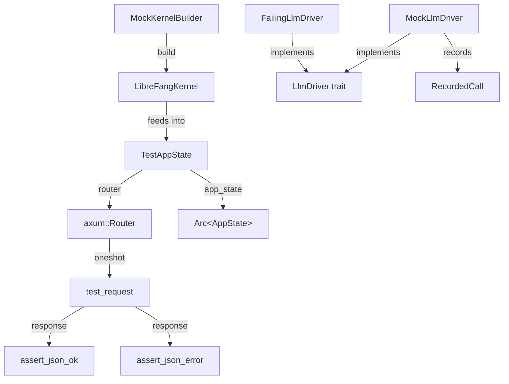

# Testing Utilities

# Testing Utilities (`librefang-testing`)

## Purpose

`librefang-testing` provides mock infrastructure for writing unit and integration tests against API routes without starting a full daemon. It replaces heavyweight dependencies—real LLM providers, persistent databases, network services—with in-memory and tempfile-backed alternatives while preserving the production code paths.

The crate is used across the entire workspace. Components like the HTTP client, MCP connectors, plugin manager, skill registries, provider health probes, and OAuth flows all call `MockKernelBuilder::build` to stand up a test kernel.

---

## Architecture



**Two independent testing tracks:**

1. **API route testing** — `MockKernelBuilder` → `TestAppState` → `Router` → send requests via `tower::ServiceExt::oneshot`, assert responses with helpers.
2. **LLM behavior testing** — `MockLlmDriver` / `FailingLlmDriver` implement the `LlmDriver` trait directly, usable wherever a driver is injected.

---

## Key Components

### `MockKernelBuilder`

Builds a real `LibreFangKernel` instance with a minimal environment:

- **In-memory-capable SQLite** — database file lives under a temp directory.
- **Temp directory tree** — creates `data/`, `skills/`, `workspaces/agents/`, `workspaces/hands/` automatically.
- **Networking disabled** — `network_enabled` is set to `false`.
- **Custom config** — `with_config` accepts a closure to override any `KernelConfig` field before boot.

```rust,ignore
let (kernel, _tmp) = MockKernelBuilder::new()
    .with_config(|cfg| {
        cfg.language = "zh".into();
        cfg.default_model.provider = "test".into();
    })
    .build();
```

**Important:** The returned `TempDir` must be held for the lifetime of the kernel. Dropping it deletes the underlying files and invalidates any path-based operations.

Convenience function: `test_kernel()` is equivalent to `MockKernelBuilder::new().build()`.

### `MockLlmDriver`

A configurable fake that implements `LlmDriver`. Features:

- **Canned responses** — provide a `Vec<String>` at construction; responses are returned in order. When the list is exhausted, the last response repeats.
- **Call recording** — every call to `complete` or `stream` pushes a `RecordedCall` with `model`, `message_count`, `tool_count`, and `system`.
- **Builder customization** — `with_tokens(input, output)` and `with_stop_reason(reason)` override defaults.
- **Streaming simulation** — `stream` sends a `TextDelta` event followed by `ContentComplete`.

```rust,ignore
let driver = MockLlmDriver::new(vec!["Hello".into(), "World".into()])
    .with_tokens(100, 50)
    .with_stop_reason(StopReason::EndTurn);

let resp = driver.complete(request).await.unwrap();
assert_eq!(driver.call_count(), 1);
assert_eq!(driver.recorded_calls()[0].model, "test-model");
```

### `FailingLlmDriver`

Always returns `LlmError::Api` with the given message. Useful for testing error-handling paths.

```rust,ignore
let driver = FailingLlmDriver::new("simulated failure");
assert!(driver.complete(request).await.is_err());
assert!(!driver.is_configured());
```

### `TestAppState`

Wraps `MockKernelBuilder` output into a full `AppState` and exposes an axum `Router` with all API routes mounted under `/api`. This is the primary entry point for HTTP-level route tests.

Construction paths:
- `TestAppState::new()` — default mock kernel.
- `TestAppState::with_builder(builder)` — custom `MockKernelBuilder`.
- `TestAppState::from_kernel(kernel, tmp)` — pre-built kernel, caller holds `TempDir`.

The `router()` method returns a `Router` covering agents CRUD, skills, config, memory, budget, system endpoints, models, providers, and sessions — matching the production route layout.

```rust,ignore
let app = TestAppState::new();
let router = app.router();

let req = test_request(Method::GET, "/api/health", None);
let resp = router.oneshot(req).await.unwrap();
let json = assert_json_ok(resp).await;
```

The `state` field is `Arc<AppState>`, accessible for direct kernel inspection (e.g., checking config values or registry state after an operation).

### Helpers

| Function | Purpose |
|---|---|
| `test_request(method, path, body)` | Builds an `axum::http::Request<Body>`. Automatically sets `content-type: application/json` when a body is provided. |
| `assert_json_ok(response)` | Asserts status 200, parses body as JSON. Returns `serde_json::Value`. |
| `assert_json_error(response, expected_status)` | Asserts status matches, parses body as JSON. Returns `serde_json::Value`. |

All assertion helpers panic with a descriptive message including the raw response body on failure.

---

## Typical Test Pattern

```rust,ignore
#[tokio::test(flavor = "multi_thread")]
async fn test_something() {
    // 1. Set up the test app
    let app = TestAppState::new();
    let router = app.router();

    // 2. Build a request
    let req = test_request(Method::POST, "/api/agents", Some(r#"{"manifest_toml": "..."}"#));

    // 3. Send it through the router
    let resp = router.oneshot(req).await.expect("request failed");

    // 4. Assert on the response
    let json = assert_json_ok(resp).await;
    assert!(json.get("id").is_some());
}
```

Tests requiring multi-threaded tokio runtime (anything touching the kernel or SQLite) must use `#[tokio::test(flavor = "multi_thread")]`.

---

## Connections to the Rest of the Codebase

`MockKernelBuilder::build` internally calls `LibreFangKernel::boot_with_config`, which exercises the real kernel initialization path including vault unlock, config validation, and database setup. This means:

- **Provider health probes** (`librefang-runtime/src/provider_health.rs`) use the test kernel to build HTTP clients and probe providers.
- **Plugin manager** (`librefang-runtime/src/plugin_manager.rs`) uses the test kernel for install/list operations.
- **Skill registries** (`librefang-skills/src/clawhub.rs`, `skillhub.rs`, `marketplace.rs`) use it to test HTTP fetching and catalog sync.
- **OAuth flows** (`librefang-runtime-oauth`) use it to test device flow start/poll with vault-backed secrets.
- **MCP connectors** (`librefang-runtime-mcp`) use it for SSE and HTTP transport setup.
- **Desktop server** (`librefang-desktop/src/server.rs`) uses it in integration tests for the full server startup path.

The `TestAppState` is specific to `librefang-api` route testing and constructs a production-faithful `AppState` including `WebhookStore`, session tracking, provider probe caches, and media driver caches — all backed by temp files.