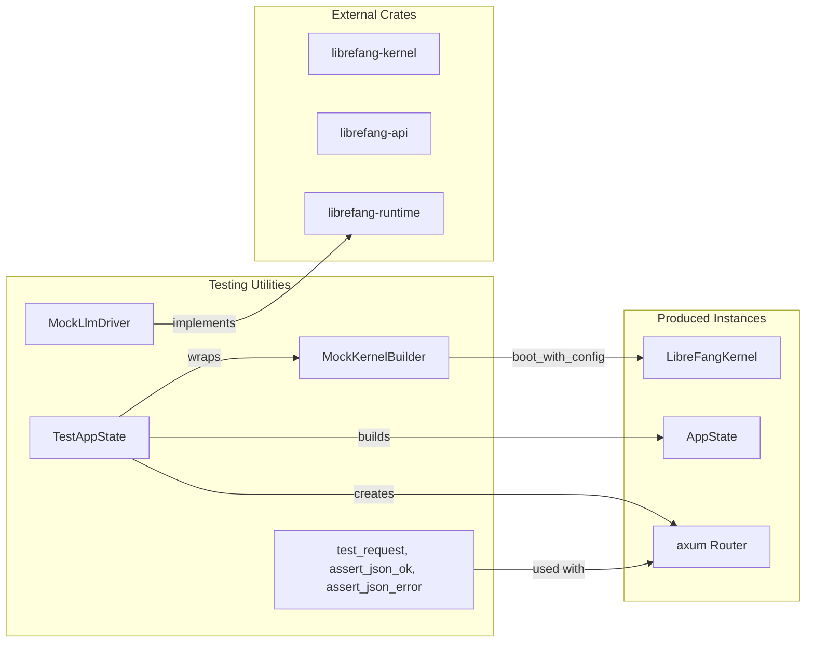

# Testing Utilities

# librefang-testing — Test Infrastructure

Provides mock infrastructure for testing LibreFang API routes and components without starting a full daemon. This module is used throughout the codebase to create isolated, reproducible test environments.

## Purpose

Testing LibreFang's API routes and kernel functionality requires:

- A running `LibreFangKernel` instance with database, file system, and configuration
- An `AppState` to serve HTTP routes via axum
- A mock LLM driver to avoid external API calls during unit tests

The `librefang-testing` crate packages all of this into reusable, composable components that integrate with the broader test infrastructure across the codebase.

## Architecture Overview



## Core Components

### MockKernelBuilder

Builds a minimal `LibreFangKernel` instance suitable for testing. It creates:

- A temporary directory for kernel data (home dir, skills, workspaces)
- An in-memory SQLite database (stored in the temp directory as a file)
- A kernel with networking disabled

```rust
use librefang_testing::MockKernelBuilder;

// Basic usage
let (kernel, _tmp) = MockKernelBuilder::new().build();

// With custom config
let (kernel, _tmp) = MockKernelBuilder::new()
    .with_config(|cfg| {
        cfg.language = "zh".into();
        cfg.default_model.provider = "test".into();
    })
    .build();
```

**Important**: The returned `TempDir` must be held by the caller. Dropping it will delete the kernel's data directory, invalidating any file paths the kernel has opened.

#### Convenience function

```rust
use librefang_testing::mock_kernel::test_kernel;

let (kernel, _tmp) = test_kernel();
```

### MockLlmDriver

A configurable mock LLM driver implementing the `LlmDriver` trait. It returns canned responses and records all calls for assertion.

```rust
use librefang_testing::MockLlmDriver;
use librefang_runtime::llm_driver::{CompletionRequest, LlmDriver};

// Basic canned responses
let driver = MockLlmDriver::new(vec!["Response 1".into(), "Response 2".into()]);

// Single repeated response
let driver = MockLlmDriver::with_response("Always the same");

// Custom token usage and stop reason
let driver = MockLlmDriver::with_response("hello")
    .with_tokens(100, 50)
    .with_stop_reason(StopReason::MaxTokens);

// Check recorded calls
let calls = driver.recorded_calls();
assert_eq!(driver.call_count(), 2);
```

The driver cycles through responses in order, wrapping to the last response when exhausted.

#### Streaming support

The `stream` method simulates streaming by sending a `TextDelta` event followed by `ContentComplete`:

```rust
async fn stream(
    &self,
    request: CompletionRequest,
    tx: tokio::sync::mpsc::Sender<StreamEvent>,
) -> Result<CompletionResponse, LlmError>
```

### FailingLlmDriver

A mock that always returns errors, useful for testing error handling paths:

```rust
use librefang_testing::FailingLlmDriver;

let driver = FailingLlmDriver::new("Simulated API failure");
let result = driver.complete(request).await;
assert!(result.is_err());
```

### TestAppState

Builds a complete `AppState` and axum `Router` for HTTP route testing:

```rust
use librefang_testing::TestAppState;

let test = TestAppState::new();
let router = test.router();
```

#### Router routes

The router includes all major API endpoints under `/api`:

| Category | Endpoints |
|----------|-----------|
| **System** | `/health`, `/health/detail`, `/status`, `/version`, `/metrics` |
| **Agents CRUD** | `GET/POST /agents`, `GET/DELETE/PATCH /agents/{id}` |
| **Agent operations** | `/agents/{id}/message`, `/agents/{id}/stop`, `/agents/{id}/model`, `/agents/{id}/mode` |
| **Sessions** | `/agents/{id}/session`, `/agents/{id}/sessions`, `/agents/{id}/session/reset` |
| **Agent config** | `/agents/{id}/tools`, `/agents/{id}/skills`, `/agents/{id}/logs` |
| **Profiles** | `GET /profiles`, `GET /profiles/{name}` |
| **Skills** | `GET /skills`, `POST /skills/create` |
| **Config** | `GET /config`, `GET /config/schema`, `POST /config/set`, `POST /config/reload` |
| **Memory** | `GET /memory/search`, `GET /memory/stats` |
| **Usage** | `GET /usage`, `GET /usage/summary` |
| **Tools & Commands** | `GET /tools`, `GET /tools/{name}`, `GET /commands` |
| **Models & Providers** | `GET /models`, `GET /providers` |
| **Sessions** | `GET /sessions` |

#### Construction methods

```rust
// Default kernel
let test = TestAppState::new();

// Custom kernel builder
let test = TestAppState::with_builder(
    MockKernelBuilder::new().with_config(|cfg| { /* ... */ })
);

// From existing kernel (caller holds TempDir)
let test = TestAppState::from_kernel(kernel, tmp);
```

### Helper Functions

#### `test_request`

Builds a test HTTP request with optional JSON body:

```rust
use librefang_testing::test_request;
use axum::http::Method;

let req = test_request(Method::GET, "/api/health", None);
let req = test_request(Method::POST, "/api/agents", Some(r#"{"name":"test"}"#));
```

Automatically sets `Content-Type: application/json` when a body is provided.

#### `assert_json_ok`

Asserts the response is 200 OK and returns the parsed JSON:

```rust
use librefang_testing::{test_request, assert_json_ok};

let resp = router.oneshot(req).await?;
let json = assert_json_ok(resp).await;
// json is a serde_json::Value
assert_eq!(json["status"], "ok");
```

Panics with a descriptive message if the status is not 200 or the body is not valid JSON.

#### `assert_json_error`

Asserts the response has a specific error status code:

```rust
use librefang_testing::{test_request, assert_json_error};
use axum::http::StatusCode;

let resp = router.oneshot(req).await?;
let json = assert_json_error(resp, StatusCode::NOT_FOUND).await;
assert!(json.get("error").is_some());
```

## Usage Patterns

### Testing an API endpoint

```rust
use librefang_testing::{TestAppState, test_request, assert_json_ok, assert_json_error};
use axum::http::{Method, StatusCode};
use tower::ServiceExt;

#[tokio::test]
async fn test_agents_list() {
    let app = TestAppState::new();
    let router = app.router();

    // Valid request
    let req = test_request(Method::GET, "/api/agents", None);
    let resp = router.oneshot(req).await.expect("request failed");
    let json = assert_json_ok(resp).await;
    assert!(json["items"].is_array());

    // Invalid UUID
    let req = test_request(Method::GET, "/api/agents/not-a-uuid", None);
    let resp = router.oneshot(req).await.expect("request failed");
    assert_json_error(resp, StatusCode::BAD_REQUEST).await;

    // Nonexistent agent
    let fake_id = uuid::Uuid::new_v4();
    let req = test_request(Method::GET, &format!("/api/agents/{fake_id}"), None);
    let resp = router.oneshot(req).await.expect("request failed");
    assert_json_error(resp, StatusCode::NOT_FOUND).await;
}
```

### Testing with a mock LLM driver

```rust
use librefang_testing::MockLlmDriver;
use librefang_runtime::llm_driver::{CompletionRequest, LlmDriver};

let driver = MockLlmDriver::new(vec!["Expected response".into()]);

let request = CompletionRequest {
    model: "test-model".into(),
    messages: vec![],
    tools: vec![],
    max_tokens: 100,
    temperature: 0.0,
    system: Some("You are helpful.".into()),
    // ... other fields
};

let response = driver.complete(request).await.unwrap();
assert_eq!(response.text(), "Expected response");

// Verify the driver recorded the call
assert_eq!(driver.call_count(), 1);
let calls = driver.recorded_calls();
assert_eq!(calls[0].model, "test-model");
assert_eq!(calls[0].system, Some("You are helpful.".into()));
```

## Integration with the Broader Codebase

`MockKernelBuilder::build()` is called by numerous modules for testing:

| Module | Usage |
|--------|-------|
| `librefang-runtime` | HTTP client tests, MCP client tests, provider health probing |
| `librefang-skills` | SkillHub and marketplace tests |
| `librefang-desktop` | Server startup, connection tests, shortcuts |
| `librefang-cli` | Daemon discovery and command tests |
| `librefang-extensions` | Extension HTTP client tests |

The `TestAppState` router is the primary integration point for API route tests, providing a complete HTTP stack without network dependencies.

## Key Design Notes

- **TempDir ownership**: Both `MockKernelBuilder::build()` and `TestAppState` return a `TempDir` that must be retained. Dropping it destroys the kernel's data directory.
- **In-memory SQLite**: The database is a file under the temp directory (not `:memory:`) because `boot_with_config` requires a file path.
- **Networking disabled**: The mock kernel sets `network_enabled = false`, avoiding HTTP client initialization.
- **Same AppState type**: `TestAppState::state` is the same type as production, just with mock/empty fields for testing.