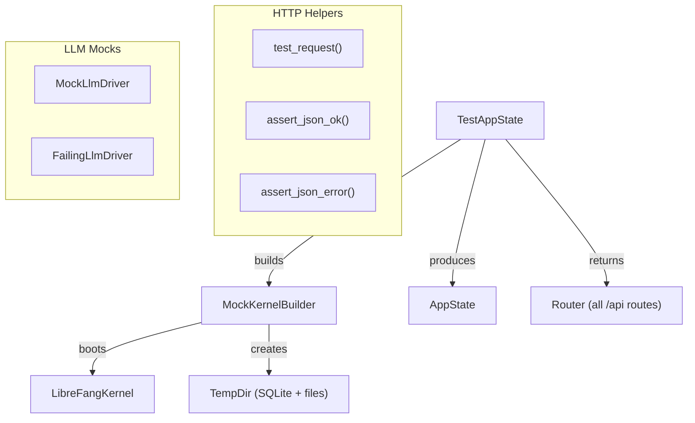

# Testing Utilities

# librefang-testing — Test Infrastructure

## Purpose

`librefang-testing` provides mock infrastructure for unit and integration testing API routes and runtime components without starting a full daemon or requiring external services. It supplies in-memory databases, temp directories, fake LLM providers, and HTTP request/response helpers so tests run fast, deterministically, and in isolation.

## Architecture



## Key Components

### MockKernelBuilder

Builds a real `LibreFangKernel` instance using an in-memory SQLite database and a temporary directory, skipping heavyweight initialization (networking, OFP, cron). Internally calls `LibreFangKernel::boot_with_config`.

**Usage:**

```rust
use librefang_testing::MockKernelBuilder;

// Default minimal kernel
let (kernel, _tmp) = MockKernelBuilder::new().build();

// With custom configuration
let (kernel, _tmp) = MockKernelBuilder::new()
    .with_config(|cfg| {
        cfg.language = "zh".into();
        cfg.default_model.provider = "test".into();
    })
    .build();
```

**Important:** The returned `TempDir` must be held for the lifetime of the kernel. Dropping it deletes the temp directory and invalidates all kernel file paths.

**Convenience function:** `test_kernel()` is shorthand for `MockKernelBuilder::new().build()`.

The builder creates the following directory structure under the temp directory:
- `data/` — SQLite database (`test.db`)
- `skills/` — skill storage
- `workspaces/agents/` — agent workspaces
- `workspaces/hands/` — hand workspaces

### MockLlmDriver

A configurable fake LLM provider that implements the `LlmDriver` trait. It returns canned responses in sequence (wrapping to the last response when exhausted) and records every call for later assertions.

```rust
use librefang_testing::MockLlmDriver;
use librefang_types::message::StopReason;

// Multiple responses returned in order
let driver = MockLlmDriver::new(vec!["First response".into(), "Second response".into()]);

// Single repeated response with custom token counts
let driver = MockLlmDriver::with_response("Always this")
    .with_tokens(200, 100)
    .with_stop_reason(StopReason::MaxTokens);
```

**Recorded call inspection:**

Each call is stored as a `RecordedCall` with these fields:
- `model` — model name from the request
- `message_count` — number of messages
- `tool_count` — number of tool definitions
- `system` — system prompt, if any

```rust
assert_eq!(driver.call_count(), 2);
let calls = driver.recorded_calls();
assert_eq!(calls[0].model, "test-model");
assert_eq!(calls[0].system, Some("system prompt".into()));
```

**Streaming support:** The `stream()` method simulates streaming by sending a `TextDelta` event followed by a `ContentComplete` event over the provided channel, then returning the full `CompletionResponse`.

**Default behavior:**
- Token usage: input=10, output=5 (override with `.with_tokens()`)
- Stop reason: `StopReason::EndTurn` (override with `.with_stop_reason()`)
- `is_configured()` always returns `true`

### FailingLlmDriver

A mock driver that always returns an `LlmError::Api` error. Use it to test error-handling paths.

```rust
use librefang_testing::FailingLlmDriver;
use librefang_runtime::llm_driver::LlmDriver;

let driver = FailingLlmDriver::new("simulated API error");
let result = driver.complete(request).await;
assert!(result.is_err());
assert!(!driver.is_configured());
```

### TestAppState

Wraps `MockKernelBuilder` output into a production-compatible `AppState` and provides a fully-wired axum `Router`. This is the primary entry point for HTTP route tests.

```rust
use librefang_testing::TestAppState;
use tower::ServiceExt;

let app = TestAppState::new();
let router = app.router();

// Send a request through the full routing stack
let resp = router.oneshot(req).await.unwrap();
```

**Construction options:**

| Method | Description |
|--------|-------------|
| `TestAppState::new()` | Default mock kernel |
| `TestAppState::with_builder(builder)` | Custom `MockKernelBuilder` |
| `TestAppState::from_kernel(kernel, tmp)` | Existing kernel (caller holds `TempDir`) |

**Router coverage:** The `router()` method returns a `Router` nested under `/api` with all production endpoints including agents CRUD, skills, config, memory, budget/usage, tools, models, providers, and sessions.

**Access to inner state:**

```rust
let state: Arc<AppState> = app.app_state();
let config = app.state.kernel.config_ref();
```

### HTTP Request Helpers

Three functions in `librefang_testing::helpers` (re-exported at the crate root):

**`test_request(method, path, body)`** — Builds an `axum::http::Request<Body>`. Automatically sets `content-type: application/json` when a body is provided.

```rust
use axum::http::Method;

let get = test_request(Method::GET, "/api/health", None);
let post = test_request(Method::POST, "/api/agents", Some(r#"{"name":"bot"}"#));
```

**`assert_json_ok(response)`** — Asserts status 200, parses body as JSON, returns `serde_json::Value`. Panics with the raw body on failure.

**`assert_json_error(response, expected_status)`** — Same as above but checks for a specific error status code.

Both assertion functions read the full response body via the internal `read_body()` helper and include the raw body text in panic messages for debugging.

## Typical Test Pattern

```rust
#[tokio::test(flavor = "multi_thread")]
async fn test_my_endpoint() {
    // 1. Build test app
    let app = TestAppState::new();
    let router = app.router();

    // 2. Build request
    let req = test_request(Method::GET, "/api/agents", None);

    // 3. Execute via tower's oneshot
    let resp = router.oneshot(req).await.expect("request failed");

    // 4. Assert response
    let json = assert_json_ok(resp).await;
    assert!(json["items"].is_array());
}
```

For error cases:

```rust
let fake_id = uuid::Uuid::new_v4();
let req = test_request(Method::GET, &format!("/api/agents/{fake_id}"), None);
let resp = router.oneshot(req).await.expect("request failed");
let json = assert_json_error(resp, StatusCode::NOT_FOUND).await;
assert!(json.get("error").is_some());
```

## Usage Across the Codebase

`MockKernelBuilder::build()` is used extensively outside this crate — by the HTTP client module, MCP runtime, plugin manager, web fetch, web search, provider health checks, OAuth flows, and the desktop server. Any component that needs a kernel instance in tests depends on this builder.